<!-- TOC start (generated with https://github.com/derlin/bitdowntoc) -->

- [Storage](#storage)
  * [RAID](#raid)
  * [Volumes](#volumes)
  * [File storage](#file-storage)
  * [Block storage](#block-storage)
  * [Object Storage](#object-storage)
  * [NAS](#nas)
  * [HDFS](#hdfs)
- [Database and DBMS](#database-and-dbms)
  * [What is a Database?](#what-is-a-database)
  * [What is DBMS?](#what-is-dbms)
  * [Components](#components)
  * [Types](#types)
  * [Challenges](#challenges)
- [SQL databases](#sql-databases)
  * [Materialized views](#materialized-views)
  * [N+1 query problem](#n1-query-problem)
  * [Advantages](#advantages)
  * [Disadvantages](#disadvantages)
  * [Examples](#examples)
- [NoSQL databases](#nosql-databases)
- [SQL vs NoSQL databases](#sql-vs-nosql-databases)
  * [High-level differences](#high-level-differences)
  * [Reasons](#reasons)
- [Geohashing and Quadtrees](#geohashing-and-quadtrees)
  * [Geohashing](#geohashing)
  * [Quadtrees](#quadtrees)
- [Database Replication](#database-replication)
  * [Types of Replication](#types-of-replication)
  * [Synchronous vs Asynchronous replication](#synchronous-vs-asynchronous-replication)
- [Indexes](#indexes)
  * [Compound/Composite Indexes](#compoundcomposite-indexes)
  * [Types of Indexes](#types-of-indexes)
  * [Deciding Which Indexes to Create](#deciding-which-indexes-to-create)
- [Normalization and Denormalization](#normalization-and-denormalization)
  * [Terms](#terms)
  * [Normalization](#normalization)
  * [Denormalization](#denormalization)
- [ACID model](#acid-model)
  * [Atomicity](#atomicity)
  * [Consistency](#consistency)
  * [Isolation](#isolation)
  * [Durability](#durability)
  * [How do acid transactions work?](#how-do-acid-transactions-work)
- [BASE model](#base-model)
  * [Basic Availability](#basic-availability)
  * [Soft-state](#soft-state)
  * [Eventual consistency](#eventual-consistency)
- [Consistency Models in Distributed Systems](#consistency-models-in-distributed-systems)
  * [Strong Consistency](#strong-consistency)
  * [Eventual Consistency](#eventual-consistency-1)
  * [Weak Consistency](#weak-consistency)
  * [Casual Consistency](#casual-consistency)
- [CAP theorem](#cap-theorem)
  * [Exploring CAP trade-offs](#exploring-cap-trade-offs)
- [PACELC Theorem](#pacelc-theorem)
- [Transactions](#transactions)
  * [States](#states)
- [Distributed Transactions](#distributed-transactions)
  * [Why do we need distributed transactions?](#why-do-we-need-distributed-transactions)
  * [Two-Phase commit](#two-phase-commit)
  * [Three-phase commit](#three-phase-commit)
  * [Sagas](#sagas)
- [Database Sharding](#database-sharding)
  * [Data Partitioning](#data-partitioning)
  * [What is sharding?](#what-is-sharding)
  * [Sharding architectures and types:](#sharding-architectures-and-types)
  * [Advantages](#advantages-1)
  * [Disadvantages](#disadvantages-1)
  * [When to use sharding?](#when-to-use-sharding)
- [Consistent Hashing](#consistent-hashing)
  * [Why do we need this?](#why-do-we-need-this)
  * [How does it work](#how-does-it-work)
  * [Virtual Nodes](#virtual-nodes)
  * [Consistent hashing implementation](#consistent-hashing-implementation)
  * [How to handle concurrency in consistent hashing?](#how-to-handle-concurrency-in-consistent-hashing)
  * [What are the benefits of consistent hashing?](#what-are-the-benefits-of-consistent-hashing)
  * [What are the drawbacks of consistent hashing?](#what-are-the-drawbacks-of-consistent-hashing)

<!-- TOC end -->

# Storage

Storage is a mechanism that enables a system to retain data, either temporarily or permanently.

## RAID

RAID (Redundant Array of Independent Disks) is a way of storing the same data on multiple hard disks or solid-state drives (SSDs) to protect data in the case of a drive failure.

There are different RAID levels, however, and not all have the goal of providing redundancy. Let's discuss some commonly used RAID levels:

- **RAID 0**: Also known as striping, data is split evenly across all the drives in the array.
- **RAID 1**: Also known as mirroring, at least two drives contains the exact copy of a set of data. If a drive fails, others will still work.
- **RAID 5**: Striping with parity. Requires the use of at least 3 drives, striping the data across multiple drives like RAID 0, but also has a parity distributed across the drives.
- **RAID 6**: Striping with double parity. RAID 6 is like RAID 5, but the parity data are written to two drives.
- **RAID 10**: Combines striping plus mirroring from RAID 0 and RAID 1. It provides security by mirroring all data on secondary drives while using striping across each set of drives to speed up data transfers.

### Comparison

Let's compare all the features of different RAID levels:

| Features             | RAID 0   | RAID 1               | RAID 5               | RAID 6                      | RAID 10                                  |
|----------------------|----------|----------------------|----------------------|-----------------------------|------------------------------------------|
| Description          | Striping | Mirroring            | Striping with Parity | Striping with double parity | Striping and Mirroring                   |
| Minimum Disks        | 2        | 2                    | 3                    | 4                           | 4                                        |
| Read Performance     | High     | High                 | High                 | High                        | High                                     |
| Write Performance    | High     | Medium               | High                 | High                        | Medium                                   |
| Cost                 | Low      | High                 | Low                  | Low                         | High                                     |
| Fault Tolerance      | None     | Single-drive failure | Single-drive failure | Two-drive failure           | Up to one disk failure in each sub-array |
| Capacity Utilization | 100%     | 50%                  | 67%-94%              | 50%-80%                     | 50%                                      |

## Volumes

Volume is a fixed amount of storage on a disk or tape. The term volume is often used as a synonym for the storage itself, but it is possible for a single disk to contain more than one volume or a volume to span more than one disk.

## File storage

File storage is a solution to store data as files and present it to its final users as a hierarchical directories structure. The main advantage is to provide a user-friendly solution to store and retrieve files. To locate a file in file storage, the complete path of the file is required. It is economical and easily structured and is usually found on hard drives, which means that they appear exactly the same for the user and on the hard drive.

Example: [Amazon EFS](https://aws.amazon.com/efs), [Azure files](https://azure.microsoft.com/en-in/services/storage/files), [Google Cloud Filestore](https://cloud.google.com/filestore), etc.

## Block storage

Block storage divides data into blocks (chunks) and stores them as separate pieces. Each block of data is given a unique identifier, which allows a storage system to place the smaller pieces of data wherever it is most convenient.

Block storage also decouples data from user environments, allowing that data to be spread across multiple environments. This creates multiple paths to the data and allows the user to retrieve it quickly. When a user or application requests data from a block storage system, the underlying storage system reassembles the data blocks and presents the data to the user or application

Example: [Amazon EBS](https://aws.amazon.com/ebs).

## Object Storage

Object storage, which is also known as object-based storage, breaks data files up into pieces called objects. It then stores those objects in a single repository, which can be spread out across multiple networked systems.

Example: [Amazon S3](https://aws.amazon.com/s3), [Azure Blob Storage](https://azure.microsoft.com/en-in/services/storage/blobs), [Google Cloud Storage](https://cloud.google.com/storage), etc.

## NAS

A NAS (Network Attached Storage) is a storage device connected to a network that allows storage and retrieval of data from a central location for authorized network users. NAS devices are flexible, meaning that as we need additional storage, we can add to what we have. It's faster, less expensive, and provides all the benefits of a public cloud on-site, giving us complete control.

## HDFS

The Hadoop Distributed File System (HDFS) is a distributed file system designed to run on commodity hardware. HDFS is highly fault-tolerant and is designed to be deployed on low-cost hardware. HDFS provides high throughput access to application data and is suitable for applications that have large data sets. It has many similarities with existing distributed file systems.

HDFS is designed to reliably store very large files across machines in a large cluster. It stores each file as a sequence of blocks, all blocks in a file except the last block are the same size. The blocks of a file are replicated for fault tolerance.


# Database and DBMS

## What is a Database?

A database is an organized collection of structured information, or data, typically stored electronically in a computer system. A database is usually controlled by a Database Management System (DBMS). Together, the data and the DBMS, along with the applications that are associated with them, are referred to as a database system, often shortened to just database.

## What is DBMS?

A database typically requires a comprehensive database software program known as a Database Management System (DBMS). A DBMS serves as an interface between the database and its end-users or programs, allowing users to retrieve, update, and manage how the information is organized and optimized. A DBMS also facilitates oversight and control of databases, enabling a variety of administrative operations such as performance monitoring, tuning, and backup and recovery.

## Components

Here are some common components found across different databases:

### Schema

The role of a schema is to define the shape of a data structure, and specify what kinds of data can go where. Schemas can be strictly enforced across the entire database, loosely enforced on part of the database, or they might not exist at all.

### Table

Each table contains various columns just like in a spreadsheet. A table can have as meager as two columns and upwards of a hundred or more columns, depending upon the kind of information being put in the table.

### Column

A column contains a set of data values of a particular type, one value for each row of the database. A column may contain text values, numbers, enums, timestamps, etc.

### Row

Data in a table is recorded in rows. There can be thousands or millions of rows in a table having any particular information.

## Types

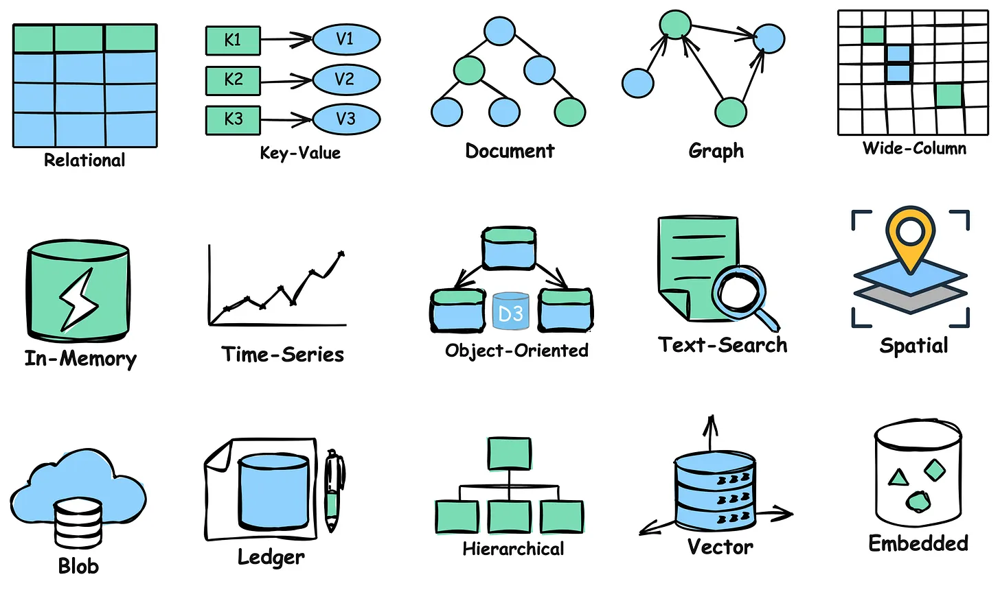

Below are different types of databases:

- **[SQL](https://karanpratapsingh.com/courses/system-design/sql-databases)**
- **[NoSQL](https://karanpratapsingh.com/courses/system-design/nosql-databases)**
    - Document
    - Key-value
    - Graph
    - Timeseries
    - Wide column
    - Multi-model

## Challenges

Some common challenges faced while running databases at scale:

- **Absorbing significant increases in data volume**: The explosion of data coming in from sensors, connected machines, and dozens of other sources.
- **Ensuring data security**: Data breaches are happening everywhere these days, it's more important than ever to ensure that data is secure but also easily accessible to users.
- **Keeping up with demand**: Companies need real-time access to their data to support timely decision-making and to take advantage of new opportunities.
- **Managing and maintaining the database and infrastructure**: As databases become more complex and data volumes grow, companies are faced with the expense of hiring additional talent to manage their databases.
- **Removing limits on scalability**: A business needs to grow if it's going to survive, and its data management must grow along with it. But it's very difficult to predict how much capacity the company will need, particularly with on-premises databases.
- **Ensuring data residency, data sovereignty, or latency requirements**: Some organizations have use cases that are better suited to run on-premises. In those cases, engineered systems that are pre-configured and pre-optimized for running the database are ideal.

# SQL databases

A SQL (or relational) database is a collection of data items with pre-defined relationships between them. These items are organized as a set of tables with columns and rows. Tables are used to hold information about the objects to be represented in the database. Each column in a table holds a certain kind of data and a field stores the actual value of an attribute. The rows in the table represent a collection of related values of one object or entity.

Each row in a table could be marked with a unique identifier called a primary key, and rows among multiple tables can be made related using foreign keys. This data can be accessed in many different ways without re-organizing the database tables themselves. SQL databases usually follow the [ACID consistency model](https://karanpratapsingh.com/courses/system-design/acid-and-base-consistency-models#acid).

## Materialized views

A materialized view is a pre-computed data set derived from a query specification and stored for later use. Because the data is pre-computed, querying a materialized view is faster than executing a query against the base table of the view. This performance difference can be significant when a query is run frequently or is sufficiently complex.

It also enables data subsetting and improves the performance of complex queries that run on large data sets which reduces network loads. There are other uses of materialized views, but they are mostly used for performance and replication.

## N+1 query problem

The N+1 query problem happens when the data access layer executes N additional SQL statements to fetch the same data that could have been retrieved when executing the primary SQL query. The larger the value of N, the more queries will be executed, the larger the performance impact.

This is commonly seen in GraphQL and ORM (Object-Relational Mapping) tools and can be addressed by optimizing the SQL query or using a dataloader that batches consecutive requests and makes a single data request under the hood.

## Advantages

Let's look at some advantages of using relational databases:

- Simple and accurate
- Accessibility
- Data consistency
- Flexibility

## Disadvantages

Below are the disadvantages of relational databases:

- Expensive to maintain
- Difficult schema evolution
- Performance hits (join, denormalization, etc.)
- Difficult to scale due to poor horizontal scalability

## Examples

Here are some commonly used relational databases:

- [PostgreSQL](https://www.postgresql.org)
- [MySQL](https://www.mysql.com)
- [MariaDB](https://mariadb.org)
- [Amazon Aurora](https://aws.amazon.com/rds/aurora)

# NoSQL databases

NoSQL is a broad category that includes any database that doesn't use SQL as its primary data access language. These types of databases are also sometimes referred to as non-relational databases. Unlike in relational databases, data in a NoSQL database doesn't have to conform to a pre-defined schema. NoSQL databases follow [BASE consistency model](https://karanpratapsingh.com/courses/system-design/acid-and-base-consistency-models#base).

Below are different types of NoSQL databases:

### Document

A document database (also known as a document-oriented database or a document store) is a database that stores information in documents. They are general-purpose databases that serve a variety of use cases for both transactional and analytical applications.

**Advantages**

- Intuitive and flexible
- Easy horizontal scaling
- Schemaless

**Disadvantages**

- Schemaless
- Non-relational

**Examples**

- [MongoDB](https://www.mongodb.com)
- [Amazon DocumentDB](https://aws.amazon.com/documentdb)
- [CouchDB](https://couchdb.apache.org)

**Common Use-cases:**

E-commerce Platforms: Storing product catalogs with diverse attributes, user reviews, and inventory data, allowing for flexible representation of product information.

Content Management Systems (CMS): Ideal for managing articles, user profiles, and comments, where each piece of content can be stored as a document.

Real-Time Analytics and IoT: Handling varied data structures generated by IoT devices and supporting real-time analytics on this data.

### Key-value

One of the simplest types of NoSQL databases, key-value databases save data as a group of key-value pairs made up of two data items each. They're also sometimes referred to as a key-value store.

**Advantages**

- Simple and performant
- Highly scalable for high volumes of traffic
- Session management
- Optimized lookups

**Disadvantages**

- Basic CRUD
- Values can't be filtered
- Lacks indexing and scanning capabilities
- Not optimized for complex queries

**Examples**

- [Redis](https://redis.io)
- [Memcached](https://memcached.org)
- [Amazon DynamoDB](https://aws.amazon.com/dynamodb)
- [Aerospike](https://aerospike.com)

**Common Use-cases:**

Session Storage: Storing and managing user session information such as user preferences, shopping carts or authentication tokens in web applications.

Caching: Implementing caching mechanisms to improve the performance of web applications by storing frequently accessed data in memory for rapid retrieval.

Real-time data processing: Key-value stores can quickly store and retrieve data for real-time analytics, event processing, or message queues.

### Graph

A graph database is a NoSQL database that uses graph structures for semantic queries with nodes, edges, and properties to represent and store data instead of tables or documents.

The graph relates the data items in the store to a collection of nodes and edges, the edges representing the relationships between the nodes. The relationships allow data in the store to be linked together directly and, in many cases, retrieved with one operation.

**Advantages**

- Query speed
- Agile and flexible
- Explicit data representation

**Disadvantages**

- Complex
- No standardized query language


**Examples**

- [Neo4j](https://neo4j.com)
- [ArangoDB](https://www.arangodb.com)
- [Amazon Neptune](https://aws.amazon.com/neptune)
- [JanusGraph](https://janusgraph.org)

**Common Use-cases:**

Social Networks: Managing user profiles and their connections, enabling features like friend recommendations and social graph analysis.

Recommendation Systems: Analyzing customer preferences, product inventories, and purchase histories to generate personalized product or content recommendations.

Knowledge Graphs: Building vast repositories of interconnected data for semantic searches, information retrieval, and decision support systems.

### Time series

A time-series database is a database optimized for time-stamped, or time series, data.

**Advantages**

- Fast insertion and retrieval
- Efficient data storage


**Examples**

- [InfluxDB](https://www.influxdata.com)
- [Apache Druid](https://druid.apache.org)

**Common Use-Cases:**

Financial Trading Platforms: For tracking stock prices, trade volumes, and market indicators over time, enabling trend analysis and algorithmic trading strategies.

IoT and Sensor Data Management: Collecting and analyzing data from sensors and IoT devices, useful in smart homes, industrial automation, and environmental monitoring.

Performance Monitoring: In IT and network infrastructure, to monitor system metrics (CPU usage, memory consumption, network traffic) over time, helping in capacity planning and anomaly detection.

### Wide column

Wide column databases, also known as wide column stores, are schema-agnostic. Data is stored in column families, rather than in rows and columns.

**Advantages**

- Highly scalable, can handle petabytes of data
- Ideal for real-time big data applications

**Disadvantages**

- Expensive
- Increased write time


**Examples**

- [BigTable](https://cloud.google.com/bigtable)
- [Apache Cassandra](https://cassandra.apache.org)
- [ScyllaDB](https://www.scylladb.com)

**Common Use-Cases:**

Web analytics and user tracking: Ideal for capturing and analyzing event data in real-time, such as web analytics, user activity logs, and network monitoring.

Real-Time Analytics: They can quickly aggregate and analyze data, making them suitable for dashboards, alerting systems, and operational analytics.


### Multi-model

Multi-model databases combine different database models (i.e. relational, graph, key-value, document, etc.) into a single, integrated backend. This means they can accommodate various data types, indexes, queries, and store data in more than one model.

**Advantages**

- Flexibility
- Suitable for complex projects
- Data consistent

**Disadvantages**

- Complex
- Less mature

**Examples**

- [ArangoDB](https://www.arangodb.com)
- [Azure Cosmos DB](https://azure.microsoft.com/en-in/services/cosmos-db)
- [Couchbase](https://www.couchbase.com)

### In-memory

In-Memory Databases store data directly in the main memory (RAM) of the computer, as opposed to disk-based storage.

They are designed to provide extremely fast data access and low latency by eliminating the need for disk I/O operations.

In-memory databases are particularly well-suited for applications that require real-time processing, high-speed transactions, and low-latency data access such as caching, real-time analytics, high-frequency trading.

However, they are costly and the main memory may lack sufficient capacity to store the entire dataset.

**Common Use-Cases:**

Online Gaming: To manage user sessions and game state in real time, ensuring fast and responsive gameplay experiences.

High-Frequency Trading: They enable a large number of financial transactions per second with minimal latency.

**Examples**
- Memcached
- Redis

### Text-Search Databases

Text Search Databases are specialized systems designed for efficient storage, indexing, and retrieval of large volumes of unstructured or semi-structured text data.

They provide fast and scalable search capabilities, enabling users to query and find relevant information from vast collections of documents, web pages, or other text-based content.

**Common Use-Cases:**

E-commerce: For product searches within online stores, helping customers find products based on descriptions, reviews, and metadata.

Web search: These are used in Search engines like Google, Bing, and DuckDuckGo to index and search the vast amount of content available on the internet, allowing users to find relevant web pages based on their queries.

Log analysis: These can be used to index and search large volumes of log data, such as application logs or system logs, for troubleshooting, monitoring, and analytics purposes.

**Example**

- ElasticSearch
- Apache Solr

### Spatial Databases

Spatial databases are designed to store, manage, and analyze data that represents geographical or spatial information. They extend traditional database capabilities to handle complex spatial data types, such as points, lines, polygons, and other geometric shapes, along with their associated attributes and relationships.

Spatial databases employ efficient indexing techniques, such as R-trees or quadtrees, to optimize spatial queries and improve performance.

They are used heavily in services that are based on the user's location, such as mapping routes, finding nearby restaurants, or tracking vehicle movements in real-time.

**Common Use-Cases:**

Geographic Information Systems (GIS): For mapping, analyzing, and managing data related to places on the earth's surface for urban planning, environmental management, and emergency response planning.

Location-Based Services (LBS): To provide services based on the user's location, such as mapping routes and finding nearby restaurants.

Logistics and transportation: Spatial databases are used in logistics and transportation systems to optimize routes, track vehicle movements, and analyze traffic patterns.

**Examples**

- PostGIS (extension for PostgreSQL)
- Oracle Spatial

### Vector Databases

Vector databases are specialized databases designed for storing and searching vectors which are arrays of numbers representing data in high-dimensional spaces.

They are optimized for similarity search and nearest neighbor queries enabling fast retrieval of similar items based on their vector representations.

These databases are particularly relevant in the field of machine learning and artificial intelligence (AI), where vector representations are commonly used to encode the features of various types of data, including text, images, and audio.

**Common Use-Cases:**

Image and Video Search: Vector databases enable content-based image and video retrieval by storing visual features as high-dimensional vectors.

Recommendation Systems: By representing users and items (e.g., products, movies) as vectors, vector databases can quickly identify and recommend items similar to a user's interests.

Anomaly detection: By comparing the similarity of new data points to known normal samples, anomalies can be detected based on their dissimilarity.

**Example**

- Pinecone
- Faiss
- Milvus

# SQL vs NoSQL databases

In the world of databases, there are two main types of solutions, SQL (relational) and NoSQL (non-relational) databases. Both of them differ in the way they were built, the kind of information they store, and how they store it. Relational databases are structured and have predefined schemas while non-relational databases are unstructured, distributed, and have a dynamic schema.

## High-level differences

Here are some high-level differences between SQL and NoSQL:

### Storage

SQL stores data in tables, where each row represents an entity and each column represents a data point about that entity.

NoSQL databases have different data storage models such as key-value, graph, document, etc.

### Schema

In SQL, each record conforms to a fixed schema, meaning the columns must be decided and chosen before data entry and each row must have data for each column. The schema can be altered later, but it involves modifying the database using migrations.

Whereas in NoSQL, schemas are dynamic. Fields can be added on the fly, and each _record_ (or equivalent) doesn't have to contain data for each _field_.

### Querying

SQL databases use SQL (structured query language) for defining and manipulating the data, which is very powerful.

In a NoSQL database, queries are focused on a collection of documents. Different databases have different syntax for querying.

### Scalability

In most common situations, SQL databases are vertically scalable, which can get very expensive. It is possible to scale a relational database across multiple servers, but this is a challenging and time-consuming process.

On the other hand, NoSQL databases are horizontally scalable, meaning we can add more servers easily to our NoSQL database infrastructure to handle large traffic. Any cheap commodity hardware or cloud instances can host NoSQL databases, thus making it a lot more cost-effective than vertical scaling. A lot of NoSQL technologies also distribute data across servers automatically.

### Reliability

The vast majority of relational databases are ACID compliant. So, when it comes to data reliability and a safe guarantee of performing transactions, SQL databases are still the better bet.

Most of the NoSQL solutions sacrifice ACID compliance for performance and scalability.

## Reasons

As always we should always pick the technology that fits the requirements better. So, let's look at some reasons for picking SQL or NoSQL based database:

**For SQL**

- Structured data with strict schema
- Relational data
- Need for complex joins
- Transactions
- Lookups by index are very fast

**For NoSQL**

- Dynamic or flexible schema
- Non-relational data
- No need for complex joins
- Very data-intensive workload
- Very high throughput for IOPS


# Geohashing and Quadtrees

## Geohashing

Geohashing is a [geocoding](https://en.wikipedia.org/wiki/Address_geocoding) method used to encode geographic coordinates such as latitude and longitude into short alphanumeric strings. It was created by [Gustavo Niemeyer](https://twitter.com/gniemeyer) in 2008.

For example, San Francisco with coordinates `37.7564, -122.4016` can be represented in geohash as `9q8yy9mf`.

### How does Geohashing work?

Geohash is a hierarchical spatial index that uses Base-32 alphabet encoding, the first character in a geohash identifies the initial location as one of the 32 cells. This cell will also contain 32 cells. This means that to represent a point, the world is recursively divided into smaller and smaller cells with each additional bit until the desired precision is attained. The precision factor also determines the size of the cell.

  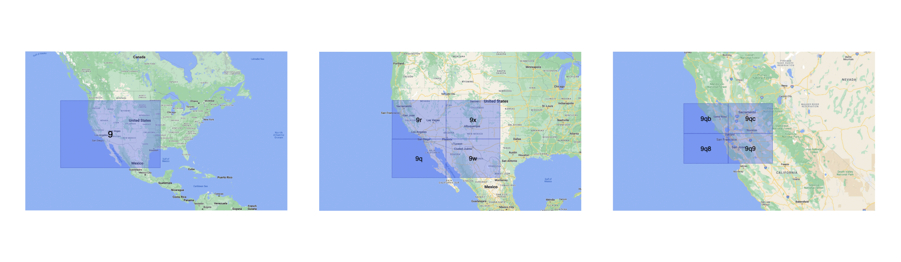

Geohashing guarantees that points are spatially closer if their Geohashes share a longer prefix which means the more characters in the string, the more precise the location. For example, geohashes `9q8yy9mf` and `9q8yy9vx` are spatially closer as they share the prefix `9q8yy9`.

Geohashing can also be used to provide a degree of anonymity as we don't need to expose the exact location of the user because depending on the length of the geohash we just know they are somewhere within an area.

The cell sizes of the geohashes of different lengths are as follows:

| Geohash length | Cell width | Cell height |
|----------------|------------|-------------|
| 1              | 5000 km    | 5000 km     |
| 2              | 1250 km    | 1250 km     |
| 3              | 156 km     | 156 km      |
| 4              | 39.1 km    | 19.5 km     |
| 5              | 4.89 km    | 4.89 km     |
| 6              | 1.22 km    | 0.61 km     |
| 7              | 153 m      | 153 m       |
| 8              | 38.2 m     | 19.1 m      |
| 9              | 4.77 m     | 4.77 m      |
| 10             | 1.19 m     | 0.596 m     |
| 11             | 149 mm     | 149 mm      |
| 12             | 37.2 mm    | 18.6 mm     |

### Use cases

Here are some common use cases for Geohashing:

- It is a simple way to represent and store a location in a database.
- It can also be shared on social media as URLs since it is easier to share, and remember than latitudes and longitudes.
- We can efficiently find the nearest neighbors of a point through very simple string comparisons and efficient searching of indexes.

### Examples

Geohashing is widely used and it is supported by popular databases.

- [MySQL](https://www.mysql.com)
- [Redis](http://redis.io)
- [Amazon DynamoDB](https://aws.amazon.com/dynamodb)
- [Google Cloud Firestore](https://cloud.google.com/firestore)

## Quadtrees

A quadtree is a tree data structure in which each internal node has exactly four children. They are often used to partition a two-dimensional space by recursively subdividing it into four quadrants or regions. Each child or leaf node stores spatial information. Quadtrees are the two-dimensional analog of [Octrees](https://en.wikipedia.org/wiki/Octree) which are used to partition three-dimensional space.

  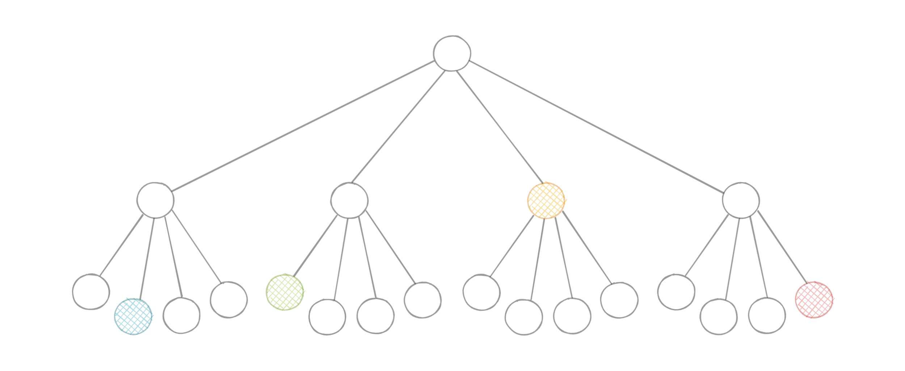

### Types of Quadtrees

Quadtrees may be classified according to the type of data they represent, including areas, points, lines, and curves. The following are common types of quadtrees:

- Point quadtrees
- Point-region (PR) quadtrees
- Polygonal map (PM) quadtrees
- Compressed quadtrees
- Edge quadtrees

### Why do we need Quadtrees?

Aren't latitudes and longitudes enough? Why do we need quadtrees? While in theory using latitude and longitude we can determine things such as how close points are to each other using [euclidean distance](https://en.wikipedia.org/wiki/Euclidean_distance), for practical use cases it is simply not scalable because of its CPU-intensive nature with large data sets.

  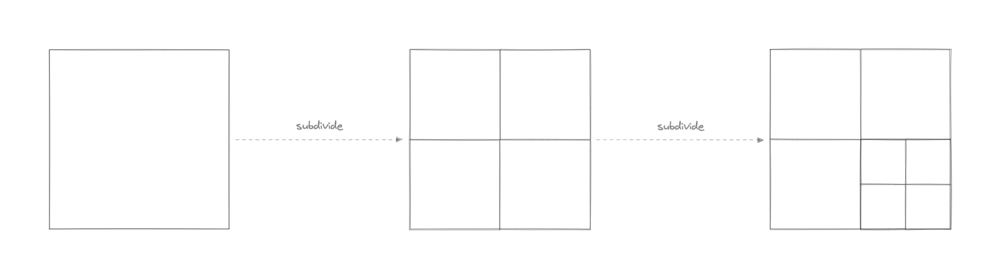

Quadtrees enable us to search points within a two-dimensional range efficiently, where those points are defined as latitude/longitude coordinates or as cartesian (x, y) coordinates. Additionally, we can save further computation by only subdividing a node after a certain threshold. And with the application of mapping algorithms such as the [Hilbert curve](https://en.wikipedia.org/wiki/Hilbert_curve), we can easily improve range query performance.

### Use cases

Below are some common uses of quadtrees:

- Image representation, processing, and compression.
- Spacial indexing and range queries.
- Location-based services like Google Maps, Uber, etc.
- Mesh generation and computer graphics.
- Sparse data storage.


# Database Replication

Replication is a method of copying data to ensure that all information stays identical in real-time between all data resources.

Replication is a technique used to improve database performance, ensure consistency between redundant resources such as multiple databases, to improve reliability, fault-tolerance, or accessibility, and support data distribution and sharing.

Replication can be either one-way or two-way. In one-way replication, updates are only sent from the primary database to the replicas. In two-way replication, updates can be sent from either the primary or the replicas, and all changes are synchronized across all databases. Replication can also be synchronous or asynchronous. In synchronous replication, updates are sent to all replicas simultaneously, ensuring that all copies of the data are always in sync. In asynchronous replication, updates are sent to the replicas at a later time, allowing for some delay in synchronization.

## Types of Replication

- Snapshot replication: This type of replication involves taking a snapshot of the master database and copying it to the replicas. After the initial copy, updates are sent to the replicas as they occur.

- Transactional replication: This type of replication involves sending individual transactions from the primary database to the replicas. This ensures that all changes are applied in the correct order and guarantees consistency across all databases.

- Merge replication: This type of replication combines data from multiple databases into a single database. Changes made in any of the databases are synchronized with the others, ensuring that all copies of the data are up to date.

### Master - Slave Replication

The master serves reads and writes, replicating writes to one or more slaves, which serve only reads. Slaves can also replicate additional slaves in a tree-like fashion. If the master goes offline, the system can continue to operate in read-only mode until a slave is promoted to a master or a new master is provisioned.


 **Advantages**

- Backups of the entire database of relatively no impact on the master.
- Applications can read from the slave(s) without impacting the master.
- Slaves can be taken offline and synced back to the master without any downtime.

**Disadvantages**

- Replication adds more hardware and additional complexity.
- Downtime and possibly loss of data when a master fails.
- All writes also have to be made to the master in a master-slave architecture.
- The more read slaves, the more we have to replicate, which will increase replication lag.

**Note** :

MySQL replication is a process by which data from one MySQL database server (the master) is copied to one or more MySQL database servers (the slaves). This is done asynchronously and in near-real-time, allowing data to be replicated across multiple servers for backup, load balancing, or other purposes.

The replication process is based on the binary log, which records all changes to the data made on the master and then applying those changes to the slave servers. This process is known as the "replication stream". The binary log is a file that contains a series of events that represent changes to the database, such as insertions, deletions, and updates.

### Master-Master Replication

Both masters serve reads/writes and coordinate with each other. If either master goes down, the system can continue to operate with both reads and writes.

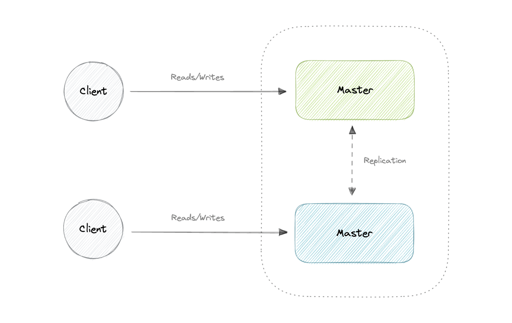

**Advantages**

- Applications can read from both masters.
- Distributes write load across both master nodes.
- Simple, automatic, and quick failover.

**Disadvantages**

- Not as simple as master-slave to configure and deploy.
- Either loosely consistent or have increased write latency due to synchronization.
- Conflict resolution comes into play as more write nodes are added and as latency increases.

## Synchronous vs Asynchronous replication

The primary difference between synchronous and asynchronous replication is how the data is written to the replica. In synchronous replication, data is written to primary storage and the replica simultaneously. As such, the primary copy and the replica should always remain synchronized.

In contrast, asynchronous replication copies the data to the replica after the data is already written to the primary storage. Although the replication process may occur in near-real-time, it is more common for replication to occur on a scheduled basis and it is more cost-effective.

# Indexes

Indexes are well known when it comes to databases, they are used to improve the speed of data retrieval operations on the data store. An index makes the trade-offs of increased storage overhead, and slower writes (since we not only have to write the data but also have to update the index) for the benefit of faster reads. Indexes are used to quickly locate data without having to examine every row in a database table. Indexes can be created using one or more columns of a database table, providing the basis for both rapid random lookups and efficient access to ordered records.

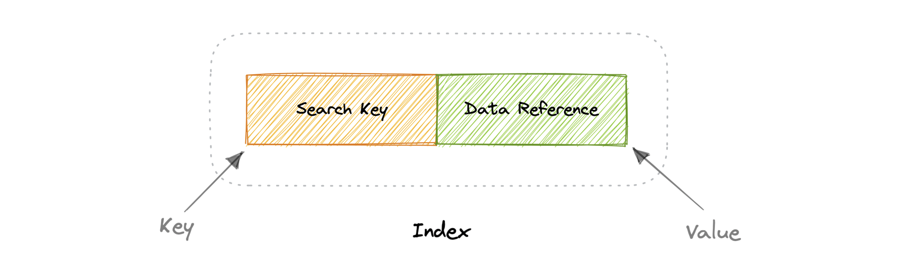

An index is a data structure that can be perceived as a table of contents that points us to the location where actual data lives. So when we create an index on a column of a table, we store that column and a pointer to the whole row in the index. Indexes are also used to create different views of the same data. For large data sets, this is an excellent way to specify different filters or sorting schemes without resorting to creating multiple additional copies of the data.

One quality that database indexes can have is that they can be **dense**, meaning an index record is created for every row of the table or **sparse**, meaning an index record is created for some subset of rows of the table. The benefit of a dense index is that values can be quickly found with just a binary search whereas sparse indexes require binary search and full scan of that subset of rows. Dense indexes require more maintenance than sparse indexes at write-time.

## Compound/Composite Indexes

Creating a compound index involves specifying two or more columns that should be indexed together. The order in which the columns are specified matters, as the index will be created based on that order. For example, if we have a table called "users" with columns "first_name", "last_name", and "email", we can create a compound index on the "first_name" and "last_name" columns with the following SQL statement:

```sqlite-sql
CREATE INDEX idx_users_name ON users (first_name, last_name);
```

This will create an index that is sorted by the "first_name" column first, and then by the "last_name" column for ties. This index can be used to speed up queries that involve filtering, sorting, or grouping by the "first_name" and/or "last_name" columns.

Concatenated indexes can also be used for Where clauses that contain only the first of two concatenated fields. 

```sqlite-sql
WHERE last_name = 'Smith' and middle_name = 'Edward' and
first_name = 'Thomas';
```
If the index fields include all the conditions of the Where clause in that order, the driver can use the entire index. If, however, your index is on two nonconsecutive fields, say, LAST_NAME and FIRST_NAME, the driver can use only the LAST_NAME field of the index.


## Types of Indexes

### B-Tree Indexes

Most commonly used index structure to speed up data retrieval. B-Tree stands for "balanced tree" and is designed to maintain a balance between the speed of retrieval and the amount of memory required to store the index.

**Creating Indexes in SQL**

In SQL, indexes can be created using the CREATE INDEX statement. For example, to create a B-tree index on the "name" column of a "customers" table, the following SQL statement can be used:

```sqlite-sql
CREATE INDEX idx_customers_name ON customers (name);
```
This statement creates a B-tree index named "idx_customers_name" on the "name" column of the "customers" table.

**How does a B-Tree Index work?**

A B-Tree index works by dividing the data into pages and creating a tree structure from those pages. Each page in the tree has a fixed size and contains a range of data values. The root node of the tree contains pointers to the child nodes, which in turn contain pointers to their own children.

When a query is executed, the B-Tree index is used to find the page or pages that contain the data being searched for. The search starts at the root node of the B-Tree and follows the pointers to the appropriate child node. This process continues until the data is found, or until the search reaches a leaf node.

**Advantages of B-Tree Index:**

- B-Tree index is well-suited for indexing large data sets and has been used in many database systems.
- B-Tree index is efficient in terms of query performance because it allows for fast searching and retrieval of data.
- B-Tree index is able to handle large amounts of data while still providing good query performance.

**Disadvantages of B-Tree Index:**

- B-Tree index can be slow for insert and delete operations because it requires reorganizing the index tree.
- B-Tree index can take up a large amount of memory because it stores the index data structure in memory.
- B-Tree index is not well-suited for indexing small data sets because the overhead of the index can outweigh the benefits.

### Bitmap Indexes

A Bitmap Index is a type of index used in SQL to improve the performance of queries that contain a large number of columns or queries with complex predicates. The Bitmap Index stores the index values as a bitmap, which is a dense representation of the data. It works by creating a bitmap for each unique value in the indexed column, with each bit in the bitmap representing a row in the table. The bitmap indicates whether the corresponding row contains the indexed value or not. The bitmap index can significantly speed up the query processing time for certain types of queries.

We can create the Bitmap Index using the following SQL query:

```oracle-sql
CREATE BITMAP INDEX prod_idx ON Sales (ProductID);
```

### Hash Indexes

Hash indexes are used for equality comparisons. They are efficient for queries that involve simple equality comparisons, but they are not efficient for range searches.

### R-tree Indexes

R-Tree indexes are used for spatial data, such as maps, images, and satellite data. They are efficient for queries that involve searching for a specific geographic location or a range of locations.

## Deciding Which Indexes to Create

- If the record retrievals are based on one field at a time (for example, dept='D101'), create an index on these fields.
- If the record retrievals are based on a combination of fields, look at the combinations.
- If the comparison operator for the conditions is AND (for example, CITY = 'Raleigh' AND STATE = 'NC'), then build a concatenated index on the CITY and STATE fields. This index is also useful for retrieving records based on the CITY field.
- If the comparison operator is OR (for example, DEPT = 'D101' OR HIRE_DATE > {01/30/89}), an index does not help performance. Therefore, need not create one.
- If the retrieval conditions contain both AND and OR comparison operators, you can use an index if the OR conditions are grouped. For example:
  `dept = 'D101' AND (hire_date > {01/30/89} OR exempt = 1)`

  In this case, an index on the DEPT field improves performance.
- If the AND conditions are grouped, an index does not improve performance.


# Normalization and Denormalization

## Terms

Before we go any further, let's look at some commonly used terms in normalization and denormalization.

### Keys

**Primary key**: Column or group of columns that can be used to uniquely identify every row of the table.

**Composite key**: A primary key made up of multiple columns.

**Super key**: Set of all keys that can uniquely identify all the rows present in a table.

**Candidate key**: Attributes that identify rows uniquely in a table.

**Foreign key**: It is a reference to a primary key of another table.

**Alternate key**: Keys that are not primary keys are known as alternate keys.

**Surrogate key**: A system-generated value that uniquely identifies each entry in a table when no other column was able to hold properties of a primary key.

### Dependencies

**Partial dependency**: Occurs when the primary key determines some other attributes.

**Functional dependency**: It is a relationship that exists between two attributes, typically between the primary key and non-key attribute within a table.

**Transitive functional dependency**: Occurs when some non-key attribute determines some other attribute.

### Anomalies

Database anomaly happens when there is a flaw in the database due to incorrect planning or storing everything in a flat database. This is generally addressed by the process of normalization.

There are three types of database anomalies:

**Insertion anomaly**: Occurs when we are not able to insert certain attributes in the database without the presence of other attributes.

**Update anomaly**: Occurs in case of data redundancy and partial update. In other words, a correct update of the database needs other actions such as addition, deletion, or both.

**Deletion anomaly**: Occurs where deletion of some data requires deletion of other data.

**Example**

Let's consider the following table which is not normalized:

| ID | Name   | Role              | Team |
|----|--------|-------------------|------|
| 1  | Peter  | Software Engineer | A    |
| 2  | Brian  | DevOps Engineer   | B    |
| 3  | Hailey | Product Manager   | C    |
| 4  | Hailey | Product Manager   | C    |
| 5  | Steve  | Frontend Engineer | D    |

Let's imagine, we hired a new person "John" but they might not be assigned a team immediately. This will cause an _insertion anomaly_ as the team attribute is not yet present.

Next, let's say Hailey from Team C got promoted, to reflect that change in the database, we will need to update 2 rows to maintain consistency which can cause an _update anomaly_.

Finally, we would like to remove Team B but to do that we will also need to remove additional information such as name and role, this is an example of a _deletion anomaly_.

## Normalization

Normalization is the process of organizing data in a database. This includes creating tables and establishing relationships between those tables according to rules designed both to protect the data and to make the database more flexible by eliminating redundancy and inconsistent dependency.

### Why do we need normalization?

The goal of normalization is to eliminate redundant data and ensure data is consistent. A fully normalized database allows its structure to be extended to accommodate new types of data without changing the existing structure too much. As a result, applications interacting with the database are minimally affected.

### Normal forms

Normal forms are a series of guidelines to ensure that the database is normalized. Let's discuss some essential normal forms:

**1NF**

For a table to be in the first normal form (1NF), it should follow the following rules:

- Repeating groups are not permitted.
- Identify each set of related data with a primary key.
- Set of related data should have a separate table.
- Mixing data types in the same column is not permitted.

**2NF**

For a table to be in the second normal form (2NF), it should follow the following rules:

- Satisfies the first normal form (1NF).
- Should not have any partial dependency.

**3NF**

For a table to be in the third normal form (3NF), it should follow the following rules:

- Satisfies the second normal form (2NF).
- Transitive functional dependencies are not permitted.

**BCNF**

Boyce-Codd normal form (or BCNF) is a slightly stronger version of the third normal form (3NF) used to address certain types of anomalies not dealt with by 3NF as originally defined. Sometimes it is also known as the 3.5 normal form (3.5NF).

For a table to be in the Boyce-Codd normal form (BCNF), it should follow the following rules:

- Satisfied the third normal form (3NF).
- For every functional dependency X → Y, X should be the super key.

_There are more normal forms such as 4NF, 5NF, and 6NF but we won't discuss them here. Check out this [amazing video](https://www.youtube.com/watch?v=GFQaEYEc8_8) that goes into detail._

In a relational database, a relation is often described as _"normalized"_ if it meets the third normal form. Most 3NF relations are free of insertion, update, and deletion anomalies.

As with many formal rules and specifications, real-world scenarios do not always allow for perfect compliance. If you decide to violate one of the first three rules of normalization, make sure that your application anticipates any problems that could occur, such as redundant data and inconsistent dependencies.

### Advantages

Here are some advantages of normalization:

- Reduces data redundancy.
- Better data design.
- Increases data consistency.
- Enforces referential integrity.

### Disadvantages

Let's look at some disadvantages of normalization:

- Data design is complex.
- Slower performance.
- Maintenance overhead.
- Require more joins.

## Denormalization

Denormalization is a database optimization technique in which we add redundant data to one or more tables. This can help us avoid costly joins in a relational database. It attempts to improve read performance at the expense of some write performance. Redundant copies of the data are written in multiple tables to avoid expensive joins.

Once data becomes distributed with techniques such as federation and sharding, managing joins across the network further increases complexity. Denormalization might circumvent the need for such complex joins.

_Note: Denormalization does not mean reversing normalization._

### Advantages

Let's look at some advantages of denormalization:

- Retrieving data is faster.
- Writing queries is easier.
- Reduction in number of tables.
- Convenient to manage.

### Disadvantages

Below are some disadvantages of denormalization:

- Expensive inserts and updates.
- Increases complexity of database design.
- Increases data redundancy.
- More chances of data inconsistency.

# ACID model

The term ACID stands for Atomicity, Consistency, Isolation, and Durability. ACID properties are used for maintaining data integrity during transaction processing.

In order to maintain consistency before and after a transaction relational databases follow ACID properties. Let us understand these terms:

## Atomicity

Atomicity in ACID transactions guarantees that a transaction is treated as a single, indivisible unit of work. If any part of the transaction fails, the entire transaction must be rolled back, meaning that any changes made during the transaction are undone. This ensures that the database remains in a consistent state, regardless of any failures that may occur during the transaction.

## Consistency

Consistency ensures that the database remains in a valid state before and after the transaction. In other words, the database schema must satisfy all constraints and rules, and any transaction that violates these constraints must be rolled back to maintain the consistency of the database. This ensures that the database maintains its integrity and the data remains accurate and reliable.

Consistency is maintained through the use of various techniques such as transactions, locking, and validation of rules and constraints. The primary goal of consistency is to prevent data corruption, which can lead to incorrect results and ultimately, data loss.

## Isolation

This property ensures that each transaction operates independently of other transactions, which means that a transaction’s effects should only become visible to other transactions after it has been committed. This property prevents interference and conflicts between concurrent transactions, and helps maintain the integrity and consistency of the database. It’s important to note that different levels of isolation can be configured for transactions, depending on the specific requirements of the application and the database system being used.

_****Levels of Isolation****_

The SQL standard defines four levels of isolation for transactions:

- **Read Uncommitted:** In this level of isolation, a transaction can read uncommitted changes from other transactions. The dirty read problem can occur in this level of isolation, where a transaction can read uncommitted data from another transaction, which may be rolled back later.
- **Read Committed:** In this level of isolation, a transaction can only read committed data from other transactions. The dirty read problem is avoided in this level of isolation.
- **Repeatable Read:** In this level of isolation, a transaction can read data that it has previously read, even if the data has been modified by another transaction. However, it cannot read data that has been modified by another transaction after it started.
- **Serializable:** In this level of isolation, transactions are executed as if they were executed one at a time. All the data accessed by a transaction is locked until the transaction is complete.

Concurrency control refers to the methods and techniques used by a database management system to ensure that multiple transactions can access and modify the database concurrently without interfering with each other.

There are two main approaches to concurrency control: **pessimistic** and **optimistic**. In the pessimistic approach, the DBMS locks the data that is being accessed by a transaction, preventing other transactions from accessing it until the lock is released. In the optimistic approach, the DBMS assumes that conflicts will be rare and allows multiple transactions to access the same data simultaneously, resolving any conflicts that arise later.

_**Concurrency control techniques:**_

1. **Locking:**
   - Locking is the most commonly used concurrency control technique. In this technique, a lock is placed on the data that is being accessed by a transaction, preventing other transactions from accessing it until the lock is released. Locking can be either shared or exclusive. In shared locking, multiple transactions can access the same data simultaneously, but they cannot modify it. In exclusive locking, only one transaction can access the data at a time, and it can modify it.

   - For example, consider two transactions T1 and T2 that access the same row in a table. If T1 locks the row in exclusive mode, T2 cannot access or modify the row until T1 releases the lock.

2. **Timestamping:**
   - In timestamping, each transaction is assigned a unique timestamp, which is used to determine the order in which transactions are executed. When a transaction wants to read or write data, it checks the timestamps of the transactions that have already accessed the data. If the timestamp of the transaction is earlier than the timestamps of the other transactions, it is allowed to access the data. If the timestamp is later, it is either aborted or put on hold until the other transactions are completed.

   - For example, consider two transactions T1 and T2 that access the same row in a table. If T1 has a lower timestamp than T2, T1 is allowed to access the row. If T2 has a lower timestamp than T1, it is either aborted or put on hold until T1 completes.

3. **Multiversion concurrency control (MVCC):**
   - In MVCC, each transaction sees a consistent view of the database as it existed at the time the transaction started. When a transaction wants to read data, it reads the version of the data that was current when the transaction started. When a transaction wants to write data, it creates a new version of the data, leaving the old version intact.

   - For example, consider two transactions T1 and T2 that access the same row in a table. If T1 updates the row, a new version of the row is created. T2 can still read the old version of the row, and when it updates the row, a new version of the row is created.

## Durability

- Once the transaction has been committed and the writes and updates have been written to database, it will remain so even in the face of power loss, system crashes, or other errors. In other words, durability ensures that the database can recover to a consistent state after a failure.
- These changes must be written to non-volatile storage, such as a hard drive or SSD, to ensure they are not lost.
- Durability is usually achieved by using a technique called logging. Whenever a transaction modifies data in the database, it generates a log entry that records the changes made. These log entries are written to disk before the transaction is considered committed. In the event of a failure, the database can use these log entries to recover the database to a consistent state.
- The logging process in SQL databases is automatic and transparent to the user. Once the database is set up, the system automatically creates a log file to store all database activities. The log file is usually located in a separate location from the database files to prevent data loss in case of a system failure.


## How do acid transactions work?

ACID transactions maintain data integrity by adhering to a set of steps. The steps described are a common way that databases implement ACID transactions, but there could be variations or differences in implementation depending on the specific database system being used.

- **Begin Transaction:** A BEGIN TRANSACTION statement declaration initiates a transaction and establishes a savepoint from which the transaction can be rolled back if necessary.
- **Execute operations:** All operations within the transaction are executed one at a time. The database validates each operation to ensure it complies with the constraints and schema.
- **Commit or Rollback:** Following the successful completion of all operations, the transaction is committed using the COMMIT statement. The transaction is rolled back to the savepoint established at the beginning of the transaction if any operation fails.

**Example** Here's an example of a SQL transaction that transfers funds from one account to another:

```sqlite-sql
BEGIN TRANSACTION;
UPDATE Accounts SET Balance = Balance - 500 WHERE AccountNumber = '12345';
UPDATE Accounts SET Balance = Balance + 500 WHERE AccountNumber = '67890';
COMMIT TRANSACTION;
```
In this example, the transaction begins with the BEGIN TRANSACTION statement, followed by two UPDATE statements that debit and credit the appropriate accounts. If both UPDATE statements are executed successfully, the transaction is committed with the COMMIT TRANSACTION statement. However, if either of the UPDATE statements fails, the transaction is rolled back, and the database is returned to its original state.

**Alternatives to acid transactions**

- BASE (Basically Available, Soft state, Eventually consistent)
- CAP (Consistency, Availability, Partition tolerance) theorem
- NoSQL databases 
  - NoSQL databases do not impose rigid consistency standards and prioritize performance and scalability over immediate consistency.
  - BASE is often used in conjunction with NoSQL databases, which prioritize scalability and availability over strict consistency requirements.

# BASE model

With the increasing amount of data and high availability requirements, the approach to database design has also changed dramatically. To increase the ability to scale and at the same time be highly available, we move the logic from the database to separate servers. In this way, the database becomes more independent and focused on the actual process of storing data.

In the NoSQL database world, ACID transactions are less common as some databases have loosened the requirements for immediate consistency, data freshness, and accuracy in order to gain other benefits, like scale and resilience.

BASE properties are much looser than ACID guarantees, but there isn't a direct one-for-one mapping between the two consistency models. Let us understand these terms:

## Basic Availability

The database appears to work most of the time.

## Soft-state

Stores don't have to be write-consistent, nor do different replicas have to be mutually consistent all the time.

## Eventual consistency

The data might not be consistent immediately but eventually, it becomes consistent. Reads in the system are still possible even though they may not give the correct response due to inconsistency.

# Consistency Models in Distributed Systems

- In distributed systems, data consistency refers to the state where all copies of the same data across multiple nodes are coherent and up-to-date. Achieving consistency ensures that users interacting with the system observe a unified and accurate view of the data, regardless of which node they access.

- A distributed system replicates the data across multiple servers to attain improved fault tolerance, scalability, and reliability. The consistency patterns (consistency models) are a set of techniques for data storage and data management in a distributed system 4. The consistency pattern determines the data propagation across the distributed system. Hence, the consistency pattern will impact the scalability, and reliability of the distributed system.

- The choice of the consistency pattern depends on the system requirements and use cases because each consistency pattern has its benefits and drawbacks. Consistency patterns must be at the crux of multi-data center system architecture as it’s non-trivial to maintain consistency across multiple data centers. 
- The consistency patterns can be broadly categorized as follows:
  - strong consistency
  - eventual consistency
  - weak consistency
- The eventual consistency model is an optimal choice for distributed systems that favor high availability and performance over consistency. Strong consistency is an optimal consistency model when the same data view must be visible across the distributed system without delay. In summary, each consistency model fits a different use case and system requirements.

## Strong Consistency

- In the strong consistency pattern, read operations performed on any server must always retrieve the data that was included in the latest write operation. The strong consistency pattern typically replicates data synchronously across multiple servers. Put another way, when a write operation is executed on a server, subsequent read operations on every other server must return the latest written data.
- The benefits of strong consistency are the following:

    - simplified application logic
    - increased data durability
    - guaranteed consistent data view across the system
- The limitations of strong consistency are as follows:

    - reduced availability of the service
    - degraded latency
    - resource-intensive

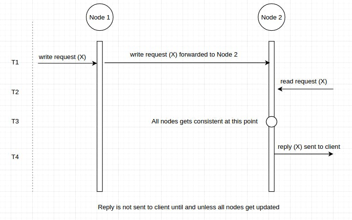

- During the time these replicas are being updated with new data, response to any subsequent read/write requests by any of the replicas will get delayed as all replicas are busy in keeping each other consistent.
- As soon as they become consistent, they start to take care of the requests that have come at their door.

- Google’s Bigtable and Google’s Spanner databases are real-world applications of strong consistency.

## Eventual Consistency

- In the eventual consistency pattern, when a write operation is executed against a server, the immediate subsequent read operations against other servers do not necessarily return the latest written data 1. The system will eventually converge to the same state and the latest data will be returned by other servers on succeeding read operations.

- In layman’s terms, any data changes are only eventually propagated across the system and stale data views are expected until data convergence occurs.
- The system converges to the same state usually in a few seconds but the time frame depends on the implementation and system requirements.
- The benefits of eventual consistency pattern are:
  - simple
  - highly available
  - scalable
  - low latency
- The drawbacks of eventual consistency are the following:
  - weaker consistency model
  - potential data loss
  - potential data conflicts
  - data inconsistency

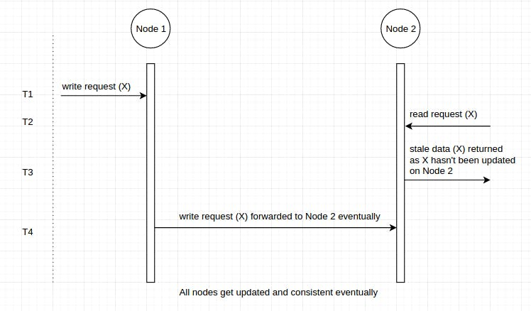


- For example, any changes to the domain name records are replicated eventually by DNS. Distributed databases such as Amazon Dynamo and Apache Cassandra are real-world applications of the eventual consistency pattern.

- Strong Consistency offers up-to-date data but at the cost of high latency.
- Eventual consistency offers low latency but may reply to read requests with stale data since all nodes of the database may not have the updated data.

## Weak Consistency

* In the weak consistency pattern, when a write operation is executed against a server, the subsequent read operations against other servers may or may not return the latest written data. In other words, a best-effort approach to data propagation is performed - the data may not be immediately propagated. The distributed system must meet various conditions such as the passing of time before the latest written data can be returned.

* The advantages of weak consistency are the following:
    * high availability
    * low latency

* The disadvantages of weak consistency are as follows:
  * potential data loss
  * data inconsistency
  * data conflicts

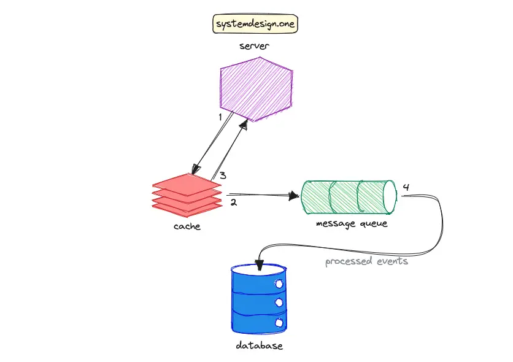

* The write-behind (write-back) cache pattern is an example of weak consistency. The data will be lost if the cache crashes before propagating the data to the database. The workflow of the write-behind cache pattern is the following:

    * the client executes a write operation against the cache server
    * the cache writes the received data to the message queue
    * the cache sends an acknowledgment signal to the client
    * the event processor asynchronously writes the data to the database

* The common use cases of weak consistency are the following:

  * Real-time multiplayer video games
  * Voice over Internet Protocol (VoIP)
  * Live streams
  * Cache server
  * Data backups

* For instance, the lost video frames due to poor network connectivity are not retransmitted in a live stream.

## Casual Consistency

- In the causal consistency pattern, the related events (cause-effect) are observed in the exact order by other servers, while unrelated events might be observed without a specific ordering by other servers. 
- Causal consistency is a variant of eventual consistency and emerges as a middle ground between eventual consistency and strong consistency. 
- The write operations that are causally unrelated or occur in parallel in real-time are known as concurrent events. The causal consistency pattern does not guarantee ordering for concurrent events.

# CAP theorem

- CAP theorem states that a distributed system can deliver only two of the three desired characteristics Consistency, Availability, and Partition tolerance (CAP).

### Consistency

- Consistency means that all clients see the same data at the same time, no matter which node they connect to. For this to happen, whenever data is written to one node, it must be instantly forwarded or replicated across all the nodes in the system before the write is deemed "successful". If not replicated with all other nodes, an error is returned. This ensures that clients always receive the latest data but may lead to temporary unavailability during network partitions.
- Consistency in CAP is different than that of ACID. Consistency in CAP means having the most up-to-date information. (ACID refers to a different database event. In ACID, consistency means any new transaction to the database won’t corrupt the database.)

### Availability

- Availability means that any client making a request for data receives a response, even if it means returning potentially stale or outdated data.
- The system stays operational and responsive no matter what.
- This is useful in scenarios where responsiveness is critical, but it might result in different nodes having slightly different data.

### Partition Tolerance

- Partition tolerance addresses the system's ability to function and maintain data consistency despite network partitions or communication failures. (ie; dropped partitions, slow network connections, or unavailable network connections between nodes)
- This is vital in distributed systems that span multiple data centers or regions.

### Final CAP Theorem

- In the theorem, partition tolerance is a must. The assumption is that the system operates on a distributed data store so the system, by nature, operates with network partitions. Network failures will happen, so to offer any kind of reliable service, partition tolerance is necessary—the P of CAP.
- This implies a tradeoff between Consistency (C) and Availability (A).
- **Final theorem :** The CAP theorem is a belief from theoretical computer science about distributed data stores that claims, in the event of a network failure on a distributed database, it is possible to provide either consistency or availability—but not both.

## Exploring CAP trade-offs

* **CA Systems (Consistency and Availability):**

  - A CA system delivers consistency and availability across all nodes. It can't do this if there is a partition between any two nodes in the system, and therefore can't deliver fault (partition) tolerance.
  - These systems are suitable for scenarios where network partitions are rare, and maintaining strong consistency is paramount. 
  - Example: PostgreSQL, MariaDB.

* **CP Systems (Consistency and Partition Tolerance):**

  * A CP system delivers consistency and partition tolerance at the expense of availability. 
  * When a partition occurs between any two nodes, the system has to shut down the non-consistent node (temporarily unavailable to ensure data consistency) until the partition is resolved.
  * Examples include databases that enforce strict consistency, such as traditional relational databases. (MySQL)

* **AP Systems (Availability and Partition Tolerance):**

  * An AP system delivers availability and partition tolerance at the expense of consistency. 
  * When a partition occurs, all nodes remain available but those at the wrong end of a partition might return an older version of data than others. 
  * When the partition is resolved, the AP databases typically re-syncs the nodes to repair all inconsistencies in the system.
  * Examples include NoSQL databases that focus on high availability. (MongoDB, Apache Cassandra, CouchDB)

# PACELC Theorem

- The PACELC theorem is an extension of the CAP theorem, incorporating the dimensions of Eventual Consistency(E) and Latency(L) as an additional attribute of a distributed system.
- **Eventual Consistency** refers to the principle that, given enough time and the absence of further updates, all replicas of a data item will converge to the same value. It represents a relaxation of the strict consistency requirement to improve availability and reduce latency.
- **Latency** denotes the time it takes for a request to travel from a client to the system and receive a response. In the PACELC theorem, latency is taken into account when making trade-offs between consistency and availability.
- As per CAP theorem, during network partitions, a system can choose either Availability (A) or Consistency (C). 
- PACELC theorem states that, even in scenarios without partitions, the system must strike a balance between Consistency (C) and Latency (L), which influences the adoption of Eventual Consistency (E).
- PACELC theorem was developed to address a key limitation of the CAP theorem as it makes no provision for performance or latency.

# Transactions

A transaction is a series of database operations that are considered to be a _"single unit of work"_. The operations in a transaction either all succeed, or they all fail. In this way, the notion of a transaction supports data integrity when part of a system fails. Not all databases choose to support ACID transactions, usually because they are prioritizing other optimizations that are hard or theoretically impossible to implement together.

_Usually, relational databases support ACID transactions, and non-relational databases don't (there are exceptions)._

## States

A transaction in a database can be in one of the following states:

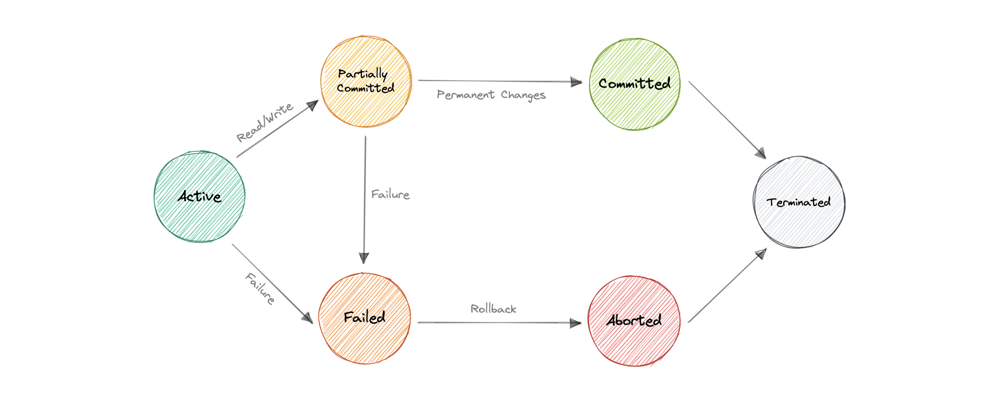

# Distributed Transactions

A distributed transaction is a set of operations on data that is performed across two or more databases. It is typically coordinated across separate nodes connected by a network, but may also span multiple databases on a single server.

## Why do we need distributed transactions?

Unlike an ACID transaction on a single database, a distributed transaction involves altering data on multiple databases. Consequently, distributed transaction processing is more complicated, because the database must coordinate the committing or rollback of the changes in a transaction as a self-contained unit.

In other words, all the nodes must commit, or all must abort and the entire transaction rolls back. This is why we need distributed transactions.

Now, let's look at some popular solutions for distributed transactions:

## Two-Phase commit

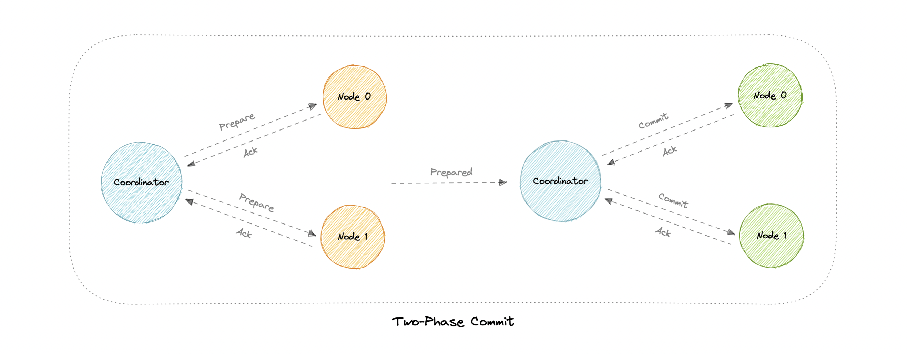

The two-phase commit (2PC) protocol is a distributed algorithm that coordinates all the processes that participate in a distributed transaction on whether to commit or abort (roll back) the transaction.

This protocol achieves its goal even in many cases of temporary system failure and is thus widely used. However, it is not resilient to all possible failure configurations, and in rare cases, manual intervention is needed to remedy an outcome.

This protocol requires a coordinator node, which basically coordinates and oversees the transaction across different nodes. The coordinator tries to establish the consensus among a set of processes in two phases, hence the name.

### Phases

Two-phase commit consists of the following phases:

**Prepare phase**

The prepare phase involves the coordinator node collecting consensus from each of the participant nodes. The transaction will be aborted unless each of the nodes responds that they're _prepared_.

**Commit phase**

If all participants respond to the coordinator that they are _prepared_, then the coordinator asks all the nodes to commit the transaction. If a failure occurs, the transaction will be rolled back.

### Problems

Following problems may arise in the two-phase commit protocol:

- What if one of the nodes crashes?
- What if the coordinator itself crashes?
- It is a blocking protocol.

## Three-phase commit

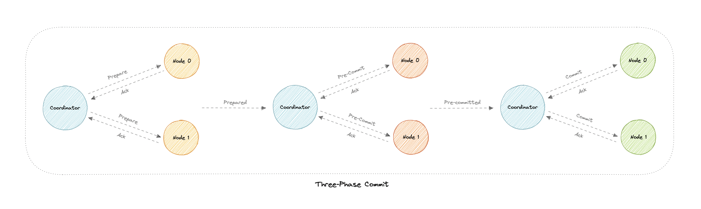

Three-phase commit (3PC) is an extension of the two-phase commit where the commit phase is split into two phases. This helps with the blocking problem that occurs in the two-phase commit protocol.

### Phases

Three-phase commit consists of the following phases:

**Prepare phase**

This phase is the same as the two-phase commit.

**Pre-commit phase**

Coordinator issues the pre-commit message and all the participating nodes must acknowledge it. If a participant fails to receive this message in time, then the transaction is aborted.

**Commit phase**

This step is also similar to the two-phase commit protocol.

### Why is the Pre-commit phase helpful?

The pre-commit phase accomplishes the following:

- If the participant nodes are found in this phase, that means that _every_ participant has completed the first phase. The completion of prepare phase is guaranteed.
- Every phase can now time out and avoid indefinite waits.

## Sagas


A saga is a sequence of local transactions. Each local transaction updates the database and publishes a message or event to trigger the next local transaction in the saga. If a local transaction fails because it violates a business rule then the saga executes a series of compensating transactions that undo the changes that were made by the preceding local transactions.

### Coordination

There are two common implementation approaches:

- **Choreography**: Each local transaction publishes domain events that trigger local transactions in other services.
- **Orchestration**: An orchestrator tells the participants what local transactions to execute.

### Problems

- The Saga pattern is particularly hard to debug.
- There's a risk of cyclic dependency between saga participants.
- Lack of participant data isolation imposes durability challenges.
- Testing is difficult because all services must be running to simulate a transaction.

# Database Sharding

Before we discuss sharding, let's talk about data partitioning:

## Data Partitioning

- Data partitioning is a technique to break up a database into many smaller parts. It is the process of splitting up a database or a table across multiple machines to improve the manageability, performance, and availability of a database.
- Partition happens at a data level and it is not necessary that partitioned data is always kept on different machine
- Sharding happens at database level and different shards are kept in different machines/servers.

### Methods

There are many different ways one could use to decide how to break up an application database into multiple smaller DBs. Below are two of the most popular methods used by various large-scale applications:

**Horizontal Partitioning (or Sharding)**

In this strategy, we split the table data horizontally based on the range of values defined by the _partition key_. It is also referred to as **_database sharding_**.

**Vertical Partitioning**

In vertical partitioning, we partition the data vertically based on columns. We divide tables into relatively smaller tables with few elements, and each part is present in a separate partition.


## What is sharding?

Sharding is a database architecture pattern related to _horizontal partitioning_, which is the practice of separating one table's rows into multiple different tables, known as _partitions_ or _shards_. Each partition has the same schema and columns, but also a subset of the shared data. Likewise, the data held in each is unique and independent of the data held in other partitions.

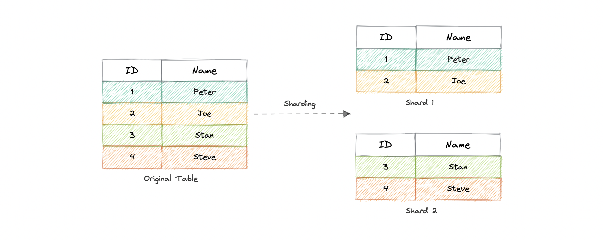

The justification for data sharding is that, after a certain point, it is cheaper and more feasible to scale horizontally by adding more machines than to scale it vertically by adding powerful servers. Sharding can be implemented at both application or the database level.

## Sharding architectures and types:

There are a large number of criteria available for data sharding. Some most commonly used criteria are:


### Ranged/dynamic sharding

- Ranged sharding, or dynamic sharding, takes a field on the record as an input and, based on a predefined range, allocates that record to the appropriate shard. 
- Ranged sharding requires there to be a lookup table or service available for all queries or writes. 
- For example, consider a set of data with IDs that range from 0-50. A simple lookup table might look like the following:
    
    | Range   | Shard ID |
    |---------|----------|
    | [0,20)  | A        |
    | [20,40) | B        |
    | [40,60) | C        |

- The field on which the range is based is also known as the shard key. Naturally, the choice of shard key, as well as the ranges, are critical in making range-based sharding effective. 
- A poor choice of shard key will lead to unbalanced shards, which leads to decreased performance. An effective shard key will allow for queries to be targeted to a minimum number of shards. 
- In our example above, if we query for all records with IDs 10-30, then only shards A and B will need to be queried.

- Two key attributes of an effective shard key are high cardinality and well-distributed frequency. 
- Cardinality refers to the number of possible values of that key. If a shard key only has three possible values, then there can only be a maximum of three shards. 
- Frequency refers to the distribution of the data along the possible values. If 95% of records occur with a single shard key value then, due to this hotspot, 95% of the records will be allocated to a single shard. 
- Consider both of these attributes when selecting a shard key.

### Algorithmic/hashed sharding

- This strategy divides the rows into different partitions based on a hashing algorithm rather than grouping database rows based on continuous indexes.
- This is similar to range-based sharding — a set of fields (shard keys) determines the allocation of the record to a given shard. 
- Hashing the inputs allows more even distribution across shards, preventing hotspots.

- The disadvantage of this method is that dynamically adding/removing database servers, i.e. resharding becomes expensive, as any update to the number of shards likely requires rebalancing all shards to moving around records.

### Entity-/relationship-based sharding

- Entity-based sharding keeps related data together on a single physical shard. In a relational database (such as PostgreSQL, MySQL, or SQL Server), related data is often spread across several different tables.
- For instance, consider the case of a shopping database with users and payment methods. Each user has a set of payment methods that is tied tightly with that user. As such, keeping related data together on the same shard can reduce the need for broadcast operations, increasing performance.

### Geography-based sharding

- Geography-based sharding, or geosharding, also keeps related data together on a single shard, but in this case, the data is related by geography. This is essentially ranged sharding where the shard key contains geographic information and the shards themselves are geo-located.
- For example, consider a dataset where each record contains a “country” field. In this case, we can both increase overall performance and decrease system latency by creating a shard for each country or region, and storing the appropriate data on that shard. This is a simple example, and there are many other ways to allocate your geoshards which are beyond the scope of this article.

### Composite sharding

As the name suggests, composite partitioning partitions the data based on two or more partitioning techniques. Here we first partition the data using one technique, and then each partition is further subdivided into sub-partitions using the same or some other method.

## Advantages

But why do we need sharding? Here are some advantages:

- **Availability**: Provides logical independence to the partitioned database, ensuring the high availability of our application. Here individual partitions can be managed independently.
- **Scalability**: Proves to increase scalability by distributing the data across multiple partitions.
- **Security**: Helps improve the system's security by storing sensitive and non-sensitive data in different partitions. This could provide better manageability and security to sensitive data.
- **Query Performance**: Improves the performance of the system. Instead of querying the whole database, now the system has to query only a smaller partition.
- **Data Manageability**: Divides tables and indexes into smaller and more manageable units.

## Disadvantages

- **Complexity**: Sharding increases the complexity of the system in general.
- **Joins across shards**: Once a database is partitioned and spread across multiple machines it is often not feasible to perform joins that span multiple database shards. Such joins will not be performance efficient since data has to be retrieved from multiple servers.
- **Rebalancing/Resharding**: If the data distribution is not uniform or there is a lot of load on a single shard, in such cases, we have to rebalance our shards so that the requests are as equally distributed among the shards as possible.

## When to use sharding?

Here are some reasons why sharding might be the right choice:

- Leveraging existing hardware instead of high-end machines.
- Maintain data in distinct geographic regions.
- Quickly scale by adding more shards.
- Better performance as each machine is under less load.
- When more concurrent connections are required.

# Consistent Hashing

Let's first understand the problem we're trying to solve.

## Why do we need this?

- In traditional hashing-based distribution methods, we use a hash function to hash our partition keys (i.e. request ID or IP). Then if we use the modulo against the total number of nodes (server or databases). This will give us the node where we want to route our request.

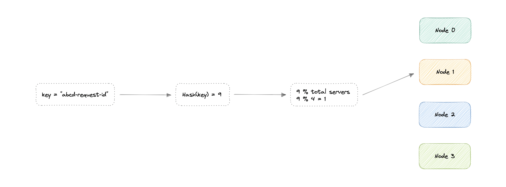

        Hash(key₁) → H₁ % N = Node₀
        Hash(key₂) → H₂ % N = Node₁
        Hash(key₃) → H₃ % N = Node₂
        ⋮
        Hash(keyₙ) → Hₙ % N = Nodeₙ₋₁
        

Where,

`key`: Request ID or IP.

`H`: Hash function result.

`N`: Total number of nodes.

`Node`: The node where the request will be routed.

- The problem with this is if we add or remove a node, it will cause `N` to change, meaning our mapping strategy will break as the same requests will now map to a different server. As a consequence, the majority of requests will need to be redistributed which is very inefficient.

- We want to uniformly distribute requests among different nodes such that we should be able to add or remove nodes with minimal effort. Hence, we need a distribution scheme that does not depend directly on the number of nodes (or servers), so that, when adding or removing nodes, the number of keys that need to be relocated is minimized.

- Consistent hashing solves this horizontal scalability problem by ensuring that every time we scale up or down, we do not have to re-arrange all the keys or touch all the servers.

Now that we understand the problem, let's discuss consistent hashing in detail.

## How does it work

- Consistent Hashing is a distributed hashing scheme that operates independently of the number of nodes in a distributed hash table by assigning them a position on an abstract circle, or hash ring. This allows servers and objects to scale without affecting the overall system.

- The basic gist behind the consistent hashing algorithm is to hash both node identifiers and data keys using the same hash function. A uniform and independent hashing function such as message-digest 5 (MD5) is used to find the position of the nodes and keys (data objects) on the hash ring. The output range of the hash function must be of reasonable size to prevent collisions.

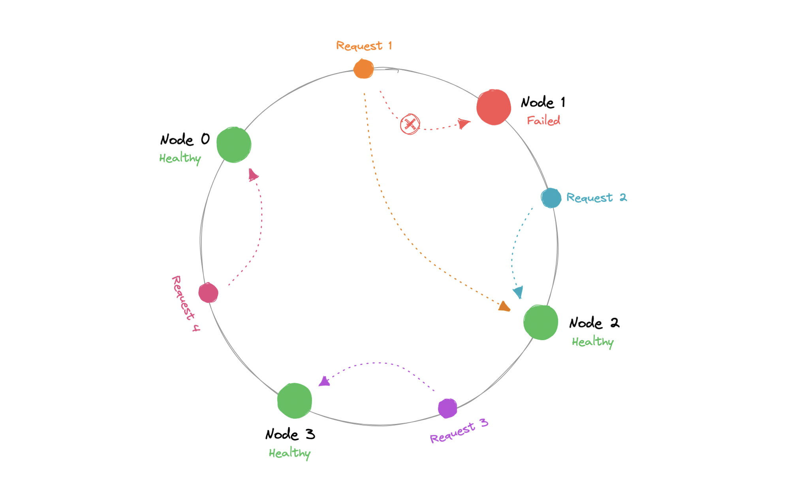

Using consistent hashing, only `K/N` data would require re-distributing.

        R = K / N
Where,

`R`: Data that would require re-distribution.

`K`: Number of partition keys.

`N`: Number of nodes.

- The output of the hash function is a range let's say `0...m-1` which we can represent on our hash ring. We hash the requests and distribute them on the ring depending on what the output was. Similarly, we also hash the node and distribute them on the same ring as well.

        Hash(key₁) = P₁
        Hash(key₂) = P₂
        Hash(key₃) = P₃
        ⋮
        Hash(keyₙ) = Pₘ₋₁


Where,

`key`: Request/Node ID or IP.

`P`: Position on the hash ring.

`m`: Total range of the hash ring.

- Now, when the request comes in we can simply route it to the closest node in a clockwise (can be counterclockwise as well) manner. This means that if a new node is added or removed, we can use the nearest node and only a _fraction_ of the requests need to be re-routed.

* **Positioning the nodes on the hash ring**

    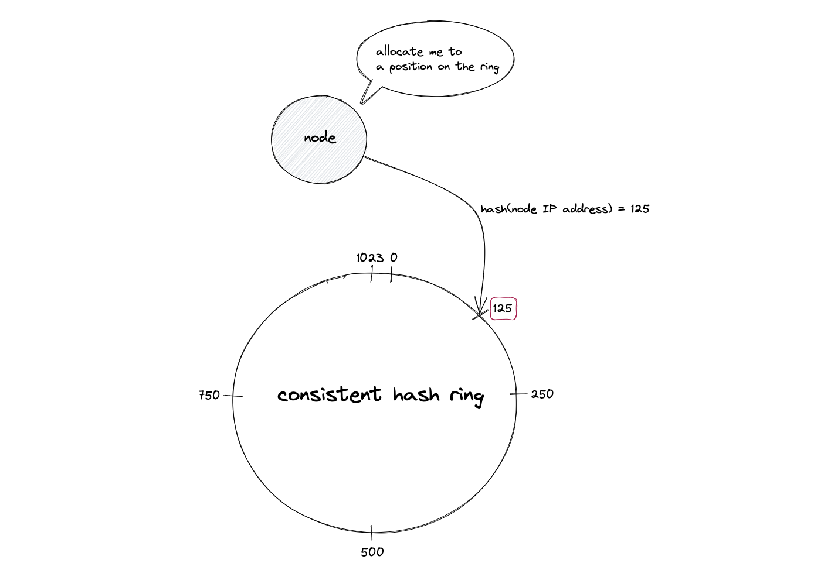
    - Hash the internet protocol (IP) address or domain name of the node using a hash function
    - The hash code is base converted
    - Modulo the hash code with the total number of available positions on the hash ring
    - Suppose the hash function produces an output space size of 10 bits (2¹⁰ = 1024), the hash ring formed is a virtual circle with a number range starting from 0 to 1023. The hashed value of the IP address of a node is used to assign a location for the node on the hash ring.

* **Storing a data object (key)**
    
    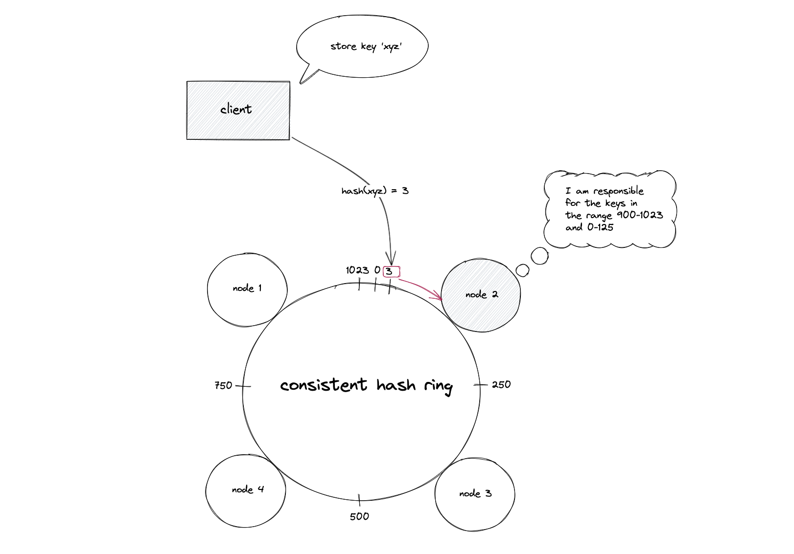
    - The key of the data object is hashed using the same hash function to locate the position of the key on the hash ring. 
    - The hash ring is traversed in the clockwise direction starting from the position of the key until a node is found. 
    - The data object is stored on the node that was found. In simple words, the first node with a position value greater than the position of the key stores the data object

* **Retrieving a data object (key)**

    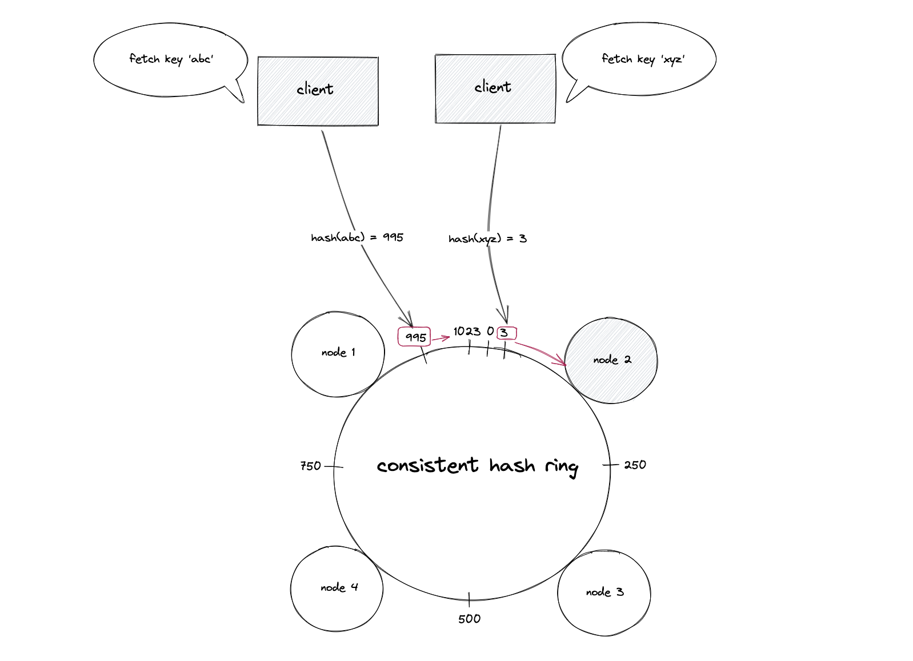
    - The key of the data object is hashed using the same hash function to locate the position of the key on the hash ring. 
    - The hash ring is traversed in the clockwise direction starting from the position of the key until a node is found. 
    - The data object is retrieved from the node that was found. 
    - In simple words, the first node with a position value greater than the position of the key must hold the data object.
    - Each node is responsible for the region on the ring between the node and its predecessor node on the hash ring.

* **Deletion of a node**

    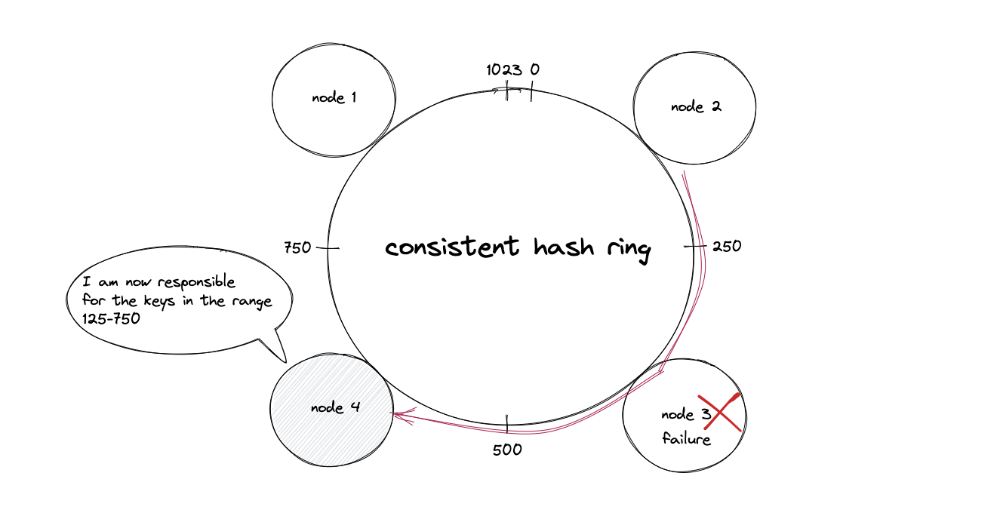
    - The failure (crash) of a node results in the movement of data objects from the failed node to the immediate neighboring node in the clockwise direction. 
    - The remaining nodes on the hash ring are unaffected

* **Addition of a node**

    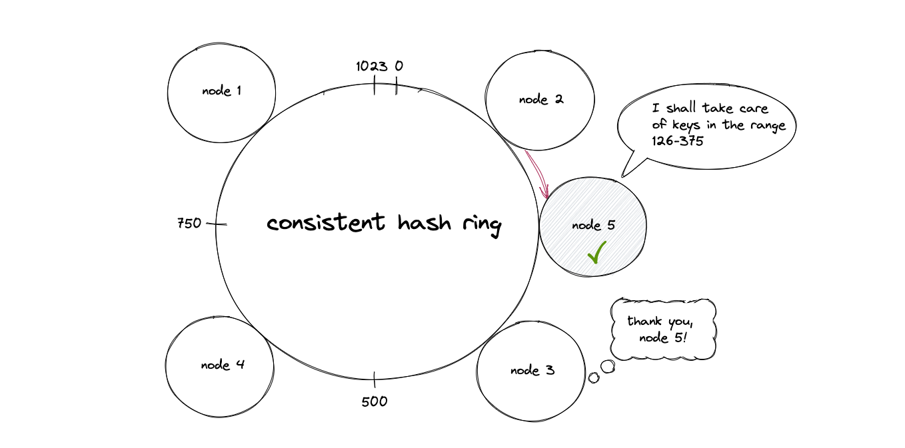
    - When a new node is provisioned and added to the hash ring, the keys (data objects) that fall within the range of the new node are moved out from the immediate neighboring node in the clockwise direction.
    - Average number of keys stored on a node = k/N, where k is the total number of keys (data objects) and N is the number of nodes.
    - The deletion or addition of a node results in the movement of an average number of keys stored on a single node. 
    - Consistent hashing aid cloud computing by minimizing the movement of data when the total number of nodes changes due to dynamic load

* **One common issue with Consistent Hashing - Non-uniform positioning of nodes**

    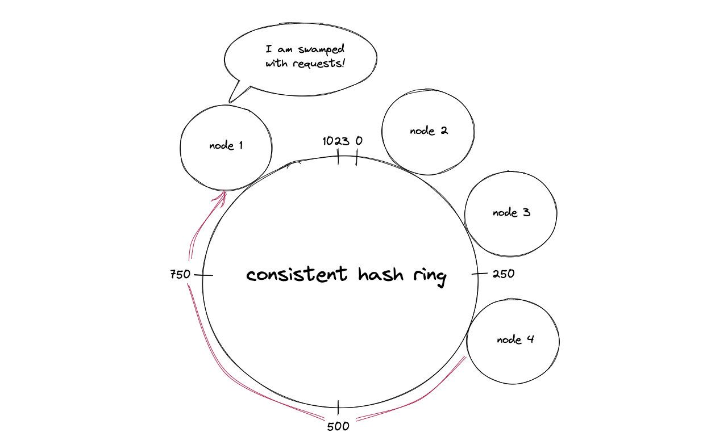
    - There is a chance that nodes are not uniformly distributed on the consistent hash ring. The nodes that receive a huge amount of traffic become hotspots resulting in cascading failure of the nodes.


- In theory, consistent hashing should distribute the load evenly however it doesn't happen in practice. Usually, the load distribution is uneven and one server may end up handling the majority of the request becoming a _hotspot_, essentially a bottleneck for the system. We can fix this by adding extra nodes but that can be expensive.

Let's see how we can address these issues.

## Virtual Nodes

- In order to ensure a more evenly distributed load, we can introduce the idea of a virtual node, sometimes also referred to as a VNode.

- Instead of assigning a single position to a node, the hash range is divided into multiple smaller ranges, and each physical node is assigned several of these smaller ranges. Each of these subranges is considered a VNode. Hence, virtual nodes are basically existing physical nodes mapped multiple times across the hash ring to minimize changes to a node's assigned range.

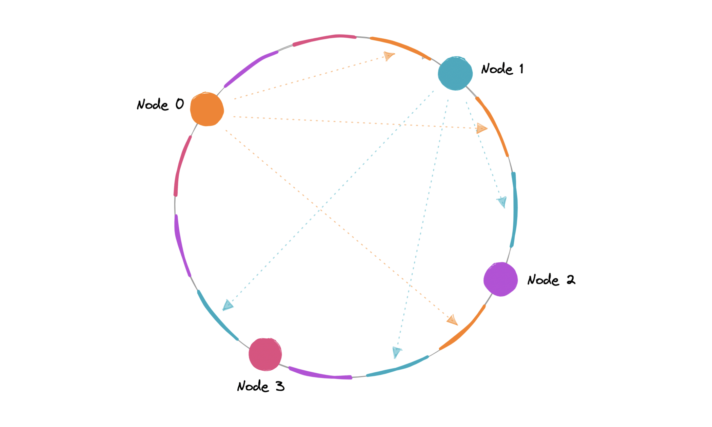

For this, we can use `k` number of hash functions.

            Hash₁(key₁) = P₁
            Hash₂(key₂) = P₂
            Hash₃(key₃) = P₃
            ⋮
            Hashₖ(keyₙ) = Pₘ₋₁


Where,

`key`: Request/Node ID or IP.

`k`: Number of hash functions.

`P`: Position on the hash ring.

`m`: Total range of the hash ring.

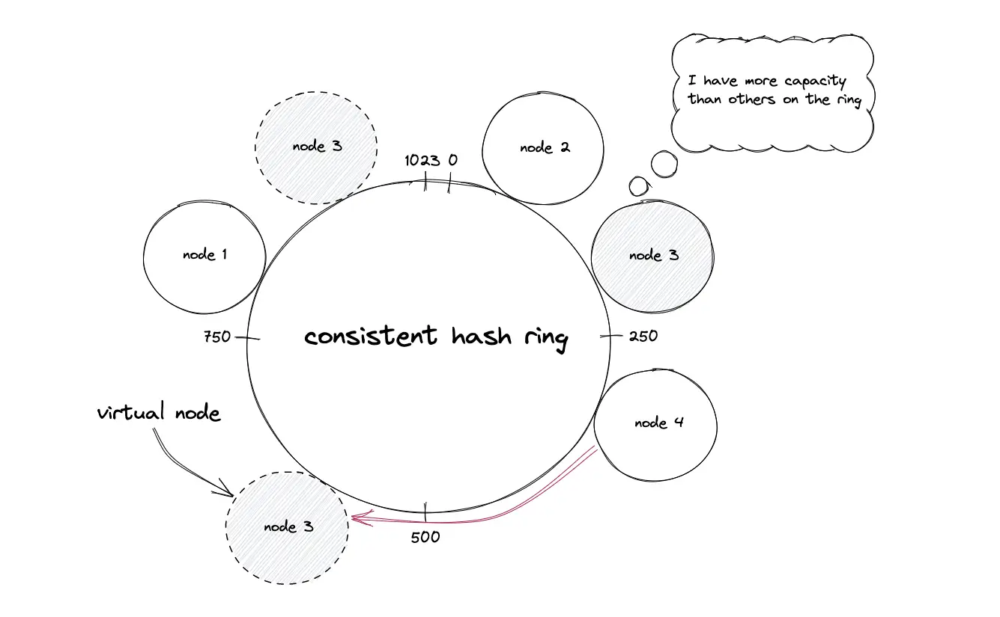

- The nodes are assigned to multiple positions on the hash ring by hashing the node IDs through distinct hash functions to ensure uniform distribution of keys among the nodes. 
- The technique of assigning multiple positions to a node is known as a virtual node. The virtual nodes improve the load balancing of the system and prevent hot spots. 
- The number of positions for a node is decided by the heterogeneity of the node. 
- In other words, the nodes with a higher capacity are assigned more positions on the hash ring.

As VNodes help spread the load more evenly across the physical nodes on the cluster by diving the hash ranges into smaller subranges, this speeds up the re-balancing process after adding or removing nodes. This also helps us reduce the probability of hotspots.

### Data Replication

To ensure high availability and durability, consistent hashing replicates each data item on multiple `N` nodes in the system where the value `N` is equivalent to the _replication factor_.

The replication factor is the number of nodes that will receive the copy of the same data. In eventually consistent systems, this is done asynchronously.

## Consistent hashing implementation

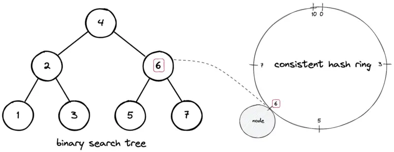

- The self-balancing binary search tree (BST) data structure is used to store the positions of the nodes on the hash ring.
- The BST offers logarithmic O(log n) time complexity for search, insert, and delete operations.
- The keys of the BST contain the positions of the nodes on the hash ring.

## How to handle concurrency in consistent hashing?

- The BST that stores the positions of the nodes is a mutable data structure that must be synchronized when multiple nodes are added or removed at the same time on the hash ring. 
- The readers-writer lock is used to synchronize BST at the expense of a slight increase in latency.

## What are the benefits of consistent hashing?

**The following are the advantages of consistent hashing**

- horizontally scalable
- Makes rapid scaling up and down more predictable
- minimized data movement when the number of nodes changes
- quick replication and partitioning of data

**The following are the advantages of virtual nodes**

- load handled by a node is uniformly distributed across the remaining available nodes during downtime
- the newly provisioned node accepts an equivalent amount of load from the available nodes
- fair distribution of load among heterogenous nodes

## What are the drawbacks of consistent hashing?

**The following are the disadvantages of consistent hashing**

- cascading failure due to hot spots
- non-uniform distribution of nodes and data
- oblivious to the heterogeneity in the performance of nodes
- Key management can be expensive when nodes transiently fail

**The following are the disadvantages of virtual nodes**

- when a specific data object becomes extremely popular, consistent hashing will still send all the requests for the popular data object to the same subset of nodes resulting in a degradation of the service
- capacity planning is trickier with virtual nodes
- memory costs and operational complexity increase due to the maintenance of BST
- replication of data objects is challenging due to the additional logic to identify the distinct physical nodes
- downtime of a virtual node affects multiple nodes on the ring

#### Examples

Let's look at some examples where consistent hashing is used:

- Data partitioning in [Apache Cassandra](https://cassandra.apache.org).
- Load distribution across multiple storage hosts in [Amazon DynamoDB](https://aws.amazon.com/dynamodb).


