<!-- TOC start (generated with https://github.com/derlin/bitdowntoc) -->

- [Reliability](#reliability)
- [Availability](#availability)
  * [The Nine's of availability](#the-nines-of-availability)
  * [Availability in Sequence vs Parallel](#availability-in-sequence-vs-parallel)
  * [Availability vs Reliability](#availability-vs-reliability)
  * [High availability vs Fault Tolerance](#high-availability-vs-fault-tolerance)
- [Fault Tolerance](#fault-tolerance)
- [Consensus in Distributed Systems](#consensus-in-distributed-systems)
  * [Challenges in Distributed Consensus](#challenges-in-distributed-consensus)
  * [Voting-based Consensus Algorithms](#voting-based-consensus-algorithms)
  * [Proof-based Consensus Algorithms](#proof-based-consensus-algorithms)
- [API gateway](#api-gateway)
  * [**What is an API gateway?**](#what-is-an-api-gateway)
  * [**Why do we need an API Gateway?**](#why-do-we-need-an-api-gateway)
  * [API Gateway Benefits](#api-gateway-benefits)
  * [API Gateway Drawbacks](#api-gateway-drawbacks)
  * [Backend For Frontend (BFF) pattern](#backend-for-frontend-bff-pattern)
  * [Examples](#examples)
- [Rate Limiting](#rate-limiting)
  * [Why do we need Rate Limiting?](#why-do-we-need-rate-limiting)
  * [Types of Rate Limits](#types-of-rate-limits)
  * [Rate Limiting Algorithms](#rate-limiting-algorithms)
  * [Rate Limiting in Distributed Systems](#rate-limiting-in-distributed-systems)
- [Circuit Breaker Pattern](#circuit-breaker-pattern)
- [Service Discovery](#service-discovery)
  * [Why do we need Service Discovery?](#why-do-we-need-service-discovery)
  * [Service Discovery Implementations](#service-discovery-implementations)
- [Gossip Protocol](#gossip-protocol)
- [HeartBeats](#heartbeats)
- [Disaster recovery](#disaster-recovery)
  * [Why is disaster recovery important?](#why-is-disaster-recovery-important)
  * [Terms](#terms)
  * [Strategies](#strategies)
- [Failover](#failover)

<!-- TOC end -->

# Reliability

The system should continue to work correctly (performing the correct function at the desired level of performance) even in the face of adversity (hardware or software faults, and even human error).

# Availability

Availability is the time a system remains operational to perform its required function in a specific period. It is a simple measure of the percentage of time that a system, service, or machine remains operational under normal conditions.

## The Nine's of availability

Availability is often quantified by uptime (or downtime) as a percentage of time the service is available. It is generally measured in the number of 9s.

    Availability = Uptime / (Uptime + Downtime)
    

If availability is 99.00% available, it is said to have "2 nines" of availability, and if it is 99.9%, it is called "3 nines", and so on.

| Availability (Percent)   | Downtime (Year)    | Downtime (Month)  | Downtime (Week)    |
|--------------------------|--------------------|-------------------|--------------------|
| 90% (one nine)           | 36.53 days         | 72 hours          | 16.8 hours         |
| 99% (two nines)          | 3.65 days          | 7.20 hours        | 1.68 hours         |
| 99.9% (three nines)      | 8.77 hours         | 43.8 minutes      | 10.1 minutes       |
| 99.99% (four nines)      | 52.6 minutes       | 4.32 minutes      | 1.01 minutes       |
| 99.999% (five nines)     | 5.25 minutes       | 25.9 seconds      | 6.05 seconds       |
| 99.9999% (six nines)     | 31.56 seconds      | 2.59 seconds      | 604.8 milliseconds |
| 99.99999% (seven nines)  | 3.15 seconds       | 263 milliseconds  | 60.5 milliseconds  |
| 99.999999% (eight nines) | 315.6 milliseconds | 26.3 milliseconds | 6 milliseconds     |
| 99.9999999% (nine nines) | 31.6 milliseconds  | 2.6 milliseconds  | 0.6 milliseconds   |

## Availability in Sequence vs Parallel

If a service consists of multiple components prone to failure, the service's overall availability depends on whether the components are in sequence or in parallel.

### Sequence

Overall availability decreases when two components are in sequence.

__`Availability (Total) = Availability (Foo) * Availability (Bar)`__

For example, if both `Foo` and `Bar` each had 99.9% availability, their total availability in sequence would be 99.8%.

### Parallel

Overall availability increases when two components are in parallel.

__`Availability (Total) = 1 - (1 - Availability (Foo)) * (1 - Availability (Bar))`__

For example, if both `Foo` and `Bar` each had 99.9% availability, their total availability in parallel would be 99.9999%.

## Availability vs Reliability

If a system is reliable, it is available. However, if it is available, it is not necessarily reliable. In other words, high reliability contributes to high availability, but it is possible to achieve high availability even with an unreliable system.

## High availability vs Fault Tolerance

Both high availability and fault tolerance apply to methods for providing high uptime levels. However, they accomplish the objective differently.

A fault-tolerant system has no service interruption but a significantly higher cost, while a highly available system has minimal service interruption. Fault-tolerance requires full hardware redundancy as if the main system fails, with no loss in uptime, another system should take over.

# Fault Tolerance

- Fault tolerance describes a system’s ability to handle errors and outages without any loss of functionality.
- Some of the most common approaches to achieving fault tolerance:
  - Multiple hardware systems capable of doing the same work, located located on two different physical servers, potentially in different locations. hat way, if the primary database server experiences an error, a hardware failure, or a power outage, the other server might not be affected.
  - Multiple instances of software capable of doing the same work. For example, many modern applications make use of containerization platforms such as Kubernetes so that they can run multiple instances of software services. One reason for this is so that if one instance encounters an error or goes offline, traffic can be routed to other instances to maintain application functionality.
  - Backup sources of power, such as generators, are often used in on-premises systems to protect the application from being knocked offline if power to the servers is impacted by, for example, the weather.
- Without proper fault tolerance, outages can cost -
  - millions in lost revenue
  - reputation damage
  - engineering hours to repair the outage rather building other imp features

**Fault tolerance goals**

- **Normal functioning vs. graceful degradation**
  - When designing fault-tolerant systems, you may want the application to remain online and fully functional at all times. In this case, your goal is normal functioning — you want your application, and by extension the user’s experience, to remain unchanged even if an element of your system fails or is knocked offline.
  - Another approach is aiming for what’s called graceful degradation, where outages and errors are allowed to impact functionality and degrade the user experience, but not knock the application out entirely.
  - Mission-critical applications and systems will likely need to maintain normal functioning in all but the most dire of disasters, whereas it might make economic sense to allow less essential systems to degrade gracefully.

- **Setting survival goals**

  - Achieving 100% fault tolerance isn’t really possible, so the question architects generally have to answer when designing fault-tolerant systems is how much they want to be able to survive.
  - **Survive node failure:** Running instances of your software on multiple nodes (often different physical servers) with the same AZ (data center) can allow your application to survive faults (such as hardware failures or errors) on one or more of those nodes.
  - **Survive AZ failure:** Running instances of your software across multiple availability zones (data centers) within a cloud region will allow you to survive AZ outages, such as a specific data center losing power during a storm.
  - **Survive region failure:** Running instances of your software across multiple cloud regions can allow you to survive an outage affecting an entire region.
  - **Survive cloud provider failure:** Running instances of your software both in the cloud and on-premises, or across multiple cloud providers, can allow you to survive even a full cloud provider outage.

**Fault-tolerant architecture examples**

Look at a very common approach for modern applications: adopting a cloud-based, multi-region architecture built around containerization services such as Kubernetes.

  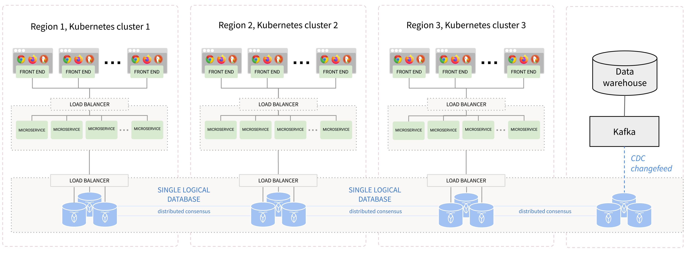

This application could survive a node, AZ, or even region failure affecting its application layer, its database layer, or both. Let’s take a closer look at how that’s possible.

- **Achieving fault tolerance in the application layer**
  - In the diagram above, the application is spread across multiple regions, with each region having its own Kubernetes cluster.
  - Within each region, the application is built with microservices that execute specific tasks, and these microservices are typically operated inside Kubernetes pods. 
  - This allows for much greater fault tolerance, since a new pod with a new instance can be started up whenever an existing pod encounters an error. 
  - This approach also makes the application easier to scale horizontally — as the load on a specific service increases, additional instances of that service can be added in real time to handle the load, and then removed when the load dies down again and they’re no longer needed.
- **Achieving fault tolerance in the persistence (database) layer**
  - The application in the diagram above takes a similar approach in the database layer. 
  - Here, CockroachDB is chosen because its distributed, node-based nature naturally provides a high level of fault tolerance and the same flexibility when it comes to scaling up and down horizontally. 
  - Being a distributed SQL database, it also allows for strong consistency guarantees, which is important for most transactional workloads.
  - Although it’s a distributed database, it can be treated like a single-instance Postgres database by the application — almost all the complexity of distributing the data to meet your application’s availability and survival goals happens under the hood.

# Consensus in Distributed Systems

- In distributed systems, nodes must work together to achieve a common goal, such as storing data, processing transactions, or running applications.
- Achieving consensus ensures that all nodes in the system agree on a particular value or state, such as the contents of a database or the result of a computation. This ensures that the system operates correctly and reliably, even in the presence of faults or failures.
- Consensus is also crucial in applications such as blockchain, where it is used to ensure that all nodes in the network agree on the ordering and validity of transactions.
- To be precise, consensus is a property that may be achieved by protocols (algorithms) attempting to determine a variable’s value. Processes (Nodes) in the system exchange messages to propose values until they decide on a final value. A protocol (algorithm) reaches consensus by achieving three properties:
  - **Termination** Every non-faulty process (node) must decide on a value
  - **Agreement** Every non-faulty process (node) must agree on the same value
  - **Integrity** If all the non-faulty processes (nodes) proposed the same value, then any non-faulty process (node) must decide the same value.
  - Non-faulty node means, node which is not crashed or attacked or malfunctioning.

## Challenges in Distributed Consensus

- A distributed system can face mainly two types of failure.
  * Crash failure
  * Byzantine failure
* Crash failure occurs when a node is not responding to other nodes of the system due to some hardware or software or network fault. This is a very common issue in distributed systems and it can be handled easily by simply ignoring the node’s existence.

  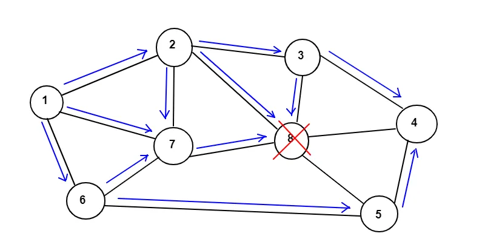

* Byzantine failure is a situation where one or more node is not crashed but behaves abnormally and forward a different message to different peers, due to an internal or external attack on that node. Handling this kind of situation is complicated in the distributed system.

  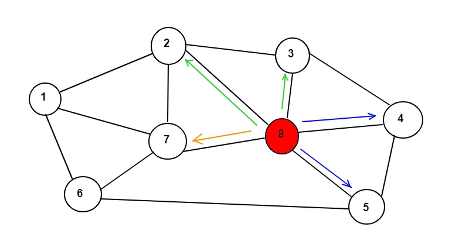

* A consensus algorithm, if it can handle Byzantine failure can handle any type of consensus problem in a distributed system.

## Voting-based Consensus Algorithms

- These algorithms have enough fault tolerance and sufficient mathematical proof to assure security and stability. However, because of their democratic character, these algorithms are extremely slow and inefficient, especially as the network becomes larger.

1. **Practical Byzantine Fault Tolerance**

   - The algorithm works on the condition that the maximum number of faulty nodes must not be greater than or equal to one-third of all nodes in the system, to reach consensus.
   - The distributed system is divided into three phases (pre-prepare, prepare, commit) and nodes are sequentially ordered with one node being the Primary node (or leader node) and others as the Secondary node (or backup node). 
   - pBFT consensus rounds are —
     - The client sends a request to the primary node.
     - The primary nodes broadcast the request (pre-prepare messages) to all secondary nodes.
     - Then, the secondaries start to send the “prepare” messages.
     - Every node receiving a threshold of “prepare” messages perform the service that is requested and starts to send “commit” messages.
     - Finally, on receiving a threshold of “commit” messages, nodes send it to the client as a reply.
     - The request is served successfully when the client received a similar message from at least two-thirds of the total nodes.

 
   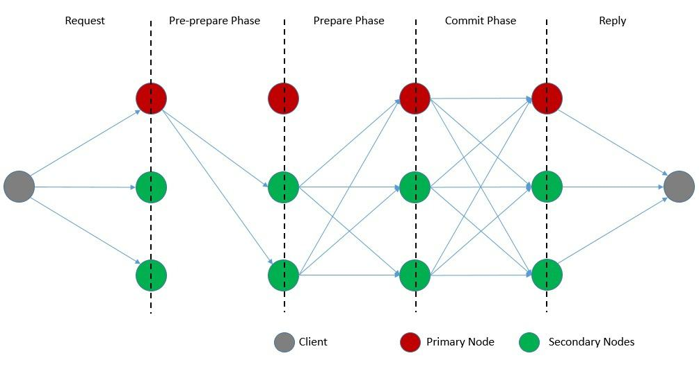
   
  - The algorithm changes the primary node in every consensus round, using view change protocol if a predetermined amount of time passes without the leading node broadcasting a request to the backup (secondary) nodes.

2. **HotStuff**
3. **Paxos**
4. **Raft**

## Proof-based Consensus Algorithms

- With the development of blockchain technology and distributed ledgers, networks became considerably broader and permissionless. For these circumstances, a proof-based consensus technique seemed preferable. 
- In this case, a participant must show adequate proof of something in order to contribute to decision-making.

1. **Proof of Work (PoW)**
2. **Proof of Stake (PoS)**

# API gateway

## **What is an API gateway?**

- An API gateway accepts API requests from a client, processes them based on defined policies, directs them to the appropriate services, and combines the responses for a simplified user experience. Typically, it handles a request by invoking multiple microservices and aggregating the results. It can also translate between protocols in legacy deployments.
- For example, an e‑commerce web site might use an API gateway to provide mobile clients with an endpoint for retrieving all product details with a single request. The gateway requests information from various services, like product availability and pricing, and combines the results.

  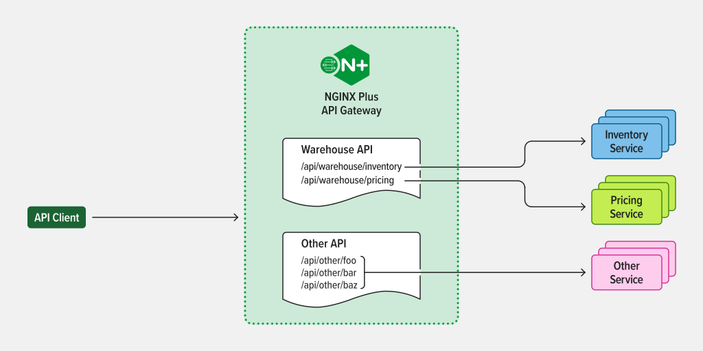

- The API Gateway is an API management tool that sits between a client and a collection of backend services. It is a single entry point into a system that encapsulates the internal system architecture and provides an API that is tailored to each client. It also has other responsibilities such as authentication, monitoring, load balancing, caching, throttling, logging, etc.

  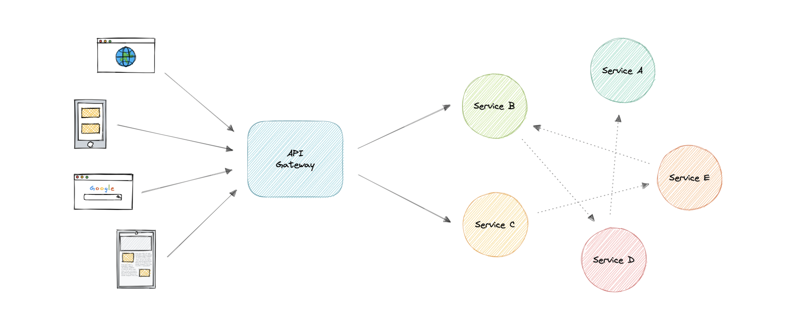

## **Why do we need an API Gateway?**

- The granularity of APIs provided by microservices is often different than what a client needs. Mobile clients need different response format than Web client, even though content required by both could be same.
- Microservices typically provide fine-grained APIs, which means that clients need not interact with multiple services. API gateway handles some requests by simply routing them to the appropriate backend service, and handles others by invoking multiple backend services and aggregating the results.
- Hence, an API gateway can provide a single entry point for all clients with some additional features and better management.

**Below are some desired capabilities of an API Gateway:**

- **Security Policy:** Authentication, authorization, access control, encryption, IP whitelisting or blacklisting
- **Routing policy:** Routing, rate limiting and throttling, request/response manipulation, circuit breaker, service discovery, blue-green and canary deployments, A/B testing, load balancing, caching, reverse-proxy, health checks, and custom error handling
- **Observability policy:** Real-time and historical metrics, logging, and tracing

## API Gateway Benefits

- Reduce complexity and speed up app releases by encapsulating the internal application architecture and providing APIs tailored for each client type. Simplifies the client code.
- Streamline and simplify request processing and policy enforcement by centralizing the point of control and offloading non-functional requirements to the infrastructure layer
- Simplify troubleshooting with granular real-time and historical metrics and dashboards.

## API Gateway Drawbacks

- Possible single point of failure.
- Might impact performance.
- Can become a bottleneck if not scaled properly.
- Configuration can be challenging.

## Backend For Frontend (BFF) pattern

- In the Backend For Frontend (BFF) pattern, we create separate backend services to be consumed by specific frontend applications or interfaces. This pattern is useful when we want to avoid customizing a single backend for multiple interfaces. This pattern was first described by [Sam Newman](https://samnewman.io).

Also, sometimes the output of data returned by the microservices to the front end is not in the exact format or filtered as needed by the front end. To solve this issue, the frontend should have some logic to reformat the data, and therefore, we can use BFF to shift some of this logic to the intermediate layer.

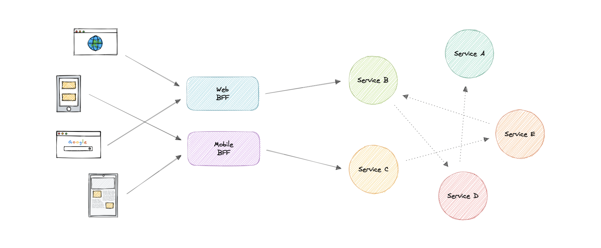

The primary function of the backend for the frontend pattern is to get the required data from the appropriate service, format the data, and sent it to the frontend.

_[GraphQL](https://karanpratapsingh.com/courses/system-design/rest-graphql-grpc#graphql) performs really well as a backend for frontend (BFF)._

### When to use this pattern?

We should consider using a Backend For Frontend (BFF) pattern when:

- A shared or general purpose backend service must be maintained with significant development overhead.
- We want to optimize the backend for the requirements of a specific client.
- Customizations are made to a general-purpose backend to accommodate multiple interfaces.

## Examples

Following are some widely used gateways technologies:

- [Amazon API Gateway](https://aws.amazon.com/api-gateway)
- [Apigee API Gateway](https://cloud.google.com/apigee)
- [Azure API Gateway](https://azure.microsoft.com/en-in/services/api-management)
- [Kong API Gateway](https://konghq.com/kong)

# Rate Limiting

- Rate limiting is a technique to limit network traffic to prevent users from exhausting system resources. 
- Rate limiting makes it harder for malicious actors to overburden the system and cause attacks like Denial of Service (DoS). This involves attackers flooding a target system with requests and consuming too much network capacity, storage, and memory.
- APIs that use rate limiting can throttle or temporarily block any client that tries to make too many API calls. It might slow down a throttled user’s requests for a specified time or deny them altogether. 
- Rate limiting ensures that legitimate requests can reach the system and access information without impacting the overall application’s performance.

  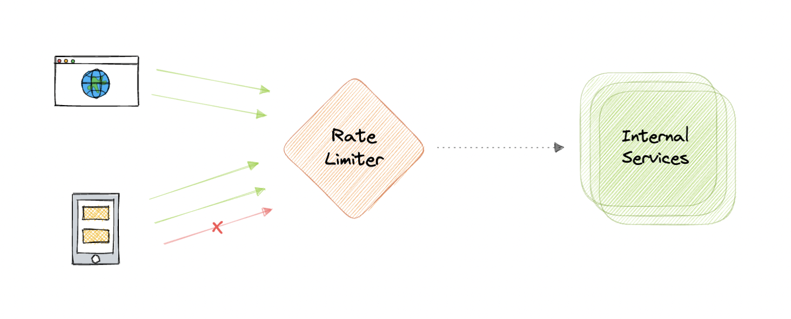

- Rate-limiting solutions work by measuring the elapsed time between every request from a given IP address and tracking the number of requests made in a set timeframe. 
- If one IP address makes too many requests within the specified timeframe, the rate-limiting solution throttles the IP address and doesn’t fulfill its requests for the next timeframe.

## Why do we need Rate Limiting?

- Avoid resource starvation as a result of Denial of Service (DoS) attacks.
- Rate Limiting helps in controlling operational costs by putting a virtual cap on the auto-scaling of resources which if not monitored might lead to exponential bills.
- Rate limiting can be used as defense or mitigation against some common attacks like-
  - **Brute force attack** where the bot systematically submits randomly generated credentials until a credential set works.
  - **Inventory Denial** attack involves sending bots to a target web application, where they start transactions without finishing them. It hoards the inventory, making it unavailable to legitimate users.
- For APIs that process massive amounts of data, rate limiting can be used to control the flow of that data.

## Types of Rate Limits

- **User rate limits -** this is the most popular rate-limiting method. It identifies the number of requests a given user makes, usually by tracking the user’s IP address or API key. Users that exceed the specified rate limit will trigger the application to deny any further requests until the rate-limited timeframe resets.
- **Geographic rate limits -** developers can further secure applications in a given geographic region by setting a rate limit for each specific region for a specified timeframe. This approach helps prevent suspicious traffic and further reduces the risk of an attack. 
- **Server rate limits -** developers can set rate limits at the server level if they define a specific server to handle parts of an application. This approach provides more flexibility, allowing the developers to increase the rate limit on commonly used servers while decreasing the traffic limit on less active servers.

## Rate Limiting Algorithms

#### **______Leaky Bucket______**

- Leaky Bucket is an algorithm that provides a simple, intuitive approach to rate limiting via a queue. 
- When registering a request, the system appends it to the end of the queue. Processing for the first item on the queue occurs at a regular interval or first-in, first-out (FIFO). If the queue is full, then additional requests are discarded (or leaked).

#### **Token Bucket**

- Here we use a concept of a bucket. When a request comes in, a token from the bucket must be taken and processed. 
- The request will be refused if no token is available in the bucket, and the requester will have to try again later. As a result, the token bucket gets refreshed after a certain time period.

#### **Fixed-window**

- Fixed-window rate limiting algorithms restrict the number of requests allowed during a given timeframe (window).
- For instance, a server’s rate-limiting component might implement an algorithm that accepts up to 200 API requests per minute. There is a fixed timeframe starting from a specified time—the server will not serve more than 200 requests between 9:00 and 9:01, but the window will reset at 9:01, allowing another 200 requests until 9:02.

#### **Sliding Window**

- Sliding-window rate limiting algorithms are similar to fixed-window algorithms except the timeframe only starts when a user makes a new request, not a predetermined time.
- For instance, if the first request arrives at 9:00:24 am (and the rate limit is 200 per minute), the server will allow up to 200 requests until 9:01:24.
- Sliding-window algorithms help solve the issues affecting requests in fixed-window rate limiting. 
- They also mitigate the starvation issue facing leaky bucket rate limiting by providing more flexibility.

## Rate Limiting in Distributed Systems

Rate Limiting becomes complicated when distributed systems are involved. The two broad problems that come with rate limiting in distributed systems are:

### Inconsistencies

When using a cluster of multiple nodes, we might need to enforce a global rate limit policy. Because if each node were to track its rate limit, a consumer could exceed a global rate limit when sending requests to different nodes. The greater the number of nodes, the more likely the user will exceed the global limit.

The simplest way to solve this problem is to use sticky sessions in our load balancers so that each consumer gets sent to exactly one node but this causes a lack of fault tolerance and scaling problems. Another approach might be to use a centralized data store like [Redis](https://redis.io) but this will increase latency and cause race conditions.

### Race Conditions

This issue happens when we use a naive _"get-then-set"_ approach, in which we retrieve the current rate limit counter, increment it, and then push it back to the datastore. This model's problem is that additional requests can come through in the time it takes to perform a full cycle of read-increment-store, each attempting to store the increment counter with an invalid (lower) counter value. This allows a consumer to send a very large number of requests to bypass the rate limiting controls.

One way to avoid this problem is to use some sort of distributed locking mechanism around the key, preventing any other processes from accessing or writing to the counter. Though the lock will become a significant bottleneck and will not scale well. A better approach might be to use a _"set-then-get"_ approach, allowing us to quickly increment and check counter values without letting the atomic operations get in the way.

# Circuit Breaker Pattern

- In a distributed environment, calls to remote resources and services can fail due to transient faults, such as slow network connections, timeouts, or the resources being overcommitted or temporarily unavailable. These faults typically correct themselves after a short period of time by using a strategy such as the Retry pattern.
- However, there can also be situations where faults are due to unanticipated events, and that might take much longer to fix. These faults can range in severity from a partial loss of connectivity to the complete failure of a service. In these situations it might be pointless for an application to continually retry an operation that is unlikely to succeed, and instead the application should quickly accept that the operation has failed and handle this failure accordingly.
- The circuit breaker is a design pattern used to detect failures and encapsulates the logic of preventing a failure from constantly recurring during maintenance, temporary external system failure, or unexpected system difficulties.

### **Use cases for Circuit Breaker**

**1. Overwhelming requests**

- Assume that you have 5 different services and you have a webserver to call these services. Now when a request is received, the server allocates one thread to call the service.
- Now what happens is that this service is a little delayed (due to a failure) and this thread is waiting.
- But if this service is a high demand service (gets more and more requests), more threads will be allocated for this service and all the threads allocated to call the service will have to wait.
- So, if you had 100 threads now 98 of them could be occupied and if the other two threads are occupied by another 2 services all the threads are now blocked.
- Now what happens is the remaining requests the reach your service will be queued (blocked). So meanwhile 50 more requests also came and all of them were queued because threads were feezed.

 
  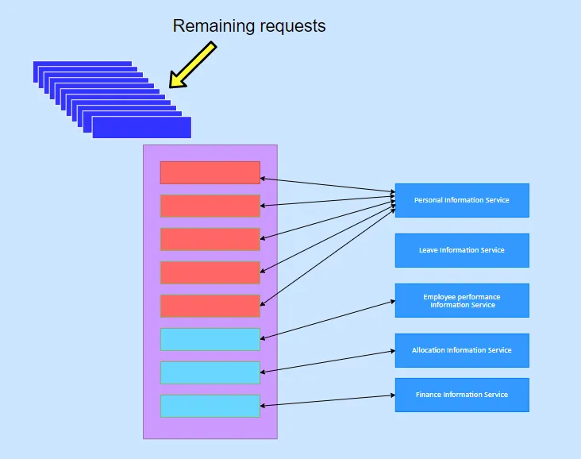

- Then a few seconds later the failed service recovers back. Now the webserver tries to process all the requests in the queue. As a result, the webserver (or the proxy) may never recover. The reason is when the webserver processes queue request more and more requests reach continuously. So, this type of scenario will kill your service.

**2. Cascade Failure**

- In this scenario, service A calls B, service B calls C, service C calls D. Meanwhile there are also other services W, X, Y and Z. But what would happen if a service could not respond on time ?
- Assume service D failed to respond on time. Now the service C will have to wait.
- Since service C is waiting, service B also will have to wait. So accordingly, service A will have to be waiting. This can cause cascade failure.

### Circuit Breaker internals

- The basic idea behind the circuit breaker is to wrap a protected function call in a circuit breaker object, which monitors for failures (count). 
- Once the failures reach a certain threshold, the circuit breaker trips, and all further calls to the circuit breaker return with an error, without the protected (actual service invoke) call being made at all. Usually, we'll also want some kind of monitor alert if the circuit breaker trips.

  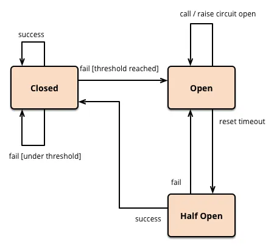

- The Circuit Breaker pattern has 3 states.

    - Open.
    - Closed.
    - Half-Open.
- The circuit breaker works (pass requests through the service) normally when it is in the “closed” state. But when the failures exceed the threshold limit, the circuit breaker trips. As seen in the above diagram, this “opens” the circuit (state switches to “open”).
- When the circuit is “open” incoming requests will return with error without any attempt to invoke the real services.
- After a  certain timeout period elapses, the circuit breaker goes into the “half-open” state. In this state, the circuit breaker will allow a limited number of test requests to pass through and invoke real service. If the requests succeed, the circuit breaker resets and returns to the “closed” state and the traffic will go through as usual. If this request fails, the circuit breaker returns to the open state until another timeout.

**Example** : Service A should respond within 200ms. 

- 0ms -100ms : expected delay interval.
- 100ms -200ms : risky.
- If response time is more thsn 200ms then cut off the service. If you create a monitoring dashboard you can monitor the requests and their response times. Based on that you can decide threshold level.
- If the number of requests (ex: 75% of requests) is reaching the upper threshold (150–200ms) that means the service is failing slowly.
- If the number of occurrences exceeds 200ms (the maximum threshold given for the service) the proxy will identify that this service is not responding anymore.
- What it does next is the request which comes to access service A will failback. it breaks the connection between your proxy and service A.
- To connect back to service A, it sends a ping request or a default request to service A in a timely manner. So, when the response time comes back to the normal threshold it will turn on the request again.

# Service Discovery

Service discovery is the detection of services within a computer network. Service Discovery Protocol (SDP) is a networking standard that accomplishes the detection of networks by identifying resources.

## Why do we need Service Discovery?

- In a monolithic application, services invoke one another through language-level methods or procedure calls.
- A microservices-based application typically runs in virtualized or containerized environments. The number of instances of a service and its locations changes dynamically. 
- A microservice needs to know the location (IP address and port) of every service it communicates with.
- Consequently, we need a mechanism that enables the clients of service to know where these instances are and their names to allow requests to arrive at the target microservice.
- Dynamically determining the location of an application service become more complicated when we consider an environment where we’re constantly destroying and distributing new instances of services.
- This may well be the case for a cloud-based application that’s continuously changing due to horizontal autoscaling to meet peak loads, or the release of a new version. Hence, the need for a Service Discovery mechanism.

## Service Discovery Implementations

### Client-Side Service Discovery

- The client is responsible for determining the network locations of available service instances and load balancing requests between them. The client queries the Service Register, which is responsible for managing and storing the network locations of all the services.
- Then the client uses a load-balancing algorithm to choose one of the available service instances and performs a request.

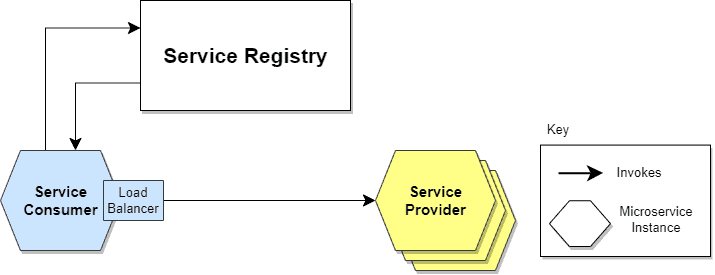

- Giving responsibility for client-side load balancing is both a burden and an advantage. It’s an advantage because it saves an extra hop that we would’ve had with a dedicated load balancer. It’s a disadvantage because the Service Consumer(client) must implement the load balancing logic.

### Server-Side Service Discovery

- This approach uses an intermediate component such as Load Balancer. The client makes a request to a service via a load balancer that acts as an orchestrator. The load balancer queries the Service Registry and routes each request to an available service instance.

  

- The client makes a request to the service via a load balancer which then forwards the request to an available service instance.
- Load Balancer creates level of abstraction making the Service Consumer (client) lighter, as it doesn’t have to deal with the lookup procedure. As a matter of fact, there’s no need to implement the discovery logic separately for each language and framework that the Service Consumer(client) uses.
- On the other hand, additional responsibility to set up and manage the Load Balancer, unless it’s already provided in the deployment environment.

### **Service Registery**

- The Service Register is a crucial part of service identification. It’s a database containing the network locations of service instances. A Service Registry must be highly available and up-to-date.

1. When using the **self-registration model**, a service instance is responsible for registering and de-registering itself in the Service Registry. In addition, if necessary, a service instance sends heartbeat requests to keep its registration alive.
2. When using the **third-party registration model**, the service instances aren’t responsible for registration in the Service Registry. Instead, another system component known as the Service Register is responsible for registration. The Service Register keeps track of changes to running instances by polling the deployment environment or subscribing to events.

### Service mesh

Service-to-service communication is essential in a distributed application but routing this communication, both within and across application clusters, becomes increasingly complex as the number of services grows. Service mesh enables managed, observable, and secure communication between individual services. It works with a service discovery protocol to detect services. [Istio](https://istio.io/latest/about/service-mesh) and [envoy](https://www.envoyproxy.io) are some of the most commonly used service mesh technologies.

### Examples

Here are some commonly used service discovery infrastructure tools:

- [etcd](https://etcd.io)
- [Consul](https://www.consul.io)
- [Apache Thrift](https://thrift.apache.org)
- [Apache Zookeeper](https://zookeeper.apache.org)

# Gossip Protocol

- Gossip is a peer-to-peer communication protocol where every node periodically exchanges state information with a few other nodes. 
- They exchange information about themselves and about other nodes they know about. Further, it versions the information with a vector clock so that gossip can ignore old versions of the cluster state.
- The gossip protocol is also known as the epidemic protocol because the transmission of the messages is similar to the way how epidemics spread.
- The gossip protocol is typically used to maintain the node membership list, achieve consensus, and fault detection in a distributed system. In addition, additional information such as application-level data can be piggybacked on gossip messages.
* The time required by the gossip protocol to propagate a message across the system and the network traffic generated in propagating a message must be taken into consideration while choosing the type of gossip protocol for a particular use case. The gossip protocol can be broadly categorized into the following types:

  - anti-entropy model
  - rumor-mongering model
  - aggregation model

# HeartBeats

 - Show a server is available and working as expected by periodically sending a message to all the other servers.

##### **Types of heartbeats**

- **Push heartbeats:** Nodes actively send heartbeat signals to the monitor.

- **Pull heartbeats:** The monitor periodically queries nodes for their status.

**Benefits**

- Monitoring health and status of different parts of distributed system.
- Detecting failures in the system
- Triggering recovery actions

# Disaster recovery

Disaster recovery (DR) is a process of regaining access and functionality of the infrastructure after events like a natural disaster, cyber attack, or even business disruptions.

Disaster recovery relies upon the replication of data and computer processing in an off-premises location not affected by the disaster. When servers go down because of a disaster, a business needs to recover lost data from a second location where the data is backed up. Ideally, an organization can transfer its computer processing to that remote location as well in order to continue operations.

_Disaster Recovery is often not actively discussed during system design interviews but it's important to have some basic understanding of this topic. You can learn more about disaster recovery from [AWS Well-Architected Framework](https://docs.aws.amazon.com/wellarchitected/latest/reliability-pillar/plan-for-disaster-recovery-dr.html)._

## Why is disaster recovery important?

Disaster recovery can have the following benefits:

- Minimize interruption and downtime
- Limit damages
- Fast restoration
- Better customer retention

## Terms

Let's discuss some important terms relevantly for disaster recovery:

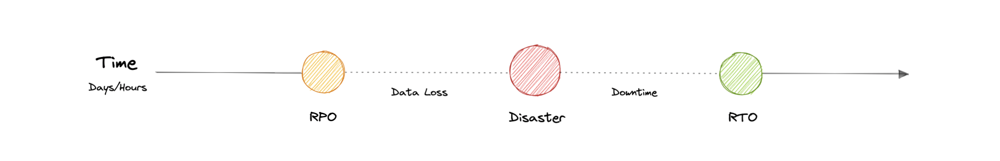

### RTO

Recovery Time Objective (RTO) is the maximum acceptable delay between the interruption of service and restoration of service. This determines what is considered an acceptable time window when service is unavailable.

### RPO

Recovery Point Objective (RPO) is the maximum acceptable amount of time since the last data recovery point. This determines what is considered an acceptable loss of data between the last recovery point and the interruption of service.

## Strategies

A variety of disaster recovery (DR) strategies can be part of a disaster recovery plan.

### Back-up

This is the simplest type of disaster recovery and involves storing data off-site or on a removable drive.

### Cold Site

In this type of disaster recovery, an organization sets up basic infrastructure in a second site.

### Hot site

A hot site maintains up-to-date copies of data at all times. Hot sites are time-consuming to set up and more expensive than cold sites, but they dramatically reduce downtime.

# Failover

- Failover is the ability to seamlessly and automatically switch to a reliable backup system.
- A redundant or standby database server, system, or other hardware component, server, or network should be ready to replace any primary component upon its abnormal termination or failure.
- Failover is essential to disaster recovery, and hence, all standby computer server systems and other backup techniques must themselves be immune to failure.
- For servers, failover automation includes heartbeat cables that connect a pair of servers. The secondary server merely rests as long as it perceives the pulse or heartbeat continues.
- However, any change in the pulse it receives from the primary failover server will cause the secondary server to initiate its instances and take over the operations of the primary. It will also send a message to the data center or technician, requesting that the primary server be brought back online.
- A set of computer servers that together provide continuous availability (CA), fault tolerance (FT), or high availability (HA) is called a failover cluster.
- CA clusters, also called fault tolerant (FT) clusters, eliminate downtime when a primary system fails, allowing end users to keep using services and applications without any timeouts.
- HA clusters, in contrast, offer automatic recovery, minimal downtime, and no data loss despite a potential brief interruption in service.

**Examples**

- The Domain Name System (DNS) is the protocol that helps translate between IP addresses and hostnames that humans can read.
- DNS failover creates a DNS record that includes two or more IP addresses or failover links for a single server. This way, you can redirect traffic to a live, redundant server and away from a failing server.
