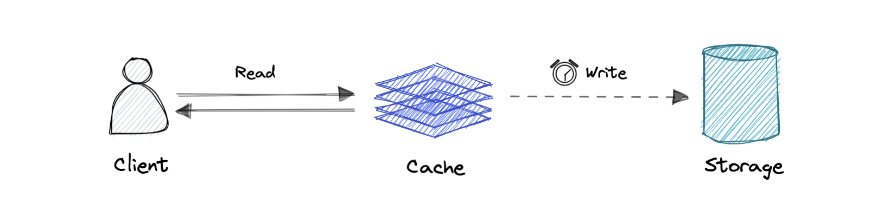
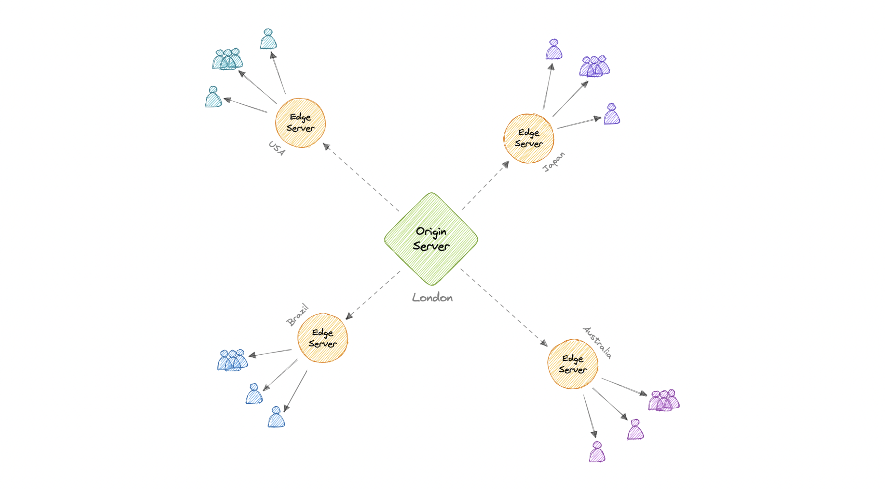

<!-- TOC start (generated with https://github.com/derlin/bitdowntoc) -->

- [Scalability](#scalability)
  * [How can a System Grow?](#how-can-a-system-grow)
- [Latency vs Throughput](#latency-vs-throughput)
- [How to Scale a System?](#how-to-scale-a-system)
  * [Vertical Scaling](#vertical-scaling)
  * [Horizontal Scaling](#horizontal-scaling)
  * [Things to consider to decide between vertical and horizontal scaling:](#things-to-consider-to-decide-between-vertical-and-horizontal-scaling)
  * [Load Balancing](#load-balancing)
  * [Clustering](#clustering)
  * [Caching](#caching)
  * [Content Delivery Networks (CDNs)](#content-delivery-networks-cdns)
  * [Proxy](#proxy)
  * [Partitioning](#partitioning)
  * [Consistent Hashing](#consistent-hashing)
  * [Database Indexing](#database-indexing)
  * [Asynchronous communication](#asynchronous-communication)
  * [Microservice Architecture](#microservice-architecture)
  * [Auto-Scaling](#auto-scaling)
  * [Multi Region Deployment](#multi-region-deployment)

<!-- TOC end -->

# Scalability

Running a system for one user is significantly different from running it for 10,000 users and that too is different from running it for 1 million users.

As the system grows the performance starts to degrade unless we adapt it to deal with that growth.

Scalability is the property of a system to handle a growing amount of load by adding resources to the system.

A system that can continuously evolve to support a growing amount of work is scalable.

## How can a System Grow?

- **Growth in User Base:** More users started using the system, leading to increased number of requests. Example: A social media platform experiencing a surge in new users.
- **Growth in Features:** Introducing new functionality to expand the system's capabilities. Example: An e-commerce website adding support for a new payment method.
- **Growth in Data Volume:** Growth in the amount of data the system stores and manages due to user activity or logging. Example: A video streaming platform like YouTube storing more video content over time.
- **Growth in Complexity:** The system's architecture evolves to accommodate new features, scale, or integrations, resulting in additional components and dependencies. Example: A system that started as a simple application is broken into smaller, independent systems.
- **Growth in Geographic Reach:** The system is expanded to serve users in new regions or countries. Example: An e-commerce company launching websites and distribution in new international markets.

# Latency vs Throughput

### What’s the Difference Between Throughput and Latency?

Latency and throughput are two metrics that measure the performance of a computer network. Latency is the delay in network communication. It shows the time that data takes to transfer across the network. Networks with a longer delay or lag have high latency, while those with fast response times have lower latency. In contrast, throughput refers to the average volume of data that can actually pass through the network over a specific time. It indicates the number of data packets that arrive at their destinations successfully and the data packet loss.

- **What does it measure?**
  - Throughput measures the volume of data that passes through a network in a given period. Throughput impacts how much data you can transmit in a period of time.
  - Latency measures the time delay when sending data. A higher latency causes a network delay.
- **How to measure?**
  - Manually calculate throughput by sending a file or using network testing tools.
  - Calculate latency by using ping times.
- **Unit of measurement**
  - of Throughput, Megabytes per second (MBps).
  - of Latency, Milliseconds (ms).
- **Impacting factors**
  - for Throughput - Bandwidth, network processing power, packet loss, and network topology.
  - for Latency - Geographical distances, network congestion, transport protocol, and network infrastructure.

### Why are throughput and latency important?

Latency determines the delay that a user experiences when they send or receive data from the network. Throughput determines the number of users that can access the network at the same time.

A network with low throughput and high latency struggles to send and process high data volume, which results in congestion and poor application performance. Users experience and satisfaction is poor.

### Relationship between bandwidth, latency and throughput

Latency and throughput work together to deliver high network connectivity and performance.

If a network connection has high latency, it can have lower throughput, as data takes longer to transmit and arrive. Low throughput also makes it seem like a network has high latency, as it takes longer for large quantities of data to arrive.

Bandwidth represents the total volume of data that you can transfer over a network. Your total bandwidth refers to the theoretical maximum amount of data that you could transfer over a network. You measure it in megabytes per second (MBps). You can think of bandwidth as the theoretical maximum throughput of your network.

Bandwidth is how much data you can transfer, while throughput is the actual amount of data you transmit in any given moment based on real-world network limitations. A high bandwidth does not guarantee speed or a good network performance, but a higher bandwidth leads to higher throughput.

# How to Scale a System?

Common ways to system scalable:

## Vertical Scaling

Vertical scaling (also known as scaling up) expands a system's scalability by adding more power to an existing machine.
This can mean upgrading the CPU, RAM, Storage, or other hardware components to boost the server's capacity.

#### Advantages
    - Simple to implement and easier to manage
    - Lower latency ->  No need for inter server communication
    - Data consistent
    - No major code changes required

#### Disadvantages
    - Limited Scalibility -> There is a limit to how much a single machine can be upgraded
    - Single point of failure
    - Risk of higher Downtime -> Upgrading hardware often requires taking the server offline
    - Higher Costs in the Long Run -> High-end servers with powerful CPUs and large amounts of RAM can get very expensive as you scale.

## Horizontal Scaling

Horizontal scaling, or scaling out, involves adding more servers or nodes to the system to distribute the load across multiple machines.

Each server runs a copy of the application, and the load is balanced among them often using a load balancer.

#### Advantages
    - Increased Redundancy
    - Low Downtime and better fault tolerance -> The failure of one node does not bring down the entire system, minimizing downtime.
    - Near-Limitless Scalability -> You can continue to add nodes as long as your architecture supports it, providing the ability to handle larger loads.
    - Cost-effective -> Horizontal scaling can be more cost-effective as it uses commodity hardware instead of expensive high-end servers.

#### Disadvantages
    - Increased Complexity -> in terms of data consistency, load balancing, and inter-server communication.
    - Data Inconsistency
    - Increased latency ->  due to inter server communication
    - Application Compatibility -> Your application's code might need adjustments to work effectively in a distributed environment.
    - Higher Set up  and maintaince cost

## Things to consider to decide between vertical and horizontal scaling:
 - Cost: Analyze initial hardware costs vs. long-term operational expenses.

 - Workload: Is your application CPU bound, memory bound, or does it lend itself to distribution?

 - Architectural Complexity: Can your application code handle distributed workloads?

 - Future Growth: How much scaling do you realistically anticipate?

**Often, the best approach involves a combination of both strategies, starting perhaps with vertical scaling for immediate needs and planning for horizontal scaling as the long-term solution.**

## Load Balancing

Load balancing lets us distribute incoming network traffic across multiple resources ensuring high availability and reliability by sending requests only to resources that are online. This provides the flexibility to add or subtract resources as demand dictates.

For additional scalability and redundancy, we can try to load balance at each layer of our system:

### But why?

Modern high-traffic websites must serve hundreds of thousands, if not millions, of concurrent requests from users or clients. To cost-effectively scale to meet these high volumes, modern computing best practice generally requires adding more servers.

A load balancer can sit in front of the servers and route client requests across all servers capable of fulfilling those requests in a manner that maximizes speed and capacity utilization. This ensures that no single server is overworked, which could degrade performance. If a single server goes down, the load balancer redirects traffic to the remaining online servers. When a new server is added to the server group, the load balancer automatically starts sending requests to it.

### Workload distribution

This is the core functionality provided by a load balancer and has several common variations:

- **Host-based**: Distributes requests based on the requested hostname.
- **Path-based**: Using the entire URL to distribute requests as opposed to just the hostname.
- **Content-based**: Inspects the message content of a request. This allows distribution based on content such as the value of a parameter.

### Layers

Generally speaking, load balancers operate at one of the two levels:

#### Network layer

This is the load balancer that works at the network's transport layer, also known as layer 4. This performs routing based on networking information such as IP addresses and is not able to perform content-based routing. These are often dedicated hardware devices that can operate at high speed.

#### Application layer

This is the load balancer that operates at the application layer, also known as layer 7. Load balancers can read requests in their entirety and perform content-based routing. This allows the management of load based on a full understanding of traffic.

### Types

Let's look at different types of load balancers:

#### Software

Software load balancers usually are easier to deploy than hardware versions. They also tend to be more cost-effective and flexible, and they are used in conjunction with software development environments. The software approach gives us the flexibility of configuring the load balancer to our environment's specific needs. The boost in flexibility may come at the cost of having to do more work to set up the load balancer. Compared to hardware versions, which offer more of a closed-box approach, software balancers give us more freedom to make changes and upgrades.

Software load balancers are widely used and are available either as installable solutions that require configuration and management or as a managed cloud service.

#### Hardware

As the name implies, a hardware load balancer relies on physical, on-premises hardware to distribute application and network traffic. These devices can handle a large volume of traffic but often carry a hefty price tag and are fairly limited in terms of flexibility.

Hardware load balancers include proprietary firmware that requires maintenance and updates as new versions, and security patches are released.

#### DNS

DNS load balancing is the practice of configuring a domain in the Domain Name System (DNS) such that client requests to the domain are distributed across a group of server machines.

Unfortunately, DNS load balancing has inherent problems limiting its reliability and efficiency. Most significantly, DNS does not check for server and network outages, or errors. It always returns the same set of IP addresses for a domain even if servers are down or inaccessible.

### Routing Algorithms

Now, let's discuss commonly used routing algorithms:

- **Round-robin**: Requests are distributed to application servers in rotation.
- **Weighted Round-robin**: Builds on the simple Round-robin technique to account for differing server characteristics such as compute and traffic handling capacity using weights that can be assigned via DNS records by the administrator.
- **Least Connections**: A new request is sent to the server with the fewest current connections to clients. The relative computing capacity of each server is factored into determining which one has the least connections.
- **Least Response Time**: Sends requests to the server selected by a formula that combines the fastest response time and fewest active connections.
- **Least Bandwidth**: This method measures traffic in megabits per second (Mbps), sending client requests to the server with the least Mbps of traffic.
- **Hashing**: Distributes requests based on a key we define, such as the client IP address or the request URL.

### Advantages

Load balancing also plays a key role in preventing downtime, other advantages of load balancing include the following:

- Scalability
- Redundancy
- Flexibility
- Efficiency
- Security

### Redundant load balancers

As you must've already guessed, the load balancer itself can be a single point of failure. To overcome this, a second or `N` number of load balancers can be used in a cluster mode.

And, if there's a failure detection and the _active_ load balancer fails, another _passive_ load balancer can take over which will make our system more fault-tolerant.

### Features

Here are some commonly desired features of load balancers:

- **Autoscaling**: Starting up and shutting down resources in response to demand conditions.
- **Sticky sessions**: The ability to assign the same user or device to the same resource in order to maintain the session state on the resource.
- **Healthchecks**: The ability to determine if a resource is down or performing poorly in order to remove the resource from the load balancing pool.
- **Persistence connections**: Allowing a server to open a persistent connection with a client such as a WebSocket.
- **Encryption**: Handling encrypted connections such as TLS and SSL.
- **Certificates**: Presenting certificates to a client and authentication of client certificates.
- **Compression**: Compression of responses.
- **Caching**: An application-layer load balancer may offer the ability to cache responses.
- **Logging**: Logging of request and response metadata can serve as an important audit trail or source for analytics data.
- **Request tracing**: Assigning each request a unique id for the purposes of logging, monitoring, and troubleshooting.
- **Redirects**: The ability to redirect an incoming request based on factors such as the requested path.
- **Fixed response**: Returning a static response for a request such as an error message.

### Examples

Following are some of the load balancing solutions commonly used in the industry:

- [Amazon Elastic Load Balancing](https://aws.amazon.com/elasticloadbalancing)
- [Azure Load Balancing](https://azure.microsoft.com/en-in/services/load-balancer)
- [GCP Load Balancing](https://cloud.google.com/load-balancing)
- [DigitalOcean Load Balancer](https://www.digitalocean.com/products/load-balancer)
- [Nginx](https://www.nginx.com)
- [HAProxy](http://www.haproxy.org)

## Clustering

At a high level, a computer cluster is a group of two or more computers, or nodes, that run in parallel to achieve a common goal. This allows workloads consisting of a high number of individual, parallelizable tasks to be distributed among the nodes in the cluster. As a result, these tasks can leverage the combined memory and processing power of each computer to increase overall performance.

To build a computer cluster, the individual nodes should be connected to a network to enable internode communication. The software can then be used to join the nodes together and form a cluster. It may have a shared storage device and/or local storage on each node.

Typically, at least one node is designated as the leader node and acts as the entry point to the cluster. The leader node may be responsible for delegating incoming work to the other nodes and, if necessary, aggregating the results and returning a response to the user.

Ideally, a cluster functions as if it were a single system. A user accessing the cluster should not need to know whether the system is a cluster or an individual machine. Furthermore, a cluster should be designed to minimize latency and prevent bottlenecks in node-to-node communication.

### Types

Computer clusters can generally be categorized into three types:

- Highly available or fail-over
- Load balancing
- High-performance computing

### Configurations

The two most commonly used high availability (HA) clustering configurations are active-active and active-passive.

#### Active-Active

An active-active cluster is typically made up of at least two nodes, both actively running the same kind of service simultaneously. The main purpose of an active-active cluster is to achieve load balancing. A load balancer distributes workloads across all nodes to prevent any single node from getting overloaded. Because there are more nodes available to serve, there will also be an improvement in throughput and response times.

#### Active-Passive

Like the active-active cluster configuration, an active-passive cluster also consists of at least two nodes. However, as the name _active-passive_ implies, not all nodes are going to be active. For example, in the case of two nodes, if the first node is already active, then the second node must be passive or on standby.

### Advantages

Four key advantages of cluster computing are as follows:

- High availability
- Scalability
- Performance
- Cost-effective

### Load balancing vs Clustering

Load balancing shares some common traits with clustering, but they are different processes. Clustering provides redundancy and boosts capacity and availability. Servers in a cluster are aware of each other and work together toward a common purpose. But with load balancing, servers are not aware of each other. Instead, they react to the requests they receive from the load balancer.

We can employ load balancing in conjunction with clustering, but it also is applicable in cases involving independent servers that share a common purpose such as to run a website, business application, web service, or some other IT resource.

### Challenges

The most obvious challenge clustering presents is the increased complexity of installation and maintenance. An operating system, the application, and its dependencies must each be installed and updated on every node.

This becomes even more complicated if the nodes in the cluster are not homogeneous. Resource utilization for each node must also be closely monitored, and logs should be aggregated to ensure that the software is behaving correctly.

Additionally, storage becomes more difficult to manage, a shared storage device must prevent nodes from overwriting one another and distributed data stores have to be kept in sync.

### Examples

Clustering is commonly used in the industry, and often many technologies offer some sort of clustering mode. For example:

- Containers (e.g. [Kubernetes](https://kubernetes.io), [Amazon ECS](https://aws.amazon.com/ecs))
- Databases (e.g. [Cassandra](https://cassandra.apache.org/_/index.html), [MongoDB](https://www.mongodb.com))
- Cache (e.g. [Redis](https://redis.io/docs/manual/scaling))

## Caching

A cache's primary purpose is to increase data retrieval performance by reducing the need to access the underlying slower storage layer. Trading off capacity for speed, a cache typically stores a subset of data transiently, in contrast to databases whose data is usually complete and durable.

Caches take advantage of the locality of reference principle _"recently requested data is likely to be requested again"._

### Caching and Memory

Like a computer's memory, a cache is a compact, fast-performing memory that stores data in a hierarchy of levels, starting at level one, and progressing from there sequentially. They are labeled as L1, L2, L3, and so on. A cache also gets written if requested, such as when there has been an update and new content needs to be saved to the cache, replacing the older content that was saved.

No matter whether the cache is read or written, it's done one block at a time. Each block also has a tag that includes the location where the data was stored in the cache. When data is requested from the cache, a search occurs through the tags to find the specific content that's needed in level one (L1) of the memory. If the correct data isn't found, more searches are conducted in L2.

If the data isn't found there, searches are continued in L3, then L4, and so on until it has been found, then, it's read and loaded. If the data isn't found in the cache at all, then it's written into it for quick retrieval the next time.

### Cache hit and Cache miss

#### Cache hit

A cache hit describes the situation where content is successfully served from the cache. The tags are searched in the memory rapidly, and when the data is found and read, it's considered a cache hit.

**Cold, Warm, and Hot Caches**

A cache hit can also be described as cold, warm, or hot. In each of these, the speed at which the data is read is described.

A hot cache is an instance where data was read from the memory at the _fastest_ possible rate. This happens when the data is retrieved from L1.

A cold cache is the _slowest_ possible rate for data to be read, though, it's still successful so it's still considered a cache hit. The data is just found lower in the memory hierarchy such as in L3, or lower.

A warm cache is used to describe data that's found in L2 or L3. It's not as fast as a hot cache, but it's still faster than a cold cache. Generally, calling a cache warm is used to express that it's slower and closer to a cold cache than a hot one.

#### Cache miss

A cache miss refers to the instance when the memory is searched, and the data isn't found. When this happens, the content is transferred and written into the cache.

### Cache Invalidation

Cache invalidation is a process where the computer system declares the cache entries as invalid and removes or replaces them. If the data is modified, it should be invalidated in the cache, if not, this can cause inconsistent application behavior. There are three kinds of caching systems:

#### Write-through cache

Data is written into the cache and the corresponding database simultaneously.

**Pro**: Fast retrieval, complete data consistency between cache and storage.

**Con**: Higher latency for write operations.

#### Write-around cache

Where write directly goes to the database or permanent storage, bypassing the cache.

**Pro**: This may reduce latency.

**Con**: It increases cache misses because the cache system has to read the information from the database in case of a cache miss. As a result, this can lead to higher read latency in the case of applications that write and re-read the information quickly. Read happen from slower back-end storage and experiences higher latency.

#### Write-back cache

Where the write is only done to the caching layer and the write is confirmed as soon as the write to the cache completes. The cache then asynchronously syncs this write to the database.

**Pro**: This would lead to reduced latency and high throughput for write-intensive applications.

**Con**: There is a risk of data loss in case the caching layer crashes. We can improve this by having more than one replica acknowledging the write in the cache.

### Eviction policies

Following are some of the most common cache eviction policies:

- **First In First Out (FIFO)**: The cache evicts the first block accessed first without any regard to how often or how many times it was accessed before.
- **Last In First Out (LIFO)**: The cache evicts the block accessed most recently first without any regard to how often or how many times it was accessed before.
- **Least Recently Used (LRU)**: Discards the least recently used items first.
- **Most Recently Used (MRU)**: Discards, in contrast to LRU, the most recently used items first.
- **Least Frequently Used (LFU)**: Counts how often an item is needed. Those that are used least often are discarded first.
- **Random Replacement (RR)**: Randomly selects a candidate item and discards it to make space when necessary.

### Distributed Cache

A distributed cache is a system that pools together the random-access memory (RAM) of multiple networked computers into a single in-memory data store used as a data cache to provide fast access to data. While most caches are traditionally in one physical server or hardware component, a distributed cache can grow beyond the memory limits of a single computer by linking together multiple computers.

### Global Cache

As the name suggests, we will have a single shared cache that all the application nodes will use. When the requested data is not found in the global cache, it's the responsibility of the cache to find out the missing piece of data from the underlying data store.

### Use cases

Caching can have many real-world use cases such as:

- Database Caching
- Content Delivery Network (CDN)
- Domain Name System (DNS) Caching
- API Caching

**When not to use caching?**

Let's also look at some scenarios where we should not use cache:

- Caching isn't helpful when it takes just as long to access the cache as it does to access the primary data store.
- Caching doesn't work as well when requests have low repetition (higher randomness), because caching performance comes from repeated memory access patterns.
- Caching isn't helpful when the data changes frequently, as the cached version gets out of sync, and the primary data store must be accessed every time.

_It's important to note that a cache should not be used as permanent data storage. They are almost always implemented in volatile memory because it is faster, and thus should be considered transient._

### Advantages

Below are some advantages of caching:

- Improves performance
- Reduce latency
- Reduce load on the database
- Reduce network cost
- Increase Read Throughput

### Examples

Here are some commonly used technologies for caching:

- [Redis](https://redis.io)
- [Memcached](https://memcached.org)
- [Amazon Elasticache](https://aws.amazon.com/elasticache)
- [Aerospike](https://aerospike.com)

## Content Delivery Networks (CDNs)

A content delivery network (CDN) is a geographically distributed group of servers that work together to provide fast delivery of internet content. Generally, static files such as HTML/CSS/JS, photos, and videos are served from CDN.

### Why use a CDN?

Content Delivery Network (CDN) increases content availability and redundancy while reducing bandwidth costs and improving security. Serving content from CDNs can significantly improve performance as users receive content from data centers close to them and our servers do not have to serve requests that the CDN fulfills.

### How does a CDN work?

In a CDN, the origin server contains the original versions of the content while the edge servers are numerous and distributed across various locations around the world.

To minimize the distance between the visitors and the website's server, a CDN stores a cached version of its content in multiple geographical locations known as edge locations. Each edge location contains several caching servers responsible for content delivery to visitors within its proximity.

Once the static assets are cached on all the CDN servers for a particular location, all subsequent website visitor requests for static assets will be delivered from these edge servers instead of the origin, thus reducing the origin load and improving scalability.

For example, when someone in the UK requests our website which might be hosted in the USA, they will be served from the closest edge location such as the London edge location. This is much quicker than having the visitor make a complete request to the origin server which will increase the latency.

### Types

CDNs are generally divided into two types:

#### Push CDNs

Push CDNs receive new content whenever changes occur on the server. We take full responsibility for providing content, uploading directly to the CDN, and rewriting URLs to point to the CDN. We can configure when content expires and when it is updated. Content is uploaded only when it is new or changed, minimizing traffic, but maximizing storage.

Sites with a small amount of traffic or sites with content that isn't often updated work well with push CDNs. Content is placed on the CDNs once, instead of being re-pulled at regular intervals.

#### Pull CDNs

In a Pull CDN situation, the cache is updated based on request. When the client sends a request that requires static assets to be fetched from the CDN if the CDN doesn't have it, then it will fetch the newly updated assets from the origin server and populate its cache with this new asset, and then send this new cached asset to the user.

Contrary to the Push CDN, this requires less maintenance because cache updates on CDN nodes are performed based on requests from the client to the origin server. Sites with heavy traffic work well with pull CDNs, as traffic is spread out more evenly with only recently-requested content remaining on the CDN.

### Disadvantages

- **Extra charges**: It can be expensive to use a CDN, especially for high-traffic services.
- **Restrictions**: Some organizations and countries have blocked the domains or IP addresses of popular CDNs.
- **Location**: If most of our audience is located in a country where the CDN has no servers, the data on our website may have to travel further than without using any CDN.

### Examples

Here are some widely used CDNs:

- [Amazon CloudFront](https://aws.amazon.com/cloudfront)
- [Google Cloud CDN](https://cloud.google.com/cdn)
- [Cloudflare CDN](https://www.cloudflare.com/cdn)
- [Fastly](https://www.fastly.com/products/cdn)

## Proxy

A proxy server is an intermediary piece of hardware/software sitting between the client and the backend server. It receives requests from clients and relays them to the origin servers. Typically, proxies are used to filter requests, log requests, or sometimes transform requests (by adding/removing headers, encrypting/decrypting, or compression).

### Types

There are two types of proxies:

#### Forward Proxy

A forward proxy, often called a proxy, proxy server, or web proxy is a server that sits in front of a group of client machines. When those computers make requests to sites and services on the internet, the proxy server intercepts those requests and then communicates with web servers on behalf of those clients, like a middleman.

**Advantages**

Here are some advantages of a forward proxy:

- Block access to certain content
- Allows access to [geo-restricted](https://en.wikipedia.org/wiki/Geo-blocking) content
- Provides anonymity
- Avoid other browsing restrictions

Although proxies provide the benefits of anonymity, they can still track our personal information. Setup and maintenance of a proxy server can be costly and requires configurations.

#### Reverse Proxy

A reverse proxy is a server that sits in front of one or more web servers, intercepting requests from clients. When clients send requests to the origin server of a website, those requests are intercepted by the reverse proxy server.

The difference between a forward and reverse proxy is subtle but important. A simplified way to sum it up would be to say that a forward proxy sits in front of a client and ensures that no origin server ever communicates directly with that specific client. On the other hand, a reverse proxy sits in front of an origin server and ensures that no client ever communicates directly with that origin server.

Introducing reverse proxy results in increased complexity. A single reverse proxy is a single point of failure, configuring multiple reverse proxies (i.e. a failover) further increases complexity.

**Advantages**

Here are some advantages of using a reverse proxy:

- Improved security
- Caching
- SSL encryption
- Load balancing
- Scalability and flexibility

### Load balancer vs Reverse Proxy

Wait, isn't reverse proxy similar to a load balancer? Well, no as a load balancer is useful when we have multiple servers. Often, load balancers route traffic to a set of servers serving the same function, while reverse proxies can be useful even with just one web server or application server. A reverse proxy can also act as a load balancer but not the other way around.

### Examples

Below are some commonly used proxy technologies:

- [Nginx](https://www.nginx.com)
- [HAProxy](http://www.haproxy.org)
- [Traefik](https://doc.traefik.io/traefik)
- [Envoy](https://www.envoyproxy.io)

## Partitioning

Split data or functionality across multiple nodes/servers to distribute workload and avoid bottlenecks.

Check - [Database Sharding](Distributed%20Data.md#database-sharding) for more

Example: Amazon DynamoDB uses partitioning to distribute data and traffic for its NoSQL database service across many servers, ensuring fast performance and scalability.

## Consistent Hashing

Check - [Consistent Hashing](Distributed%20Data.md#consistent-hashing) for more

## Database Indexing

Check - [Indexes](Distributed%20Data.md#indexes) for more

## Asynchronous communication

Defer long-running or non-critical tasks to background queues or message brokers. This ensures your main application remains responsive to users.

Check - [Synchronous vs. asynchronous communications](System%20Architectural%20Patterns.md#synchronous-vs-asynchronous-communications-the-differences) for more

Example: Slack uses asynchronous communication for messaging. When a message is sent, the sender's interface doesn't freeze; it continues to be responsive while the message is processed and delivered in the background.

## Microservice Architecture

Break down your application into smaller, independent services that can be scaled independently. This improves resilience and allows teams to work on specific components in parallel.

Check - [Microservice Architecture](System%20Architectural%20Patterns.md#microservice-architecture) for more

Example: Uber has evolved its architecture into microservices to handle different functions like billing, notifications, and ride matching independently, allowing for efficient scaling and rapid development.

## Auto-Scaling

Automatically adjust the number of active servers based on the current load. This ensures that the system can handle spikes in traffic without manual intervention

Example: AWS Auto Scaling monitors applications and automatically adjusts capacity to maintain steady, predictable performance at the lowest possible cost.

## Multi Region Deployment

Deploy the application in multiple data centers or cloud regions to reduce latency and improve redundancy.

Example: Spotify uses multi-region deployments to ensure their music streaming service remains highly available and responsive to users all over the world, regardless of where they are located.

