<!-- TOC start (generated with https://github.com/derlin/bitdowntoc) -->

- [N-Tier Architecture](#n-tier-architecture)
  * [Types of N-Tier architectures](#types-of-n-tier-architectures)
  * [1-Tier Structure](#1-tier-structure)
  * [Advantages](#advantages)
  * [Disadvantages](#disadvantages)
- [Monolithic Architecture](#monolithic-architecture)
  * [Modular Monoliths](#modular-monoliths)
- [Microservice Architecture](#microservice-architecture)
  * [Beware of the distributed monolith](#beware-of-the-distributed-monolith)
  * [Microservices vs Service-oriented architecture (SOA)](#microservices-vs-service-oriented-architecture-soa)
  * [Why you don't need microservices](#why-you-dont-need-microservices)
- [Serverless Architecture](#serverless-architecture)
- [Event-Driven Architecture (EDA)](#event-driven-architecture-eda)
  * [What is an event?](#what-is-an-event)
  * [Components](#components)
  * [Patterns](#patterns)
  * [Advantages](#advantages-1)
  * [Challenges](#challenges)
  * [Useful Considerations](#useful-considerations)
  * [Use cases](#use-cases)
  * [Examples](#examples)
- [Important Concepts around Event-driven Architecture](#important-concepts-around-event-driven-architecture)
  * [Sagas](#sagas)
  * [Publish-Subscribe](#publish-subscribe)
  * [Event Sourcing](#event-sourcing)
  * [Command and Query Responsibility Segregation (CQRS)](#command-and-query-responsibility-segregation-cqrs)
  * [Use cases](#use-cases-1)
  * [Enterprise Service Bus (ESB)](#enterprise-service-bus-esb)
  * [Message Queues](#message-queues)
  * [Message Brokers](#message-brokers)
  * [Synchronous vs. asynchronous communications: The differences](#synchronous-vs-asynchronous-communications-the-differences)
- [Big-Data Architecture](#big-data-architecture)
  * [When to use this architecture](#when-to-use-this-architecture)
  * [Batch processing vs Stream Processing](#batch-processing-vs-stream-processing)

<!-- TOC end -->

# N-Tier Architecture

- N-tier architecture divides an application into logical layers and physical tiers. Layers are a way to separate responsibilities and manage dependencies. Each layer has a specific responsibility. A higher layer can use services in a lower layer, but not the other way around.

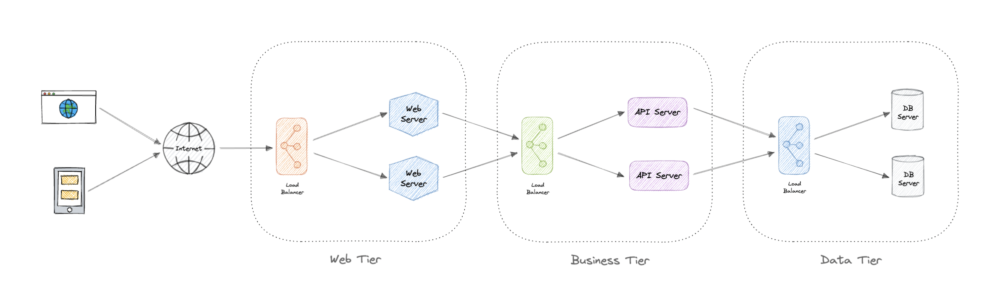

- Tiers are physically separated, running on separate machines. A tier can call to another tier directly, or use asynchronous messaging. Although each layer might be hosted in its own tier, that's not required. Several layers might be hosted on the same tier. Physically separating the tiers improves scalability and resiliency and adds latency from the additional network communication.

An N-tier architecture can be of two types:

- In a closed layer architecture, a layer can only call the next layer immediately down.
- In an open layer architecture, a layer can call any of the layers below it.

A closed-layer architecture limits the dependencies between layers. However, it might create unnecessary network traffic, if one layer simply passes requests along to the next layer.

## Types of N-Tier architectures

Let's look at some examples of N-Tier architecture:

### 3-Tier architecture

3-Tier is widely used and consists of the following different layers:

- **Presentation layer**: Handles user interactions with the application.
- **Business Logic layer**: Accepts the data from the application layer, validates it as per business logic and passes it to the data layer.
- **Data Access layer**: Receives the data from the business layer and performs the necessary operation on the database.

### 2-Tier architecture

- While the database is on the server side, the user interface is client-side. Both the client and server end can store the database and business logic.
- The design is known as a fat client-thin server architecture if both sit at the client end.
- On the other hand, the design is known as a thin client-fat server architecture if both sit at the server end.
- A two-tier architecture is typically used in online ticket reservation systems.

## 1-Tier Structure

- In a 1-tier architecture, the user interface, business logic, and data logic are all on the same server. 
- Because the client and server are on the same system, the environment is straightforward and inexpensive, but the variation in the data necessitates repetitive effort. 
- These systems keep their data in a shared driver or a local file. 
- The MP3 player and MS Office files are two examples of 1-tier apps.

## Advantages

Here are some advantages of using N-tier architecture:

- Can improve availability.
- Better security as layers can behave like a firewall.
- Separate tiers allow us to scale them as needed.
- Improve maintenance as different people can manage different tiers.

## Disadvantages

Below are some disadvantages of N-tier architecture:

- Increased complexity of the system as a whole.
- Increased network latency as the number of tiers increases.
- Expensive as every tier will have its own hardware cost.
- Difficult to manage network security in large systems.

# Monolithic Architecture

- A monolith is a self-contained and independent application. It is built as a single unit and is responsible for not just a particular task, but can perform every step needed to satisfy a business need.

### Advantages

Following are some advantages of monoliths:

- Simple to develop or debug.
- Fast and reliable communication.
- Easy monitoring and testing.
- Supports ACID transactions.

### Disadvantages

Some common disadvantages of monoliths are:

- Maintenance becomes hard as the codebase grows.
- Tightly coupled application, hard to extend.
- Requires commitment to a particular technology stack.
- On each update, the entire application is redeployed.
- Reduced reliability as a single bug can bring down the entire system.
- Difficult to scale or adopt new technologies.

## Modular Monoliths

A Modular Monolith is an approach where we build and deploy a single application (that's the _Monolith_ part), but we build it in a way that breaks up the code into independent modules for each of the features needed in our application.

This approach reduces the dependencies of a module in such as way that we can enhance or change a module without affecting other modules. When done right, this can be really beneficial in the long term as it reduces the complexity that comes with maintaining a monolith as the system grows.

# Microservice Architecture

- A microservices architecture consists of a collection of small, autonomous services where each service is self-contained and should implement a single business capability within a bounded context. 
- A bounded context is a natural division of business logic that provides an explicit boundary within which a domain model exists.

- Each service has a separate codebase, which can be managed by a small development team. 
- Services can be deployed independently and a team can update an existing service without rebuilding and redeploying the entire application.
- Services are responsible for persisting their own data or external state (database per service). This differs from the traditional model, where a separate data layer handles data persistence.
- Services communicate with each other by using well-defined APIs. Internal implementation details of each service are hidden from other services.
- Supports polyglot programming. For example, services don't need to share the same technology stack, libraries, or frameworks.
- Besides for the services themselves, some other components appear in a typical microservices architecture:
  - **Management/orchestration.** This component is responsible for placing services on nodes, identifying failures, rebalancing services across nodes, and so forth. Typically this component is an off-the-shelf technology such as Kubernetes, rather than something custom built.
  - **API Gateway.** The API gateway is the entry point for clients. Instead of calling services directly, clients call the API gateway, which forwards the call to the appropriate services on the back end.

### Characteristics

The microservices architecture style has the following characteristics:

- **Loosely coupled**: Services should be loosely coupled so that they can be independently deployed and scaled. This will lead to the decentralization of development teams and thus, enabling them to develop and deploy faster with minimal constraints and operational dependencies.
- **Small but focused**: It's about scope and responsibilities and not size, a service should be focused on a specific problem. Basically, _"It does one thing and does it well"_. Ideally, they can be independent of the underlying architecture.
- **Built for businesses**: The microservices architecture is usually organized around business capabilities and priorities.
- **Resilience & Fault tolerance**: Services should be designed in such a way that they still function in case of failure or errors. In environments with independently deployable services, failure tolerance is of the highest importance.
- **Highly maintainable**: Service should be easy to maintain and test because services that cannot be maintained will be rewritten.

### Advantages

Here are some advantages of microservices architecture:

- Loosely coupled services.
- Services can be deployed independently.
- Highly agile for multiple development teams.
- Improves fault tolerance and data isolation.
- Better scalability as each service can be scaled independently.
- Eliminates any long-term commitment to a particular technology stack.

### Disadvantages

Microservices architecture brings its own set of challenges:

- Complexity of a distributed system.
- Testing is more difficult.
- Expensive to maintain (individual servers, databases, etc.).
- Inter-service communication has its own challenges.
- Data integrity and consistency.
- Network congestion and latency.

### Best practices

Let's discuss some microservices best practices:

- Model services around the business domain.
- Services should have loose coupling and high functional cohesion.
- Isolate failures and use resiliency strategies to prevent failures within a service from cascading.
- Services should only communicate through well-designed APIs. Avoid leaking implementation details.
- Data storage should be private to the service that owns the data
- Avoid coupling between services. Causes of coupling include shared database schemas and rigid communication protocols.
- Decentralize everything. Individual teams are responsible for designing and building services. Avoid sharing code or data schemas.
- Fail fast by using a circuit breaker to achieve fault tolerance.
- Ensure that the API changes are backward compatible.

### Pitfalls

Below are some common pitfalls of microservices architecture:

- Service boundaries are not based on the business domain.
- Underestimating how hard is to build a distributed system.
- Shared database or common dependencies between services.
- Lack of Business Alignment.
- Lack of clear ownership.
- Lack of idempotency.
- Trying to do everything ACID instead of BASE.
- Lack of design for fault tolerance may result in cascading failures.

## Beware of the distributed monolith

- Distributed Monolith is a system that resembles the microservices architecture but is tightly coupled within itself like a monolithic application. 
- Adopting microservices architecture comes with a lot of advantages. 
- But while making one, there are good chances that we might end up with a distributed monolith.

Our microservices are just a distributed monolith if any of these apply to it:

- Requires low latency communication.
- Services don't scale easily.
- Dependency between services.
- Sharing the same resources such as databases.
- Tightly coupled systems.

One of the primary reasons to build an application using microservices architecture is to have scalability. Therefore, microservices should have loosely coupled services which enable every service to be independent. The distributed monolith architecture takes this away and causes most components to depend on one another, increasing design complexity.

## Microservices vs Service-oriented architecture (SOA)

- You might have seen _Service-oriented architecture (SOA)_ mentioned around the internet, sometimes even interchangeably with microservices, but they are different from each other and the main distinction between the two approaches comes down to _scope_.

- Service-oriented architecture (SOA) defines a way to make software components reusable via service interfaces. These interfaces utilize common communication standards and focus on maximizing application service reusability whereas microservices are built as a collection of various smallest independent service units focused on team autonomy and decoupling.

## Why you don't need microservices

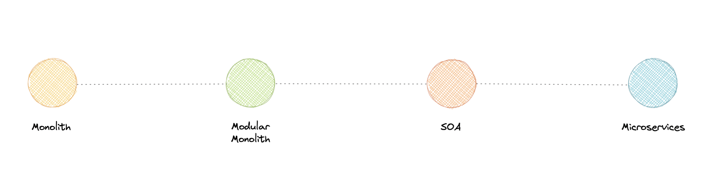

- So, you might be wondering, monoliths seem like a bad idea to begin with, why would anyone use that?

- Well, it depends. While each approach has its own advantages and disadvantages, it is advised to start with a monolith when building a new system. It is important to understand, that microservices are not a silver bullet, instead, they solve an organizational problem. Microservices architecture is about your organizational priorities and team as much as it's about technology.

Before making the decision to move to microservices architecture, you need to ask yourself questions like:

- _"Is the team too large to work effectively on a shared codebase?"_
- _"Are teams blocked on other teams?"_
- _"Does microservices deliver clear business value for us?"_
- _"Is my business mature enough to use microservices?"_
- _"Is our current architecture limiting us with communication overhead?"_

- If your application does not require to be broken down into microservices, you don't need this. There is no absolute necessity that all applications should be broken down into microservices.

- We frequently draw inspiration from companies such as Netflix and their use of microservices, but we overlook the fact that we are not Netflix. They went through a lot of iterations and models before they had a market-ready solution, and this architecture became acceptable for them when they identified and solved the problem they were trying to tackle.

That's why it's essential to understand in-depth if your business _actually_ needs microservices. What I'm trying to say is microservices are solutions to complex concerns and if your business doesn't have complex issues, you don't need them.

Further reading 
- [The What, Why, and How of a Microservices Architecture](https://medium.com/hashmapinc/the-what-why-and-how-of-a-microservices-architecture-4179579423a9)
- [Microservice Lessons](https://newsletter.systemdesign.one/p/netflix-microservices)

# Serverless Architecture

- Serverless architecture is an approach to software design that allows developers to build and run services without having to manage the underlying infrastructure.
- Developers can write and deploy code, while a cloud provider provisions servers to run their applications, databases, and storage systems at any scale.

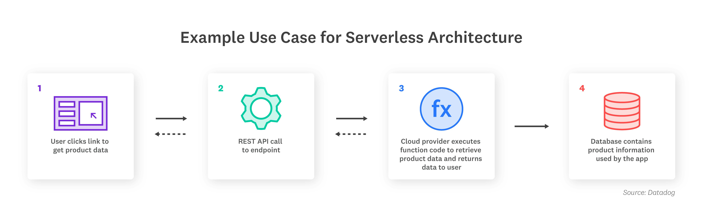

### Fundamental Concepts in Serverless Architecture

* **Invocation** - A single function execution.

* **Duration** - The time it takes for a serverless function to execute.

* **Cold Start** - The latency that occurs when a function is triggered for the first time or after a period of inactivity.

* **Concurrency Limit** - The number of function instances that can run simultaneously in one region, as determined by the cloud provider. A function will be throttled if it exceeds this limit.

* **Timeout** - The amount of time that a cloud provider allows a function to run before terminating it. Most providers set a default timeout and a maximum timeout.

### Serverless Architecture vs. Container Architecture

- Developers who are using container architecture have to update and maintain each container they deploy, as well as its system settings and dependencies. In contrast, server maintenance in serverless architectures is handled entirely by the cloud provider. 
- Additionally, serverless apps scale automatically, while scaling container architectures requires the use of an orchestration platform like Kubernetes.
- Containers give developers control over the underlying operating system and runtime environment, making them suitable for applications that consistently get high traffic or as a first step in a cloud migration. Serverless functions, on the other hand, are better suited for trigger-based events such as payment processing.

### Use Cases

- Serverless architecture is best used to perform short-lived tasks and manage workloads that experience infrequent or unpredictable traffic.
- Companies that want to minimize their go-to-market time and build scalable, lightweight applications can benefit greatly from serverless. 
- But if your applications involve a large number of continuous, long-running processes, virtual machines or containers may be the better choice. 
- In a hybrid infrastructure, developers may utilize containers or virtual machines to handle the bulk of requests but hand off certain short-running tasks, such as database storage, to serverless functions.
- With Serverless Monitoring, you can observe the health and performance of your functions and other infrastructure components in real time, and collect metrics, traces, and logs from every invocation.

**Examples**
- [AWS Lambda](https://aws.amazon.com/lambda/)
- [Google Cloud Functions (GCF)](https://cloud.google.com/functions)
- [Azure Functions](https://azure.microsoft.com/en-us/services/functions/)

# Event-Driven Architecture (EDA)

Event-Driven Architecture (EDA) is about using events as a way to communicate within a system. Generally, leveraging a message broker to publish and consume events asynchronously. The publisher is unaware of who is consuming an event and the consumers are unaware of each other. Event-Driven Architecture is simply a way of achieving loose coupling between services within a system.

## What is an event?

An event is a data point that represents state changes in a system. It doesn't specify what should happen and how the change should modify the system, it only notifies the system of a particular state change. When a user makes an action, they trigger an event.

## Components

Event-driven architectures have three key components:

- **Event producers**: Publishes an event to the router.
- **Event routers**: Filters and pushes the events to consumers.
- **Event consumers**: Uses events to reflect changes in the system.

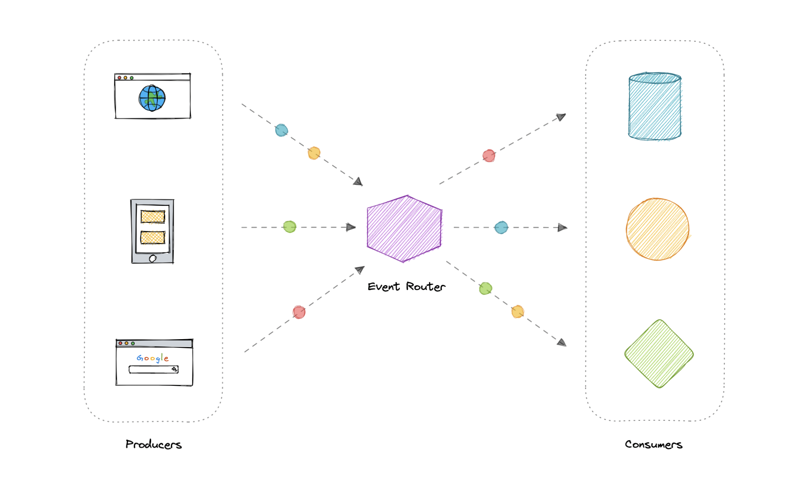

_Note: Dots in the diagram represents different events in the system._

## Patterns

There are several ways to implement the event-driven architecture, and which method we use depends on the use case but here are some common examples:

- [Sagas](Distributed%20Data.md#sagas)
- [Publish-Subscribe](#publish-subscribe)
- [Event Sourcing](#event-sourcing)
- [Command and Query Responsibility Segregation (CQRS)](#command-and-query-responsibility-segregation-cqrs)

## Advantages

Let's discuss some advantages:

- Decoupled producers and consumers.
- Highly scalable and distributed.
- Easy to add new consumers.
- Improves agility.

## Challenges

Here are some challenges of event-drive architecture:

- Guaranteed delivery.
- Error handling is difficult.
- Event-driven systems are complex in general.
- Exactly once, in-order processing of events.

## Useful Considerations

- The amount of data to include in an event can be a significant consideration that affects both performance and cost. 
- Putting all the relevant information needed for processing in the event itself can simplify the processing code and save additional lookups. 
- Putting the minimal amount of information in an event, like just a couple of identifiers, will reduce transport time and cost, but requires the processing code to look up any additional information it needs.

## Use cases

Below are some common use cases where event-driven architectures are beneficial:

- Metadata and metrics.
- Server and security logs.
- Integrating heterogeneous systems.
- Fanout and parallel processing.

## Examples

Here are some widely used technologies for implementing event-driven architectures:

- [NATS](https://nats.io)
- [Apache Kafka](https://kafka.apache.org)
- [Amazon EventBridge](https://aws.amazon.com/eventbridge)
- [Amazon SNS](https://aws.amazon.com/sns)
- [Google PubSub](https://cloud.google.com/pubsub)

# Important Concepts around Event-driven Architecture

## [Sagas](Distributed%20Data.md#sagas)

## Publish-Subscribe

- Publish-subscribe is a form of service-to-service communication that facilitates asynchronous communication. In a pub/sub model, any message published to a topic is pushed immediately to all the subscribers of the topic.

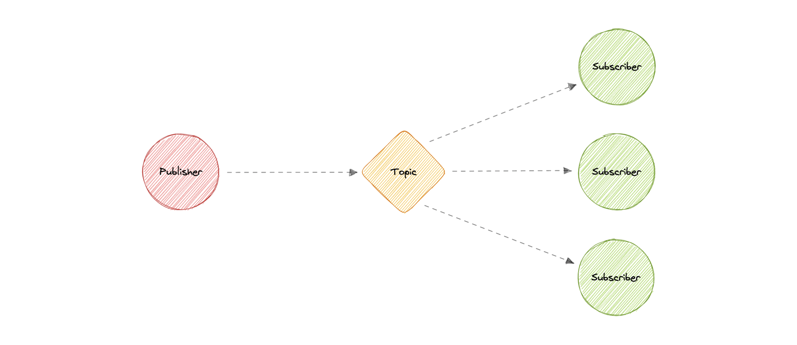

- The subscribers to the message topic often perform different functions, and can each do something different with the message in parallel. The publisher doesn't need to know who is using the information that it is broadcasting, and the subscribers don't need to know where the message comes from. This style of messaging is a bit different than message queues, where the component that sends the message often knows the destination it is sending to.

### Working

Unlike message queues, which batch messages until they are retrieved, message topics transfer messages with little or no queuing and push them out immediately to all subscribers. Here's how it works:

- A message topic provides a lightweight mechanism to broadcast asynchronous event notifications and endpoints that allow software components to connect to the topic in order to send and receive those messages.
- To broadcast a message, a component called a _publisher_ simply pushes a message to the topic.
- All components that subscribe to the topic (known as _subscribers_) will receive every message that was broadcasted.

### Advantages

Let's discuss some advantages of using publish-subscribe:

- **Eliminate Polling**: Message topics allow instantaneous, push-based delivery, eliminating the need for message consumers to periodically check or _"poll"_ for new information and updates. This promotes faster response time and reduces the delivery latency which can be particularly problematic in systems where delays cannot be tolerated.
- **Dynamic Targeting**: Pub/Sub makes the discovery of services easier, more natural, and less error-prone. Instead of maintaining a roster of peers where an application can send messages, a publisher will simply post messages to a topic. Then, any interested party will subscribe its endpoint to the topic, and start receiving these messages. Subscribers can change, upgrade, multiply or disappear and the system dynamically adjusts.
- **Decoupled and Independent Scaling**: Publishers and subscribers are decoupled and work independently from each other, which allows us to develop and scale them independently.
- **Simplify Communication**: The Publish-Subscribe model reduces complexity by removing all the point-to-point connections with a single connection to a message topic, which will manage subscriptions and decide what messages should be delivered to which endpoints.

### Features

Now, let's discuss some desired features of publish-subscribe:

#### Push Delivery

Pub/Sub messaging instantly pushes asynchronous event notifications when messages are published to the message topic. Subscribers are notified when a message is available.

#### Multiple Delivery Protocols

In the Publish-Subscribe model, topics can typically connect to multiple types of endpoints, such as message queues, serverless functions, HTTP servers, etc.

#### Fanout

This scenario happens when a message is sent to a topic and then replicated and pushed to multiple endpoints. Fanout provides asynchronous event notifications which in turn allows for parallel processing.

#### Filtering

This feature empowers the subscriber to create a message filtering policy so that it will only get the notifications it is interested in, as opposed to receiving every single message posted to the topic.

#### Durability

Pub/Sub messaging services often provide very high durability, and at least once delivery, by storing copies of the same message on multiple servers.

#### Security

Message topics authenticate applications that try to publish content, this allows us to use encrypted endpoints and encrypt messages in transit over the network.

### Examples

Here are some commonly used publish-subscribe technologies:

- [Amazon SNS](https://aws.amazon.com/sns)
- [Google Pub/Sub](https://cloud.google.com/pubsub)

## Event Sourcing

- Instead of storing just the current state of the data in a domain, use an append-only store to record the full series of actions taken on that data. 
- The store acts as the system of record and can be used to materialize the domain objects.

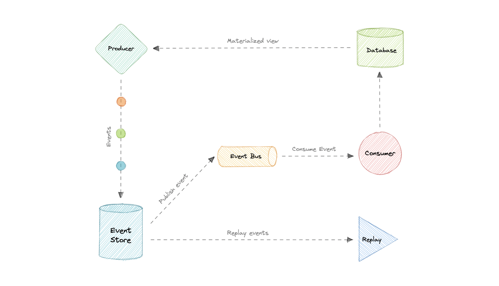

- This can simplify tasks in complex domains, by avoiding the need to synchronize the data model and the business domain, while improving performance, scalability, and responsiveness. 
- It can also provide consistency for transactional data, and maintain full audit trails and history that can enable compensating actions.

### Event sourcing vs Event-Driven Architecture (EDA)

- Event sourcing is seemingly constantly being confused with Event-driven Architecture (EDA). Event-driven architecture is about using events to communicate between service boundaries. Generally, leveraging a message broker to publish and consume events asynchronously within other boundaries.
- Whereas, event sourcing is about using events as a state, which is a different approach to storing data. Rather than storing the current state, we're instead going to be storing events. Also, event sourcing is one of the several patterns to implement an event-driven architecture.

### Advantages

Let's discuss some advantages of using event sourcing:

- Excellent for real-time data reporting.
- Great for fail-safety, data can be reconstituted from the event store.
- Extremely flexible, any type of message can be stored.
- Preferred way of achieving audit logs functionality for high compliance systems.

### Disadvantages

Following are the disadvantages of event sourcing:

- Requires an extremely efficient network infrastructure.
- Requires a reliable way to control message formats, such as a schema registry.
- Different events will contain different payloads.

## Command and Query Responsibility Segregation (CQRS)

- Command Query Responsibility Segregation (CQRS) is an architectural pattern that divides a system's actions into commands and queries. 

- In CQRS, a _command_ is an instruction, a directive to perform a specific task. It is an intention to change something and doesn't return a value, only an indication of success or failure. And, a _query_ is a request for information that doesn't change the system's state or cause any side effects.

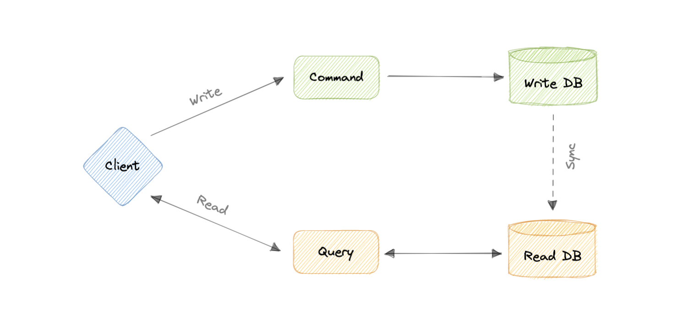

- The core principle of CQRS is the separation of commands and queries. They perform fundamentally different roles within a system, and separating them means that each can be optimized as needed, which distributed systems can really benefit from.

### CQRS with Event Sourcing

- The CQRS pattern is often used along with the Event Sourcing pattern. CQRS-based systems use separate read and write data models, each tailored to relevant tasks and often located in physically separate stores.

- When used with the Event Sourcing pattern, the store of events is the write model and is the official source of information. The read model of a CQRS-based system provides materialized views of the data, typically as highly denormalized views.

### Advantages

Let's discuss some advantages of CQRS:

- Allows independent scaling of read and write workloads.
- Easier scaling, optimizations, and architectural changes.
- Closer to business logic with loose coupling.
- The application can avoid complex joins when querying.
- Clear boundaries between the system behavior.

### Disadvantages

Below are some disadvantages of CQRS:

- More complex application design.
- Message failures or duplicate messages can occur.
- Dealing with eventual consistency is a challenge.
- Increased system maintenance efforts.

## Use cases

Here are some scenarios where CQRS will be helpful:

- The performance of data reads must be fine-tuned separately from the performance of data writes.
- The system is expected to evolve over time and might contain multiple versions of the model, or where business rules change regularly.
- Integration with other systems, especially in combination with event sourcing, where the temporal failure of one subsystem shouldn't affect the availability of the others.
- Better security to ensure that only the right domain entities are performing writes on the data.

## Enterprise Service Bus (ESB)

- An Enterprise Service Bus (ESB) is an architectural pattern whereby a centralized software component performs integrations between applications. 
- It performs transformations of data models, handles connectivity, performs message routing, converts communication protocols, and potentially manages the composition of multiple requests. The ESB can make these integrations and transformations available as a service interface for reuse by new applications.

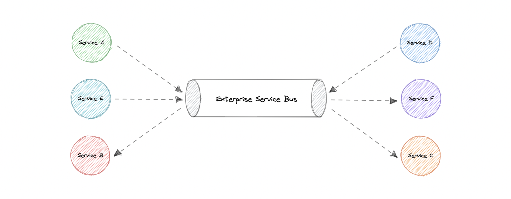

### Advantages

In theory, a centralized ESB offers the potential to standardize and dramatically simplify communication, messaging, and integration between services across the enterprise. Here are some advantages of using an ESB:

- **Improved developer productivity**: Enables developers to incorporate new technologies into one part of an application without touching the rest of the application.
- **Simpler, more cost-effective scalability**: Components can be scaled independently of others.
- **Greater resilience**: Failure of one component does not impact the others, and each microservice can adhere to its own availability requirements without risking the availability of other components in the system.

### Disadvantages

While ESBs were deployed successfully in many organizations, in many other organizations the ESB came to be seen as a bottleneck. Here are some disadvantages of using an ESB:

- Making changes or enhancements to one integration could destabilize others who use that same integration.
- A single point of failure can bring down all communications.
- Updates to the ESB often impact existing integrations, so there is significant testing required to perform any update.
- ESB is centrally managed which makes cross-team collaboration challenging.
- High configuration and maintenance complexity.

### Examples

Below are some widely used Enterprise Service Bus (ESB) technologies:

- [Azure Service Bus](https://azure.microsoft.com/en-in/services/service-bus)
- [IBM App Connect](https://www.ibm.com/in-en/cloud/app-connect)
- [Apache Camel](https://camel.apache.org)
- [Fuse ESB](https://www.redhat.com/en/technologies/jboss-middleware/fuse)

## Message Queues

- A message queue is a form of service-to-service communication that facilitates asynchronous communication. It asynchronously receives messages from producers and sends them to consumers.
- Queues are used to effectively manage requests in large-scale distributed systems. In small systems with minimal processing loads and small databases, writes can be predictably fast. However, in more complex and large systems writes can take an almost non-deterministic amount of time.

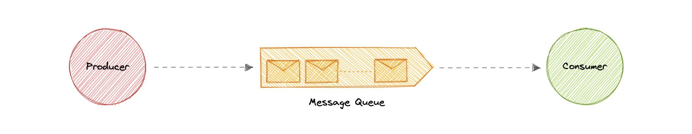

### Working

Messages are stored in the queue until they are processed and deleted. Each message is processed only once by a single consumer. Here's how it works:

- A producer publishes a job to the queue, then notifies the user of the job status.
- A consumer picks up the job from the queue, processes it, then signals that the job is complete.

### Advantages

Let's discuss some advantages of using a message queue:

- **Scalability**: Message queues make it possible to scale precisely where we need to. When workloads peak, multiple instances of our application can add all requests to the queue without the risk of collision.
- **Decoupling**: Message queues remove dependencies between components and significantly simplify the implementation of decoupled applications.
- **Performance**: Message queues enable asynchronous communication, which means that the endpoints that are producing and consuming messages interact with the queue, not each other. Producers can add requests to the queue without waiting for them to be processed.
- **Reliability**: Queues make our data persistent, and reduce the errors that happen when different parts of our system go offline.

### Features

Now, let's discuss some desired features of message queues:

#### Push or Pull Delivery

Most message queues provide both push and pull options for retrieving messages. Pull means continuously querying the queue for new messages. Push means that a consumer is notified when a message is available. We can also use long-polling to allow pulls to wait a specified amount of time for new messages to arrive.

#### FIFO (First-In-First-Out) Queues

In these queues, the oldest (or first) entry, sometimes called the _"head"_ of the queue, is processed first.

#### Schedule or Delay Delivery

Many message queues support setting a specific delivery time for a message. If we need to have a common delay for all messages, we can set up a delay queue.

#### At-Least-Once Delivery

Message queues may store multiple copies of messages for redundancy and high availability, and resend messages in the event of communication failures or errors to ensure they are delivered at least once.

#### Exactly-Once Delivery

When duplicates can't be tolerated, FIFO (first-in-first-out) message queues will make sure that each message is delivered exactly once (and only once) by filtering out duplicates automatically.

#### Dead-letter Queues

A dead-letter queue is a queue to which other queues can send messages that can't be processed successfully. This makes it easy to set them aside for further inspection without blocking the queue processing or spending CPU cycles on a message that might never be consumed successfully.

#### Ordering

Most message queues provide best-effort ordering which ensures that messages are generally delivered in the same order as they're sent and that a message is delivered at least once.

#### Poison-pill Messages

Poison pills are special messages that can be received, but not processed. They are a mechanism used in order to signal a consumer to end its work so it is no longer waiting for new inputs, and are similar to closing a socket in a client/server model.

#### Security

Message queues will authenticate applications that try to access the queue, this allows us to encrypt messages over the network as well as in the queue itself.

#### Task Queues

Tasks queues receive tasks and their related data, run them, then deliver their results. They can support scheduling and can be used to run computationally-intensive jobs in the background.

### Backpressure

If queues start to grow significantly, the queue size can become larger than memory, resulting in cache misses, disk reads, and even slower performance. Backpressure can help by limiting the queue size, thereby maintaining a high throughput rate and good response times for jobs already in the queue. Once the queue fills up, clients get a server busy or HTTP 503 status code to try again later. Clients can retry the request at a later time, perhaps with [exponential backoff](https://en.wikipedia.org/wiki/Exponential_backoff) strategy.

### Examples

Following are some widely used message queues:

- [Amazon SQS](https://aws.amazon.com/sqs)
- [RabbitMQ](https://www.rabbitmq.com)
- [ActiveMQ](https://activemq.apache.org)
- [ZeroMQ](https://zeromq.org)

## Message Brokers

- A message broker is a software that enables applications, systems, and services to communicate with each other and exchange information. The message broker does this by translating messages between formal messaging protocols. This allows interdependent services to _"talk"_ with one another directly, even if they were written in different languages or implemented on different platforms.

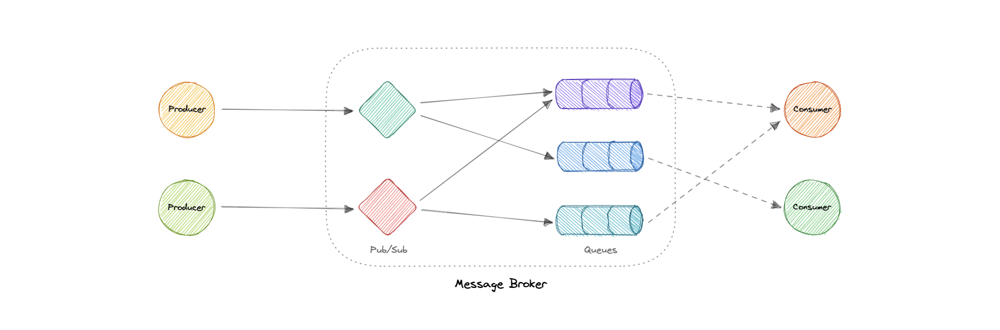

- Message brokers can validate, store, route, and deliver messages to the appropriate destinations. They serve as intermediaries between other applications, allowing senders to issue messages without knowing where the receivers are, whether or not they are active, or how many of them there are. This facilitates the decoupling of processes and services within systems.

### Models

Message brokers offer two basic message distribution patterns or messaging styles:

- **Point-to-Point messaging**: This is the distribution pattern utilized in message queues with a one-to-one relationship between the message's sender and receiver.
- **Publish-Subscribe messaging**: In this message distribution pattern, often referred to as _"pub/sub"_, the producer of each message publishes it to a topic, and multiple message consumers subscribe to topics from which they want to receive messages.

### Message brokers vs Event streaming

- Message brokers can support two or more messaging patterns, including message queues and pub/sub, while event streaming platforms only offer pub/sub-style distribution patterns. Designed for use with high volumes of messages, event streaming platforms are readily scalable. They're capable of ordering streams of records into categories called _topics_ and storing them for a predetermined amount of time. Unlike message brokers, however, event streaming platforms cannot guarantee message delivery or track which consumers have received the messages.

- Event streaming platforms offer more scalability than message brokers but fewer features that ensure fault tolerance like message resending, as well as more limited message routing and queueing capabilities.

### Message brokers vs Enterprise Service Bus (ESB)

- Enterprise Service Bus (ESB) infrastructure is complex and can be challenging to integrate and expensive to maintain. It's difficult to troubleshoot them when problems occur in production environments, they're not easy to scale, and updating is tedious.

- Whereas message brokers are a _"lightweight"_ alternative to ESBs that provide similar functionality, a mechanism for inter-service communication, at a lower cost. They're well-suited for use in the microservices architectures that have become more prevalent as ESBs have fallen out of favor.

### Examples

Here are some commonly used message brokers:

- [NATS](https://nats.io)
- [Apache Kafka](https://kafka.apache.org)
- [RabbitMQ](https://www.rabbitmq.com)
- [ActiveMQ](https://activemq.apache.org)

## Synchronous vs. asynchronous communications: The differences

- In synchronous communications, multiple parties continually listen for and act upon replies from each other. Both the sender and receiver establish a communications session. Once the session is established, the two-way conversation takes place with no restrictions on who inputs information when.
- In asynchronous communication, parties do not actively listen for messages. Asynchronous communications typically incur a delay between when the sender initiates the message and when the recipient responds. In fact, either receiving end may be completely unaware of who exactly they are interacting with.

- When a software component communicates synchronously, it sits idle until it receives a call, response, value or other data transfer.
- Conversely, asynchronous communication allows code to continue to run after it has generated a call or response.

- Synchronous communication is simpler in design but carries the risk of spreading failures across services. To mitigate that risk, the architect must implement sophisticated service discovery and application load balancing among microservices.
- On the other hand, asynchronous communication trades architectural simplicity and data consistency for resilience and scalability. Asynchronous designs often provide better control over failures than synchronous setups.

Communications between services in a microservices architecture can be:

* **Decentralized and synchronous** - In a decentralized and synchronous communications pattern, each service receives flow control, makes subsequent synchronous calls to other services and passes control to the next service.
* **Choreographed and asynchronous** - In choreographed and asynchronous service communications, however, the service publishes events to a central message queue that distributes those events.
* **Orchestrated and synchronous/asynchronous** - The orchestrator sequences the various service calls based on a defined workflow. That sequence is not embedded within the participating services. The business workflow knowledge resides in a centralized place, and the services focus solely on their individual responsibilities.

# Big-Data Architecture

- A big data architecture is designed to handle the ingestion, processing, and analysis of data that is too large or complex for traditional database systems.
- Big data solutions typically involve one or more of the following types of workload:
  - Batch processing of big data sources at rest.
  - Real-time processing of big data in motion.
  - Interactive exploration of big data.
  - Predictive analytics and machine learning.

  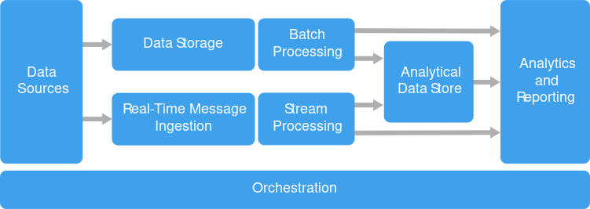

Most big data architectures include some or all of the following components:

- **Data sources:** All big data solutions start with one or more data sources. Examples include:

    - Application data stores, such as relational databases.
    - Static files produced by applications, such as web server log files.
    - Real-time data sources, such as IoT devices.
    
**Data storage:** Data for batch processing operations is typically stored in a distributed file store that can hold high volumes of large files in various formats. This kind of store is often called a data lake. Options for implementing this storage include Azure Data Lake Store or blob containers in Azure Storage.

**Batch processing:** Because the data sets are so large, often a big data solution must process data files using long-running batch jobs to filter, aggregate, and otherwise prepare the data for analysis. Usually these jobs involve reading source files, processing them, and writing the output to new files. Options include running U-SQL jobs in Azure Data Lake Analytics, using Hive, Pig, or custom Map/Reduce jobs in an HDInsight Hadoop cluster, or using Java, Scala, or Python programs in an HDInsight Spark cluster.

**Real-time message ingestion:** If the solution includes real-time sources, the architecture must include a way to capture and store real-time messages for stream processing. This might be a simple data store, where incoming messages are dropped into a folder for processing. However, many solutions need a message ingestion store to act as a buffer for messages, and to support scale-out processing, reliable delivery, and other message queuing semantics. Options include Azure Event Hubs, Azure IoT Hubs, and Kafka.

**Stream processing:** After capturing real-time messages, the solution must process them by filtering, aggregating, and otherwise preparing the data for analysis. The processed stream data is then written to an output sink. Azure Stream Analytics provides a managed stream processing service based on perpetually running SQL queries that operate on unbounded streams. You can also use open source Apache streaming technologies like Spark Streaming in an HDInsight cluster.

**Analytical data store:** Many big data solutions prepare data for analysis and then serve the processed data in a structured format that can be queried using analytical tools. The analytical data store used to serve these queries can be a Kimball-style relational data warehouse, as seen in most traditional business intelligence (BI) solutions. Alternatively, the data could be presented through a low-latency NoSQL technology such as HBase, or an interactive Hive database that provides a metadata abstraction over data files in the distributed data store. Azure Synapse Analytics provides a managed service for large-scale, cloud-based data warehousing. HDInsight supports Interactive Hive, HBase, and Spark SQL, which can also be used to serve data for analysis.

**Analysis and reporting:** The goal of most big data solutions is to provide insights into the data through analysis and reporting. To empower users to analyze the data, the architecture may include a data modeling layer, such as a multidimensional OLAP cube or tabular data model in Azure Analysis Services. It might also support self-service BI, using the modeling and visualization technologies in Microsoft Power BI or Microsoft Excel. Analysis and reporting can also take the form of interactive data exploration by data scientists or data analysts. For these scenarios, many Azure services support analytical notebooks, such as Jupyter, enabling these users to leverage their existing skills with Python or R. For large-scale data exploration, you can use Microsoft R Server, either standalone or with Spark.

**Orchestration:** Most big data solutions consist of repeated data processing operations, encapsulated in workflows, that transform source data, move data between multiple sources and sinks, load the processed data into an analytical data store, or push the results straight to a report or dashboard. To automate these workflows, you can use an orchestration technology such Azure Data Factory or Apache Oozie and Sqoop.

## When to use this architecture

- To Store and process data in volumes too large for a traditional database.
- To Transform unstructured data for analysis and reporting.
- To Capture, process, and analyze unbounded streams of data in real time, or with low latency.

## Batch processing vs Stream Processing

| Criteria                    | Batch Processing                                                                | Stream Processing                                                                   |
|-----------------------------|---------------------------------------------------------------------------------|-------------------------------------------------------------------------------------|
| Nature of Data              | Processed in chunks or batches.                                                 | Processed continuously, one event at a time.                                        |
| Latency                     | High latency: insights are obtained after the entire batch is processed.        | Low latency: insights are available almost immediately or in near-real-time.        |
| Processing Time             | Scheduled (e.g., daily, weekly).                                                | Continuous.                                                                         |
| Infrastructure Needs        | Significant resources might be required but can be provisioned less frequently. | Requires systems to be always on and resilient.                                     |
| Throughput                  | High: can handle vast amounts of data at once.                                  | Varies: optimized for real-time but might handle less data volume at a given time.  |
| Complexity                  | Relatively simpler as it deals with finite data chunks.                         | More complex due to continuous data flow and potential order or consistency issues. |
| Ideal Use Cases             | Data backups, ETL jobs, monthly reports.                                        | Real-time analytics, fraud detection, live dashboards.                              |
| Error Handling              | Detected after processing the batch; might need to re-process data.             | Needs immediate error-handling mechanisms; might also involve later corrections.    |
| Consistency &  Completeness | Data is typically complete and consistent when processed.                       | Potential for out-of-order data or missing data points.                             |
| Tools & Technologies        | Hadoop, Apache Hive, batch-oriented Apache Spark.                               | Apache Kafka, Apache Flink, Apache Storm.                                           |
