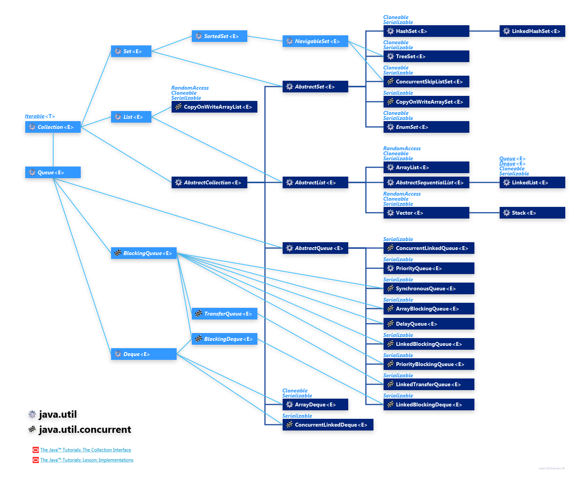

https://www.digitalocean.com/community/tutorials/java-collections-interview-questions-and-answers#what-is-unsupportedoperationexception

References

https://www.digitalocean.com/community/tutorials/collections-in-java-tutorial
https://www.youtube.com/watch?v=VE_AAUxTUCY
https://naveen-metta.medium.com/navigating-the-depths-of-java-collections-a-comprehensive-journey-into-the-heart-of-data-26ba9f149614
https://www.scaler.com/topics/java/collections-in-java/
https://levelup.gitconnected.com/java-collections-framework-class-hierarchy-latest-2024-51f9154f1f57
https://medium.com/@dakota.lillie/javas-collections-framework-an-overview-86de12f4f622
https://www.uml-diagrams.org/java-7-concurrent-uml-class-diagram-example.html

# Collections Framework

- Before Collection Framework(or before JDK 1.2) was introduced, the standard methods for grouping Java objects (or collections) were Arrays or Vectors, or HashTables (known as legacy classes). All of these collections had no common interface.
- The implementation of all these collections was defined independently and had no correlation among them. And also, it is very difficult for the users to remember all the different methods, syntax, and constructors present in every collection class.

- The Collections framework provides
  - uniform and consistent API by having common interfaces
  - lessened effort for programming
  - high performance and efficiency of programs

## Iterable and Collection Interfaces, and Abstract Classes

- **Iterable Interface:** This interface represents a collection of elements that can be iterated over, meaning you can access each element one by one. It is a base interface that enables the use of the for-each loop and other iteration constructs in Java. It contains the iterator(); the method that returns an `Iterator<T>` object and `hasNext()` and `next()` methods of Iterator can be used for traversal and retrieval of the objects. It is the root interface for the entire collection framework
- **Collection Interface:** This interface contains all the basic methods which every collection has like adding the data into the collection, removing the data, clearing the data, etc. All these methods are implemented in this interface because these methods are implemented by all the classes irrespective of their style of implementation. 

https://www.geeksforgeeks.org/iterable-interface-in-java/
https://www.geeksforgeeks.org/collection-interface-in-java-with-examples/

Sub-interfaces extending Collection: List, Set, Queue

## List Interface

## Queue Interface

## Set Interface

## Map
Creating an adjacency list for graph questions using HashMap
# Internal Implementation of HashMap and HashSet

# Internal Implementation of LinkedHashMap

# Comparable vs Comparator

# Concurrent Collections

##
