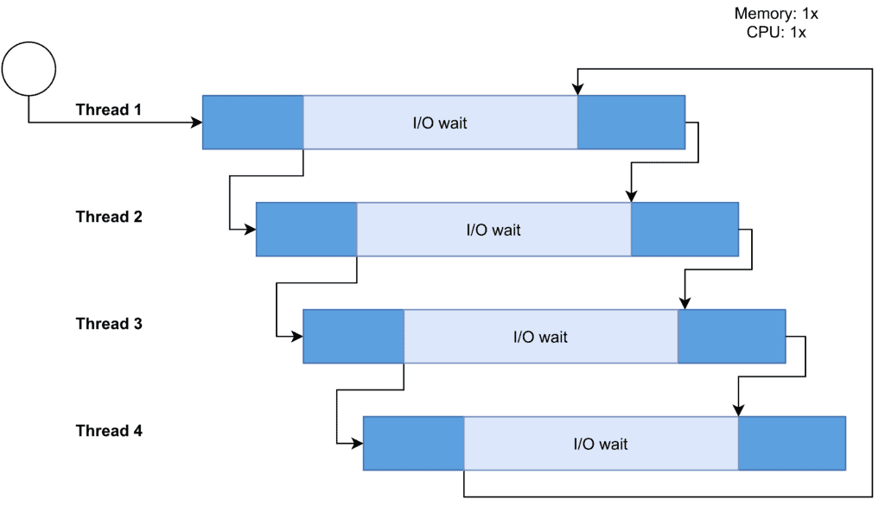
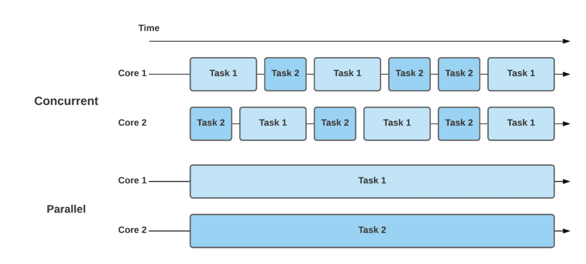
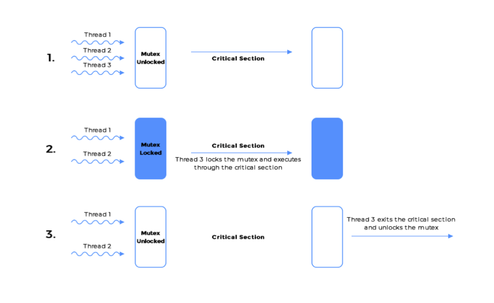
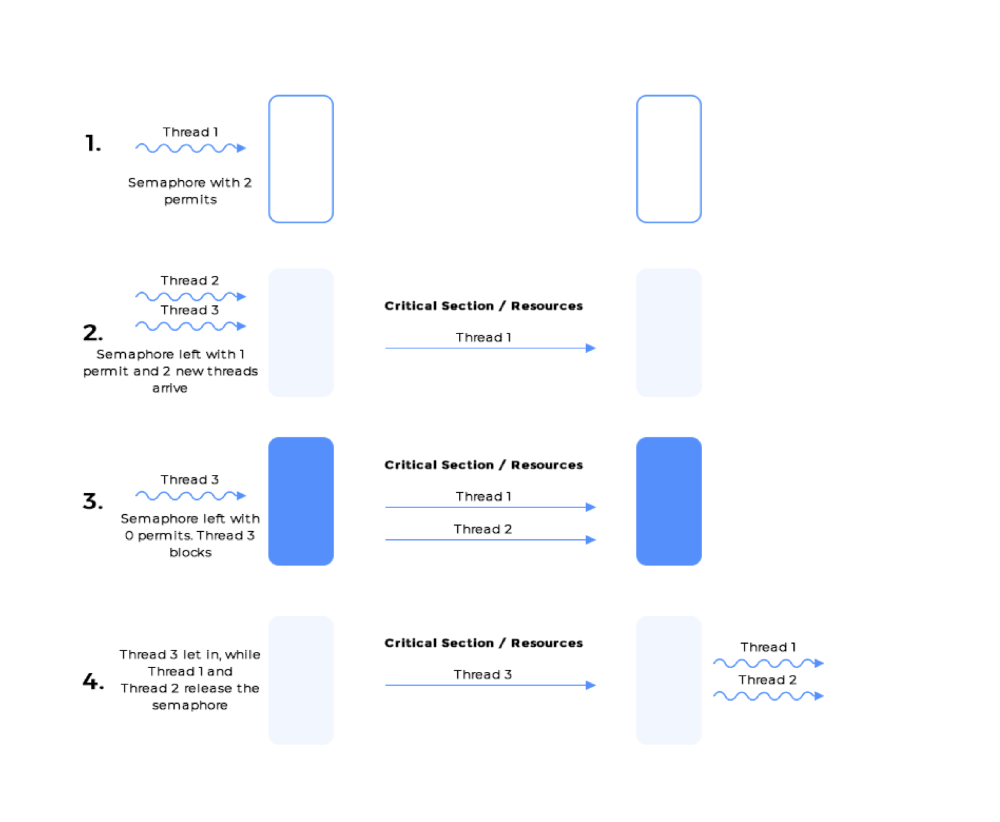
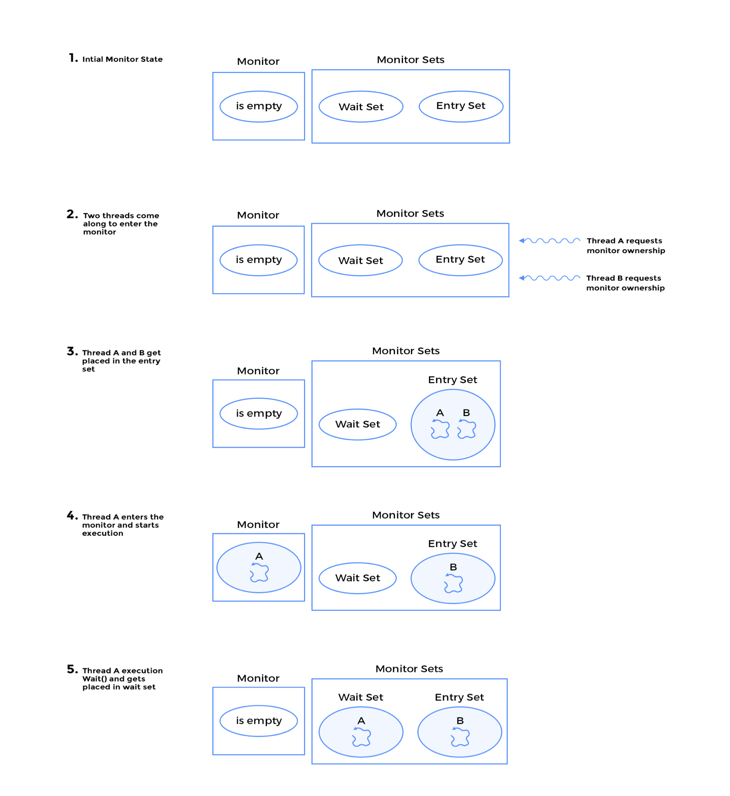
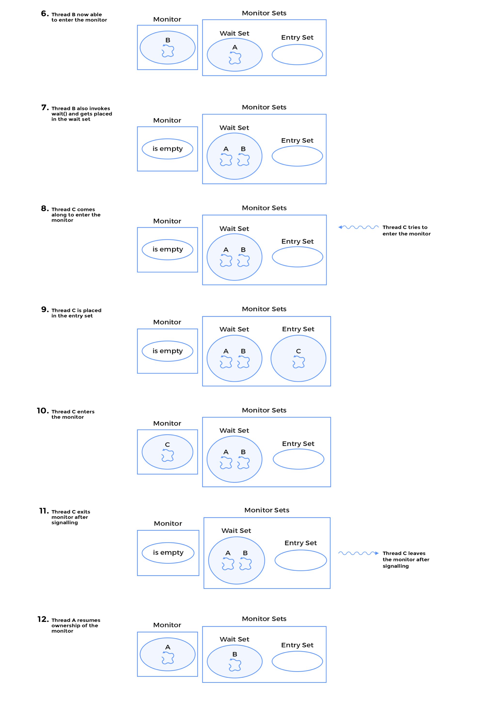
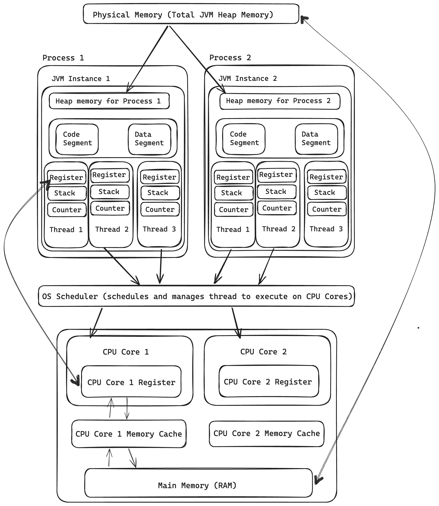
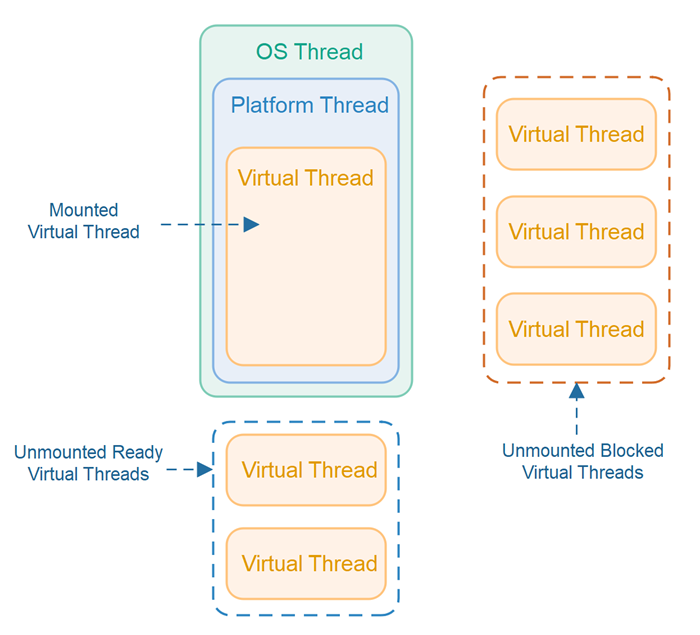

<!-- TOC start (generated with https://github.com/derlin/bitdowntoc) -->

- [Introduction to Concurrency](#introduction-to-concurrency)
  * [Program vs Process vs Thread](#program-vs-process-vs-thread)
  * [Concurrency vs Parallelism](#concurrency-vs-parallelism)
  * [Preemptive multitasking vs Cooperative multitasking](#preemptive-multitasking-vs-cooperative-multitasking)
  * [Synchronous vs Asynchronous execution](#synchronous-vs-asynchronous-execution)
  * [CPU Bound vs I/O Bound Programs](#cpu-bound-vs-io-bound-programs)
  * [Throughput and Latency](#throughput-and-latency)
  * [Context Switching](#context-switching)
  * [Multithreading : Definition, Benefits and Cost](#multithreading-definition-benefits-and-cost)
  * [Concurrency Models](#concurrency-models)
  * [Same-Threading, Single-Threaded Concurrency](#same-threading-single-threaded-concurrency)
  * [Mutex vs Semaphore vs Monitor](#mutex-vs-semaphore-vs-monitor)
  * [Amdahls law and Moores Law](#amdahls-law-and-moores-law)
- [Java Memory Model for Threads](#java-memory-model-for-threads)
  * [User Thread vs Kernel Thread](#user-thread-vs-kernel-thread)
  * [The "happens before relationship" model](#the-happens-before-relationship-model)
- [Basics of Java Multithreading](#basics-of-java-multithreading)
  * [Thread Creation](#thread-creation)
  * [Thread Lifecycle and States](#thread-lifecycle-and-states)
  * [InterThread Communication](#interthread-communication)
  * [Thread Joining](#thread-joining)
  * [Thread Safety and shared resources, Synchronization in Java](#thread-safety-and-shared-resources-synchronization-in-java)
  * [Race Conditions and Critical Sections](#race-conditions-and-critical-sections)
  * [Producer-Consumer Problem](#producer-consumer-problem)
  * [CPU Cache coherence](#cpu-cache-coherence)
  * [Java Virtual Threads](#java-virtual-threads)
- [Atomic Operations](#atomic-operations)
  * [Compare-and-Swap Operations](#compare-and-swap-operations)
  * [AtomicInteger, AtomicLong, AtomicBoolean, AtomicReference](#atomicinteger-atomiclong-atomicboolean-atomicreference)
- [Locks and Semaphores](#locks-and-semaphores)
  * [Difference between Locks and Synchronized blocks/methods](#difference-between-locks-and-synchronized-blocksmethods)
  * [Lock Interface](#lock-interface)
- [Advanced Multithreading and Java Concurrency Utilities](#advanced-multithreading-and-java-concurrency-utilities)
  * [ThreadPools, Executors and ExecutorService, ThreadPoolExecutor, ScheduledExecutorService](#threadpools-executors-and-executorservice-threadpoolexecutor-scheduledexecutorservice)
  * [Fork/Join Framework](#forkjoin-framework)
  * [Callable and Future Interface](#callable-and-future-interface)
  * [CompletableFuture](#completablefuture)
  * [ThreadLocal](#threadlocal)
  * [CountDownLatch, CyclicBarrier, Phaser, and Exchanger](#countdownlatch-cyclicbarrier-phaser-and-exchanger)
  * [Non-Blocking synchronization](#non-blocking-synchronization)
- [Concurrent Collections](#concurrent-collections)
  * [Best Practices and Patterns](#best-practices-and-patterns)
- [Common Concurrency Issues and Solutions](#common-concurrency-issues-and-solutions)
- [Java 9+ features](#java-9-features)

<!-- TOC end -->


<!-- TOC --><a name="introduction-to-concurrency"></a>
# Introduction to Concurrency

<!-- TOC --><a name="program-vs-process-vs-thread"></a>
## Program vs Process vs Thread

- A program is a set of instructions and associated data that resides on the disk and is loaded by the operating system to perform some task. An executable file or a python script file are examples of programs. In order to run a program, the operating system's kernel is first asked to create a new process, which is an environment in which a program executes.
- A process is a program in execution. A process is an execution environment that consists of instructions, user-data, and system-data segments, as well as lots of other resources such as CPU, memory, addressspace, disk and network I/O acquired at runtime. A program can have several copies of it running at the same time but a process necessarily belongs to only one program.
- Thread is the smallest unit of execution in a process. A thread simply executes instructions serially. A process can have multiple threads running as part of it. Usually, there would be some state associated with the process that is shared among all the threads and in turn each thread would have some state private to itself. The globally shared state among the threads of a process is visible and accessible to all the threads, and special attention needs to be paid when any thread tries to read or write to this global shared state.

<!-- TOC --><a name="concurrency-vs-parallelism"></a>
## Concurrency vs Parallelism

- **Serial Execution:** When programs are serially executed, they are scheduled one at a time on the CPU. Once a task gets completed, the next one gets a chance to run. Each task is run from the beginning to the end without interruption.
- **Concurrency:**
  - A concurrent program is one that can be decomposed into constituent parts and each part can be executed out of order or in partial order without affecting the final outcome.
  - A system capable of running several distinct programs or more than one independent unit of the same program in overlapping time intervals is called a concurrent system. The execution of two programs or units of the same program may not happen simultaneously.
  - A concurrent system can have two programs in progress at the same time where progress doesn't imply execution. One program can be suspended while the other executes. Both programs are able to make progress as their execution is interleaved.
  - Concurrency is achieved through the interleaving operation of processes on the central processing unit(CPU) or in other words by the context switching.
  - In concurrent systems, the goal is to maximize throughput and minimize latency. While the current thread or process is waiting for input-output operations, database transactions, or launching an external program, another process or thread receives the CPU allocation. On the kernel side, the OS sends an interrupt to the active task to stop it:




- Concurrent systems achieve lower latency and higher throughput when programs running on the system require frequent network or disk I/O.
- The classic example of a concurrent system is that of an operating system running on a single core machine. Such an operating system is concurrent but not parallel.
- It can only process one task at any given point in time but all the tasks being managed by the operating system appear to make progress because the operating system is designed for concurrency. Each task gets a slice of the CPU time to execute and move forward.

- **Parallelism:**
  - A parallel system is one which necessarily has the ability to execute multiple programs at the same time. Usually, this capability is aided by hardware in the form of multicore processors on individual machines or as computing clusters where several machines are hooked up to solve independent pieces of a problem simultaneously.
  - Note, an individual problem has to be concurrent in nature, that is portions of it can be worked on independently without affecting the final outcome before it can be executed in parallel.
  - In parallel systems the emphasis is on increasing throughput and optimizing usage of hardware resources. The goal is to extract out as much computation speedup as possible.


**Concurrency vs Parallelism**

- A concurrent system need not be parallel, whereas a parallel system is indeed concurrent.
- A system can be both concurrent and parallel e.g. a multitasking operating system running on a multicore machine.
- Concurrency is as a property of a program or a system whereas parallelism as a runtime behaviour of executing multiple tasks.
- **Example :**
  - There are two cores and two tasks. In a concurrent approach, each core is executing both tasks by switching among them over time. In contrast, the parallel approach doesn’t switch among tasks, but instead executes them in parallel over time:




- Issues while designing concurrent systems : deadlocks, race conditions, or starvation.
- Issues while designing parallel systems : memory corruption, leaks, or errors.

<!-- TOC --><a name="preemptive-multitasking-vs-cooperative-multitasking"></a>
## Preemptive multitasking vs Cooperative multitasking

- Computer multitasking means that a computer system enables multiple (and generally different) tasks to execute concurrently over a certain period. Processes and threads are execution instances of these tasks.
- A multitasking operating system can schedule threads of a process (kernel threads) or schedule a process that, in turn, manages the execution of its own threads (user threads). In the latter case, the scheduler is unaware of user threads, and the process must employ a thread library to coordinate their execution.
- A system can achieve concurrency by employing one of the following multitasking models: **1. Preemptive Multitasking** or **2. Cooperative Multitasking**

**Preemptive multitasking**

- In preemptive multitasking, the operating system preempts a program to allow another waiting task to run on the CPU.
- Programs or threads can't decide how long for or when they can use the CPU. The operating system’s scheduler decides which thread or program gets to use the CPU next and for how much time.
- Furthermore, scheduling of programs or threads on the CPU isn’t predictable. A thread or program once taken off of the CPU by the scheduler can't determine when it will get on the CPU next.
- As a consequence, if a malicious program initiates an infinite loop, it only hurts itself without affecting other programs or threads. Lastly, the programmer isn't burdened to decide when to give up control back to the CPU in code.
- Preemptive multitasking has always been a core feature of Unix based systems.

**Cooperative multitasking**

- Cooperative Multitasking involves well-behaved programs to voluntarily give up control back to the scheduler so that another program can run.
- A program or thread may give up control after a period of time has expired or if it becomes idle or logically blocked.
- The operating system’s scheduler has no say in how long a program or thread runs for.
- A malicious program can bring the entire system to a halt by busy waiting or running an infinite loop and not giving up control.
- The process scheduler for an operating system implementing cooperative multitasking is called a cooperative scheduler. As the name implies, the participating programs or threads are required to cooperate to make the scheduling scheme work.


<!-- TOC --><a name="synchronous-vs-asynchronous-execution"></a>
## Synchronous vs Asynchronous execution

**Synchronous Execution**

- Synchronous execution refers to line-by-line execution of code. If a function is invoked, the program execution waits until the function call is completed.
- Synchronous execution blocks at each method call before proceeding to the next line of code.
- A program executes in the same sequence as the code in the source code file.
- Synchronous execution is synonymous to serial execution.

**Asynchronous Execution**

- Asynchronous programming is a means of parallel programming in which a unit of work runs separately from the main application thread and notifies the calling thread of its completion, failure or progress.
- An asynchronous program doesn’t wait for a task to complete and can move on to the next task.
- In contrast to synchronous execution, asynchronous execution doesn't necessarily execute code line by line, that is instructions may not run in the sequence they appear in the code.
- Async execution can invoke a method and move onto the next line of code without waiting for the invoked function to complete or receive its result.
- Usually, such methods return an entity sometimes called a future or promise that is a representation of an in-progress computation. The program can query for the status of the computation via the returned future or promise and retrieve the result once completed.
- Another pattern is to pass a callback function to the asynchronous function call which is invoked with the results when the asynchronous function is done processing. Asynchronous programming is an excellent choice for applications that do extensive network or disk I/O and spend most of their time waiting.
- In non-threaded environments, asynchronous programming provides an alternative to threads in order to achieve concurrency and fall under the cooperative multitasking model.

<!-- TOC --><a name="cpu-bound-vs-io-bound-programs"></a>
## CPU Bound vs I/O Bound Programs

- Programs utilize various resources of the computer systems on which they run. For instance a program running on your machine will broadly require:
  - CPU Time
  - Memory
  - Networking Resources, Disk Storage
- Depending on what a program does, it can require heavier use of one or more resources.
- For instance, a program that loads gigabytes of data from storage into main memory would hog the main memory of the machine it runs on.
- Another can be writing several gigabytes to permanent storage, requiring abnormally high disk i/o.


**CPU Bound**

- Programs which are compute-intensive i.e. program execution requires very high utilization of the CPU (close to 100%) are called CPU bound programs. Such programs primarily depend on improving CPU speed to decrease program completion time.
- This could include programs such as data crunching, image processing, matrix multiplication etc.
- If a CPU bound program is provided a more powerful CPU it can potentially complete faster. Eventually, there is a limit on how powerful a single CPU can be.
- At this point, the recourse is to harness the computing power of multiple CPUs and structure your program code in a way that can take advantage of the multiple CPU units available.
- Example : Sum of natural numbers from 1 to 1000000.
- A single-threaded program would sum in a single loop from 1 to 1000000. To cut down on execution time, we can create two threads and divide the range into two halves. The first thread sums the numbers from 1 to 500000 and the second sums the numbers from 500001 to 1000000.
- If there are two processors available on the machine, then each thread can independently run on a single CPU in parallel. In the end, we sum the results from the two threads to get the final result.
- Theoretically, the multithreaded program should finish in half the time that it takes for the single-threaded program. However, there will be a slight overhead of creating the two threads and merging the results from the two threads.


**I/O Bound**

- I/O bound programs are the opposite of CPU bound programs. Such programs spend most of their time waiting for input or output operations to complete while the CPU sits idle.
- I/O operations can consist of operations that write or read from main memory or network interfaces. Because the CPU and main memory are physically separate a data bus exists between the two to transfer bits to and fro. Similarly, data needs to be moved between network interfaces and CPU/memory.
- Even though the physical distances are tiny, the time taken to move the data across is big enough for several thousand CPU cycles to go waste. This is why I/O bound programs would show relatively lower CPU utilization than CPU bound programs.

**Some key points**

- Both types of programs can benefit from concurrent architectures.
- If a program is CPU bound we can increase the number of processors and structure our program to spawn multiple threads that individually run on a dedicated or shared CPU.
- For I/O bound programs, it makes sense to have a thread give up CPU control if it is waiting for an I/O operation to complete so that another thread can get scheduled on the CPU and utilize CPU cycles.
- Different programming languages come with varying support for multithreading. For instance, Javascript is single-threaded, Java provides full-blown multithreading and Python is sort of multithreaded as it can only have a single thread in running state because of its global interpreter lock (GIL) limitation.
- However, all three languages support asynchronous programming models which is another way for programs to be concurrent (but not parallel).
- There are also memory-bound programs that depend on the amount of memory available to speed up execution.


<!-- TOC --><a name="throughput-and-latency"></a>
## Throughput and Latency

- Throughput is defined as the rate of doing work or how much work gets done per unit of time.
- Latency is defined as the time required to complete a task or produce a result. Latency is also referred to as response time.
- In the context of concurrency, throughput can be thought of as time taken to execute a program or computation.
- For example, imagine a program that is given hundreds of files containing integers and asked to sum up all the numbers. Since addition is commutative each file can be worked on in parallel.
- In a single-threaded environment, each file will be sequentially processed but in a concurrent system, several threads can work in parallel on distinct files. Of course, there will be some overhead to manage the state including already processed files. However, such a program will complete the task much faster than a single thread.
- The performance difference will become more and more apparent as the number of input files increases.
- The throughput in this example can be defined as the number of files processed by the program in a minute.
- And latency can be defined as the total time taken to completely process all the files.
- As one can observe in a multithreaded implementation throughput will go up and latency will go down. More work gets done in less amount of time. In general, the two have an inverse relationship.


<!-- TOC --><a name="context-switching"></a>
## Context Switching

- Context switch is a system event in which the operating system or the OS removes the executing job (thread) from the CPU and allocates it to another task. It involves saving the context (local data, program pointers, etc. of the thread) of the switched-out process (or thread) and loading the context of the one taking over.
- The OS ensures a switch is seamless, fast, and free from conflicts or dependency. Thus, context switching is vital for multitasking and user responsiveness.
- Context switching is always an overhead, and it is not cheap. It is a resource and CPU intensive process, as the OS has to allocate memory for the thread stack and CPU time for context switches.


<!-- TOC --><a name="multithreading-definition-benefits-and-cost"></a>
## Multithreading : Definition, Benefits and Cost

- Multithreading is a CPU (central processing unit) feature that allows two or more instruction threads to execute independently while sharing the same process resources. A thread is a self-contained sequence of instructions that can execute in parallel with other threads that are part of the same root process.
- Multithreading can improve the performance and efficiency of a program by utilizing the available CPU resources more effectively. Executing multiple threads concurrently, it can take advantage of parallelism and reduce overall execution time.
- Multithreading can enhance responsiveness in applications that involve user interaction. By separating time-consuming tasks from the main thread, the user interface can remain responsive and not freeze or become unresponsive.
- Multithreading can facilitate better code organization and modularity by dividing complex tasks into smaller, manageable units of execution. Each thread can handle a specific part of the task, making the code easier to understand and maintain.
- Some costs/drawbacks of multithreading:
  - **Debugging:** Multithreaded code can be complex and difficult to debug and maintain, especially with more threads.
  - **Context Switching overhead:** Context switching can become a memory/resource intensive operation for OS if more than necessary threads are spawned from the main thread.
  - **Resource Contention:** If many threads try to access the same data, then there is a chance that the situation of thread starvation may arise.
  - **System Load:** Creating threads can put a load on the system in terms of memory and CPU resources.
  - **Concurrency Issues:** Multithreading can lead to concurrency issues like deadlocks, race conditions, and thread interference if threads aren't properly synchronized. These issues can cause system failure.


<!-- TOC --><a name="concurrency-models"></a>
## Concurrency Models

- A concurrency model specifies how threads in the system collaborate to complete the tasks they are given along with proper synchronization to prevent partial reading or writing of the final value in the program which is running in the system. Different concurrency models split the tasks in different ways, and the threads may communicate and collaborate in different ways.
- Shared-state model means that the different threads in the system will share some state among them. By state is meant some data, typically one or more objects or even primitives. In a shared state model, some issues that may arise are race conditions and dead locks due to synchronization. As more threads increase in the system, it becomes more complex to manage the state/object access control, debugging, etc.
- Independent-state model means that the different threads in the system do not share any state among them. This is a preferred approach, as threads work on independent copies of data. In case the different threads need to communicate, they do so either by exchanging immutable objects among them, or by sending copies of objects (or data) among them. Thus, no two threads write to the same object (data / state).

- Broadly they are categorised into :
  - **Parallel workers model** (also called shared memory model, as concurrent modules interact by reading and writing shared objects in memory.)
  - **Assembly Line model** (also called message passing model, or reactive model or event driven model, as concurrent modules interact by sending messages to each other through a communication channel. Modules send off messages, and incoming messages to each module are queued up for handling. No shared states in this type of model)
- In the parallel workers concurrency model a delegator distributes the incoming jobs to different workers. Each worker completes the full job. The workers work in parallel, running in different threads, and possibly on different CPUs. The parallel workers concurrency model can be designed to use both shared state or separate state, meaning the workers either has access to some shared state (shared objects or data), or they have no shared state.
- Advantages Of Parallel Workers Model:
  - It is easy to implement and easy to understand.
  - If the amount of work is high or more then to decrease the time complexity or to decrease the execution time more workers can be added to increase the work parallelly.
- Disadvantages Of Parallel Workers Model:
  - Shared State Can Get Complex - part of the parallelization is lost when threads are waiting for each other when accessing the shared data structures.
  - Stateless Workers - Workers need to re-read the shared state data to make sure they are working on the latest copy. Re-reading data every time can get slow, especially if the state is stored in an external database.
  - Another disadvantage of the parallel worker model is that the job execution order is nondeterministic. There is no way to guarantee which jobs are executed first or last. Job A may be given to a worker before job B, yet job B may be executed before job A. The nondeterministic nature of the parallel worker model makes it hard to reason about the state of the system at any given point in time.
- In assembly line concurrency model, the workers are organized like workers at an assembly line in a factory. Each worker only performs a part of the full job. When that part is finished the worker forwards the job to the next worker.
- Systems using the assembly line concurrency model are usually designed to use non-blocking IO. Non-blocking IO means that when a worker starts an IO operation (e.g. reading a file or data from a network connection) the worker does not wait for the IO call to finish. A worker does as much as it can until it has to start an IO operation. Then it gives up control over the job. When the IO operation finishes the result of the IO operation ( e.g. data read or status of data written) is passed on to the next worker in the assembly line who continues working on the job, until that too has to start an IO operation etc.
- In reality hybrid of above models are followed.
- Reactive , Event driven systems use assembly line model. Actors vs channels are another sub-types in it.


<!-- TOC --><a name="same-threading-single-threaded-concurrency"></a>
## Same-Threading, Single-Threaded Concurrency

- Single-threaded systems do not share any state (objects / data) with other threads. This enables the single thread to use non-concurrent data structures, and utilize the CPU and CPU caches better. Unfortunately, single-threaded systems do not fully utilize modern CPUs (all the cores).
- Same-threading is Single-threading Scaled Out. In order to utilize all the cores in the CPU, a single-threaded system can be scaled out to utilize the whole computer. Same-threaded systems usually has 1 thread running per CPU in the computer.
- The difference between a same-threaded and a traditional multi-threaded system is that the threads in a same-threaded system do not share state. Same-threaded basically means that data processing stays within the same thread, and that no threads in a same-threaded system share data concurrently.
- A same-threaded system needs to share the work load between the single-threaded instances running on each CPU of the system.
- If the threads in a same-threaded system need to communicate, they do so by message passing via queues, pipes, unix sockets, TCP sockets etc. If Thread A wants to send a message to Thread B, Thread A can do so by generating a message (a byte sequence). Thread B can then copy that message (byte sequence) and read it.

More about Single thread concurrency design - https://jenkov.com/tutorials/java-concurrency/single-threaded-concurrency.html

<!-- TOC --><a name="mutex-vs-semaphore-vs-monitor"></a>
## Mutex vs Semaphore vs Monitor

**Mutex**

- Mutex as the name hints implies mutual exclusion. A mutex is used to guard shared data such as a linked-list, an array or any primitive type. A mutex allows only a single thread to access a resource or critical section.
- Once a thread acquires a mutex, all other threads attempting to acquire the same mutex are blocked until the first thread releases the mutex. Once released, most implementations arbitrarily chose one of the waiting threads to acquire the mutex and make progress.
- A mutex is owned by the thread acquiring it till the point the owning-thread releases it




**Semaphore**

- Semaphore is used for limiting access to a collection of resources. Think of semaphore as having a limited number of permits to give out. If a semaphore has given out all the permits it has, then any new thread that comes along requesting for a permit will be blocked, till an earlier thread with a permit returns it to the semaphore. A typical example would be a pool of database connections that can be handed out to requesting threads.
- Semaphores can also be used for signaling among threads, allowing threads to cooperatively work towards completing the task.
- Semaphore has no concept of ownership.



**Monitor**

- Monitors are generally language level constructs whereas mutex and semaphore are lower-level or OS provided constructs.
- A monitor is made up of a mutex and one or more condition variables.
- A single monitor can have multiple condition variables but not vice versa.
- Theoretically, another way to think about a monitor is to consider it as an entity having two queues or sets where threads can be placed. One is the entry set and the other is the wait set.
- When a thread A enters a monitor it is placed into the entry set. If no other thread owns the monitor, which is equivalent of saying no thread is actively executing within the monitor section, then thread A will acquire the monitor and is said to own it too. Thread A will continue to execute within the monitor section till it exits the monitor or calls wait() on an associated condition variable and be placed into the wait set.
- Another thread B comes along and gets placed in the entry set, while thread A sits in the wait set. Since no other thread owns the monitor, thread B successfully acquires the monitor and continues execution. If thread B exits the monitor section without calling notify() on the condition variable, then thread A will remain waiting in the wait set. Thread B can also invoke wait() and be placed in the wait set along with thread A. This then would require a third thread to come along and call notify() on the condition variable on which both threads A and B are waiting.
- In Java each object is a monitor and implicitly has a lock and is a condition variable too. You can think of a monitor as a mutex with a wait set. Monitors allow threads to exercise mutual exclusion as well as cooperation by allowing them to wait and signal on conditions.




- In Java every object is a condition variable and has an associated lock that is hidden from the developer. Each java object exposes wait() and notify() methods.
- wait() and notify() can only be called on an object once the calling thread becomes the owner of the monitor, which is done implicitly through the `synchronized` keyword.
- Any attempt to call wait() or notify() outside of a synchronized block, an `IllegalMonitorStateException` would occur.
- The ownership of the monitor can be achieved in the following ways:
  - the method the thread is executing has synchronized in its signature
  - the thread is executing a block that is synchronized on the object on which wait or notify will be called
  - in case of a class, the thread is executing a static method which is synchronized.
-

<!-- TOC --><a name="amdahls-law-and-moores-law"></a>
## Amdahls law and Moores Law

**Amdahl's Law**

- Blindly adding threads to speed up program execution may not always be a good idea. The law specifies the cap on the maximum speedup that can be achieved when parallelizing the execution of a program.
- Amdahl's law describes the theoretical speedup a program can achieve at best by using additional computing resources.

      S(n) = 1 / ((1-P) + P/n)

where
- S(n) is the speed-up achieved by using n cores or threads.
- P is the fraction of the program that is parallelizable
- (1 - P) is the fraction of the program that must be executed serially.

Example - program has a parallelizable portion of P = 90% = 0.9.

- Now for n = 1, S(1) = 1
- for n = 2, S(2) = 1.81
- for n = 10, S(10) = 5.26
- for n = 1000, S(1000) = 9.91
- for n = infinity, S(infinity) = 10

- The speed-up steadily increases with increase in the number of processors or threads. However, the theoretical maximum speed-up for the above program with 10% serial execution will be 10. To achieve greater speed-ups than 10, program must optimize or parallelize the serially executed portion of the code.
- Another import aspect to realize is the utilization which is defined as speedup divided by the number of processors.

**Moore's Law**

- It states that the number of transistors per square inch on a chip will double every two years, and in turn the processing power of computers doubles and the cost halves.
- However, the promise of exponential growth by Moore’s law came to an end more than a decade ago with respect to clock speeds (processors).
- Since processors aren't getting faster as quickly as they use to, to achieve performance gains, usage of multicore processors is increasing.
- To exploit this processing power, programs must be written as multi- threaded applications. A single-threaded application running on an octa- core processor will only use 1/8th of the total throughput of that machine, which is unacceptable in most scenarios.


<!-- TOC --><a name="java-memory-model-for-threads"></a>
# Java Memory Model for Threads
- Kernel is central component of an operating system that manages operations of computer and hardware. Kernel loads first into memory when an operating system is loaded and remains into memory until operating system is shut down again. It is responsible for various tasks such as disk management, task management, and memory management. Kernel acts as a bridge between applications and data processing performed at hardware level using inter-process communication and system calls.




**Few points to remember about process and thread memory:**

- Each new process instantiates a new JVM instance. The heap memory of the process will vary as per the requirements.
- Objects created at runtime with "new" keyword are allocated in the heap. Each process has its own heap memory and all threads within the same process share the heap data and can read and modify it. Hence, synchronization is required between multiple threads.
- Each process has its code segment and data segment.
- Code segment is the compiled BYTECODE (Machine code) of the program. It is read only and shared between all the threads of the process.
- Data segment contains the global and static variables of the program. It is shared by all the threads of the process and they can read and modify it. Hence synchronization is necessary between the threads.
- Each thread has its own stack to store and manage method calls, local variables.
- Each thread has a register which is a temporary memory location that stores data (includes the address of the next instruction to be executed, the current instruction being decoded) and processing (intermediate) results from the thread. When JIT compiler converts BYTECODE into native machine code, it uses register to optimize the generated machine code (reshuffling of instructions). Thread register play a crucial part in context switching.
- Each thread has a program counter, which is a pointer to the current instruction in code segment which is being executed on the thread. Increments its counter after the instruction is executed successfully.
- All these 3 components are managed by JVM.

**Example to understand complete flow :**

- There is main function, and in it, there are two threads T1 and T2 being spawned in it and doing some task.
- As soon as the code is compiled, process is created and JIT compiler starts interpreting the code. While doing so, it will understand that, 3 threads are required in this process and stored the machine code in code segment. Counters of each thread in process points to the respective start line in code segment.
- OS scheduler schedules the main thread and process starts executing. As it encounters the start of T1 thread, Main thread may get paused or T1 may get scheduled on other CPU core. During scheduling, information on thread register and PC is loaded into CPU core register.
- If CPU core is not available, the intermediate results of the execution of Main thread, along with counter will be shifted from CPU register to thread register, thus saving the state of Main thread, and then T1 may get scheduled on that CPU core.
- Similarly, T2 will also get scheduled. After execution of T1 and T2 , the Main thread will get again rescheduled on CPU core, and start from right it was stopped. The Main thread register will load the saved intermediate results back to CPU register. Thus register help in context switching.
- Note the order of Main, T1 and T2 execution depends on OS scheduler. It is possible that, if any core is available while T1 is running , Main thread may get scheduled and complete its execution before T2 and even T1. This is parallelism.
- If there is just one core, then it will be concurrency.


<!-- TOC --><a name="user-thread-vs-kernel-thread"></a>
## User Thread vs Kernel Thread

- User-level threads are managed entirely by the application, without any involvement from the operating system kernel and stored in its process's address space. The application manages the creation, scheduling, and synchronization of threads.
- The kernel does not know anything about the user-level threads. It treats them as if they are single-threaded processes.
  - **Benefits:**
    - User-level threads are generally faster to create and switch between than kernel-level threads, as there is no need to switch to kernel mode or perform costly context switches.
    - User-level threads are generic and can run on any Operating System.
    -
  - **Disadvantages:**
    - OS is unaware of user-level threads, so the scheduler cannot schedule them properly.
    - The entire process will get blocked if one user-level thread performs a blocking operation (eg: I/O operation).
    - Regardless of whether a process contains one thread or multiple threads, it receives a single time slice during the scheduling. Hence, user-level threads cannot take advantage of multiple CPUs or CPU cores, as only one user-level thread can be executing at a time.
    - Non-blocking systems calls are necessary. Otherwise, even if the process still has runnable threads, it will be halted in the kernel.
    - User-level threads are less fault-tolerant than kernel-level threads. If a user-level thread crashes, it can bring down the entire process. Kernel threads can be managed independently.
    - User level threads don’t have direct access to the system-level features like I/O operations

- Kernel-level threads are managed by the operating system kernel. Each thread is a separate entity with its own stack, register set, and execution context. The kernel handles thread scheduling, synchronization, and management, allowing multiple threads to execute simultaneously on different CPUs or cores.
- No runtime system is required in the case of this type of thread. The kernel has a thread table that keeps track of all threads in the system, rather than having a thread table in each process. In addition to that, the kernel keeps track of processes using a traditional process table. The kernel includes system calls for creating and managing threads.
  - **Benefits:**
    - For the same process, the kernel can still schedule another thread for execution if one thread is performing blocking operation (independent System calls for each thread).
    - Scheduling multiple threads that belong to the same process on different processors is possible in kernel-level threads (Multithreading).
    - In kernel-level threads have their own stacks and their own separate address spaces, so they are better isolated from each other. User-level threads have same address space.
    - Kernel threads have direct access to system resources.

  - **Disadvantages:**
    - Transferring control within a process from one thread to another necessitates a mode switch to kernel mode. Hence, Kernel-level level threads take more time to create and manage and are heavy-weight compared to user-level threads.
    - Kernel-level threads are not generic and are specific to the Operating System.

- User threads must be mapped to kernel threads because the kernel plans the thread for execution on the CPU and has to be aware of the thread it’s scheduling.
- All the user threads of a process get executed by the kernel thread assigned to the process. The kernel thread of the chosen process gets scheduled onto the CPU whenever its turn is to run on the processor.
- If any of the other user threads in the process are to be executed, they must all be mapped one by one onto the kernel thread designated to the generating process.
- There are different multithreading models based user to kernel thread mapping:
  - **Many-to-many** multiple user threads corresponds to same or lesser number of kernel level threads. System doesn’t block if a particular thread is blocked.
  - **Many-to-one** multiple user threads mapped to one kernel thread. A blocking system call makes entire process blocked.
  - **One-to-one** creating a user thread requires the corresponding kernel thread. multiple thread can run on multiple processor. if any user thread makes a blocking system call, the other user threads won’t be blocked.


<!-- TOC --><a name="the-happens-before-relationship-model"></a>
## The "happens before relationship" model

- The (JIT) compiler in the spirit of optimization is free to reorder statements however it must make sure that the outcome of the program is the same as without reordering.
- Some sources of reordering include:
  - If two fields X and Y are being assigned but don't depend on each other, then the compiler is free to reorder them
  - Processors may execute instructions out of order under some circumstances.
  - Data may be juggled around in the registers, processor cache or the main memory in an order not specified by the program e.g. Y can be flushed to main memory before X.
- For single threaded-programs, these re-orderings have no ill-effects as Java Memory Model guarantees that the outcome of the program would be the same as if these reorderings never happened.
- However, when multiple threads are involved, without proper synchronization, these same optimizations can wreak havoc and program output would be unpredictable.
- The JMM defines actions as :
  - read and writes of variables
  - locks and unlocks of monitors
  - starting and joining of threads
- The JMM enforces a happens-before ordering on these actions. When an action A happens-before an action B, it implies that A is guaranteed to be ordered before B and visible to B.

**Example to illustrate happens-before relationship model**

```java
public class ReorderingExample {
    int x = 3;
    int y = 7;
    int a = 4;
    int b = 9;
    Object lock1 = new Object();
    Object lock2 = new Object();
    
    public void writerThread() {
        // BLOCK #1
        // The statements in block#1 and block#2 aren't dependent
        // on eachother and the two blocks can be reordered by the
        // compiler
        x = a;
        
        // BLOCK#2
        // These two writes within block#2 can't be reordered, as
        // they are dependent on eachother. Though this block can
        // be ordered before block#1
        y += y;
        y *= y;
        
        // BLOCK #3
        // Because this block uses x and y, it can't be placed before
        // the assignments to the two variables, i.e. block#1 and block#2

        synchronized (lock1) {
          x *= x;
          y *= y; 
        }

    }

    public void readerThread() {
      a *= 10;
      
      // BLOCK#4
      // Closely check the monitor and then check the flow of variable a
      // and how it will affect the x
      // here happens-before-relationship is violated due to different monitors
      synchronized (lock2) {
        a *= a;
        b *= b; }
    }
}
```

- despite reordering between block 1, block 2 and block 3 , final outcome will remain the same.
- block#1 will appear to happen-before block#2 even if block#2 gets executed before.
- there's no partial ordering between block#1 and block#2 but there's a partial ordering between block#1 and block#3 where block#3 must come after block#1.
- Say if the `readerThread` runs to completion, it is possible for the writerThread to never see the updated value of the variable a as it may never have been flushed out to the main memory, where the `writerThread` would attempt to read from. There's no happens before relationship between the two code snippets executed in two different threads!
- To make sure that the changes done by one thread to shared data are visible immediately to the next thread accessing those same variables, a a happens-before relationship between the execution of the two threads must be established in following ways:
  - Each action in a thread happens-before every action in that thread that comes later in the program's order. However, for a single- threaded program, instructions can be reordered but the semantics of the program order is still preserved.
  - An unlock on a monitor happens-before every subsequent lock on that same monitor. The synchronization block is equivalent of a monitor.
  - A write to a volatile field happens-before every subsequent read of that same volatile.
  - A call to start() on a thread happens-before any actions in the started thread.
  - All actions in a thread happen-before any other thread successfully returns from a join() on that thread.
  - The constructor for an object happens-before the start of the finalizer for that object.
  - A thread interrupting another thread happens-before the interrupted thread detects it has been interrupted.
- This implies that any memory operations on shared objects which were visible to a thread before exiting a synchronized block are visible to any thread after it enters a synchronized block protected by the same monitor, since all the memory operations happen before the release, and the release happens before the acquire.
- Exiting a synchronized block causes the cache to be flushed to the main memory so that the writes made by the exiting thread are visible to other threads. Similarly, entering a synchronized block has the effect of invalidating the local processor cache and reloading of variables from the main memory so that the entering thread is able to see the latest values.
- In `readerThread` if synchronization is on the same lock object as the one in the `writerThread` then happens-before relationship between the two threads could be established.
- It means that when readerThread releases the monitor, up till that point, whatever shared variables it has manipulated will have their latest values visible to the writerThread as soon as it acquires the same monitor. If it acquires a different monitor then there's no happens-before relationship and it may or may not see the latest values for the shared variables


<!-- TOC --><a name="basics-of-java-multithreading"></a>
# Basics of Java Multithreading

<!-- TOC --><a name="thread-creation"></a>
## Thread Creation

- To execute a thread , start() method of Thread class is called, which in turn invokes run() method in Thread class.
- The run() method will execute as if executed by a different CPU.
- Notice, run() method has a return value of void, so thread doesnt return anything. `Callable` interface is used to get the result of thread execution, which is known as `Future`.
- Threads can be created by using two mechanisms :
  1. Extending the Thread class:
  - The first way to specify what code a thread is to run, is to create a subclass of Thread and override the run() method.
```java
  // Java code for thread creation by extending
  // the Thread class
  class MultithreadingDemo extends Thread {
    public void run()
    {
      try {
      // Displaying the thread that is running
        System.out.println(
        "Thread " + Thread.currentThread().getId()
        + " is running");
        }
      catch (Exception e) {
      // Throwing an exception
        System.out.println("Exception is caught");
      }
    }
  }
  
  // Main Class
  public class Multithread {
    public static void main(String[] args)
    {
      int n = 8; // Number of threads
      for (int i = 0; i < n; i++) {
      MultithreadingDemo object = new MultithreadingDemo();
      object.start();
    }
    }
  }

```

2. Implementing the Runnable Interface and create a Thread class object:
  - The second way to specify what code a thread should run is by creating a class that implements the java.lang.Runnable interface (a functional interface). A Java object that implements the Runnable interface can be executed by a Java Thread.

  ```
public class MyRunnable implements Runnable {

  public void run(){
    System.out.println("MyRunnable running");
  }
}

//using Lambdas

Runnable runnable = () -> { System.out.println("Lambda Runnable running"); };

//pass runnable object to thread object.

Thread thread = new Thread(runnable);
thread.start();

```

**Runnable vs Subclass of Thread**

- Implementing Runnable interface allows class to be extensible as compared to extending Thread class, due to no multiple inheritance allowance in Java.
- Creating an implementation of Runnable and passing it to the Thread class utilizes composition and not inheritance – which is more flexible.
- Runnables can be represented as lambda expressions.
- Basic functionality of a thread can be achieved by extending Thread class because it provides some inbuilt methods like yield(), interrupt() etc. that are not available in Runnable interface.

**Calling run() instead of start()**

```
  Thread newThread = new Thread(MyRunnable());
  newThread.run();  //should be start();
```
- Here run() method is not executed by the newThread.
- Instead, the run() method is executed by the thread that created the thread (in this case main thread). In other words, the thread that executed the above two lines of code.
- To have the run() method of the MyRunnable instance called by the new created thread, newThread, newThread.start() method must be called.


<!-- TOC --><a name="thread-lifecycle-and-states"></a>
## Thread Lifecycle and States


- **New Thread:**
  - When a new thread is created, it is in the new state. The thread has not yet started to run when the thread is in this state. When a thread lies in the new state, its code is yet to be run and hasn’t started to execute.
- **Runnable State:**
  - A thread that is ready to run is moved to a runnable state. In this state, a thread might actually be running or it might be ready to run at any instant of time. It is the responsibility of the thread scheduler(part of JVM) to give the thread, time to run. A multi-threaded program allocates a fixed amount of time to each individual thread. Each and every thread runs for a short while and then pauses and relinquishes the CPU to another thread so that other threads can get a chance to run. When this happens, all such threads that are ready to run, waiting for the CPU and the currently running thread lie in a runnable state.
- **Blocked:**
  - The thread will be in blocked state when it is trying to acquire a monitor lock to enter or re-enter a synchronized block/method but currently the lock is acquired by the other thread. The thread will move from the blocked state to runnable state when it acquires the lock.
- **Waiting state:**
  - The thread will be in waiting state when it calls wait() method or join() method. It will move to the runnable state when other thread will notify or that thread will be terminated. waiting for some other thread to perform a particular action without any time limit.
  -  According to JavaDocs, any thread can enter this state by calling any one of the following three methods:
    - object.wait()
    - thread.join()
    - LockSupport.park()

```java
  public class WaitingState implements Runnable {
      public static Thread t1;
  
      public static void main(String[] args) {
          t1 = new Thread(new WaitingState());
          t1.start();
      }
  
      public void run() {
          Thread t2 = new Thread(new DemoWaitingStateRunnable());
          t2.start();
  
          try {
              t2.join();
          } catch (InterruptedException e) {
              Thread.currentThread().interrupt();
              e.printStackTrace();
          }
      }
  }
  
  class DemoWaitingStateRunnable implements Runnable {
      public void run() {
          try {
              Thread.sleep(1000);
          } catch (InterruptedException e) {
              Thread.currentThread().interrupt();
              e.printStackTrace();
          }
          
          System.out.println(WaitingState.t1.getState());
      }
  }
  /*
          We’ve created and started the t1
          t1 creates a t2 and starts it
          While the processing of t2 continues, we call t2.join(), this puts t1 in WAITING state until t2 has finished execution
          Since t1 is waiting for t2 to complete, we’re calling t1.getState() from t2
          
          Output of the program:
          WAITING

   */
```

- **Timed Waiting:**
  - A thread lies in a timed waiting state when it calls a method with a time-out parameter. A thread lies in this state until the timeout is completed or until a notification is received. For example, when a thread calls sleep or a conditional wait, it is moved to a timed waiting state. waiting for some other thread to perform a specific action for a specified period.
  - According to JavaDocs, there are five ways to put a thread on TIMED_WAITING state:
    - thread.sleep(long millis)
    - wait(int timeout) or wait(int timeout, int nanos)
    - thread.join(long millis)
    - LockSupport.parkNanos
    - LockSupport.parkUntil

```java
  public class TimedWaitingState {
    public static void main(String[] args) throws InterruptedException {
      DemoTimeWaitingRunnable runnable= new DemoTimeWaitingRunnable();
      Thread t1 = new Thread(runnable);
      t1.start();
  
      // The following sleep will give enough time for ThreadScheduler
      // to start processing of thread t1
      Thread.sleep(1000);
      System.out.println(t1.getState());
    }
  }
  
  class DemoTimeWaitingRunnable implements Runnable {
    @Override
    public void run() {
      try {
        Thread.sleep(5000);
      } catch (InterruptedException e) {
        Thread.currentThread().interrupt();
        e.printStackTrace();
      }
    }
  }
  
  /*
          we’ve created and started a thread t1 which is entered into the sleep state with a timeout period of 5 seconds; 
          the output will be: TIMED_WAITING
   */
```

- **Terminated State:** A thread terminates because of either of the following reasons:
  - Because it exits normally. This happens when the code of the thread has been entirely executed by the program.
  - Because there occurred some unusual erroneous event, like a segmentation fault or an unhandled exception.


<!-- TOC --><a name="interthread-communication"></a>
## InterThread Communication

- Inter-Thread Communication (Cooperation) is a mechanism that enables threads of a process to exchange information or coordinate their execution, thus work together to solve a common problem or to share resources.
- Polling is the process of continually testing a condition until it becomes true, usually done with the use of multiple loops which determines whether a condition is true or false. However, because this method uses numerous CPU cycles, it is wasteful, and hence ITC is imp.
- To avoid polling, Java provides three methods. These are the wait(), notify(), and notifyAll methods(). Because these methods are in the object class and are marked as final, they can be used in any class. They can only be utilized inside a synchronized block.
- The `java.util.concurrent` package provides higher-level constructs such as locks, semaphores, and condition variables to facilitate inter-thread communication and synchronization.

**1. wait()**

- The `wait()` method causes the current thread to wait indefinitely until another thread either invokes notify() for the same object or notifyAll().
- For this, the current thread must own the object’s monitor. According to Javadocs, this can happen in the following ways:
  - when we’ve executed synchronized instance method for the given object
  - when we’ve executed the body of a synchronized block on the given object
  - by executing synchronized static methods for objects of type Class

- `wait(long timeout)` Using this method, we can specify a timeout after which a thread will be woken up automatically. A thread can be woken up before reaching the timeout using notify() or notifyAll().
- `wait(long timeout, int nanos)` is just a alternate version of previous method to provide higher precision. The total timeout period (in nanoseconds) is calculated as 1_000_000*timeout + nanos.

**2. notify() and notifyAll()**

- For all threads waiting on this object’s monitor (by using any one of the wait() methods), the method `notify()` notifies any one of them to wake up arbitrarily.
- The choice of exactly which thread to wake is nondeterministic and depends upon the implementation.
- Since notify() wakes up a single random thread, we can use it to implement mutually exclusive locking where threads are doing similar tasks. But in most cases, it would be more viable to implement notifyAll().
- `notifyAll()` method simply wakes all threads that are waiting on this object’s monitor.

**Difference between sleep() and wait()**

**wait() :**

- wait() is an instance method that’s used for thread synchronization.
- It can be called on any object, as it’s defined right on java.lang.Object, but it can only be called from a synchronized block.
- It releases the lock on the object so that another thread can jump in and acquire a lock.
- Thread using wait() method can be woken up by other threads calling notify() or notifyAll() in the same synchronised context.

**sleep() :**

- Thread.sleep() is a static method that can be called from any context.
- Thread.sleep() pauses the current thread and does not release any locks.
- Thread using sleep() method gets woken up after the specified amount of time, unless its interrupted.


**How to kill a thread**

- https://www.baeldung.com/java-thread-stop

**yield() :**

- As the official documentation suggests, Thread.yield() provides a mechanism to inform the “scheduler” that the current thread is willing to relinquish its current use of processor but it’d like to be scheduled back soon as possible.
- The “scheduler” is free to adhere or ignore this information and in fact, has varying behavior depending upon the operating system.
- Some of the usecase for yield() include designing concurrency control constructs, improving system responsiveness in a compute-heavy program etc.


- Thread interrupt - https://www.geeksforgeeks.org/interrupting-a-thread-in-java/


<!-- TOC --><a name="thread-joining"></a>
## Thread Joining

- The join() method is defined in Thread class throws Interrupted exception.
- When we invoke the join() method on a thread, the calling thread goes into a waiting state. It remains in a waiting state until the referenced thread terminates. (th.join() -> th is referenced thread)
- By looking at the Java source code: calling t2.join() from t1 will make t1 wait on t2 object (t2 is a Thread, which is a subclass of Object). The wait will be forever as long as t1 is alive. When t2 thread finishes its work, it will call Object.notifyAll() so t1 awakens.
- If the referenced thread was already terminated or hasn’t been started, the call to join() method returns immediately.
- There are two overloaded methods of join() to handle the non-responsiveness issue of the method.

```
  “public final void join(long millis) throws InterruptedException
  Waits at most millis milliseconds for this thread to die. A timeout of 0 means to wait forever.”
  
  “public final void join(long millis,intnanos) throws InterruptedException
  Waits at most millis milliseconds plus nanos nanoseconds for this thread to die.”
```

```java

  @Test
  public void givenStartedThread_whenTimedJoinCalled_waitsUntilTimedout()
    throws InterruptedException {
      Thread t3 = new SampleThread(10);
      t3.start();
      t3.join(1000);
      assertTrue(t3.isAlive());
  }
```

- In this case, the calling thread waits for roughly 1 second for the thread t3 to finish. If the thread t3 does not finish in this time period, the join() method returns control to the calling method.
- Timed join() is dependent on the OS for timing. So, we cannot assume that join() will wait exactly as long as specified.
- join() creates a happens-before relationship:
  - “All actions in a thread happen-before any other thread successfully returns from a join() on that thread.”
  - This means that when a thread t1 calls t2.join(), all changes done by t2 are visible in t1 on return. However, if we do not invoke join() or use other synchronization mechanisms, we do not have any guarantee that changes in the other thread will be visible to the current thread even if the other thread has been completed.

<!-- TOC --><a name="thread-safety-and-shared-resources-synchronization-in-java"></a>
## Thread Safety and shared resources, Synchronization in Java

- A class and its public APIs are labelled as thread safe if multiple threads can consume the exposed APIs without causing race conditions or state corruption (shared resource) or unpredictable results for the class.
- Note that composition of two or more thread-safe classes doesn't guarantee the resulting type to be thread-safe.
- Even if the use of an object is thread safe, if that object points to a shared resource like a file or database, the application as a whole may not be thread safe. For instance, if thread 1 and thread 2 each create their own database connections, connection 1 and connection 2, the use of each connection itself is thread safe. But the use of the database the connections point to may not be thread safe.
- Few methods achieve thread safety :


**Stateless implementations:**

- In most cases, errors in multithreaded applications are the result of incorrectly sharing state between several threads.
- Consider the following:

```java
  public class MathUtils {
      
      public static BigInteger factorial(int number) {
          BigInteger f = new BigInteger("1");
          for (int i = 2; i <= number; i++) {
              f = f.multiply(BigInteger.valueOf(i));
          }
          return f;
      }
  }

```

- The factorial() method is a stateless deterministic function. Given a specific input, it always produces the same output.
- The method neither relies on external state nor maintains state at all.
- All threads can safely call the factorial() method and will get the expected result without interfering with each other and without altering the output that the method generates for other threads.

**Immutable Implementations:**

- If we need to share state between different threads, we can create thread-safe classes by making them immutable.
- A class instance is immutable when its internal state can’t be modified after it has been constructed.
- The easiest way to create an immutable class in Java is by declaring all the fields private and final and not providing setters:

```java

public class MessageService {
    
    private final String message;

    public MessageService(String message) {
        this.message = message;
    }
    
    // standard getter
    
}
```
- A MessageService object is effectively immutable since its state can’t change after its construction.
- Moreover, if MessageService were actually mutable, but multiple threads only have read-only access to it, it’s thread-safe as well.

**Using Thread-Local Fields**

- The ThreadLocal construct allows to store data that will be accessible only by a specific thread.

```
  ThreadLocal<Integer> threadLocalValue = new ThreadLocal<>();
```
- Next, to use this value from a thread, only need to call a get() or set() method. Simply put, imagine that ThreadLocal stores data inside of a map with the thread as the key.
- As a result, when get() method on the threadLocalValue is called, an Integer value for the requesting thread is returned.

**Synchronized Collections**

- To create thread-safe collections, a set of synchronization wrappers are included within collections framework.

```
  Collection<Integer> syncCollection = Collections.synchronizedCollection(new ArrayList<>());
  Thread thread1 = new Thread(() -> syncCollection.addAll(Arrays.asList(1, 2, 3, 4, 5, 6)));
  Thread thread2 = new Thread(() -> syncCollection.addAll(Arrays.asList(7, 8, 9, 10, 11, 12)));
  thread1.start();
  thread2.start();

```

- Synchronized collections use intrinsic locking in each method meaning the methods can be accessed by only one thread at a time, while other threads will be blocked until the method is unlocked by the first thread.

**Concurrent Collections**

- Java provides the java.util.concurrent package, which contains several concurrent collections, such as ConcurrentHashMap:

```
  Map<String,String> concurrentMap = new ConcurrentHashMap<>();
  concurrentMap.put("1", "one");
  concurrentMap.put("2", "two");
  concurrentMap.put("3", "three");

```

- Unlike their synchronized counterparts, concurrent collections achieve thread-safety by dividing their data into segments. In a ConcurrentHashMap, for example, several threads can acquire locks on different map segments, so multiple threads can access the Map at the same time.
- Concurrent collections are much more performant than synchronized collections, due to the inherent advantages of concurrent thread access.
- It’s worth mentioning that synchronized and concurrent collections only make the collection itself thread-safe and not the contents.

**Using Atomic Objects :**

- It’s also possible to achieve thread-safety using the set of atomic classes that Java provides, including AtomicInteger, AtomicLong, AtomicBoolean and AtomicReference.
- Atomic classes allow us to perform atomic operations, which are thread-safe, without using synchronization.
- An atomic operation is executed in one single machine-level operation.

**Volatile Fields :**

- Suppose a thread is working with a field variable named counter. It is possible that the thread keeps a copy of the counter in CPU core's cache for faster manipulation rather than keeping it in main memory.
- The JVM will decide when to update the main memory with the value of the counter, even though other threads may read the value of the counter from the main memory and may end up reading a stale value.
- If a variable is declared volatile then whenever a thread writes or reads to the volatile variable, JVM and the compiler are instructed to store the counter variable in the main memory. That way, every time the thread reads the value of the counter variable, it will actually read it from the main memory, instead of from the CPU cache. Likewise, every time the thread writes to the counter variable, the value will be written to the main memory.
- Moreover, the use of a volatile variable ensures that all variables that are visible to a given thread will be read/write from/to the main memory as well.

```java
  public class User {
  
      private String name;
      private volatile int age;
  
      // standard constructors / getters
      
  }
```

- Each time the JVM writes the `age` volatile variable to the main memory, it will write the non-volatile name variable to the main memory as well. This assures that the latest values of both variables are stored in the main memory, so consequent updates to the variables will automatically be visible to other threads. Same is for read operation.
- This extended guarantee that volatile variables provide is known as the full volatile visibility guarantee.
- If there's a single thread that writes to the volatile variable and other threads only read the volatile variable then just using volatile is enough, however, if there's a possibility of multiple threads writing to the volatile variable then "synchronized" would be required to ensure atomic writes to the variable.

**Synchronized methods :**

- By prefixing the method signature with the synchronized keyword.
- Only one thread can access a synchronized method at a time, while blocking access to this method from other threads. Other threads will remain blocked until the first thread finishes or the method throws an exception.
- Synchronized methods rely on the use of “intrinsic locks” or “monitor locks.” An intrinsic lock is an implicit internal entity associated with a particular class instance. Each object in Java has an entity associated with it called the "monitor lock" or just monitor.
- When a thread calls a synchronized method, it acquires the intrinsic lock. After the thread finishes executing the method, it releases the lock, which allows other threads to acquire the lock and get access to the method.
- For static methods, the monitor will be the class object, which is distinct from the monitor of each instance of the same class.
- If an uncaught exception occurs in a synchronized method, the monitor is still released.

**Synchronized statements :**

- Synchronizing the critical section in a method instead of the whole is better optimization.

```
  public void incrementCounter() {
      // additional unsynced operations
      synchronized(this) {
          counter += 1;
      }
  }
```

- Unlike synchronized methods, synchronized statements must specify the object that provides the intrinsic lock, usually the this reference.
- Using another object as monitor lock instead of this in synchronized block is good practice.

```java
public class ObjectLockCounter {

    private int counter = 0;
    private final Object lock = new Object();
    
    public void incrementCounter() {
        synchronized(lock) {
            counter += 1;
        }
    }
    
    // standard getter
}
```

- Not only does this provide coordinated access to a shared resource in a multithreaded environment, but it also uses an external entity to enforce exclusive access to the resource.
- This implementation is slightly better, as it promotes security at the lock level. (not the private final keyword)
- When using other objects for intrinsic locking, the private entity lock is not accessible from the outside. This makes it harder for an attacker to acquire the lock and cause a deadlock.
- Even though any Java object can be used as intrinsic Lock, Strings should be avoided for locking purposes. Suppose , two different classes have two different string object with equal value as their locks, due to string interning, these two “Lock” values may actually refer to the same object on the string pool. That is , both class would be sharing the same lock.
- Similarly, any cacheable or reusable objects (eg, Integer.valueOf() method ches for small numbers) should be avoided as intrinsic locks.


**Other methods for thread safety include using Reentrant Locks, Read/Write Locks**

<!-- TOC --><a name="race-conditions-and-critical-sections"></a>
## Race Conditions and Critical Sections

- Critical section is any piece of code that has the possibility of being executed concurrently by more than one thread of the application and exposes any shared data or resources used by the application for access.
- Here the sequence of execution for the threads makes a difference in the result of the concurrent execution of the critical section.
- When the result of multiple threads executing a critical section may differ depending on the sequence in which the threads execute, the critical section is said to contain a race condition.
- The threads "race" through the critical section to write or read shared resources and depending on the order in which threads finish the "race", the program result changes.
- There are two common patterns of Race conditions:
  - Check-then-act
  - Read-Modify-Write

**Check-then-act**

- It’s defined by a program flow where a potentially stale observation is used to decide what to do next. We refer to the bugs produced by this condition as Time-of-check to time-of-use or TOCTOU bugs.
- Lazy initialization is yet another example of a check-then-act pattern.


```java
  public class CheckThenActExample {

  public void checkThenAct(Map<String, String> sharedMap) {
    if(sharedMap.containsKey("key")){
      String val = sharedMap.remove("key");
      if(val == null) {
        System.out.println("Value for 'key' was null");
      }
    } else {
      sharedMap.put("key", "value");
    }
  }
}
```

- If two or more threads call the checkThenAct() method on the same CheckThenActExample object, then two or more threads may execute the if-statement at the same time, evaluate sharedMap.containsKey("key") to true, and thus move into the body code block of the if-statement.
- In there, multiple threads may then try to remove the key,value pair stored for the key "key", but only one of them will actually be able to do it. The rest will get a null value back, since another thread already removed the key,value pair.

**Read - Modify - Write**

- The read-modify-write pattern means, that two or more threads first read a given variable, then modify its value and write it back to the variable.
- For this to cause a problem, the new value must depend one way or another on the previous value.

```java

  public class Counter {

     protected long count = 0;

     public void add(long value){
         this.count = this.count + value;
     }
  }
```

- Imagine if two threads, A and B, are executing the add method on the same instance of the Counter class. There is no way to know when the operating system switches between the two threads.
- The code in the add() method is not executed as a single atomic instruction by the Java virtual machine.
- Rather it is a set of smaller executions for each thread, with thread interleaving happening in between:
  - Read this.count from main memory into CPU core register.
  - Add value to register.
  - Write register to memory.

```
       this.count = 0;

   A:  Reads this.count into a register (0)
   B:  Reads this.count into a register (0)
   B:  Adds value 2 to register
   B:  Writes register value (2) back to memory. this.count now equals 2
   A:  Adds value 3 to register
   A:  Writes register value (3) back to memory. this.count now equals 3

```

- Here, thread A wants to add 2  and thread B wants to add 3 to the count variable. So final answer should have been 5.
- But since due thread interleaving and context switching, the result is different = 3.


**Preventing Race Conditions**

- Avoiding shared state
- Using synchronizations and atomic operations


<!-- TOC --><a name="producer-consumer-problem"></a>
## Producer-Consumer Problem

(using blockingQueue)
https://www.baeldung.com/java-producer-consumer-problem


<!-- TOC --><a name="cpu-cache-coherence"></a>
## CPU Cache coherence

https://jenkov.com/tutorials/java-concurrency/cache-coherence-in-java-concurrency.html
https://www.geeksforgeeks.org/cache-coherence/


<!-- TOC --><a name="java-virtual-threads"></a>
## Java Virtual Threads





- Still a preview feature of Project Loom, Virtual threads are lightweight threads that greatly minimize the effort required to create, operate, and manage high volumes systems that are concurrent.
- Java code is executed by a platform thread on its parent OS thread, and the platform thread captures its OS thread for the length of its lifetime. As a result, maximum number of platform threads running can only be to number of OS threads.
- Platform threads are managed by operating system scheduler, so to create a new platform thread, which mostly requires a new OS thread creation, a system call is necessary, which is a costly operation.
- Thread pools are mostly used to instead of allocating and deallocating threads. To scale by adding more threads, the context switching and their memory footprint associated results in significant cost of maintainance and also affects the processing time.
- Usage of non-blocking I/O APIs and asynchronous APIs, may result of code clutter.
- On the other hand, virtual threads are managed by JVM. Therefore, their allocation doesn’t require a system call, and they’re free of the operating system’s context switch.
- As shown in the diagram, Java virtual threads - executed by platform threads - which are again executed by OS threads. While a platform thread can only execute a single virtual thread at a time, it has the ability to switch to executing a different virtual thread when the currently executed virtual thread makes a blocking call (e.g. network or concurrency data structure).
- While the virtual thread is being executed by a platform thread - the virtual thread is said to be mounted to that thread. New virtual threads are queued up until a platform thread is ready to execute it. When a platform thread becomes ready, it will take a virtual thread and start executing it.
- A virtual thread that executes some blocking network call (IO) will be unmounted from the platform thread while waiting for the response. In the meantime the platform thread can execute another virtual thread.
- There is no time slicing happening between virtual threads. In other words, the platform thread does not switch between executing multiple virtual threads - except in the case of blocking network calls. As long as a virtual thread is running code and is not blocked waiting for a network response - the platform thread will keep executing the same virtual thread. Additionally, calling a blocking operation on e.g. a BlockingQueue will also unmount the virtual thread.
- However, if the virtual thread makes a blocking file system call - that does not unmount the virtual thread. During file system calls the virtual thread remains pinned to the platform thread. That means, that the platform thread cannot execute any other virtual thread while it waits for a response from the file system. The Java virtual thread system may compensate for that, though, by starting up another platform thread to run other virtual threads being started while the file system call is going on.
- There are other situations that may currently pin a virtual thread to a platform thread. For instance, entering a synchronized block. If the virtual thread makes a blocking network call from inside a synchronized block, the virtual thread may also remain pinned to the platform thread.
- Virtual threads have a limited call stack and can only execute one HTTP client call or JDBC query. They are suitable for delayed operations, but not for extended CPU-intensive tasks.
- Server applications often handle large numbers of client requests, which requires blocking I/O tasks such as resource access. This makes server applications high-throughput. Use virtual threads in applications where there are many concurrent processes that take a long time to finish.

**Advantages :**

- Increases the availability of applications
- Enhances application throughput.
- Reduces the occurrence of ‘OutOfMemoryError: Unable to Create New Native Thread’.
- Reduces the amount of memory used by the application
- Enhances code quality


**How to create virtual thread ?**

- Using the Thread Class and the Thread.Builder Interface to Create a Virtual Thread

```java
  
  // Java program to demonstrate exchange 
  // Data between threads using scoped values 
  import java.util.*; 
  
  //Driver class 
  public class VirtualThreadExample { 
      // main function 
      public static void main(String[] args) { 
          try { 
              
              // Initialization of thread 
              Thread.Builder builder = Thread.ofVirtual().name("GFG Thread"); 
  
              Runnable task = () -> { 
                  System.out.println("Running thread"); 
              }; 
  
              Thread t = builder.start(task); 
  
              System.out.println("Thread t name: " + t.getName()); 
  
              // Add a delay to allow the virtual thread to run 
              // Sleep for 1 second 
              Thread.sleep(1000); 
  
              // Wait for the thread to complete 
              t.join(); 
          } catch (InterruptedException e) { 
              e.printStackTrace(); 
          }
  
      }
  } 

```
- Creating and executing a virtual thread with the Executors.newVirtualThreadPerTaskExecutor() Method
- One can separate the creation and management of threads from other software components by using executors.

```java
  // Java Program for Creating and executing 
  // Virtual thread with the 
  // Executors.newVirtualThreadPerTaskExecutor() Method 
  import java.util.concurrent.ExecutionException; 
  import java.util.concurrent.ExecutorService; 
  import java.util.concurrent.Executors; 
  import java.util.concurrent.Future; 
  
  public class VirtualThreadExecutorExample { 
      public static void main(String[] args) { 
          try (ExecutorService myExecutor = Executors.newVirtualThreadPerTaskExecutor()) { 
              // Submit a task that prints a message 
              Future<?> future = myExecutor.submit(() -> System.out.println("Running thread")); 
  
              // Wait for the task to complete 
              future.get(); 
  
              System.out.println("Program Completed !!"); 
          } catch (InterruptedException | ExecutionException e) { 
              e.printStackTrace(); 
          } 
      } 
  } 


```

- The Executors.newVirtualThreadPerTaskExecutor() function is used in the example above to build the ExecutorService. To complete the work, a new virtual thread is generated and launched when one uses ExecutorService.submit(Runnable).
- A Future instance is returned by this method. It’s important to note that the Future.get() function waits for the thread to complete its task.
- The code submits a basic task that prints a message and then uses future to wait for the task to finish using an ExecutorService with a virtual thread per task.fetch(). It prints “GeeksForGeeks” to signify that the task has been finished after it is finished.


<!-- TOC --><a name="atomic-operations"></a>
#  Atomic Operations

- Using locks solves the problem of accessing shared mutable objects in a concurrent environment, but the performance of the system takes a hit.
- When multiple threads attempt to acquire a lock, one of them wins, while the rest of the threads are either blocked or suspended. The process of suspending and then resuming a thread is very expensive and affects the overall efficiency of the system.
- Atomic operations(non-dividable) are an alternative. Atomic operations are those operations that ALWAYS execute together. If an operation is atomic, then it cannot be partially complete, either it will be complete, or not start at all, but will not be incomplete.

<!-- TOC --><a name="compare-and-swap-operations"></a>
## Compare-and-Swap Operations

- Non-blocking algorithms for concurrent environments exploit low-level atomic machine instructions such as compare-and-swap (CAS), to ensure data integrity.
- At its core, CAS is a crucial atomic operation that allows for the modification of a shared variable in a thread-safe manner. The operation involves three parameters: a memory location (address), an expected value, and a new value.
- The approach is to compare the actual value of the variable to the expected value of the variable and if the actual value matches the expected value, then swap the actual value of the variable for the new value passed in.
- The process is as follows:
  - The current value at the specified memory location is compared with the expected value.
  - If the comparison yields a match, the new value is atomically written to the memory location.
  - If the comparison fails, the operation is deemed unsuccessful, signaling that the value at the memory location has been modified by another thread.
- When multiple threads attempt to update the same value through CAS, one of them wins and updates the value. However, unlike in the case of locks, no other thread gets suspended; instead, they’re simply informed that they did not manage to update the value. The threads can then proceed to do further work and context switches are completely avoided.
- Consequence of CAS is, the core program logic becomes more complex because we have to handle the scenario when the CAS operation didn’t succeed. We can retry it again and again till it succeeds, or we can do nothing and move on depending on the use case.


<!-- TOC --><a name="atomicinteger-atomiclong-atomicboolean-atomicreference"></a>
## AtomicInteger, AtomicLong, AtomicBoolean, AtomicReference

- Objects of these classes represent the atomic variable of int, long, boolean, and object reference respectively. These classes contain the following methods:
  - `get()` – gets the value from the memory, so that changes made by other threads are visible; equivalent to reading a volatile variable
  - `incrementAndGet() / decrementAndGet()` – Atomically increments/decrements by one the current value
  - `set(value)` – writes the value to memory, so that the change is visible to other threads; equivalent to writing a volatile variable
  - `compareAndSet(expect, update)` - Atomically sets the value to the given updated value if the current value == the expected value (in case of AtomicReference, compares the reference not values, i.e it uses ==, not equals()), returns boolean.
  - `lazySet()` - eventually writes the value to memory, maybe reordered with subsequent relevant memory operations. One use case is nullifying references, for the sake of garbage collection, which is never going to be accessed again. In this case, better performance is achieved by delaying the null volatile write.


* Volatile vs Atomic variables
  https://www.baeldung.com/java-volatile-vs-atomic

<!-- TOC --><a name="locks-and-semaphores"></a>
# Locks and Semaphores

https://www.baeldung.com/java-concurrent-locks

- A locked instance should always be unlocked to avoid deadlock condition.
- A recommended code block to use the lock should contain a try/catch and finally block:

```
  Lock lock = ...; 
  lock.lock();
  
  try {
      // access to the shared resource
  } finally {
      lock.unlock() // must release the lock in a finally block
  }

```


<!-- TOC --><a name="difference-between-locks-and-synchronized-blocksmethods"></a>
## Difference between Locks and Synchronized blocks/methods

- A synchronized block is fully contained within a method. We can have Lock APIs lock() and unlock() operation in separate methods.
- A synchronized block doesn’t support the fairness. Any thread can acquire the lock once released, and no preference can be specified. We can achieve fairness within the Lock APIs by specifying the fairness property. It makes sure that the longest waiting thread is given access to the lock.
- A thread gets blocked if it can’t get an access to the synchronized block. The Lock API provides tryLock() / tryLock(timeout) methods. The thread acquires lock only if it’s available and not held by any other thread. This reduces blocking time of thread waiting for the lock.
- A thread that is in “waiting” state to acquire the access to synchronized block can’t be interrupted. The Lock API provides a method lockInterruptibly() that can be used to interrupt the thread when it’s waiting for the lock.


<!-- TOC --><a name="lock-interface"></a>
## Lock Interface

- The Lock interface provides a tool for implementing mutual exclusion that is more flexible and capable than synchronized methods and statements. A single thread is allowed to acquire the lock and gain access to a shared resource, however, some implementing classes such as the ReentrantReadWriteLock allow multiple threads concurrent access to shared resource.
- The Lock interface has the following classes implementing it:

  *   ReentrantLock
  *   ReentrantReadWriteLock.ReadLock
  *   ReentrantReadWriteLock.WriteLock


**ReentrantLock**

- Reentrancy in locking is an important concept in Java concurrency that allows a thread to acquire a lock that it already holds multiple times, without causing a deadlock or blocking itself. It is important to note that, reentrant lock has to be unlocked equal no of times as it has been locked.
- Lock and ReadWriteLock class instance are not reentrant. On calling lock() more than one time on a Lock class object will put the thread in blocked state.
- Synchronized blocks/methods are reentrant in nature.
- ReentrantLock class implements the Lock interface. It offers the same concurrency and memory semantics as the implicit monitor lock accessed using synchronized methods and statements, with extended capabilities.
- The reentrant behavior of the lock allows recursively locking by the already owning thread, however, the lock supports a maximum of 2147483647 locks by the same thread.


```java
  import java.util.concurrent.ExecutorService;
  import java.util.concurrent.Executors;
  import java.util.concurrent.Future;
  import java.util.concurrent.locks.Lock;
  import java.util.concurrent.locks.ReentrantLock;
  
  class Demonstration {
      public static void main( String args[] ) throws Exception {
  
          ExecutorService es = Executors.newFixedThreadPool(5);
          ReentrantLock lock = new ReentrantLock();
          Runnable threadA = new Runnable() {
              @Override
              public void run() {
                  threadA(lock);
              }
          };
  
          Runnable threadB = new Runnable() {
              @Override
              public void run() {
                  threadB(lock);
              }
          };
  
          try {
              lock.lock();
              lock.lock();
              lock.lock();
  
              System.out.println("Main thread lock hold count = " + lock.getHoldCount());
  
              // submit other threads
              Future future1 = es.submit(threadA);
              Future future2 = es.submit(threadB);
  
              // release locks slowly
              for (int i = 0; i < 3; i++) {
                  Thread.sleep(50);
                  lock.unlock();
              }
  
              System.out.println("Main thread released lock. Lock hold count = " + lock.getHoldCount());
              future1.get();
              future2.get();
          } finally {
              // Make sure to release the locks if an exception occurs
              for (int i = 0; i < lock.getHoldCount(); i++) {
                  lock.unlock();
              }
  
              // Shutdown the executor service
              es.shutdown();
          }
      }
  
      static void threadB(Lock lock) {
          lock.lock();
          lock.unlock();
      }
  
      static void threadA(ReentrantLock lock) {
  
          String name = "THREAD-A";
          Thread.currentThread().setName(name);
          boolean keepTrying = true;
  
          System.out.println("Is lock owned by any other thread = " + lock.isLocked());
  
          while (keepTrying) {
              System.out.println(name + " trying to acquire lock");
  
      
              if (lock.tryLock()) {
                  try {
                      System.out.println(name + " acquired lock");
                      keepTrying = false;
                  } finally {
                      lock.unlock();
                      System.out.println(name + " released lock");
                  }
              } else {
                  System.out.println(name + " failed to acquire lock. Other threads waiting = " + lock.getQueueLength());
              }
  
              try {
                  Thread.sleep(20);
              } catch (InterruptedException ie) {
                  // ignore exception.
              }
          }
      }    
  }
```

- Output :

```
  Main thread lock hold count = 3
  Is lock owned by any other thread = true
  THREAD-A trying to acquire lock
  THREAD-A failed to acquire lock. Other threads waiting = 0
  THREAD-A trying to acquire lock
  THREAD-A failed to acquire lock. Other threads waiting = 1
  THREAD-A trying to acquire lock
  THREAD-A failed to acquire lock. Other threads waiting = 1
  THREAD-A trying to acquire lock
  THREAD-A failed to acquire lock. Other threads waiting = 1
  THREAD-A trying to acquire lock
  THREAD-A failed to acquire lock. Other threads waiting = 1
  THREAD-A trying to acquire lock
  THREAD-A failed to acquire lock. Other threads waiting = 1
  THREAD-A trying to acquire lock
  THREAD-A failed to acquire lock. Other threads waiting = 1
  THREAD-A trying to acquire lock
  THREAD-A failed to acquire lock. Other threads waiting = 1
  Main thread released lock. Lock hold count = 0
  THREAD-A trying to acquire lock
  THREAD-A acquired lock
  THREAD-A released lock
```

- Reentrant Locks also offer a fairness parameter, by which the lock would abide by the order of the lock request i.e. after a thread unlocks the resource, the lock would go to the thread which has been waiting for the longest time. This fairness mode is set up by passing true to the constructor of the lock.
- The fairness parameter used to construct the lock object decreases the throughput of the program.

**ReadWriteLock**

- The ReadWriteLock interface is part of Java’s java.util.concurrent.locks package, with ReentrantReadWriteLock only class implementing it.
- The ReadWriteLock interface provides two methods for acquiring locks:
  - The readLock() method returns a Lock object that can be used to acquire a read lock. If no thread acquired the write lock or requested for it, multiple threads can acquire the read lock.
  - The writeLock() method returns a Lock object that can be used to acquire a write lock. If no threads are reading or writing, only one thread can acquire the write lock.
- Internally, there are two locks to guard for read and write accesses. ReentrantReadWriteLock can help improve concurrency over using a mutual exclusion lock as it allows multiple reader threads to read concurrently. However, whether an application will truly realize concurrency improvements depends on other factors such as:
  - Running on multiprocessor machines.
  - Frequency of reads and writes. Generally, ReadWriteLock can improve concurrency in scenarios where read operations occur frequently and write operations are infrequent. If write operations happen often then most of the time is spent with the lock acting as a mutual exclusion lock.
  - Contention for data, i.e. the number of threads that try to read or write at the same time.
  - Duration of the read and write operations. If read operations are very short then the overhead of locking ReadWriteLock versus a mutual exclusion lock can be higher.
- The ReentrantReadWriteLock can also be operated in the fair mode, which grants entry to threads in an approximate arrival order. The longest waiting writer thread or a group of longest waiting reader threads is given preference to acquire the lock when it becomes free. In case of reader threads we consider a group since multiple reader threads can acquire the lock concurrently.

```java
  
  import java.util.HashMap;
  import java.util.Random;
  import java.util.concurrent.ExecutorService;
  import java.util.concurrent.Executors;
  import java.util.concurrent.Future;
  import java.util.concurrent.locks.ReadWriteLock;
  import java.util.concurrent.locks.ReentrantReadWriteLock;
  
  class Demonstration {
  
      static Random random = new Random();
      static boolean isDataFresh = true;
  
      public static void main( String args[] ) throws Exception {
          ExecutorService es = Executors.newFixedThreadPool(15);
  
          // cache
          HashMap<String, Object> cache = new HashMap<>();
          ReentrantReadWriteLock lock = new ReentrantReadWriteLock();
  
          // put some data in the cache
          cache.put("key", -1);
  
          Runnable writerTask = new Runnable() {
              @Override
              public void run() {
                  writerThread(lock);
              }
          };
  
          Runnable readerTask = new Runnable() {
              @Override
              public void run() {
                  readerThread(cache, lock);
              }
          };
  
          try {
              Future future1 = es.submit(writerTask);
              Future future2 = es.submit(readerTask);
              Future future3 = es.submit(readerTask);
              Future future4 = es.submit(readerTask);
  
              future1.get();
              future2.get();
              future3.get();
              future4.get();
          } finally {
              es.shutdown();
          }
      }
  
      static void writerThread(ReadWriteLock lock) {
  
          for (int i = 0; i < 9; i++) {
              try {
                  Thread.sleep(random.nextInt(50));
              } catch (InterruptedException ie) {
                  // ignore
              }
  
              lock.writeLock().lock();
              System.out.println("Acquired write lock");
              isDataFresh = false;
              lock.writeLock().unlock();
          }
      }
  
      static void updateData(HashMap<String, Object> cache) {
          cache.put("key", random.nextInt(1000));
          isDataFresh = true;
      }
  
      static void readerThread(HashMap<String, Object> cache, ReadWriteLock lock) {
  
          for (int i = 0; i < 3; i++) {
              try {
                  Thread.sleep(random.nextInt(50));
              } catch (InterruptedException ie) {
                  // ignore
              }
  
              // acquire the read lock to check if data is fresh before
              // reading from the cache
              lock.readLock().lock();
  
              try {
                  // check if the data is fresh
                  if (!isDataFresh) {
  
                      // release the read lock, before acquiring the write lock
                      lock.readLock().unlock();
  
                      // acquire the write lock before triggering an update
                      lock.writeLock().lock();
  
                      try {
  
                          // Check the flag again, the data might already have been refreshed by
                          // another writer thread.
                          if (!isDataFresh) {
                              updateData(cache);
                          }
  
                          // acquire read lock before releasing the write lock. This is an
                          // example of downgrading from write -> read lock
                          lock.readLock().lock();
                      } finally {
                          lock.writeLock().unlock();
                      }
                  }
  
                  System.out.println("Acquire read lock and reading key = " + cache.get("key"));
  
              } finally {
                  lock.readLock().unlock();
              }
          }
      }
  }
```

- Output - Note it may vary, depends on the scheduler.

```
  Acquire read lock and reading key = -1
  Acquire read lock and reading key = -1
  Acquire read lock and reading key = -1
  Acquire read lock and reading key = -1
  Acquired write lock
  Acquire read lock and reading key = 983
  Acquire read lock and reading key = 983
  Acquired write lock
  Acquired write lock
  Acquire read lock and reading key = 848
  Acquire read lock and reading key = 848
  Acquired write lock
  Acquire read lock and reading key = 770
  Acquired write lock
  Acquired write lock
  Acquired write lock
  Acquired write lock
  Acquired write lock
```


**StampedLock**

- The StampedLock class is designed for use as an internal utility in the development of other thread-safe components. Its use relies on knowledge of the internal properties of the data, objects, and methods it protects.
- The state of a StampedLock is defined by a version and mode. There are three modes the lock can be in:
  - Writing
  - Reading
  - Optimistic Reading
- On acquiring a lock, a stamp (long value) is returned that represents and controls access with respect to a lock state. The stamp can be used later on to release the lock or convert the existing acquired lock to a different mode.

```java
  public class StampedLockDemo {
      Map<String,String> map = new HashMap<>();
      private StampedLock lock = new StampedLock();
  
      public void put(String key, String value){
          long stamp = lock.writeLock();
          try {
              map.put(key, value);
          } finally {
              lock.unlockWrite(stamp);
          }
      }
  
      public String get(String key) throws InterruptedException {
          long stamp = lock.readLock();
          try {
              return map.get(key);
          } finally {
              lock.unlockRead(stamp);
          }
      }
  }
      public String readWithOptimisticLock(String key) {
        long stamp = lock.tryOptimisticRead();
        String value = map.get(key);
      
        if(!lock.validate(stamp)) {
          stamp = lock.readLock();
          try {
            return map.get(key);
          } finally {
            lock.unlock(stamp);
          }
        }
        return value;
      }
```

- Multiple threads can acquire Read lock at the same time. While read lock is held by a reader thread, all attempts to acquire the write lock will be blocked.
- When the write lock is held, all threads attempting to acquire the read lock will be blocked. Remember that the writeLock() is not re-entrant.
- A thread can invoke the tryOptimisticRead() method which returns a non-zero value if the write lock isn’t exclusively locked. The thread can then proceed to read but once the thread reads the desired value it must validate if the lock wasn’t acquired for a write in the meanwhile. If validation returns true then the reader thread can safely assume that from the time it was returned a stamp from invoking the tryOptimisticRead() method till the time the thread validated the stamp, the lock hasn’t been acquired for writing and the data hasn’t changed.

```java
  class Demonstration {
      public static void main( String args[] ) {
          // create an instance of StampedLock
          StampedLock stampedLock = new StampedLock();
  
          // try optimistic read
          long stamp = stampedLock.tryOptimisticRead();
  
          // check for validation, prints true
          System.out.println(stampedLock.validate(stamp));
  
          // acquire the write lock which will invalidate the previous stamp
          stampedLock.writeLock();
  
          // check for validation, prints false
          System.out.println(stampedLock.validate(stamp));
      }
  }

```
- https://www.educative.io/courses/java-multithreading-for-senior-engineering-interviews/stampedlock

**Semaphores in Java**

- There are two constructors in Semaphore class.
  - Semaphore(int num)   // num denotes number of permits
  - Semaphore(int num, boolean how)  // how denotes waiting threads are granted a permit in the order in which they requested access.

- `tryAcquire()` – return true if a permit is available immediately and acquire it otherwise return false, but acquire() acquires a permit and blocking until one is available
- `release()` – release a permit
- `availablePermits()` – return number of current permits available

```java

  class LoginQueueUsingSemaphore {
  
      private Semaphore semaphore;
  
      public LoginQueueUsingSemaphore(int slotLimit) {
          semaphore = new Semaphore(slotLimit);
      }
  
      boolean tryLogin() {
          return semaphore.tryAcquire();
      }
  
      void logout() {
          semaphore.release();
      }
  
      int availableSlots() {
          return semaphore.availablePermits();
      }
  
  }

```


**Lock and Condition Interface**

- The Condition class provides the ability for a thread to wait for some condition to occur while executing the critical section.
- This can occur when a thread acquires the access to the critical section but doesn’t have the necessary condition to perform its operation. For example, a reader thread can get access to the lock of a shared queue that still doesn’t have any data to consume.
- Condition class provides await() and signal() in-place of traditional methods - wait() and notify(), notifyAll() .

```java
  
  public class ReentrantLockWithCondition {
  
      Stack<String> stack = new Stack<>();
      int CAPACITY = 5;
  
      ReentrantLock lock = new ReentrantLock();
      Condition stackEmptyCondition = lock.newCondition();
      Condition stackFullCondition = lock.newCondition();
  
      public void pushToStack(String item){
          try {
              lock.lock();
              while(stack.size() == CAPACITY) {
                  stackFullCondition.await();
              }
              stack.push(item);
              stackEmptyCondition.signalAll();
          } finally {
              lock.unlock();
          }
      }
  
      public String popFromStack() {
          try {
              lock.lock();
              while(stack.size() == 0) {
                  stackEmptyCondition.await();
              }
              return stack.pop();
          } finally {
              stackFullCondition.signalAll();
              lock.unlock();
          }
      }
  }
```


<!-- TOC --><a name="advanced-multithreading-and-java-concurrency-utilities"></a>
# Advanced Multithreading and Java Concurrency Utilities

<!-- TOC --><a name="threadpools-executors-and-executorservice-threadpoolexecutor-scheduledexecutorservice"></a>
## ThreadPools, Executors and ExecutorService, ThreadPoolExecutor, ScheduledExecutorService

- A task is a logical unit of work (A database server handling client queries, server handling HTTP requests ) and can be represented by an object of a class implementing the Runnable interface.
- In Java, the primary abstraction for executing logical tasks units is the Executor framework and not the Thread class. The classes in the Executor framework separate out: Task Submission and Task Execution.
- The Executor interface forms the basis for the asynchronous task execution framework in Java.
- Java offers three interfaces, which classes can implement to manage thread lifecycle. These are:
  - Executor Interface
  - ExecutorService
  - ScheduledExecutorService
- The Executor interface has a single execute() method to submit Runnable instances for execution.
- ExecutorService interface has submit() method that accepts a Runnable or Callable.
- Thread pools in Java are implementations of the Executor interface or any of its sub-interfaces. Thread pools allow us to decouple task submission and execution.
- When we use a thread pool, we write our concurrent code in the form of parallel tasks and submit them for execution to an instance of a thread pool.
- A thread pool consists of homogenous worker threads that are assigned to execute tasks. Once a worker thread finishes a task, it is returned to the pool and gets re-used. Usually, thread pools are bound to a queue from which tasks are dequeued for execution by worker threads.
- A thread pool can be tuned for the size of the threads it holds. A thread pool may also replace a thread if it dies of an unexpected exception.
- **Advantages of thread pool:**
  - There's no latency when a request is received and processed by a thread because no time is lost in creating a thread. Threads are reused.
  - The system will not go out of memory because threads are not created without any limits.
  - Fine tuning the thread pool will allow us to control the throughput of the system. We can have enough threads to keep all processors busy but not so many as to overwhelm the system.
- **Thread leakage :** If the thread pool class doesnt catch the exception arising from the thread, the thread will simply exit, reducing the size of the thread pool by one. If this repeats many times, then the pool would eventually become empty and no threads would be available to execute other requests.

**Implementations of thread pools using factory methods of Executor interface** (represented as an instance of ExecutorService/ ThreadPoolExecutor)

1. `Executors.newCachedThreadPool()` - This pool is unbounded and  will create new threads as required and use older ones when they become available. However, it'll terminate threads that remain idle for a certain configurable period of time to conserve memory.
2. `Executors.newFixedThreadPool(int)` - This type of pool has a fixed number of threads and any number of tasks can be submitted for execution. Once a thead finishes a task, it can reused to execute another task from the queue.
3. `Executors.newSingleThreadExecutor()` - This executor uses a single worker thread to take tasks off of queue and execute them. If the thread dies unexpectedly, then the executor will replace it with a new one.
4. `Executors.newScheduledThreadPool(int)` - This pool can be used to execute tasks periodically or after a delay.

- Executors can be made to shutdown either abruptly or gracefully. In general, the ExecutorService will not be automatically destroyed when there is no task to process. It will stay alive and wait for new work to do.
- To properly shut down an ExecutorService, we have the shutdown() and shutdownNow() APIs.
- The shutdownNow() method tries to destroy the ExecutorService immediately, but it doesn’t guarantee that all the running threads will be stopped at the same time. This method returns a list of tasks that are waiting to be processed.
- The shutdown() method doesn’t cause immediate destruction of the ExecutorService. It will make the ExecutorService stop accepting new tasks and shut down after all running threads finish their current work.
- It is recommended to use both of these methods combined with the awaitTermination() method.

```
  executorService.shutdown();
  try {
      if (!executorService.awaitTermination(800, TimeUnit.MILLISECONDS)) {
          executorService.shutdownNow();
      } 
  } catch (InterruptedException e) {
      executorService.shutdownNow();
  }
```

Further readings - https://www.baeldung.com/java-executor-service-tutorial
- https://www.educative.io/courses/java-multithreading-for-senior-engineering-interviews/threadpoolexecutor


<!-- TOC --><a name="forkjoin-framework"></a>
## Fork/Join Framework

- Similar to ExecutorService, it provides tools to help speed up parallel processing by attempting to use all available processor cores. It accomplishes this through a divide and conquer approach.
- The framework first “forks,” recursively breaking the task into smaller independent subtasks until they are simple enough to run asynchronously.
- After that, the “join” part begins. The results of all subtasks are recursively joined into a single result. In the case of a task that returns void, the program simply waits until every subtask runs.
- To provide effective parallel execution, the fork/join framework uses a pool of threads called the ForkJoinPool. This pool manages worker threads of type ForkJoinWorkerThread.
- A prefconfigured version of it can be instantiated using the factory method Executors.newWorkStealingPool() .

Reading- https://www.baeldung.com/java-fork-join


<!-- TOC --><a name="callable-and-future-interface"></a>
## Callable and Future Interface

**Limitations of Runnable:**
- The run() method of the Runnable interface is of type void and cannot return any values.
- The Runnable interface doesn't allow to throw any checked exceptions (exceptions caught at compile time. Eg: Exception).
- Callable interface overcomes these limitations. call() methods contains 'throws Exception' clause.


- Unlike the Runnable, the Callable instance cannot be passed as an input while creating a thread. Instead, we must wrap it with a future (Eg. FutureTask) and pass it to the Thread class / executor. The Thread returns a future object , generic in nature, with the result produced by the Callable instance. ExecutorService / thread pools are usually preferred to submit callable tasks.

**Future Interface**

- The Future interface is used to represent the result of an asynchronous computation. This result will eventually appear in the Future after the processing is complete.
- Long running methods are good candidates for asynchronous processing and the Future interface because we can execute other processes while we’re waiting for the task encapsulated in the Future to complete.
- FutureTask is an implementation of Future and Runnable, it can wrap a callable or runnable object and in turn be submitted to an executor.
- Methods available in Future interface:
  - **public boolean cancel(boolean mayInterrupt):** Used to stop the task. It stops the task if it has not started. If it has started, it interrupts the task only if mayInterrupt is true.
  - **public Object get() throws InterruptedException, ExecutionException:** Used to get the result of the task. If the task is complete, it returns the result immediately, otherwise it waits till the task is complete and then returns the result.
  - **public boolean isDone():** Returns true if the task is complete and false otherwise

```java
// Java program to illustrate Callable and FutureTask 
// for random number generation 
import java.util.Random; 
import java.util.concurrent.Callable; 
import java.util.concurrent.FutureTask; 

class CallableExample implements Callable 
{ 

public Object call() throws Exception 
{ 
	Random generator = new Random(); 
	Integer randomNumber = generator.nextInt(5); 

	Thread.sleep(randomNumber * 1000); 

	return randomNumber; 
} 

} 

public class CallableFutureTest 
{ 
public static void main(String[] args) throws Exception 
{ 

	// FutureTask is a concrete class that 
	// implements both Runnable and Future 
	FutureTask[] randomNumberTasks = new FutureTask[5]; 

	for (int i = 0; i < 5; i++) 
	{ 
	Callable callable = new CallableExample(); 

	// Create the FutureTask with Callable 
	randomNumberTasks[i] = new FutureTask(callable); 

	// As it implements Runnable, create Thread 
	// with FutureTask 
	Thread t = new Thread(randomNumberTasks[i]); 
	t.start(); 
	} 

	for (int i = 0; i < 5; i++) 
	{ 
	// As it implements Future, we can call get() 
	System.out.println(randomNumberTasks[i].get()); 

	// This method blocks till the result is obtained 
	// The get method can throw checked exceptions 
	// like when it is interrupted. This is the reason 
	// for adding the throws clause to main 
	} 
} 
} 

```


<!-- TOC --><a name="completablefuture"></a>
## CompletableFuture
- https://www.baeldung.com/java-completablefuture
-

<!-- TOC --><a name="threadlocal"></a>
## ThreadLocal
- The TheadLocal construct allows us to store data that will be accessible only by a specific thread.
- get(), set(), remove() methods and withInitial() , a static method is exposed.
```
  ThreadLocal<Integer> threadLocal = ThreadLocal.withInitial(() -> 1);
  threadLocal.remove();
```
- Conceptually, you can think of a ThreadLocal<T> variable as a map that contains mapping for each thread and its copy of the threadlocal variable or equivalently a Map<Thread, T>. Though this is not how it is actually implemented. Furthermore, the thread specific values are stored in the thread object itself and are eligible for garbage collection once a thread terminates (if no other references exist to the threadlocal value).
- ThreadLocal variables get tricky when used with the executor service (threadpools) since threads don't terminate and are returned to the threadpool. So any threadlocal variables aren't garbage collected.

```java
class Demonstration {
    public static void main( String args[] ) throws Exception{
        UnsafeCounter usc = new UnsafeCounter();
        Thread[] tasks = new Thread[100];
        for (int i = 0; i < 100; i++) {
            Thread t = new Thread(() -> {
                for (int j = 0; j < 100; j++)
                    usc.increment();
                System.out.println(usc.counter.get());
            });
tasks[i] = t;
t.start(); }
        for (int i = 0; i < 100; i++) {
            tasks[i].join();
}
        System.out.println(usc.counter.get());
    }
}
class UnsafeCounter {
    ThreadLocal<Integer> counter = ThreadLocal.withInitial(() -> 0);
    void increment() {
        counter.set(counter.get() + 1);
} }
```

<!-- TOC --><a name="countdownlatch-cyclicbarrier-phaser-and-exchanger"></a>
## CountDownLatch, CyclicBarrier, Phaser, and Exchanger

- The java.util.concurrent package contains several classes that help manage a set of threads that collaborate with each other. Some of these include:

  * CyclicBarrier
  * Phaser
  * CountDownLatch
  * Exchanger
  * Semaphore
  * SynchronousQueue

- If we have a set of threads that communicate with each other and resemble one of the common patterns, we can simply reuse the appropriate library classes (also called Synchronizers) instead of trying to come up with a custom scheme using a set of locks and condition objects and the synchronized keyword.


**CountDownLatch**

- CountDownLatch is a synchronization primitive that comes with the java.util.concurrent package. It can be used to block a single or multiple threads while other threads complete their operations.
- A CountDownLatch object is initialized with the number of tasks/threads it is required to wait for. Multiple threads can block and wait for the CountDownLatch object to reach zero by invoking await() . Every time a thread finishes its work, the thread invokes countDown() which decrements the counter by 1. Once the count reaches zero, threads waiting on the await() method are notified and resume execution.
- https://www.geeksforgeeks.org/countdownlatch-in-java/
- https://www.baeldung.com/java-countdown-latch

**CyclicBarrier**

- A CyclicBarrier is a synchronizer that allows a set of threads to wait for each other to reach a common execution point, also called a barrier.
- The threads wait for each other by calling the await() method on the CyclicBarrier . All threads that wait for each other to reach barrier are called parties. This situation where the required number of threads have called await(), is called tripping the barrier.
- CyclicBarrier is initialized with an integer that denotes the number of threads that need to call the await() method on the barrier. Second argument in CyclicBarrier’s constructor is a Runnable instance that includes the action to be executed once the last thread arrives.
```
  public CyclicBarrier(int parties, Runnable barrierAction)
```
- The most useful property of CyclicBarrier is that it can be reset to its initial state by calling the reset() method. It can be reused after all the threads have been released.
- Lets take an example where CyclicBarrier is initialized with 3 worker threads that will have to cross the barrier. All the threads need to call the await() method. Once all the threads have reached the barrier, it gets broken and each thread starts its execution from that point onwards.

```java
/**
 * Runnable task for each thread.
 */
class Task implements Runnable {
    private CyclicBarrier barrier;
    public Task(CyclicBarrier barrier) {
        this.barrier = barrier;
    }

  //Await is invoked to wait for other threads
  @Override
  public void run() {
    try {
      System.out.println(Thread.currentThread().getName() + " is waiting on barrier");
              barrier.await();
      //printing after crossing the barrier
      System.out.println(Thread.currentThread().getName() + " has crossed the barrier");
    } catch (InterruptedException ex) {
      Logger.getLogger(Task.class.getName()).log(Level.SEVERE,null, ex);
    } catch (BrokenBarrierException ex) {
      Logger.getLogger(Task.class.getName()).log(Level.SEVERE, null, ex); }
  } }
/**
 * Main thread that demonstrates how to use CyclicBarrier.
 */
public class Main {
  public static void main (String args[]) {
    //Creating CyclicBarrier with 3 parties i.e. 3 Threads needs to call await()
    
    final CyclicBarrier cb = new CyclicBarrier(3, new Runnable(){
      //Action that executes after the last thread arrives
      @Override
      public void run(){
        System.out.println("All parties have arrived at the barrier, lets continue execution.");
      }
    });
    //starting each thread
    Thread t1 = new Thread(new Task(cb), "Thread 1");
    Thread t2 = new Thread(new Task(cb), "Thread 2");
    Thread t3 = new Thread(new Task(cb), "Thread 3");
    t1.start();
    t2.start();
    t3.start();
  } }
```

**Phaser**

- It is a very similar construct to the CountDownLatch that allows us to coordinate the execution of threads.
- Phaser’s primary purpose is to enable synchronization of threads that represent one or more phases of activity.
- The Phaser allows us to build logic in which threads need to wait on the barrier before going to the next step of execution.
- Phaser(Phaser parent, int parties) – This specifies a parent phaser for the newly created object and the number of parties required to advance to the next phase.
```
  public Phaser(Phaser parent, int parties) throws IllegalArgumentException
```

- https://www.baeldung.com/java-phaser
- https://www.educative.io/courses/java-multithreading-for-senior-engineering-interviews/phaser


**Exchanger**

- The Exchanger class in Java can be used to share objects between two threads of type T. The class provides only a single overloaded method exchange(T t).
- When invoked exchange waits for the other thread in the pair to call it as well. At this point, the second thread finds the first thread is waiting with its object. The thread exchanges the objects they are holding and signals the exchange, and now they can return.
- https://www.geeksforgeeks.org/java-util-concurrent-exchanger-class-with-examples/
- https://www.baeldung.com/java-exchanger
- https://www.educative.io/courses/java-multithreading-for-senior-engineering-interviews/exchanger


<!-- TOC --><a name="non-blocking-synchronization"></a>
## Non-Blocking synchronization

- Non-blocking algorithms use machine-level atomic instructions such as compare-and-swap instead of locks to provide data integrity when multiple threads access shared resources.
- Non-blocking algorithms dont block when multiple threads contend for the same data and thus greatly reduce scheduling overhead.
- https://www.baeldung.com/java-asynchronous-programming
- Future and CompletableFuture, JavaNIO library, Reactive Programing using FLow API, and Spring WebFlux are some example which provide asynchronous operation in Java.


<!-- TOC --><a name="concurrent-collections"></a>
# Concurrent Collections

- Concurrent Collections provide better performance than synchronized (wrapper) collections. Synchronized collections use intrinsic locking and the entire collections are locked. Concurrent collections achieve thread-safety by dividing their data into segments and different threads acquire locks on different segments, thus increasing throughput.
- The concurrent collections use a various ways to achieve thread-safety:
  - **Copy on Write:**
    - Concurrent collections utilizing this scheme are suitable for read-heavy use cases. An immutable copy is created of the backing collection and whenever a write operation is attempted, the copy is discarded and a new copy with the change is created. Reads of the collection don’t require any synchronization, though synchronization is needed briefly when the new array is being created. Examples include CopyOnWriteArrayList and CopyOnWriteArraySet
  - **Compare and Swap:**
    - Consider a computation in which the value of a single variable is used as input to a long-running calculation whose eventual result is used to update the variable. Traditional synchronization makes the whole computation atomic, excluding any other thread from concurrently accessing the variable. This reduces opportunities for parallel execution and hurts throughput. An algorithm based on CAS behaves differently: it makes a local copy of the variable and performs the calculation without getting exclusive access.
    - Only when it is ready to update the variable does it call CAS, which in one atomic operation compares the variable’s value with its value at the start and, if they are the same, updates it with the new value.
    - If they are not the same, the variable must have been modified by another thread; in this situation, the CAS thread can try the whole computation again using the new value, or give up, or— in some algorithms — continue, because the interference will have actually done its work for it! Collections using CAS include ConcurrentLinkedQueue and ConcurrentSkipListMap .
  - **Lock:**
    - Some collection classes use Lock to divide up the collection into multiple parts that can be locked separately resulting in improved concurrency. For example, LinkedBlockingQueue has separate locks for the head and tail ends of the queue, so that elements can be added and removed in parallel. Other collections using these locks include ConcurrentHashMap and most of the implementations of BlockingQueue .

* ConcurrentHashMap
  https://www.educative.io/courses/java-multithreading-for-senior-engineering-interviews/concurrenthashmap


* ConcurrentLinkedQueue and ConcurrentLinkedDeque
* CopyOnWriteArrayList
* BlockingQueue Interface
* ArrayBlockingQueue
* LinkedBlockingQueue
* PriorityBlockingQueue
* Concurrent Modification Exception


<!-- TOC --><a name="best-practices-and-patterns"></a>
## Best Practices and Patterns
* Thread Safety Best Practices
* Immutable Objects
* ThreadLocal Usage
* Double-Checked Locking and its Issues
* Concurrency Design Patterns
* Parallel Streams

<!-- TOC --><a name="common-concurrency-issues-and-solutions"></a>
# Common Concurrency Issues and Solutions
* Deadlocks
* Starvation
* Livelocks
* Race Conditions
* False Sharing
* Thread Congestion
* Spurious Wakeups
* Strategies for Avoiding Concurrency Issues

<!-- TOC --><a name="java-9-features"></a>
# Java 9+ features

* Reactive Programming with Flow API
* CompletableFuture Enhancements
* Process API Updates
* Local-Variable Type Inference (var keyword)
  * Enhancements in Optional class
  * New Methods in the String class relevant to concurrency


