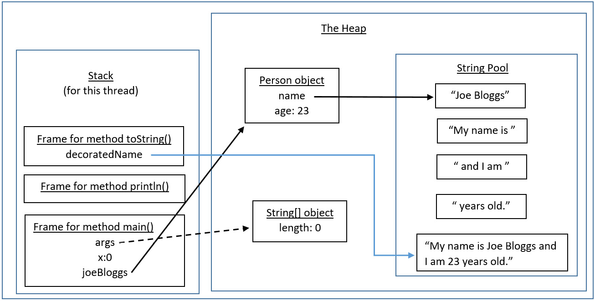

<!-- TOC start (generated with https://github.com/derlin/bitdowntoc) -->

- [How are Java programs executed?](#how-are-java-programs-executed)
    * [Why JVM is platform dependent but Java is not?](#why-jvm-is-platform-dependent-but-java-is-not)
- [JDK (Java Development Kit)](#jdk-java-development-kit)
- [JRE (Java Runtime Environment)](#jre-java-runtime-environment)
- [JVM (Java Virtual Machine)](#jvm-java-virtual-machine)
    * [**Architecture of JVM**](#architecture-of-jvm)
- [Memory management in Java](#memory-management-in-java)
    * [Java Heap's Components](#java-heaps-components)
    * [Garbage Collection Process and Types](#garbage-collection-process-and-types)
    * [Memory Issues like Memory Leaks and Performance Optimization Techniques](#memory-issues-like-memory-leaks-and-performance-optimization-techniques)
    * [Memory Leaks](#memory-leaks)
    * [Performance Optimization techniques:](#performance-optimization-techniques)
    * [How are Strings stored in Heap](#how-are-strings-stored-in-heap)


<!-- TOC end -->


# How are Java programs executed?

  

- Source code (.java files) are converted into bytecode (.class files) by compiler in JDK. This process checks for any semantics and syntax error in the code.
- These bytecode files are interpreted by JVM and converted to machine code for execution. 

## Why JVM is platform dependent but Java is not?

| Feature                           | Java Programming Language                                                                                                                                                                                                            | Java Virtual Machine (JVM)                                                                                                                                                                                                                                             |
|-----------------------------------|--------------------------------------------------------------------------------------------------------------------------------------------------------------------------------------------------------------------------------------|------------------------------------------------------------------------------------------------------------------------------------------------------------------------------------------------------------------------------------------------------------------------|
| _**Dependence**_                  | Platform-independent                                                                                                                                                                                                                 | Platform-dependent                                                                                                                                                                                                                                                     |
| **_Reason_**                      | Java code is compiled into a universal bytecode format, which can be executed on any platform with a compatible JVM. <br/>This means the same Java program can run on different operating systems and hardware without modification. | Each JVM is implemented to translate Java bytecode into the machine code of a specific platform (Windows, macOS, Linux, etc.). <br/>This is necessary because each operating system and hardware architecture has its own set of native instructions and capabilities. |
| **_Execution_**                   | Java programs are compiled once into bytecode, which can run on any JVM, regardless of the underlying platform.                                                                                                                      | The JVM executes Java bytecode and converts it into native machine code for the host machine. A different JVM version is needed for each operating system to handle this conversion appropriately.                                                                     |
| **_Portability vs. Specificity_** | High portability. The "Write Once, Run Anywhere" (WORA) model ensures Java applications can be developed and distributed for any platform without needing to adapt the source code.                                                  | Each JVM must be specifically customized and optimized for its host operating system and hardware to efficiently execute Java applications. This requirement ensures that Java maintains its platform independence at the application level.                           |
| **_Compilation/Execution Model_** | Java source code is compiled into bytecode by the Java compiler (javac), which is platform-independent.                                                                                                                              | The JVM interprets (or JIT compiles) the bytecode into native machine code at runtime. Because machine code varies between different systems, JVMs are inherently platform-specific.                                                                                   |


# JDK (Java Development Kit)

- It is a cross-platform software development environment offering a collection of software development tools and supporting libraries used for developing Java-based software applications and is a core package in Java along with the Java Runtime Environment (JRE) and Java Virtual Machine (JVM).
- JDK is an implementation of any of these Java platforms: Standard Edition (Java SE), Java Enterprise Edition (Java EE), Micro Edition (Java ME)
- **Architecture of JDK:**

    

- **Contents of JDK** :
  - Java Runtime Environment (JRE)
  - An interpreter/loader (Java)
  - A compiler (javac)
  - An archiver (jar), and many more.

- **Examples of JDK** :  OpenJDK and Oracle JDK.

# JRE (Java Runtime Environment)

- As the runtime environment for Java, the JRE contains the Java class libraries, the Java class loader, and the Java virtual machine.
- The JRE is the on-disk software component that takes your compiled Java code (the code is compiled with the JDK), combines it with the required libraries, and starts the JVM to execute it.
- The ClassLoader loads all the necessary classes in Java bytecode on demand, the ByteCode verifier ensures format and accuracy of Java code, the Interpreter creates and instance of JVM for that verified bytecode to get executed.
- Components of JRE - 
  - Integration libraries, which include Remote Method Invocation Over Internet Inter-Orb Protocol (RMI-IIOP), Interface Definition Language (IDL), emote Method Invocation (RMI), Java Database Connectivity (JDBC), and Java Naming and Directory Interface (JNDI).
  - Land and util base libraries, including Java Archive (JAR), lang and util, zip, Preferences API, instrument, reflection, management, versioning, Logging, Collections, Concurrency Utilities, Ref Objects, and Regular Expressions.
  - Deployment technologies, which include Java plug-in, deployment, and Java Web Start.
  - User Interface toolkits, including Sound, Drag, and Drop (DnD), Java 2D, Swing, Abstract Window Toolkit (AWT), Image I/O, Print Service, Accessibility, and input methods. 
  - Other base libraries, such as input/output (I/O), extension mechanism, international support, Beans, Java Management Extensions (JMX), Math, Networking, Override Mechanism, Java Native Interface (JNI), Security, Serialization and Java for XML Processing (XML JAXP).
  - Java Virtual Machine (JVM) comprises Java HubSpot and Server Virtual Machine.


# JVM (Java Virtual Machine)

- JVM is a specification which acts as a run-time engine to run Java applications and calls the main method present in a Java code. As we compile a .java file, the Java compiler generates a .class file containing bytecode with the same class name available in the .java file. 
- JRE is the implementation of Java Virtual Machine (JVM), which analyzes the bytecode, interprets the code and executes it.
- In programming languages like C and C++, the code is first compiled into platform-specific machine code. These languages are called compiled languages.
- On the other hand, in languages like JavaScript and Python, the computer executes the instructions directly without having to compile them. These languages are called interpreted languages.
- Java uses a combination of both techniques. Java code is first compiled into byte code to generate a class file. This class file is then interpreted by the Java Virtual Machine for the underlying platform. The same class file can be executed on any version of JVM running on any platform and operating system.

## **Architecture of JVM**


- The JVM is divided into three main subsystems:

    - Class Loader Subsystem
    
    - Runtime Data Area (Memory Area)
    
    - Execution Engine

### **Class Loader Subsystem** : 

- It is an on-demand functionality, responsible for loading class files into the memory area. 
- The first class to be loaded into memory is usually the class that contains the main() method.
- It deals with loading, linking and initialization of the class file when it refers to a class for the first time at runtime, not compile time.

1. **Loading**: 
     - Loading involves taking the binary representation (bytecode) of a class or interface with a particular name, and generating the original class or interface from that.
     - There are three built-in class loaders available in Java:
   
       1. **Bootstrap Class Loader -** This is the root (first) class loader. It is the superclass of Extension Class Loader and loads the standard Java packages like `java.lang, java.net, java.util, java.io,` and so on. These packages are present inside the rt.jar file and other core libraries present in the `$JAVA_HOME/jre/lib` directory. It is implemented in native languages, such as C and C++.
       
       2. **Extension Class Loader -** This is the subclass of the Bootstrap Class Loader and the superclass of the Application Class Loader. This loads the extensions of standard Java libraries which are present in the `$JAVA_HOME/jre/lib/ext` directory.
       
       3. **Application Class Loader -** This is the final class loader and the subclass of Extension Class Loader. It loads the files present on the classpath. By default, the classpath is set to the current directory of the application. The classpath can also be modified by adding the `-classpath` or `-cp` command line option.

     - When the class is loaded to the JVM, it creates an object of class type and is put into the heap area. This class type object will be created only the very first time the class is loaded to the JVM.

2. **Linking**:
   
    - Linking a class or interface involves combining the different elements and dependencies of the program together. It involves following steps - 
   
      1. **Verification** - This phase checks the structural correctness of the .class file by checking it against a set of constraints or rules. If verification fails for some reason, we get a `VerifyException`. It is done by `Bytecode Verifier`. Eg: Code built using Java 11 cannot run on system that has Java 8.
      2. **Preparation** - In this phase, the JVM allocates memory for the static fields of a class or interface, and initializes them with default values.
      3. **Resolution** - In this phase, symbolic references are replaced with direct references present in the runtime constant pool. Eg : if in our java programs, we have references to other classes or constant variables present in other classes, JVM cannot understand these references by their names. Therefore, JVM searches method area and replaces these words from a memory address (direct reference).

3. **Initialization**:
   - Initialization involves executing the initialization method of the class or interface (known as `<clinit>`). This can include calling the class's constructor, executing the static block, and assigning values to all the static variables. This is the final stage of class loading.

### **Runtime Data Area (Memory Area)** :

- There are five components inside the runtime data area:

1. **Method Area** :
   - All the per-class structures and class-level information, such as the ClassLoader reference, run-time constant pool, field (— Per field: name, type, modifiers, attributes), and method data (— Per method: name, return type, parameter types (in order), modifiers, attributes), and the code for methods and constructors, are stored here.
   - If the memory available in the method area is not sufficient for the program startup, the JVM throws an `OutOfMemoryError.`
   - The method area is created on the virtual machine start-up, and there is only one method area per JVM.

2. **Heap Area** :
   - All the objects and their corresponding instance variables are stored here. This is the run-time data area from which memory for all class instances and arrays is allocated.
   - There is also one Heap Area per JVM. Since the Method and Heap areas share same memory for multiple threads, the data stored is not thread safe.

3. **Stack Area** : 
   - The stack area is not a shared resource, hence it is inherently thread safe. Whenever a new thread is created in the JVM, a separate runtime stack is also created at the same time. All local variables, method calls, and partial results are stored in the stack area.
   - If the processing being done in a thread requires a larger stack size than what's available, the JVM throws a `StackOverflowError`.
   - For every method call, one entry is made in the stack memory which is called the Stack Frame. When the method call is complete, the Stack Frame is destroyed.
   - The Stack Frame is divided into three sub-parts:

     - **Local Variables** – Each frame contains an array of variables known as its local variables. All local variables and their values are stored here. The length of this array is determined at compile-time.
     - **Operand Stack** – Each frame contains a last-in-first-out (LIFO) stack known as its operand stack. This acts as a runtime workspace to perform any intermediate operations. The maximum depth of this stack is determined at compile-time.
     - **Frame Data** – All symbols corresponding to the method are stored here. This also stores the catch block information in case of exceptions.

4. **Program Counter (PC) Registers** :
   - The JVM supports multiple threads at the same time. Each thread has its own PC Register to hold the address of the currently executing JVM instruction. That is like a pointer to the current instruction in a sequence of instructions in a program.
   - Once the instruction is executed, the PC register is updated with the next instruction.

5. **Native Method Stacks** :
   - The JVM contains stacks that support native methods. These methods are written in a language other than the Java, such as C and C++. For every new thread, a separate native method stack is also allocated.

### **Execution Engine**

- Once the bytecode has been loaded into the main memory, and details are available in the runtime data area, the next step is to run the program. The Execution Engine handles this by executing the code present in each class.
- However, before executing the program, the bytecode needs to be converted into machine language instructions. The JVM can use an interpreter or a JIT compiler for the execution engine.

1. **Interpreter** :
   - The interpreter reads and executes the bytecode instructions line by line. This process will use some sort of dictionary that implies this kind of byte code should be converted into this kind of machine instructions.
   - Even though interpreter is fast to load, due to the line by line execution, the interpreter is comparatively slower.
   - Another disadvantage of the interpreter is that when same code blocks (methods, loops, etc) are called multiple times, every time a new interpretation is required.

2. **Just-in-Time Compiler (JIT)** :
   - The JIT Compiler overcomes the disadvantage of the interpreter. The Execution Engine first uses the interpreter to execute the byte code, but when it finds some repeated code, it uses the JIT compiler.
   - JIT compiler can identify those repeated code segments, compile them and store them as native codes in the cache. This native machine code is used directly for repeated method calls, which improves the performance of the system.
   - The JIT Compiler has the following components:
     1. **Intermediate Code Generator -** generates intermediate code
     2. **Code Optimizer -** optimizes the intermediate code for better performance
     3. **Target Code Generator -** converts intermediate code to native machine code
     4. **Profiler -** finds the hotspots (code that is executed repeatedly)
   - **Note :** JIT compiler takes more time to compile the code than for the interpreter to interpret the code line by line. If you are going to run a program only once, using the interpreter is better.

3. **Garbage Collector** :
    - All the objects are stored in the heap area before JVM starts the execution. . Since this area is limited, it is required to manage this area efficiently by removing the objects that are no longer in use.
    - The Garbage Collector (GC) collects and removes unreferenced objects from the heap area. It is the process of reclaiming the runtime unused memory automatically by destroying them.
    - This makes Java memory efficient and makes space for new objects.
    - There are two ways the objects are considered as no longer in use:
      - When the reference is pointed to a null value.
      - When the reference is pointed to another object
       ```
           Employee employee1 = new Employee(); //object 1
           Employee employee2 = new Employee(); //object 2
           employee1 = employee2;
        
           //object 1 is considered as no longer reachable.
       ```
    - The GC is a daemon thread that runs in the background. It is done automatically by the JVM at regular intervals and does not need to be handled separately. It can also be triggered by calling System.gc(), but the execution is not guaranteed.

### **Java Native Interface (JNI)**

- At times, it is necessary to use native (non-Java) code (for example, C/C++). This can be in cases where we need to interact with hardware, operating system libraries, share output to console or to overcome the memory management and performance constraints in Java. Java supports the execution of native code via the Java Native Interface (JNI).
- JNI acts as a bridge for permitting the supporting packages for other programming languages such as C, C++, and so on. This is especially helpful in cases where you need to write code that is not entirely supported by Java, like some platform specific features that can only be written in C.
- You can use the `native` keyword to indicate that the method implementation will be provided by a native library. You will also need to invoke `System.loadLibrary()` to load the shared native library into memory, and make its functions available to Java.

### **Native Method Libraries**

- It is a collection of the Native Libraries (written in C/C++ ad assembly) which is required for the Execution Engine.
- These libraries are usually present in the form of .dll or .so files. These native libraries can be loaded through JNI.

# Memory management in Java

- Memory management in Java is the process of allocating working memory space to new objects and properly removing unreferenced objects to create space for those new object allocations.
- Unlike other programming languages, it is an automatic (periodic) process in Java. The JVM and to be specific, Garbage Collector has the role of managing memory allocation so that the programmer need not to.
- However, GC doesn't always guarantee error free operation all the time. Programmers unknowingly leave objects referenced, even after their use is complete, which leads to memory leaks or a large application that uses Collections, pipes, and others, which, if not managed correctly, can result in inordinately large memory usage or memory leaks. Hence understanding of Memory management is crucial to write efficient and high-performance based programs that dont crash, and also to know how to debug or overcome the crashes.

### Types of Memory :


- Divided into three major areas -


1. **Method :**

- The method area is a logical part of the heap area that is created at the time of Virtual Machine startup and shared by all the threads.
- This memory is used to store class, superclass, interface, and constructor names , along with class structure, hierarchy and relationships between classes.
- It includes elements specific to each class, including fields, constant pools, method local data, method codes, Constructor codes, etc., that are used to initialize objects and interfaces.
- By storing this information in the Method Area, the JVM can avoid the need to repeatedly load class information into memory for each new instance of a class.
- Depending on system configuration, the Method area can be fixed or dynamic size required by the computation. It need not be contagious memory. 
- Garbage collection is mandatory in the heap, but the Method area may or may not be garbage collected though it is a logical part of the heap area.


2. **Stack**




- The stack memory is allocated at runtime for each thread. It stores method calls and method specific values such as the primitives (int, boolean char, short, byte, long, float, double) , variables declared within a method, and references to the objects on the heap.
- The stack memory need not be contagious. Its size can either be fixed or dynamic and can be chosen independently when it is created.
- The stack frame is the data structure of the thread’s data. The thread data represents the state of the thread in the current method. Each frame contains its own Local Variable Array (LVA), Frame Data (FD), and Operand Stack (OS).
- In a thread of control, only one frame is active at a time. In case the method invokes another method or the method is completed, the frame stops the current method.
- A new frame is created on the stack when a method is called. This frame has the method's local variables, parameters, and return address. Stack uses a last in, first out (LIFO) approach to remove frames when method returns.
- The stack variables have visibility known as the scope of those variables. Thus, the variables declared within a method are not accessible outside it.
- `StackOverflowError` is thrown when JVM runs out of stack space.
- Besides deep recursive calls, creating a large number of threads can also cause memory issues since each thread has its own stack memory.


3. **Heap :**


- The objects that are produced using "new" keyword while a Java program is running are kept in heap memory and its memory is referenced using a variable from the thread’s stack. Dynamic memory allocation is followed by heap (memory is allocated during execution or runtime).
- There exists only one heap memory for each running JVM process. Therefore, this is a shared part of memory regardless of how many threads are running. 
- The heap's memory does not have to be contiguous.
- Once an object is created and stored on the heap, it stays there until it is no longer referenced by any part of the program. At that point, the object becomes eligible for garbage collection, which is a process by which the JVM frees up memory occupied by unreferenced objects.
- References to heap objects are of majorly three types:

  1. **Strong Reference**
     - The default type of reference in Java is a strong reference. 
     - When you define an object regularly, it will have a strong reference, and as long as an object has a strong reference, the object will not be eligible for the garbage collector. 
     - When we set the strong referenced variable to null, that object will become eligible for garbage collection.

  2. **Weak Reference**
     - A weak reference can be created with the `java.lang.ref.WeakReference class`. 
     - If JVM sees an object that has only a weak reference during GC, it will be collected.
     - There is a `get()` method of `WeakReference` that will return the object itself if it is not garbage collected yet or returns null if it is removed already.
     - Weak references can be used to prevent memory leaks.
     - Example : These references are used in real time applications while establishing a DBConnection which might be cleaned up by Garbage Collector when the application using the database gets closed, i.e lifecycle of DB object has ended so has the strong reference, now GC can remove it.
     - One convenient example of WeakReference is WeakHashMap, implementation of HashMap, which wraps keys as WeakReference which means a once strong reference to actual object removed, WeakReference present internally on WeakHashMap doesn't prevent them from being garbage collected.

    ````
    Counter counter = new Counter(); // strong reference - line 1 
    WeakReference<Counter> weakCounter = new WeakReference<Counter>(counter); //weak reference 
    counter = null; // now Counter object is eligible for garbage collection
    
    Counter c = weakCounter.get(); // will return original counter object if its not garbage collected
    ````
  
  3. **Soft Reference**
  
    - A soft reference can be created with the `java.lang.ref.SoftReference` class. A soft reference is garbage-collected only if there is not enough memory left in the heap. 
    - That means it can be used for memory-sensitive caches where we do not want it to be removed from memory because reading from the source is more expensive.
    - Similar to WeakReference, it has `.get()` method to return object.
  
    ```
    Counter prime = new Counter(); // prime holds a strong reference - line 2 
    SoftReference<Counter> soft = new SoftReference<Counter>(prime) ; //soft reference variable has SoftReference to Counter Object created at line 2 
    prime = null; // now Counter object is eligible for garbage 
                  // collection but only be collected when JVM absolutely needs memory
    ```

   4. **Phantom Reference**
    - A phantom reference can be created with `java.lang.ref.PhantomReference` class. 
    - Unlike weak and soft references whereby we can control how objects garbage-collected, a phantom reference is used for pre-mortem clean-up actions before the GC removes the object.
    - Used only with a reference queue, since the `.get()` method of such references will always return null. 
    - These types of references are considered preferable to finalizers.

- Memory Pools are created by JVM memory managers to create a pool of immutable objects if the implementation supports it. String Pool is a good example of this kind of memory pool. Memory Pool belong to Heap.
- Collections (lists, maps, etc.) can grow significantly in production with large data; hence, they must be handled in batches to ensure optimal memory usage.
- Object references must be explicitly assigned to `null` when they are no longer required.

## Java Heap's Components


- The heap is divided into several different components, Young Generation, the Old Generation (Tenured Generation), and in more recent versions of Java (Java 8 and later), the Metaspace (replacing the Permanent Generation).


### Young Generation

**Purpose**

- The Young Generation is where new objects are initially allocated. It’s designed to be short-lived, as most objects either become unreachable quickly or survive for only a short period.

**Structure**

The Young Generation is further divided into three parts:

1. **Eden Space:** This is where all new objects start their lives.
2. **Survivor Space 1 and Survivor Space 2:** Objects that survive garbage collection in the Young Generation are moved between these spaces.

**Data Movement**

The process of moving data in the Young Generation is known as “minor garbage collection.” When the Eden Space fills up, a minor garbage collection is triggered. During this process:

- Live objects are moved from Eden to one of the Survivor Spaces (typically Survivor Space 1).
- Objects that survive subsequent garbage collections in the Survivor Spaces are eventually promoted to the Old Generation.
- The remaining objects in Eden, as well as the objects in the other Survivor Space, are considered garbage and are collected to free up space.


### Old Generation (Tenured Generation)

**Purpose**

The Old Generation, also known as the Tenured Generation, is where long-lived objects reside . Objects that persist beyond several garbage collection cycles (threshold age is specified) in the Young Generation get promoted to the Old Generation.

**Data Movement**

Objects in the Old Generation are subject to “major garbage collection.” This process is also known as a “full garbage collection.” During a full garbage collection:

- Live objects are retained in the Old Generation.
- Any unreachable objects are collected, and the memory they occupied is freed.
- Fragmentation issues can arise in the Old Generation, as it may become fragmented over time.

### Metaspace

**Purpose**

The Metaspace, introduced in Java 8, replaces the Permanent Generation for storing class metadata. It holds class-related information, such as class bytecode and method information.

**Data Movement**

- Unlike the heap, Metaspace is allocated out of the native memory, and its size is not fixed but can increase dynamically, which helps prevent the OutOfMemoryErrors that were possible with the Permanent Generation.
- The garbage collector now automatically triggers the cleaning of the dead classes once the class metadata usage reaches its maximum metaspace size.
- We can fine tune Metaspace size using `-XX:MetaspaceSize` and `-XX:MaxMetaspaceSize`, for initial and maximum Metasapce size resp.

## Garbage Collection Process and Types

- An object is said to be eligible for GC(garbage collection) if it is unreachable. (doesnt have any reference to it)
- Garbage Collection is done whenever JVM detects the low availability of working memory resources.
- Even though JVM often responds quickly to `System.gc()` and `Runtime.getRuntime().gc()` as manual call to run GC, it is not always guaranteed.

- Steps involved in garbage collection :


1. Mark: In this step, the Garbage Collector identifies all reachable objects. It starts from a set of known roots (e.g., global variables, local variables, or static variables) and traverses the object graph, marking every object it encounters as reachable.
2. Sweep: Once all reachable objects are marked, the Garbage Collector sweeps through the entire Heap, identifying and freeing up memory occupied by objects that were not marked as reachable. These are the candidates for removal.
3. Compact: This step is optional and depends on the Garbage Collector used. For better performance, after deleting unused objects, all the survived objects can be moved to be together. This will increase the performance of allocation of memory to newer objects. Some collectors, like the G1 collector, compact memory to reduce fragmentation.

- Garbage collection is an expensive process since it pauses all other processes or threads and slows down the application. This problem can be overcome by applying several garbage-collector-based algorithms to improve the performance of the program. This process is termed as Garbage Collector tuning.
- The generational garbage collectors, which add an age field to the objects that are allotted a memory, can be another solution. The objects are divided into groups and given an age based on how many clock cycles they have endured. This way the garbage collection work gets distributed.


### Types of Garbage Collectors

JVM can choose the type of GC based on the underlying hardware. Programmers can also choose which garbage collector should be used.


1. Serial Garbage Collector:
   
   - The Serial Garbage Collector (also known as the Serial Collector) is the simplest garbage collector in Java. It uses a single thread for garbage collection operations.
   - It is suitable for applications with small to moderate memory requirements where low overhead is crucial. It is often used in single-threaded or resource-constrained environments.
   - The Serial Collector performs garbage collection in two phases — the young generation and the old generation. During each phase, it freezes all application threads, collecting garbage in a stop-the-world fashion. This can cause noticeable pauses in the application’s responsiveness.
   - Using it in multi-threaded applications like server environments is not a good idea.
   - Command line code to enable serial GC:
    ```
    java -XX:+UseSerialGC -jar GFGApplicationJar.java
    ```

2. Parallel Garbage Collector:

   - Also known as the throughput collector, the Parallel Garbage Collector uses multiple threads to perform garbage collection operations, making it suitable for multi-threaded applications.
   - It is ideal for applications with medium to large memory requirements where maximizing throughput is a priority.
   - It can spawn upto N threads for young generation garbage collection where N is the number of CPU cores in the system. Parallel GC uses a single thread for Old Generation garbage collection.
   - Maximum pause time and number of threads spawn can be controlled.
   - It parallelizes the work across multiple threads, reducing pause times compared to the Serial Collector. However, it can still have noticeable freeze-the-application threads pauses.
   - If we are using JDK 8 then parallel GC is the default garbage collector.
   - Command line code to enable parallel GC:
   
    ```
    java -XX:+UseParallelGC -jar GFGApplicationJar.java
    ```

3. Concurrent Mark-Sweep (CMS) Collector:

   - The CMS Collector aims to minimize pause times by performing most of the garbage collection work concurrently with the application’s threads.
   - It is made for programs that can afford to share processor resources with the garbage collector while they are operating and that want shorter garbage collection pauses.
   - It does the garbage collection for the Old generation. CMS collector on the young generation uses the same algorithm as that of the parallel GC.
   - It analyses the heap memory to identify instances that should be swept, then it marks such instances for eviction.
   - The "CMS collector" employs more CPU than the parallel garbage collector to ensure faster application throughput. The "CMS garbage collector" is recommended over the parallel collection if we can assign additional CPU for better performance.
   - While it offers low-latency benefits, it can suffer from fragmentation issues in the old generation, potentially leading to more frequent full garbage collections.
   - Command line code to enable CMS GC:

    ```
        java -XX:+UseParNewGC -jar GFGApplicationJar.java
    ```

4. G1 Garbage Collector:

   - The G1 Garbage Collector is designed for large heap sizes (multi-processor) and low-latency requirements. It divides the heap into multiple equal-sized regions to improve efficiency and predictability, and performs parallel collection within each one.
   - G1 Garbage Collector is the default garbage collection of Java 9.
   - When a garbage collection is invoked, it first collects the region with lesser live data (most unreferenced objects), hence “Garbage First”.
   - G1 also does compact the free heap space just after garbage collection that makes G1 Garbage Collector better than other garbage collectors.
   - Command line code to enable G1 GC:
   ```
    java -XX:+UseG1GC -jar GFGApplicationJar.java
    ```

5. Z Garbage Collector (ZGC):

   - It is designed for large heap sizes processors, to run low-latency and high-throughput applications such as financial services and gaming, with minimal impact on application pause times.
   - It executes all expensive work concurrently without pausing the execution of application threads for longer than 10ms. 
   - "Oracle documentation" states that multi-terabyte heaps are supported. Oracle made ZGC available in Java 11. Cycles are completed by the Z garbage collector in its threads. It typically pauses the application for 1 milliseconds. 
   - The Parallel and G1 collectors have an average of about 200ms.
   - It features an efficient algorithm for compacting the heap, reducing fragmentation issues.


## Memory Issues like Memory Leaks and Performance Optimization Techniques

- Memory issues in Java can have symptoms such as excessive memory usage, where the heap grows abnormally as the Java application runs. 
- The application may also become sluggish due to an underlying memory issue (such as inadequate heap allocation or memory leak), requiring the garbage collector to run frequently.

## Memory Leaks

- Memory leaks occur due to unintentional object references that are erroneously kept in the application even when they are no longer required. This prevents those objects from being garbage collected. Slowly, the accidental leak grows over time and occupies a significant portion of the heap space. This, in turn, forces the garbage collector to run frequently, and the application may crash with the exception: `OutOfMemoryError`.
- Leaks can also occur due to circular references between objects or poor thread management. Circular references happen when two or more objects reference each other. They then form a loop that blocks them from being garbage-collected.
- Some memory leaks in Java Collections (map implementations, such as HashMap and Hashtable) may also occur due to incorrect implementation of equals/hashCode methods in the application code.
- High memory usage typically occurs when the Java objects and Collections are allowed to grow without an adequate check in the code. This can be handled effectively using correct batch sizes for the Collections and ensuring they do not grow beyond a predetermined value. Alternatively, consider increasing the maximum heap size for the memory requirement of your Java application.
- A java application may run into an `OutOfMemoryError` on metaspace if there is a memory leak in the class loader. The classes are referenced by their class loader. They are not garbage collected unless the class loader itself is garbage collected, which takes place when the application server unloads the application.
- The class loader–related memory issue may arise when duplicate classes are loaded by multiple `ClassLoader` instances. This usually arises with multiple deployments on the application server when classes are not unloaded during the undeploy process.
- Occasionally, this issue may also occur if the size specified by the JVM parameter `MaxMetaspaceSize` is lower than the application requirement.


## Performance Optimization techniques:

- Explicitly refer to `null` obsolete references after use. That will make objects those refer to eligible for garbage collecting.
- Avoid `finalizers`. They slow down the process, and they do not guarantee anything. Prefer phantom references for cleanup work.
- Do not use strong references where weak or soft references apply. The most common memory pitfalls are caching scenarios,when data is held in memory even if it might not be needed. eg. "WeakHashMap"
- Using Primitives wherever possible as Primitive types are stored on the stack and use less memory than objects.
- Consider using object pooling or flyweight design patterns to reduce the number of new objects that need to be made.
- A new string object is made every time string concatenation is used in Java. It can quickly cause an app with a lot of string concatenation to run out of memory. Considering this use StringBuilder or StringBuffer instead to build strings.
- Creating and deleting objects in Java can use a lot of memory and slow things down. Must try to reuse objects instead of making new ones.
- If a Java application crashes with an `OutOfMemoryError` and you need some extra info to detect the leak, run the process with the `–XX:HeapDumpOnOutOfMemory` parameter, which will create a heap dump file when this error happens next time.


## How are Strings stored in Heap

- String Pool in Java is a special storage space in Java Heap memory where string literals are stored. It is also known by the names - String Constant Pool or String Intern Pool. 


- There are three popular ways of creating strings in Java and they all differ in the way they are stored:

1. String literal

    ```
    String str = "Java";
    ```
   
   - When we create a String variable and assign a value to it, the JVM searches the String Constant Pool for a String of equal value. If found, the Java compiler will simply return a reference to its memory address, without allocating additional memory. If not found, it’ll be added to the pool (interned) and its reference will be returned.
   - By storing Strings in this way, JVM effectively utilizes the memory.

2. Using new Keyword

   - When we create a String via the new operator, the Java compiler will create a new object and store it in the heap space reserved for the JVM (outside String Constant Pool).
   - Every String created like this will point to a different memory region with its own address.

    ```
    String constantString = "Baeldung";
    String newString = new String("Baeldung");

    assertThat(constantString).isNotSameAs(newString);
   
    String third = new String("Baeldung");
    String fourth = new String("Baeldung");
    System.out.println(third == fourth); // False, because two different objects in heap with different memory address
   ```
   
3. Manual Interning

   - When we use the String.intern() method, JVM puts the string literal in the String Pool (if not already present), and its reference is stored in the variable. However, if the String Constant Pool already contains a string equal to the String object to be created, its reference is returned.
    
    ```
    String constantString = "interned Baeldung";
    String newString = new String("interned Baeldung");
    
    assertThat(constantString).isNotSameAs(newString);
    
    String internedString = newString.intern();
    
    assertThat(constantString).isSameAs(internedString); 
   ```
    

**Note:** "==" opererator compares the references of Object while "equals" method compare the content of Object.


### String Literal vs String Object

- When we create a String object using the new() operator, it always creates a new object in heap memory. On the other hand, if we create an object using String literal syntax e.g. “Baeldung”, it may return an existing object from the String pool, if it already exists. Otherwise, it will create a new String object and put in the string pool for future re-use.
- Use String literal wherever possible.

**Some points to remember about strings**

- The reason String are immutable in Java is to support the memory storage of Strings in String Constant Pool.
- Java String Pool allows caching of string, provides reusability, reduces memory usage.
- From Java 7 onwards, the Java String Pool is stored in the Heap space, which is garbage collected by the JVM. The advantage of this approach is the reduced risk of `OutOfMemory` error because unreferenced Strings will be removed from the pool, thereby releasing memory.
- Until Java 8, Strings were internally represented as an array of characters – char[], encoded in UTF-16, so that every character uses two bytes of memory.
- With Java 9 a new representation is provided, called Compact Strings. This new format will choose the appropriate encoding between char[] and byte[] depending on the stored content.
- Since the new String representation will use the UTF-16 encoding only when necessary, the amount of heap memory will be significantly lower, which in turn causes less Garbage Collector overhead on the JVM.
- One disadvantage of immutability of Strings is if they are altered, instead of reflecting the changes in the original string, a new object is created. This causes a lot of objects to be created in the heap and wastes a lot of memory if the user keeps on updating the value of the string.
- In order to overcome the drawbacks of the String class, Java provides StringBuffer and StringBuilder classes. They are used to create mutable String objects.
- concat() method is better than the + operator because it creates a new object only when the string length is greater than zero(0) but the + operator always creates a new string irrespective of the length of the string.