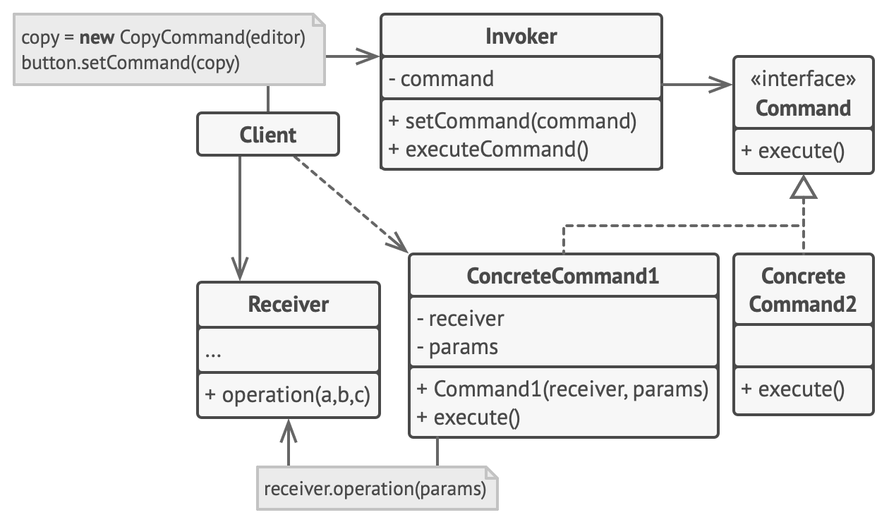

#### Command

- encapsulates a request, along with all the information necessary to handle the request, in a single object. This information includes the method name, the object that owns the method and values for the method parameters.
- This transformation lets clients pass requests as a method arguments, delay or queue a request’s execution for later time, and support undoable operations. 
- **Usage Examples:** 
  - Needing to store a command for execution at a later time (queueing tasks)
  - Needing to execute a command by a different component than the original handler
  - All implementations of `java.lang.Runnable`
  - All implementations of `javax.swing.Action`
- **Identification:** If you see a set of related classes that represent specific actions (such as “Copy”, “Cut”, “Send”, “Print”, etc.), this may be a Command pattern. These classes should implement the same interface/abstract class. The commands may implement the relevant actions on their own or delegate the work to separate objects—that will be the receivers. The last piece of the puzzle is to identify an invoker—search for a class that accepts the command objects in the parameters of its methods or constructor.

- The Sender class (aka invoker) is responsible for initiating requests. This class must have a field for storing a reference to a command object. The sender triggers that command instead of sending the request directly to the receiver. Note that the sender isn’t responsible for creating the command object. Usually, it gets a pre-created command from the client via the constructor.
- The Command interface usually declares just a single method for executing the command.
- Concrete Commands implement various kinds of requests. A concrete command isn’t supposed to perform the work on its own, but rather to pass the call to one of the business logic objects. However, for the sake of simplifying the code, these classes can be merged.
- Parameters required to execute a method on a receiving object can be declared as fields in the concrete command. You can make command objects immutable by only allowing the initialization of these fields via the constructor.
- The Receiver class contains some business logic. Almost any object may act as a receiver. Most commands only handle the details of how a request is passed to the receiver, while the receiver itself does the actual work.
- The Client creates and configures concrete command objects. The client must pass all of the request parameters, including a receiver instance, into the command’s constructor. After that, the resulting command may be associated with one or multiple senders.

- Use the Command pattern when you want to parametrize objects with operations.
- Use the Command pattern when you want to queue operations, schedule their execution, or execute them remotely.
- Use the Command pattern when you want to implement reversible operations.