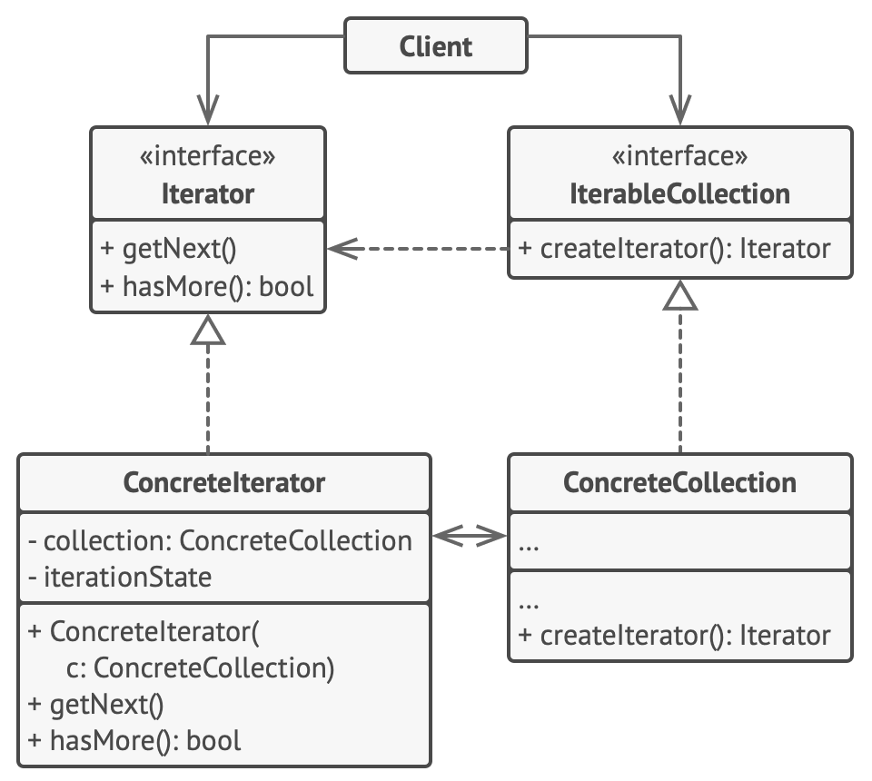

#### Iterator

- provides a way to access elements of an aggregate object (or collection) sequentially without exposing its underlying representation (list, stack, tree, etc.).
- The main idea of the Iterator pattern is to extract the traversal behavior of a collection into a separate object called an iterator.
- **Usage Examples:** 
  - All implementations of `java.util.Iterator` and `java.util.Scanner`.
- **Identification:** Iterator is easy to recognize by the navigation methods (such as next, previous and others). Client code that uses iterators might not have direct access to the collection being traversed.

- The Iterator interface declares the operations required for traversing a collection: fetching the next element, retrieving the current position, restarting iteration, etc.
- Concrete Iterators implement specific algorithms for traversing a collection. The iterator object should track the traversal progress on its own. This allows several iterators to traverse the same collection independently of each other.
- The Collection interface declares one or multiple methods for getting iterators compatible with the collection. Note that the return type of the methods must be declared as the iterator interface so that the concrete collections can return various kinds of iterators.
- Concrete Collections return new instances of a particular concrete iterator class each time the client requests one. 
- The Client works with both collections and iterators via their interfaces. This way the client isn’t coupled to concrete classes, allowing you to use various collections and iterators with the same client code.
- Typically, clients don’t create iterators on their own, but instead get them from collections. Yet, in certain cases, the client can create one directly; for example, when the client defines its own special iterator.

- Use the Iterator pattern when your collection has a complex data structure under the hood, but you want to hide its complexity from clients (either for convenience or security reasons). Abstracting the iteration process for a collection of objects.
- Use the Iterator when you want your code to be able to traverse different data structures or when types of these structures are unknown beforehand. Traversing the same collection using different logic depending on the chosen iterator.

