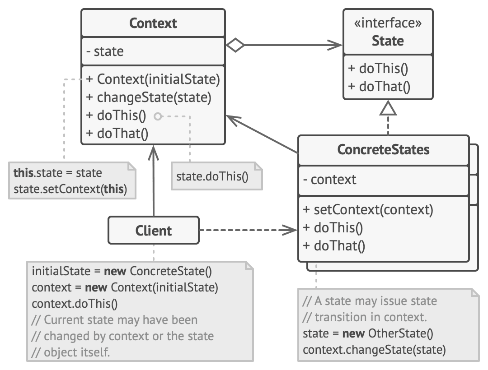

#### State

- lets an object alter its behavior when its internal state changes. It appears as if the object changed its class.
- The main idea is that, at any given moment, there’s a finite number of states which a program can be in. Within any unique state, the program behaves differently, and the program can be switched from one state to another instantaneously.
- However, depending on a current state, the program may or may not switch to certain other states. These switching rules, called transitions, are also finite and predetermined.
- The pattern extracts state-related behaviors into separate state classes and forces the original object to delegate the work to an instance of these classes, instead of acting on its own.

- Context stores a reference to one of the concrete state objects and delegates to it all state-specific work. The context communicates with the state object via the state interface. The context exposes a setter for passing it a new state object.
- The State interface declares the state-specific methods. These methods should make sense for all concrete states because you don’t want some of your states to have useless methods that will never be called.
- Concrete States provide their own implementations for the state-specific methods. To avoid duplication of similar code across multiple states, you may provide intermediate abstract classes that encapsulate some common behavior.
- State objects may store a backreference to the context object. Through this reference, the state can fetch any required info from the context object, as well as initiate state transitions.
- Both context and concrete states can set the next state of the context and perform the actual state transition by replacing the state object linked to the context.

- Use the State pattern when you have an object that behaves differently depending on its current state, the number of states is enormous, and the state-specific code changes frequently.
- Use the pattern when you have a class polluted with massive conditionals that alter how the class behaves according to the current values of the class’s fields.
- Use State when you have a lot of duplicate code across similar states and transitions of a condition-based state machine. 
- The State pattern lets you compose hierarchies of state classes and reduce duplication by extracting common code into abstract base classes.