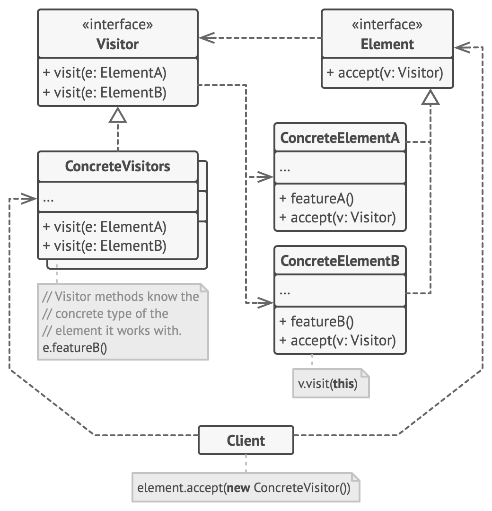

#### Visitor

- lets you separate algorithms/methods from the object structure on which they operate.
- A practical result of this separation is the ability to add new operations to existing object structures without modifying the structures.
- The Visitor pattern suggests that you place the new behavior into a separate class called visitor, instead of trying to integrate it into existing classes. 
- The original object that had to perform the behavior is now passed to one of the visitor’s methods as an argument, providing the method access to all necessary data contained within the object.

- The Visitor interface declares a set of visiting methods that can take concrete elements of an object structure as arguments. These methods may have the same names if the program is written in a language that supports overloading, but the type of their parameters must be different.
- Each Concrete Visitor implements several versions of the same behaviors, tailored for different concrete element classes.
- The Element interface declares a method for “accepting” visitors. This method should have one parameter declared with the type of the visitor interface.
- Each Concrete Element must implement the acceptance method. The purpose of this method is to redirect the call to the proper visitor’s method corresponding to the current element class. 
- The Client usually represents a collection or some other complex object (for example, a Composite tree). Usually, clients aren’t aware of all the concrete element classes because they work with objects from that collection via some abstract interface.

- Use the Visitor when you need to perform an operation on all elements of a complex object structure (for example, an object tree).
- Use the Visitor when an object structure contains many classes of objects with differing interfaces, and you want to perform operations on these objects that depend on their concrete classes.
- Use the pattern when a behavior makes sense only in some classes of a class hierarchy, but not in others. You can extract this behavior into a separate visitor class and implement only those visiting methods that accept objects of relevant classes, leaving the rest empty.

