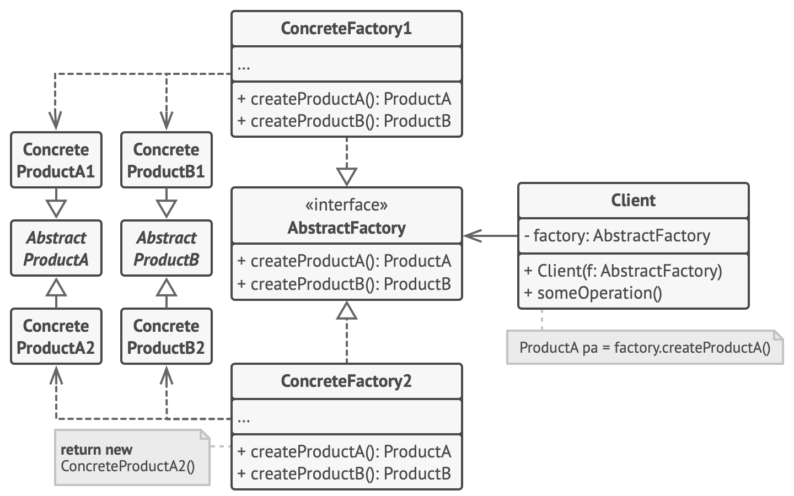

#### **Abstract Factory**

- Lets you produce families of related objects without specifying their concrete classes.

- Use the Abstract Factory when your code needs to work with various families of related products, but you don’t want it to depend on the concrete classes of those products—they might be unknown beforehand or you simply want to allow for future extensibility.
- Promotes loose coupling