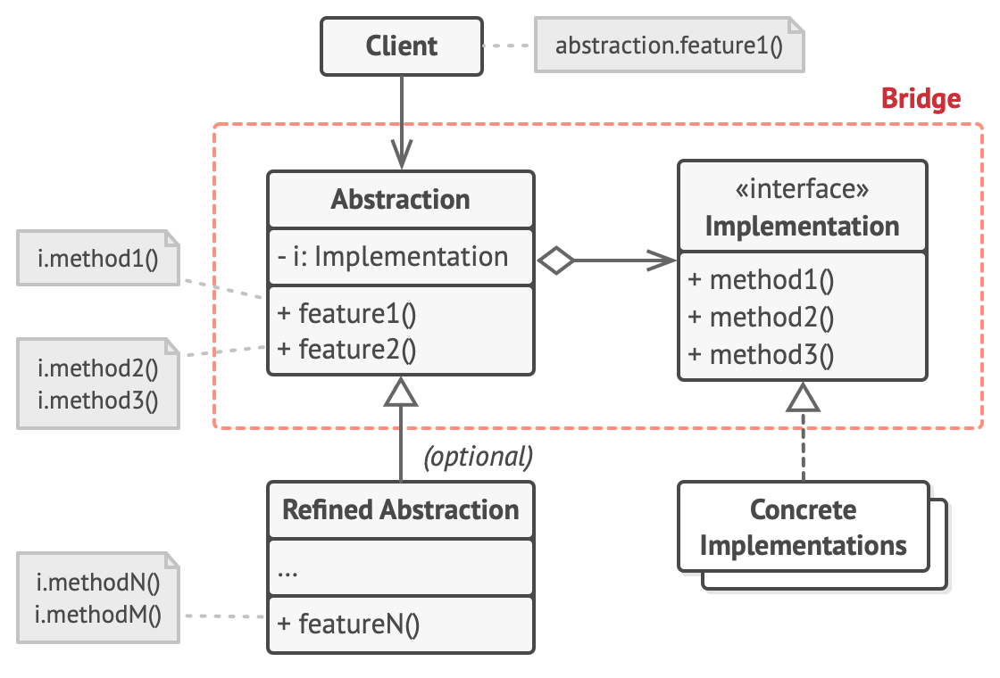

#### Bridge

- Bridge is a structural design pattern that divides business logic or huge class into separate class hierarchies that can be developed independently.
- One of these hierarchies (often called the Abstraction) will get a reference to an object of the second hierarchy (Implementation).
- The abstraction will be able to delegate some (sometimes, most) of its calls to the implementations object. Since all implementations will have a common interface, they’d be interchangeable inside the abstraction.
- Bridge pattern is about preferring composition to inheritance. Implementation details are pushed from a hierarchy to another object with a separate hierarchy.

- **Usage :** The Bridge pattern is especially useful when dealing with cross-platform apps, supporting multiple types of database servers or working with several API providers of a certain kind (for example, cloud platforms, social networks, etc.)

- **Identification:** Bridge can be recognized by a clear distinction between some controlling entity and several different platforms that it relies on.

- The Abstraction provides high-level control logic. It relies on the implementation object to do the actual low-level work.
- The Implementation declares the interface that’s common for all concrete implementations. An abstraction can only communicate with an implementation object via methods that are declared here.
- The abstraction may list the same methods as the implementation, but usually the abstraction declares some complex behaviors that rely on a wide variety of primitive behaviours declared by the implementation.
- Concrete Implementations contain platform-specific code.
- Refined Abstractions provide variants of control logic. Like their parent, they work with different implementations via the general implementation interface.
- Usually, the Client is only interested in working with the abstraction. However, it’s the client’s job to link the abstraction object with one of the implementation objects.

- Use the Bridge pattern when you want to divide and organize a monolithic class that has several variants of some functionality (for example, if the class can work with various database servers).
- Use the pattern when you need to extend a class in several orthogonal (independent) dimensions.

